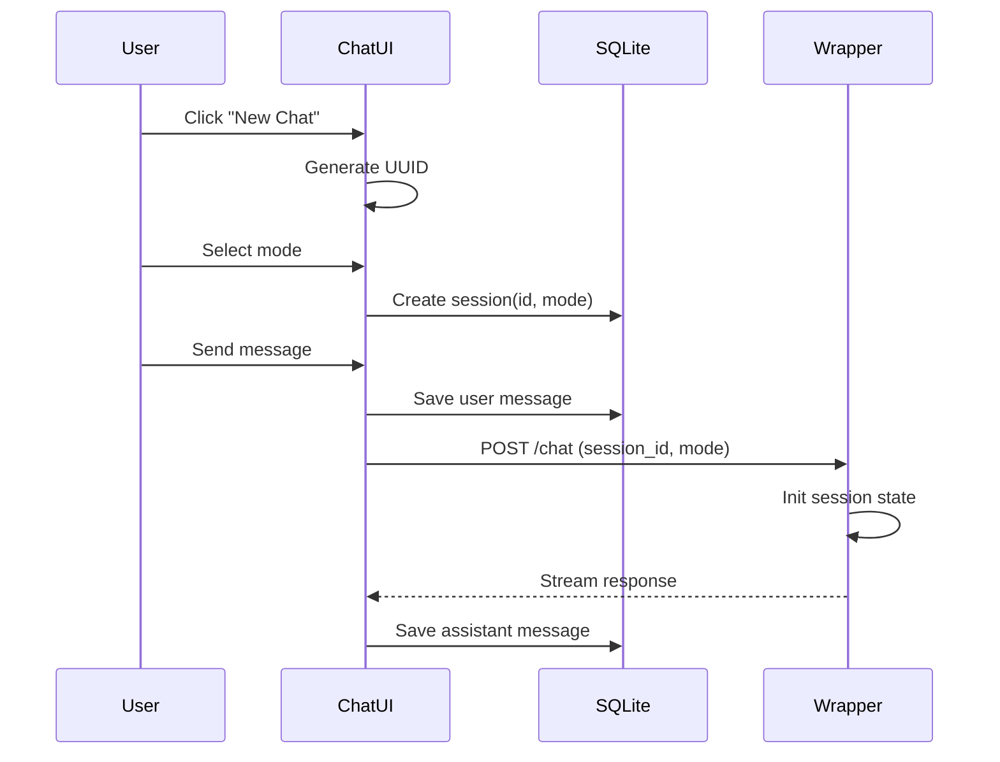
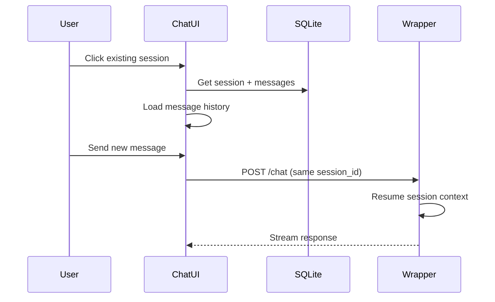
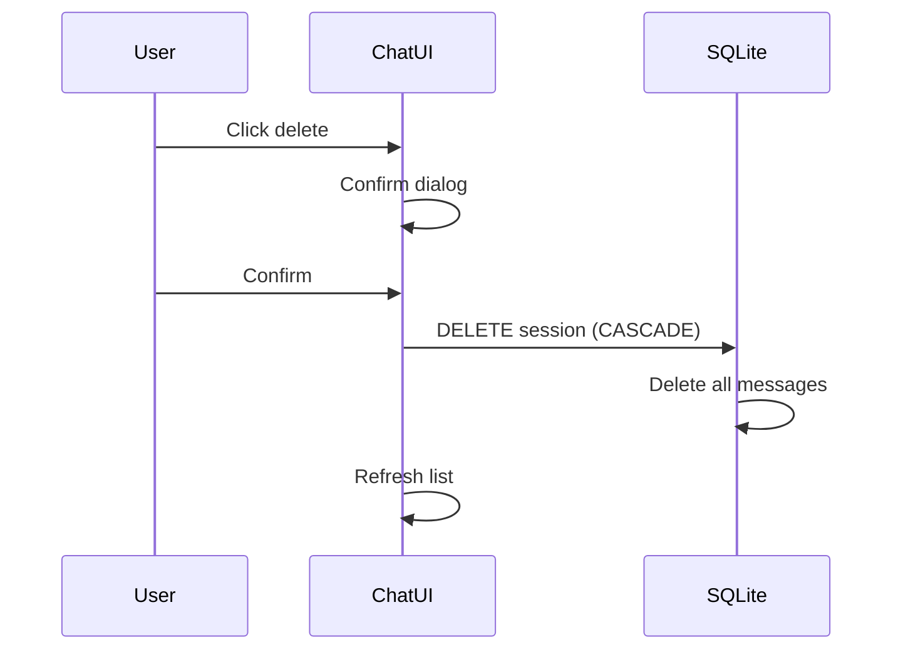

# Session Management Guide

## Overview

Sessions enable conversation persistence across page reloads and browser sessions. This guide covers both client-side (Chat UI) and server-side (Wrapper) session management.

## Architecture

```
┌─────────────────────────────────────────────────────────────┐
│                      Chat UI Session                         │
│                      (SQLite - Next.js)                      │
├─────────────────────────────────────────────────────────────┤
│  Stores:                                                     │
│  ├── Session metadata (id, title, mode, system_prompt)      │
│  ├── Message history (all user/assistant messages)          │
│  └── Timestamps (created_at, updated_at)                    │
└─────────────────────────┬───────────────────────────────────┘
                          │
                          │ session_id passed in request
                          ▼
┌─────────────────────────────────────────────────────────────┐
│                    Wrapper Session                           │
│                    (In-memory - FastAPI)                     │
├─────────────────────────────────────────────────────────────┤
│  Stores:                                                     │
│  ├── Claude SDK session state                               │
│  ├── Tool configurations per session                        │
│  └── Conversation context for multi-turn                    │
└─────────────────────────────────────────────────────────────┘
```

## Chat UI Session Management

### Database Schema

```sql
CREATE TABLE sessions (
    id TEXT PRIMARY KEY,
    title TEXT,                    -- Auto-generated from first message
    mode TEXT DEFAULT 'default',   -- Agent mode (deep-research, etc.)
    system_prompt TEXT,            -- Custom system prompt
    created_at TEXT DEFAULT (datetime('now')),
    updated_at TEXT DEFAULT (datetime('now'))
);

CREATE TABLE messages (
    id TEXT PRIMARY KEY,
    session_id TEXT NOT NULL,
    role TEXT NOT NULL,            -- 'user' or 'assistant'
    content TEXT NOT NULL,
    created_at TEXT DEFAULT (datetime('now')),
    FOREIGN KEY (session_id) REFERENCES sessions(id) ON DELETE CASCADE
);
```

### API Endpoints

#### List Sessions

```http
GET /api/sessions
```

Response:
```json
{
  "sessions": [
    {
      "id": "abc123",
      "title": "Research on AI trends",
      "mode": "deep-research",
      "created_at": "2024-12-06T10:00:00Z",
      "updated_at": "2024-12-06T10:30:00Z",
      "message_count": 5,
      "last_message": "Here are the key findings..."
    }
  ]
}
```

#### Get Session with Messages

```http
GET /api/sessions/[id]
```

Response:
```json
{
  "session": {
    "id": "abc123",
    "title": "Research on AI trends",
    "mode": "deep-research",
    "system_prompt": "You are a research agent...",
    "created_at": "2024-12-06T10:00:00Z",
    "updated_at": "2024-12-06T10:30:00Z"
  },
  "messages": [
    {
      "id": "msg1",
      "role": "user",
      "content": "Search for AI trends",
      "created_at": "2024-12-06T10:00:00Z"
    },
    {
      "id": "msg2",
      "role": "assistant",
      "content": "Here are the key findings...",
      "created_at": "2024-12-06T10:01:00Z"
    }
  ]
}
```

#### Delete Session

```http
DELETE /api/sessions/[id]
```

Response:
```json
{
  "success": true
}
```

### Implementation

```typescript
// src/app/api/sessions/route.ts
import { getAllSessions } from '@/lib/db';

export async function GET() {
  const sessions = getAllSessions();
  return Response.json({ sessions });
}

// src/app/api/sessions/[id]/route.ts
import { getSession, deleteSession } from '@/lib/db';

export async function GET(
  req: Request,
  { params }: { params: { id: string } }
) {
  const data = getSession(params.id);
  if (!data) {
    return Response.json({ error: 'Session not found' }, { status: 404 });
  }
  return Response.json(data);
}

export async function DELETE(
  req: Request,
  { params }: { params: { id: string } }
) {
  deleteSession(params.id);
  return Response.json({ success: true });
}
```

## Wrapper Session Management

### Session ID Flow

```typescript
// Chat UI sends session_id to wrapper
const requestBody = {
  model: 'claude-sonnet-4-5-20250929',
  messages: [...],
  stream: true,
  enable_tools: true,
  session_id: 'my-session-123',  // <-- This enables session continuity
};
```

### Wrapper Session Features

The wrapper supports:

1. **Session Continuity**: Same session_id maintains conversation context
2. **Per-Session Tool Config**: Different tools for different sessions
3. **Session Resume**: Continue from a previous session

### API: Tool Configuration per Session

```http
POST /v1/tools/config
Content-Type: application/json

{
  "session_id": "my-session-123",
  "allowed_tools": ["Read", "Write", "WebSearch"],
  "disallowed_tools": ["Bash"]
}
```

### API: Get Session Tools

```http
GET /v1/tools/config?session_id=my-session-123
```

Response:
```json
{
  "session_id": "my-session-123",
  "allowed_tools": ["Read", "Write", "WebSearch"],
  "disallowed_tools": ["Bash"],
  "effective_tools": ["Read", "Write", "WebSearch", "Glob", "Grep", "Edit"]
}
```

## Session Lifecycle

### 1. New Session Creation



### 2. Session Resume



### 3. Session Deletion



## Best Practices

### Session ID Generation

```typescript
import { randomUUID } from 'crypto';

// Generate unique session ID
const sessionId = randomUUID();

// Or use timestamp-based for debugging
const sessionId = `session_${Date.now()}_${Math.random().toString(36).slice(2)}`;
```

### Message Deduplication

```typescript
// Prevent duplicate message saves
const existingMessage = db.prepare(
  'SELECT id FROM messages WHERE session_id = ? AND content = ? AND role = ?'
).get(sessionId, content, role);

if (!existingMessage) {
  addMessage(id, sessionId, role, content);
}
```

### Session Cleanup

```typescript
// Clean old sessions (e.g., older than 30 days)
db.prepare(`
  DELETE FROM sessions
  WHERE updated_at < datetime('now', '-30 days')
`).run();
```

### Error Handling

```typescript
try {
  const session = getSession(sessionId);
  if (!session) {
    // Create new session if not found
    createSession(sessionId, undefined, mode);
  }
} catch (error) {
  console.error('Session error:', error);
  // Fallback to new session
  const newSessionId = randomUUID();
  createSession(newSessionId);
}
```

## Data Migration

### Export Sessions

```typescript
export function exportAllSessions(): string {
  const sessions = db.prepare('SELECT * FROM sessions').all();
  const messages = db.prepare('SELECT * FROM messages').all();

  return JSON.stringify({ sessions, messages }, null, 2);
}
```

### Import Sessions

```typescript
export function importSessions(data: string): void {
  const { sessions, messages } = JSON.parse(data);

  db.transaction(() => {
    for (const session of sessions) {
      db.prepare(`
        INSERT OR REPLACE INTO sessions (id, title, mode, system_prompt, created_at, updated_at)
        VALUES (?, ?, ?, ?, ?, ?)
      `).run(session.id, session.title, session.mode, session.system_prompt,
             session.created_at, session.updated_at);
    }

    for (const message of messages) {
      db.prepare(`
        INSERT OR REPLACE INTO messages (id, session_id, role, content, created_at)
        VALUES (?, ?, ?, ?, ?)
      `).run(message.id, message.session_id, message.role, message.content, message.created_at);
    }
  })();
}
```

## Production Considerations

### SQLite Limitations

- Single-writer concurrency
- File-based (not distributed)
- Limited to ~1TB practical size

### Migration Path to PostgreSQL

```typescript
// Abstract database interface for future migration
interface SessionStore {
  createSession(id: string, mode?: string): Promise<Session>;
  getSession(id: string): Promise<{ session: Session; messages: Message[] } | null>;
  deleteSession(id: string): Promise<void>;
  addMessage(id: string, sessionId: string, role: string, content: string): Promise<void>;
}

// SQLite implementation
class SQLiteSessionStore implements SessionStore { ... }

// PostgreSQL implementation (future)
class PostgresSessionStore implements SessionStore { ... }
```

### Supabase Example

```typescript
import { createClient } from '@supabase/supabase-js';

const supabase = createClient(
  process.env.SUPABASE_URL!,
  process.env.SUPABASE_KEY!
);

async function getSession(id: string) {
  const { data: session } = await supabase
    .from('sessions')
    .select('*')
    .eq('id', id)
    .single();

  const { data: messages } = await supabase
    .from('messages')
    .select('*')
    .eq('session_id', id)
    .order('created_at', { ascending: true });

  return { session, messages };
}
```
