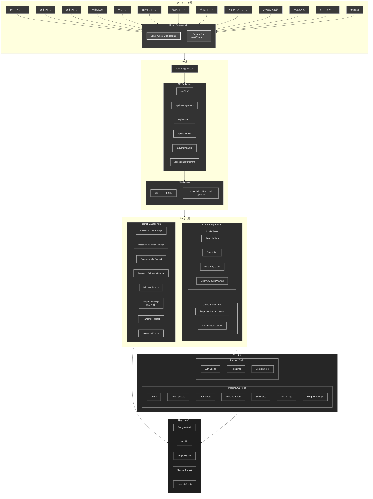
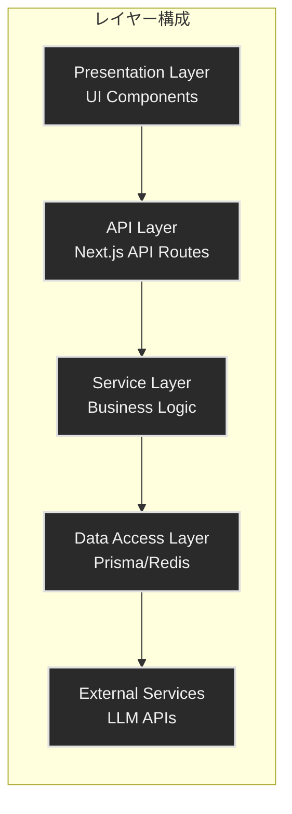
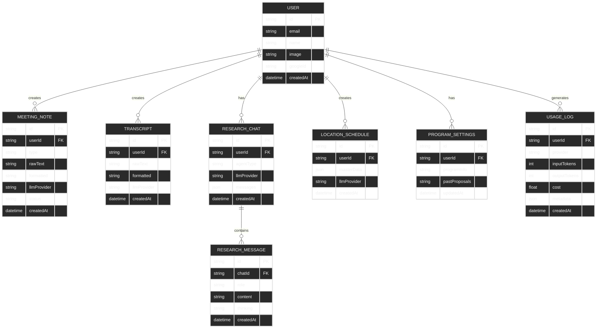
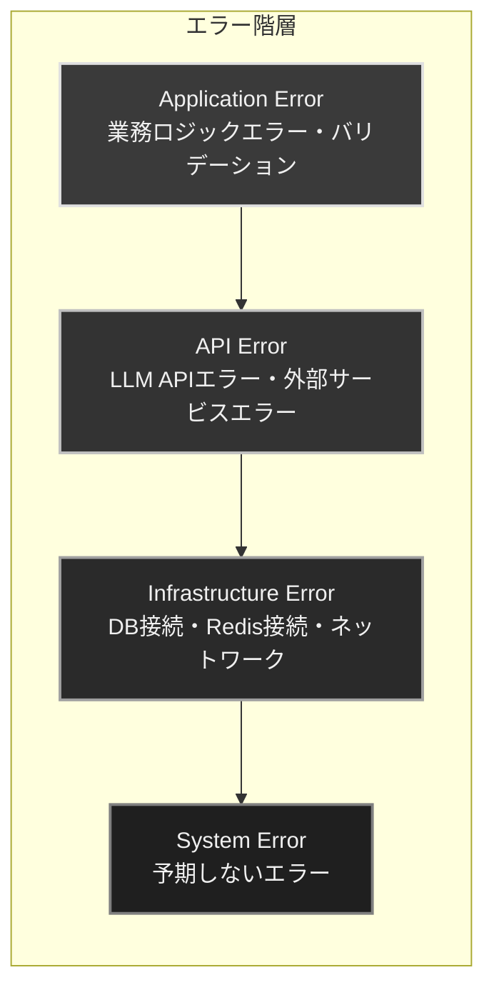
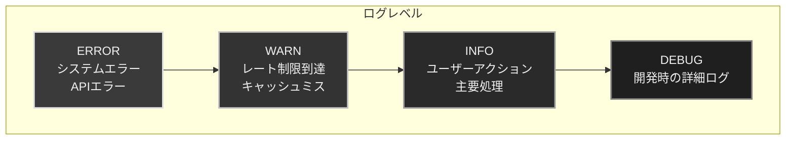
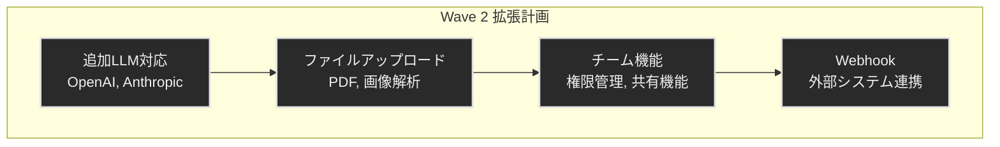

# アーキテクチャ設計書

## システム概要

AI Hubは、テレビ制作業務を支援するための統合プラットフォームです。Next.jsをベースに、複数のAI/LLMサービスを統合し、制作現場の業務効率化を実現します。

## アーキテクチャ図



## 設計原則

### 1. レイヤードアーキテクチャ



### 2. Factory Pattern (LLM統合)

複数のLLMプロバイダーを統一インターフェースで扱うため、Factoryパターンを採用しています。

```typescript
// lib/llm/factory.ts
export function createLLMClient(provider: LLMProvider): LLMClient {
  switch (provider) {
    case 'gemini-2.5-flash-lite':
    case 'gemini-3.0-flash':
      return new GeminiClient(provider);
    case 'grok-4.1-fast':
    case 'grok-4':
      return new GrokClient(provider);
    // ...
  }
}
```

### 3. FeatureChat パターン

各機能ページで共通して使用するチャットUIを `FeatureChat` コンポーネントとして実装しています。

```typescript
// components/ui/FeatureChat.tsx
interface FeatureChatProps {
  featureId: string;          // 機能識別子
  title: string;              // ページタイトル
  systemPrompt: string;       // システムプロンプト
  placeholder: string;        // 入力欄プレースホルダー
  inputLabel?: string;        // 入力エリアラベル
  outputFormat?: "markdown" | "plaintext";  // 出力形式
}
```

**特徴:**
- ストリーミングレスポンス対応
- 会話履歴の自動保存（Prisma）
- plaintextモード時のWordコピー機能
- 各機能別のシステムプロンプト切り替え

### 4. Prompt Management

システムプロンプトは `lib/prompts/` ディレクトリで管理しています。

```
lib/prompts/
├── research-cast.ts      # 出演者リサーチ
├── research-location.ts  # 場所リサーチ
├── research-info.ts      # 情報リサーチ
├── research-evidence.ts  # エビデンスリサーチ
├── minutes.ts            # 議事録作成
├── proposal.ts           # 新企画立案（動的生成）
├── transcript.ts         # 文字起こし変換
└── na-script.ts          # NA原稿作成
```

### 5. キャッシュ戦略

- **LLMレスポンスキャッシュ**: 同一プロンプトの重複リクエストを削減（TTL: 24時間）
- **レート制限**: プロバイダー別のAPI制限を管理（RPM/RPD）

### 6. 認証・認可

- **NextAuth.js**: Google OAuth 2.0によるSSO
- **JWTセッション**: ステートレス認証
- **Prisma Adapter**: ユーザーデータの永続化

## ページ構成

### サイドバーナビゲーション

```
├── リサーチ（折りたたみ）
│   ├── 出演者リサーチ     → /research/cast
│   ├── 場所リサーチ       → /research/location
│   ├── 情報リサーチ       → /research/info
│   └── エビデンスリサーチ → /research/evidence
├── 議事録作成             → /minutes
├── 新企画立案             → /proposal
├── 文字起こし（折りたたみ）
│   ├── フォーマット変換   → /transcript
│   └── NA原稿作成         → /transcript/na
└── 番組設定               → /settings/program
```

### 各機能ページ

| ページ | パス | 説明 |
|--------|------|------|
| 出演者リサーチ | `/research/cast` | 企画に適した出演者候補を提案 |
| 場所リサーチ | `/research/location` | ロケ地候補と撮影条件を調査 |
| 情報リサーチ | `/research/info` | テーマに関する情報を収集・整理 |
| エビデンスリサーチ | `/research/evidence` | 情報の真偽を検証 |
| 議事録作成 | `/minutes` | 文字起こしから議事録を作成 |
| 新企画立案 | `/proposal` | 番組情報を基に新企画を提案 |
| 文字起こし変換 | `/transcript` | テキスト整形・フォーマット変換 |
| NA原稿作成 | `/transcript/na` | ナレーション原稿を作成（Wordコピー対応） |
| 番組設定 | `/settings/program` | 番組情報・過去企画を管理 |

## データモデル

### ER図



### 主要モデル

| モデル | 説明 |
|-------|------|
| `User` | ユーザー情報（NextAuth連携） |
| `MeetingNote` | 議事録データ（PJ-A） |
| `Transcript` | NA原稿データ（PJ-B） |
| `ResearchChat` | リサーチチャット履歴（PJ-C） |
| `ResearchMessage` | チャットメッセージ |
| `LocationSchedule` | ロケスケジュール（PJ-D） |
| `ProgramSettings` | 番組設定（新企画立案で使用） |
| `UsageLog` | LLM使用ログ |

## セキュリティ設計

### 認証フロー

```mermaid
sequenceDiagram
    participant C as Client
    participant NA as NextAuth Handler
    participant GO as Google OAuth
    participant UC as User Consent
    participant JWT as JWT Token
    participant SV as Session Validate
    participant API as API Routes
    
    C->>NA: 認証リクエスト
    NA->>GO: OAuthリクエスト
    GO->>UC: 同意画面表示
    UC-->>GO: 同意
    GO-->>NA: 認証コード
    NA->>JWT: トークン生成
    JWT-->>NA: JWT Token
    NA-->>C: 認証完了
    
    C->>API: APIリクエスト
    API->>SV: セッション検証
    SV->>JWT: トークン検証
    JWT-->>SV: 検証結果
    SV-->>API: 検証成功
    API-->>C: レスポンス

    %% スタイリング - モノトーン
    classDef participant fill:#2a2a2a,stroke:#e0e0e0,stroke-width:2px,color:#f0f0f0
    class C,NA,GO,UC,JWT,SV,API participant
```

### セキュリティ対策

1. **環境変数管理**: 機密情報は`.env.local`で管理
2. **APIキー保護**: LLM APIキーはサーバーサイドのみで使用
3. **レート制限**: 悪意あるリクエストを防止
4. **入力バリデーション**: Zodによる厳格なバリデーション
5. **CORS設定**: 適切なオリジン制限

## パフォーマンス設計

### 最適化戦略

| 戦略 | 実装 |
|-----|------|
| レスポンスキャッシュ | Upstash Redis（24時間TTL） |
| レート制限 | Upstash Redis（スライディングウィンドウ） |
| 画像最適化 | Next.js Imageコンポーネント |
| フォント最適化 | next/font（Geist） |
| コード分割 | 動的インポート（必要に応じて） |
| ストリーミング | Server-Sent Eventsによるリアルタイムレスポンス |

### スケーリング

- **水平スケーリング**: Vercel Edge Network
- **データベース**: Neon Serverless Postgres（自動スケーリング）
- **キャッシュ**: Upstash Redis（サーバーレス）

## エラーハンドリング

### エラー階層



### エラーレスポンス形式

```typescript
{
  error: string;        // エラーコード
  message: string;      // 人間可読なメッセージ
  details?: unknown;    // 詳細情報（開発時のみ）
  retryAfter?: number;  // レート制限時の再試行秒数
}
```

## モニタリング・ロギング

### ログレベル



- **ERROR**: システムエラー、APIエラー
- **WARN**: レート制限到達、キャッシュミス
- **INFO**: ユーザーアクション、主要処理
- **DEBUG**: 開発時の詳細ログ

### 使用状況トラッキング

`UsageLog`モデルで以下を記録：
- ユーザーID
- 使用プロバイダー
- 入力/出力トークン数
- 推定コスト（USD）
- メタデータ（エンドポイント等）

## 将来の拡張性

### Wave 2で予定



1. **追加LLM対応**: OpenAI, Anthropic
2. **ファイルアップロード**: PDF, 画像解析
3. **チーム機能**: 権限管理、共有機能
4. **Webhook**: 外部システム連携

### 拡張ポイント

- `lib/llm/clients/`: 新しいLLMクライアントを追加
- `lib/prompts/`: 新しい機能のプロンプトを追加
- `app/api/`: 新しいAPIエンドポイントを追加
- `prisma/schema.prisma`: データモデルの拡張
