# UPエージェント - ドキュメントガイド

> **本ディレクトリは「UPエージェント」（AI Hub）開発用のドキュメント群です。**
> 
> **最終更新**: 2026-03-25 18:40

---

## 📑 目次

- [ドキュメントマップ](#️-ドキュメントマップ)
- [クイックスタート](#-クイックスタート)
- [最近更新されたドキュメント](#-最近更新されたドキュメント)
- [ディレクトリ構成](#-ディレクトリ構成)
- [ドキュメント運用ルール](#-ドキュメント運用ルール)
- [よくある質問（FAQ）](#-よくある質問faq)
- [検索・活用方法](#-検索活用方法)
- [参照ルール](#-参照ルール)
- [ドキュメント作成・更新ルール](#-ドキュメント作成更新ルール)

**全ドキュメントのインデックス**: [docs/INDEX.md](./INDEX.md)

---

## 🗺️ ドキュメントマップ

```mermaid
flowchart TD
    A[docs/README.md] --> B[specs/ 技術仕様]
    A --> C[user-docs/ ユーザードキュメント]
    A --> D[plans/ 進行中の計画]
    A --> E[guides/ 開発ガイド]
    A --> F[archive/ アーカイブ]
    A --> G[lessons/ 学びの蓄積]
    A --> H[prompts/ システムプロンプト]
    A --> I[backlog/ 検討・調査]
    
    B --> B1[architecture/ アーキテクチャ]
    B --> B2[api-integration/ API連携]
    B --> B3[operations/ 運用]
    B --> B4[features/ 機能仕様]
    B --> B5[testing/ テスト戦略]
    
    G --> G1[過去の教訓]
    G --> G2[推奨事項]
    G --> G3[技術選定の失敗/成功]
    
    H --> H1[GENERAL_CHAT.md]
    H --> H2[MINUTES.md]
    H --> H3[RESEARCH_CAST.md]
    H --> H4[RESEARCH_EVIDENCE.md]
    H --> H5[PROPOSAL.md]
    
    C --> C1[getting-started.md]
    C --> C2[feature-guide.md]
    
    D --> D1[要件定義]
    D --> D2[タスク一覧]
    
    E --> E1[setup/ 環境構築]
    E --> E2[development/ 開発標準]
```



---

## 🚀 クイックスタート

### 初めての方へ

| あなたは誰？ | 最初に読むドキュメント | 目的 |
|-------------|---------------------|------|
| **開発者（新規参入）** | [システム構成](specs/architecture/system-architecture.md) → [API仕様](specs/api-integration/api-specification.md) → [lessons/README.md](lessons/README.md) | 全体像を把握し、過去の教訓を学ぶ |
| **開発者（実装時）** | [plans/](plans/) の現在のタスク → [開発ガイド](guides/development/workflow-standards.md) → [lessons/](lessons/) の関連知見 | 実装を進める |
| **制作スタッフ** | [user-docs/getting-started.md](user-docs/getting-started.md) | 使い方を学ぶ |
| **トラブル発生時** | [guides/troubleshooting.md](guides/troubleshooting.md) | 問題解決 |

### 環境構築（開発者）
```bash
# 1. 環境構築手順を読む
cat docs/guides/setup/database-cache.md
cat docs/guides/setup/vercel-authentication.md
cat docs/guides/setup/google-oauth-setup.md

# 2. 開発標準を確認
cat docs/guides/development/workflow-standards.md

# 3. 過去の教訓を確認（技術選定前に必読）
cat docs/lessons/README.md
```

---

## 🆕 最近更新されたドキュメント

### 2026年3月

| 日付 | ドキュメント | カテゴリ | 概要 |
|------|-------------|---------|------|
| 03-26 | [archive/2026-03-26-bug-fixes-and-final-tuning.md](./archive/2026-03-26-bug-fixes-and-final-tuning.md) | archive | バグ修正・最終調整完了 |
| 03-25 | [archive/2026-03-25-new-project-naming-and-subtitle.md](./archive/2026-03-25-new-project-naming-and-subtitle.md) | archive | 新企画立案命名・サブテキスト設定完了 |
| 03-25 | [archive/2026-03-25-screenshot-for-company-announcement.md](./archive/2026-03-25-screenshot-for-company-announcement.md) | archive | 社内発表用スクリーンショット作成完了 |
| 03-25 | [archive/2026-03-25-design-final-adjustment.md](./archive/2026-03-25-design-final-adjustment.md) | archive | デザイン最終調整完了 |
| 03-25 | [plans/implementation-plan-2026-03.md](./plans/implementation-plan-2026-03.md) | plans | 3月実装プラン - 全タスク完了 |
| 03-19 | [archive/2026-03-19-feedback-incorporation-from-field-test.md](./archive/2026-03-19-feedback-incorporation-from-field-test.md) | archive | 現場テストフィードバック反映完了 |
| 03-19 | [archive/2026-03-19-admin-dashboard-cost-monitoring.md](./archive/2026-03-19-admin-dashboard-cost-monitoring.md) | archive | 管理画面調整（コスト監視）完了 |
| 03-12 | [archive/2026-03-12-field-test.md](./archive/2026-03-12-field-test.md) | archive | 3月12日現場テスト完了 |
| 03-12 | [archive/2026-03-12-prompt-tuning-performer-research.md](./archive/2026-03-12-prompt-tuning-performer-research.md) | archive | 出演者リサーチプロンプト磨き込み完了 |
| 03-12 | [archive/2026-03-12-prompt-tuning-evidence-research.md](./archive/2026-03-12-prompt-tuning-evidence-research.md) | archive | エビデンスリサーチプロンプト磨き込み完了 |
| 03-12 | [archive/2026-03-12-new-project-planning-porting.md](./archive/2026-03-12-new-project-planning-porting.md) | archive | 新規企画立案機能の移植完了 |
| 03-11 | [archive/2026-03-11-test-to-production-migration.md](./archive/2026-03-11-test-to-production-migration.md) | archive | テストから本番への移行完了 |
| 03-10 | [archive/2026-03-10-performer-research-ui-improvement.md](./archive/2026-03-10-performer-research-ui-improvement.md) | archive | 出演者リサーチUI改善完了 |
| 03-10 | [archive/2026-03-10-research-integration-test.md](./archive/2026-03-10-research-integration-test.md) | archive | リサーチ機能統合テスト完了 |
| 03-05 | [archive/2026-03-05-sidebar-functionality-consultation.md](./archive/2026-03-05-sidebar-functionality-consultation.md) | archive | サイドバー機能実装相談対応完了 |
| 03-05 | [archive/2026-03-05-weekly-progress-meeting.md](./archive/2026-03-05-weekly-progress-meeting.md) | archive | 週次進捗報告会（3月5日）完了 |
| 03-05 | [backlog/research/sns-paid-tool-verification.md](./backlog/research/sns-paid-tool-verification.md) | backlog | SNS有料ツール統合検証完了（第2段階に保留） |
| 03-02 | [archive/2026-03-02-subtitle-content-for-new-project.md](./archive/2026-03-02-subtitle-content-for-new-project.md) | archive | 新企画立案サブテキスト内容策定完了 |

### 2026年2月（主な更新）

| 日付 | ドキュメント | カテゴリ | 概要 |
|------|-------------|---------|------|
| 02-27 | [lessons/2026-02-27-programs-data-verification.md](./lessons/2026-02-27-programs-data-verification.md) | lessons | レギュラー番組ナレッジデータ検証 |
| 02-26 | [lessons/2026-02-26-chat-streaming-loading-issue.md](./lessons/2026-02-26-chat-streaming-loading-issue.md) | lessons | チャット送信後の画面停滞問題 |
| 02-26 | [lessons/2026-02-26-lint-error-fixes.md](./lessons/2026-02-26-lint-error-fixes.md) | lessons | Lintエラー修正完了報告 |
| 02-24 | [lessons/2026-02-24-langchain-premature-abstraction.md](./lessons/2026-02-24-langchain-premature-abstraction.md) | lessons | LangChain導入：過早な抽象化の失敗 |

**全ドキュメントの一覧**: [docs/INDEX.md](./INDEX.md)

---

## 📁 ディレクトリ構成

```
docs/
├── README.md                    # 本ファイル（入り口）
│
├── lessons/                     # 【学びの蓄積】過去の教訓と推奨事項
│   ├── README.md                # 学びの一覧と運用方法
│   ├── template.md              # 新規作成用テンプレート
│   ├── 2026-02-20-agent-swarm-development.md
│   ├── 2026-02-20-agent-human-checkpoints.md
│   ├── 2026-02-21-llm-framework-comparison.md
│   ├── 2026-02-22-api-duplication-lesson.md
│   ├── 2026-02-23-framework-evaluation.md
│   ├── 2026-02-24-langchain-premature-abstraction.md
│   ├── 2026-02-26-chat-streaming-loading-issue.md
│   ├── 2026-02-26-lint-error-fixes.md
│   ├── 2026-02-27-programs-data-verification.md
│   ├── 2026-03-20-supabase-migration-lesson.md
│   └── 2026-03-20-xai-direct-implementation-lesson.md
│
├── specs/                       # 【技術仕様】信頼できる唯一の情報源
│   ├── architecture/            # アーキテクチャ設計
│   │   ├── system-architecture.md
│   │   ├── component-design.md
│   │   ├── data-flow.md
│   │   ├── state-management.md
│   │   ├── theme-system.md
│   │   ├── code-structure-overview.md
│   │   └── code-structure-mermaid.md
│   ├── api-integration/         # API・外部連携
│   │   ├── api-specification.md
│   │   ├── authentication.md    # Supabase Auth認証
│   │   ├── database-schema.md
│   │   ├── llm-integration-overview.md
│   │   ├── llm-integration-patterns.md
│   │   ├── conversation-context-flow.md
│   │   ├── summarization-api.md
│   │   ├── system-prompt-management.md
│   │   ├── system-prompt-generation.md
│   │   ├── memory-management.md
│   │   ├── prompt-management.md
│   │   ├── xai-citations-behavior-spec.md
│   │   ├── xai-responses-api-spec.md
│   │   ├── external-services.md
│   │   ├── 2026-03-18-grok-model-comparison.md
│   │   └── error-handling.md
│   ├── features/                # 機能仕様
│   ├── operations/              # 運用・品質
│   │   ├── deployment-guide.md
│   │   ├── logging-monitoring.md
│   │   ├── security.md
│   │   ├── performance.md
│   │   ├── testing-strategy.md
│   │   └── change-history.md
│   ├── testing/                 # テスト戦略
│   ├── api-changelog.md
│   ├── change-history.md
│   └── client-server-llm-architecture.md
│
├── prompts/                     # 【システムプロンプト】DB反映用ソース
│   ├── GENERAL_CHAT.md          # 汎用チャット
│   ├── MINUTES.md               # 議事録作成
│   ├── RESEARCH_CAST.md         # 出演者リサーチ
│   ├── RESEARCH_EVIDENCE.md     # エビデンスリサーチ
│   └── PROPOSAL.md              # 新企画立案
│   # NOTE: 本番の Single Source of Truth は Supabase DB。
│   # ここのファイルを更新後、scripts/prompts/update-from-doc.mjs でDBに反映。
│
├── user-docs/                   # 【ユーザードキュメント】非技術者向け
│   ├── README.md
│   ├── getting-started.md
│   ├── feature-guide.md
│   └── troubleshooting.md
│
├── plans/                       # 【計画・設計】進行中のみ
│   ├── README.md
│   └── *.md                     # 各種計画書
│
├── backlog/                     # 【検討・調査】いつか対応したいもの
│   ├── README.md
│   ├── idea-*.md                # 新機能アイデア
│   ├── research-*.md            # 技術調査
│   ├── todo-*.md                # 保留タスク
│   ├── langchain-future-considerations.md
│   └── enhancements/
│       └── features/
│
├── guides/                      # 【手順書】開発者向け
│   ├── README.md
│   ├── setup/                   # 環境構築
│   │   ├── database-cache.md
│   │   ├── vercel-authentication.md
│   │   └── google-oauth-setup.md
│   ├── development/             # 開発ガイド
│   │   ├── workflow-standards.md
│   │   ├── code-review-checklist.md
│   │   └── naming-conventions.md
│   ├── data-quality/
│   ├── research-tools-guide.md
│   ├── testing-e2e.md
│   ├── ui-ux-guidelines.md
│   └── troubleshooting.md
│
├── archive/                     # 【アーカイブ】参照のみ
│   ├── SUMMARY.md
│   └── YYYY-MM-DD-*.md          # 日付付きアーカイブ
│
├── refactoring/                 # リファクタリング関連
├── research-reports/            # 調査レポート
├── dev-meeting/                 # 開発会議メモ
└── assets/                      # 添付ファイル
    └── ...
```

---

## 📋 ドキュメント運用ルール

### 必須事項

| ルール | 説明 | コマンド例 |
|-------|------|-----------|
| **更新日時を記録** | 変更したら必ず日時を記載 | `date +"%Y-%m-%d %H:%M"` |
| **適切な分割** | 長いドキュメントは論理的に分割 | 責任分界を意識 |
| **内容の重複禁止** | 詳細は1箇所に集約 | 他は参照リンクに |
| **削除禁止** | 古いドキュメントは削除せず | `mv file.md archive/$(date +%Y-%m-%d)-file.md` |

### ドキュメント種別ごとの役割

| ディレクトリ | 役割 | 対象者 | 更新頻度 | 信頼度 |
|-------------|------|--------|---------|-------|
| `specs/` | 技術仕様 | 開発者 | 随時 | ⭐⭐⭐ 最優先 |
| `lessons/` | **過去の教訓・推奨事項** | **開発者（技術選定時）** | **学びが発生した時** | ⭐⭐⭐ **重要** |
| `prompts/` | **システムプロンプト（SSOT）** | 開発者 | プロンプト変更時 | ⭐⭐⭐ |
| `user-docs/` | ユーザードキュメント | 制作スタッフ | 機能変更時 | ⭐⭐ |
| `plans/` | **実装前の計画・実装中の進捗** | 開発者 | **実装中のみ** | ⭐⭐ |
| `backlog/` | 検討・調査・保留タスク | 開発者 | 随時 | ⭐ |
| `guides/` | 手順書 | 開発者 | 環境変化時 | ⭐⭐ |
| `archive/` | 過去資料 | 全員 | なし（参照のみ） | ⭐ |

### 計画書のライフサイクル（重要）

```
【実装前】
アイデア発生 → backlog/ に配置 → 検討・調査 → 実装決定 → plans/ に配置

【実装中】
plans/ の計画書を随時更新（実装状況を記録）
    ↓ 保留タスク・イシュー発見 → backlog/ に記録

【実装完了後】
教訓・知見を抽出 → lessons/ に移動（または新規作成）
    ↓ 単純な完了報告のみ → archive/YYYY-MM-DD-*.md に移動
```

| ステータス | 場所 | 操作 |
|-----------|------|------|
| 検討・調査中 | `backlog/` | 継続検討 or `plans/` へ移動 |
| **実装前計画** | `plans/` | 実装開始前に作成 |
| **実装中** | `plans/` | **実装と並行して進捗を更新** |
| 完了（教訓あり） | `lessons/YYYY-MM-DD-*.md` | 知見として蓄積 |
| 完了（報告のみ） | `archive/YYYY-MM-DD-*.md` | 参照のみ、更新禁止 |
| 優先度低下 | `archive/YYYY-MM-DD-*.md` | 参照のみ |

### plans/ の運用ルール

**実装前:**
- 計画書を `plans/` に作成
- 実装範囲、タスク一覧、期限を明記

**実装中:**
- 計画書に**実装状況を随時更新**
- 完了したタスクに `[x]` を付ける
- 保留タスク・イシューは `backlog/` に記録し、計画書からリンク
- **技術設計に関わる問題を発見した場合は、その場で解決または理想的な設計を提案**

**実装完了後:**
- **教訓・知見が得られた場合**:
  - 計画書を `lessons/YYYY-MM-DD-タイトル.md` に変換・移動
  - 「背景・結果・教訓・推奨事項」を明記（[lessons/template.md](./lessons/template.md) 参照）
  - `lessons/README.md` に一覧追加
- **単純な完了報告のみの場合**:
  - 計画書を `archive/YYYY-MM-DD-元のファイル名.md` に移動
- 未対応の保留タスクがあれば `backlog/` に残す

**判断基準**: 「3ヶ月後の自分が同じ状況で、これを知っていれば異なる判断をするか？」
→ Yes なら `lessons/`、No なら `archive/`

### prompts/ の運用ルール

**重要**: `docs/prompts/*.md` は本番DBへの反映用ソースです。

```bash
# 1. プロンプトを編集（例: MINUTES.md）
vim docs/prompts/MINUTES.md

# 2. DBに反映
node scripts/prompts/update-from-doc.mjs MINUTES "変更理由"
```

詳細: [system-prompt-management.md](specs/api-integration/system-prompt-management.md)

### 情報の信頼順位

実装と矛盾した場合の優先順位：

1. `specs/` - 技術仕様（最優先）
2. `lessons/` - 過去の教訓・推奨事項（技術選定時に必読）
3. 実装コード（ソースコード）
4. `guides/` - 手順書
5. その他

### specs/ の更新時は実装と同期必須

`specs/` に変更を加えた場合、以下の確認が必要：

| 変更内容 | 必要なアクション | 確認方法 |
|---------|----------------|---------|
| API仕様変更 | 実装コードの修正 | エンドポイントの動作確認 |
| DBスキーマ変更 | Supabaseマイグレーション実行 | スキーマの整合性確認 |
| 型定義変更 | 使用箇所の型エラー解消 | `npx tsc --noEmit` |
| 環境変数追加 | `.env.example` 更新 + チーム共有 | 環境変数一覧の確認 |
| プロンプト変更 | DBへの反映 | `scripts/prompts/update-from-doc.mjs` |

### 計画書の期限ルール

`plans/` の計画書には期限を設け、長期間停滞を防ぐ：

| 計画タイプ | 推奨期限 | 超過時のアクション |
|-----------|---------|------------------|
| 機能追加計画 | 2週間 | 見直し or アーカイブ検討 |
| 改修計画 | 1週間 | 優先度見直し |
| 調査・分析 | 3日間 | 一旦アーカイブ、必要時に再開 |

**確認コマンド:**
```bash
# plans/ のファイル更新日を確認
ls -lt docs/plans/*.md

# 1週間以上更新されていないファイルを確認
find docs/plans/ -name "*.md" -mtime +7
```

---

## ❓ よくある質問（FAQ）

### Q: 新しい機能の仕様書はどこに書く？
**A:** 
- **実装決定済み**: `specs/` の適切なサブディレクトリに。迷ったら `specs/architecture/` に。
- **検討・調査段階**: `backlog/` に `idea-{機能名}.md` として作成。

### Q: 過去の決定事項を調べたい
**A:** 
1. まず `lessons/` を検索（技術的知見が集約されている）
2. 次に `archive/` を検索（完了した計画書）
```bash
grep -r "決定事項" docs/lessons/ --include="*.md"
grep -r "決定事項" docs/archive/ --include="*.md"
```

### Q: 実装とドキュメントが矛盾している
**A:** `specs/` を正とする。実装を修正するか、ドキュメントを更新する必要がある。

### Q: 計画書はいつアーカイブする？
**A:** 
- **実装完了時**: `plans/` → `lessons/`（教訓あり）または `archive/`（報告のみ）
- **優先度低下時**: `backlog/` → `archive/YYYY-MM-DD-元のファイル名.md`

### Q: ファイル名の規則は？
**A:** [naming-conventions.md](guides/development/naming-conventions.md) を参照。基本はケバブケース。

### Q: プロンプトを変更したら？
**A:** 
1. `docs/prompts/{PROMPT_KEY}.md` を編集
2. `node scripts/prompts/update-from-doc.mjs {PROMPT_KEY} "変更理由"` でDBに反映

詳細: [system-prompt-management.md](specs/api-integration/system-prompt-management.md)

### Q: 技術選定をする前に何を読むべき？
**A:** 必ず `lessons/README.md` を読む。過去の技術選定の失敗（LangChain等）や推奨事項が記録されている。

---

## 🔍 検索・活用方法

### 目次から探す

| 探したいもの | 参照先 |
|-------------|-------|
| **全ドキュメント一覧** | [docs/INDEX.md](./INDEX.md) |
| **カテゴリ別一覧** | [INDEX.md#カテゴリ別ドキュメント一覧](./INDEX.md#カテゴリ別ドキュメント一覧) |
| **更新日順一覧** | [INDEX.md#更新日順一覧](./INDEX.md#更新日順一覧) |
| **ステータス別一覧** | [INDEX.md#ステータス別一覧](./INDEX.md#ステータス別一覧) |

### 頻出コマンド

```bash
# キーワードで全文検索（specs内）
grep -r "LangChain" docs/specs/ --include="*.md"

# 過去の教訓を検索
grep -r "教訓" docs/lessons/ --include="*.md"

# 最近更新されたファイルを確認
ls -lt docs/**/*.md | head -10

# ファイル名で検索
find docs/ -name "*auth*.md"

# アーカイブ内を検索
grep -r "キーワード" docs/archive/ --include="*.md"

# 特定の日付範囲のlessonsを検索
ls -lt docs/lessons/2026-03-*.md

# Supabase関連のドキュメントを検索
grep -r "Supabase" docs/specs/ docs/lessons/ --include="*.md"

# プロンプト関連のドキュメントを検索
grep -r "system-prompt\|プロンプト" docs/ --include="*.md"

# 1週間以内に更新されたファイルを確認
find docs/ -name "*.md" -mtime -7

# 特定のディレクトリ内の全ファイルを更新日順で表示
ls -lt docs/specs/**/*.md
```

### 目的別検索ガイド

| 目的 | コマンド |
|------|---------|
| 技術仕様を探す | `find docs/specs -name "*.md"` |
| lessonsを探す | `ls docs/lessons/*.md` |
| plansを探す | `find docs/plans -name "*.md"` |
| アーカイブを探す | `ls docs/archive/2026-*.md` |
| 特定キーワードを含む | `grep -r "キーワード" docs/ --include="*.md" -l` |

### ドキュメント間の移動

```bash
# 計画書をlessonsに移動（教訓を抽出）
cp docs/plans/your-plan.md "docs/lessons/$(date +%Y-%m-%d)-title.md"
# 内容を書き換え後、lessons/README.md に追加

# 計画書をアーカイブに移動（単純な完了報告）
mv docs/plans/old-plan.md "docs/archive/$(date +%Y-%m-%d)-old-plan.md"

# 更新日時を記録（ファイル先頭に追加）
echo -e "$(date +"%Y-%m-%d %H:%M")\n\n$(cat file.md)" > file.md
```

---

## 🔗 参照ルール

### 技術者
1. **必ず読む**: `specs/architecture/system-architecture.md`
2. **API確認**: `specs/api-integration/api-specification.md`
3. **技術選定時**: **`lessons/README.md`** ← **過去の教訓を確認（最重要）**
4. **認証・認可**: `specs/api-integration/authentication.md`
5. **LLM連携**: `specs/api-integration/llm-integration-overview.md`
6. **プロンプト管理**: `specs/api-integration/system-prompt-management.md`
7. **現在のタスク**: `plans/`
8. **トラブル時**: `guides/troubleshooting.md`
9. **命名規則**: `guides/development/naming-conventions.md`
10. **E2Eテスト**: `guides/testing-e2e.md`

### 制作スタッフ
1. **必ず読む**: `user-docs/getting-started.md`
2. **機能の詳細**: `user-docs/feature-guide.md`
3. **困ったとき**: `user-docs/troubleshooting.md`

---

## 📝 ドキュメント作成・更新ルール（詳細）

### 参照リンクの優先順位

| 優先度 | 参照先 | 例 |
|-------|--------|-----|
| 1 | 実装ファイル（ソースコード） | `supabase/migrations/*.sql` |
| 2 | 同ディレクトリの仕様 | `[error-handling.md](./error-handling.md)` |
| 3 | 別ディレクトリのドキュメント | `[guides/setup/](../guides/setup/)` |
| 4 | 外部リソース | 公式ドキュメント等 |

### ファイル命名規則

| ディレクトリ | 命名規則 | 例 |
|-------------|---------|-----|
| `docs/plans/` | `計画名.md`（プラン作成日はメタデータ内） | `conversation-memory-design.md` |
| `docs/lessons/` | `YYYY-MM-DD-タイトル.md`（**終了日**を先頭に） | `2026-03-20-supabase-migration-lesson.md` |
| `docs/archive/` | `YYYY-MM-DD-元のファイル名.md`（**アーカイブ日**を先頭に） | `2026-02-22-refactoring-completed.md` |
| `docs/backlog/` | `idea-機能名.md` / `research-調査名.md` / `todo-タスク名.md` | `idea-vtuber-research.md` |

- **ケバブケース**（例: `api-specification.md`）
- **日本語ファイル名は避ける**（アーカイブの既存ファイルはそのまま）
- **アーカイブ時は日付プレフィックス必須**（例: `2026-02-24-refactoring.md`）

### 日時取得コマンド

```bash
# 更新日時用
date +"%Y-%m-%d %H:%M"

# アーカイブファイル名用
date +"%Y-%m-%d"
```

---

## 🔄 スキルの自律的改善

ドキュメントを使用する際、常に改善の機会を探し、発見したら即座に更新すること。

**改善を行うタイミング:**
- 「この手順がない」→ 新しい手順を追加
- 「説明がわかりにくい」→ ドキュメントを書き換え
- 「エラーが出た」→ トラブルシューティング追加
- 「もっと効率的な方法がある」→ ベストプラクティス更新

詳細: [AGENTS.md](../AGENTS.md)
