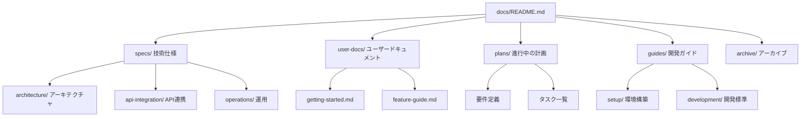

# UPエージェント - ドキュメントガイド

> **本ディレクトリは「UPエージェント」（AI Hub）開発用のドキュメント群です。**
> 
> **最終更新**: 2026-02-24 13:10

---

## 🗺️ ドキュメントマップ



---

## 🚀 クイックスタート

### 初めての方へ

| あなたは誰？ | 最初に読むドキュメント | 目的 |
|-------------|---------------------|------|
| **開発者（新規参入）** | [システム構成](specs/architecture/system-architecture.md) → [API仕様](specs/api-integration/api-specification.md) | 全体像を把握 |
| **開発者（実装時）** | [plans/](plans/) の現在のタスク → [開発ガイド](guides/development/workflow-standards.md) | 実装を進める |
| **制作スタッフ** | [user-docs/getting-started.md](user-docs/getting-started.md) | 使い方を学ぶ |
| **トラブル発生時** | [guides/troubleshooting.md](guides/troubleshooting.md) | 問題解決 |

### 環境構築（開発者）
```bash
# 1. 環境構築手順を読む
cat docs/guides/setup/database-cache.md
cat docs/guides/setup/vercel-authentication.md

# 2. 開発標準を確認
cat docs/guides/development/workflow-standards.md
```

---

## 📁 ディレクトリ構成

```
docs/
├── README.md                    # 本ファイル（入り口）
│
├── specs/                       # 【技術仕様】信頼できる唯一の情報源
│   ├── architecture/            # アーキテクチャ設計
│   │   ├── system-architecture.md
│   │   ├── component-design.md
│   │   ├── data-flow.md
│   │   ├── state-management.md
│   │   └── theme-system.md      # テーマシステム仕様
│   ├── api-integration/         # API・外部連携
│   │   ├── api-specification.md
│   │   ├── authentication.md
│   │   ├── database-schema.md
│   │   ├── llm-integration.md
│   │   ├── prompt-engineering.md
│   │   └── error-handling.md
│   └── operations/              # 運用・品質
│       ├── deployment-guide.md
│       ├── logging-monitoring.md
│       ├── security.md
│       ├── performance.md
│       └── change-history.md
│
├── user-docs/                   # 【ユーザードキュメント】非技術者向け
│   ├── README.md
│   ├── getting-started.md
│   ├── feature-guide.md
│   └── troubleshooting.md
│
├── plans/                       # 【計画・設計】進行中のみ
│   ├── product-requirements.md  # 要件定義
│   ├── tasks-overview.md        # タスク一覧（概要）
│   ├── tasks-detailed.md        # タスク一覧（詳細）
│   └── status-dashboard.md      # 実装状況
│
├── backlog/                     # 【検討・調査】いつか対応したいもの
│   ├── README.md
│   ├── idea-*.md                # 新機能アイデア
│   ├── research-*.md            # 技術調査
│   ├── refactor-*.md            # リファクタリング候補
│   └── improve-*.md             # 改善案
│
├── guides/                      # 【手順書】開発者向け
│   ├── setup/                   # 環境構築
│   │   ├── database-cache.md
│   │   └── vercel-authentication.md
│   └── development/             # 開発ガイド
│       ├── workflow-standards.md
│       ├── code-review-checklist.md
│       └── naming-conventions.md
│
├── archive/                     # 【アーカイブ】参照のみ
│   ├── SUMMARY.md
│   └── YYYY-MM-DD-*.md          # 日付付きアーカイブ
│
└── assets/                      # 添付ファイル
    └── ...
```

---

## 📋 ドキュメント運用ルール

### 必須事項

| ルール | 説明 | コマンド例 |
|-------|------|-----------|
| **更新日時を記録** | 変更したら必ず日時を記載 | `date +"%Y-%m-%d %H:%M"` |
| **ファイルサイズ制限** | 200行以内を目安 | 超える場合は分割 |
| **内容の重複禁止** | 詳細は1箇所に集約 | 他は参照リンクに |
| **削除禁止** | 古いドキュメントは削除せず | `mv file.md archive/$(date +%Y-%m-%d)-file.md` |

### ドキュメント種別ごとの役割

| ディレクトリ | 役割 | 対象者 | 更新頻度 | 信頼度 |
|-------------|------|--------|---------|-------|
| `specs/` | 技術仕様 | 開発者 | 随時 | ⭐⭐⭐ 最優先 |
| `user-docs/` | ユーザードキュメント | 制作スタッフ | 機能変更時 | ⭐⭐ |
| `plans/` | 進行中の計画 | 開発者 | 進行中のみ | ⭐⭐ |
| `backlog/` | 検討・調査・将来対応 | 開発者 | 随時 | ⭐ |
| `guides/` | 手順書 | 開発者 | 環境変化時 | ⭐⭐ |
| `archive/` | 過去資料 | 全員 | なし（参照のみ） | ⭐ |

### 計画書のライフサイクル

```
アイデア発生 → backlog/ に配置 → 検討・調査 → 実装決定 → plans/ に配置 → 実装 → 完了 → archive/YYYY-MM-DD-*.md
                                    ↓
                              優先度低下 → archive/YYYY-MM-DD-*.md
```

| ステータス | 場所 | 操作 |
|-----------|------|------|
| 検討・調査中 | `backlog/` | 継続検討 or `plans/` へ移動 |
| 進行中 | `plans/` | 随時更新 |
| 完了 | `archive/YYYY-MM-DD-*.md` | 参照のみ、更新禁止 |
| 優先度低下 | `archive/YYYY-MM-DD-*.md` | 参照のみ |

### 情報の信頼順位

実装と矛盾した場合の優先順位：

1. `specs/` - 技術仕様（最優先）
2. 実装コード（ソースコード）
3. `guides/` - 手順書
4. その他

### specs/ の更新時は実装と同期必須

`specs/` に変更を加えた場合、以下の確認が必要：

| 変更内容 | 必要なアクション | 確認方法 |
|---------|----------------|---------|
| API仕様変更 | 実装コードの修正 | エンドポイントの動作確認 |
| DBスキーマ変更 | Prismaスキーマ更新 + マイグレーション | `prisma migrate dev` |
| 型定義変更 | 使用箇所の型エラー解消 | `npx tsc --noEmit` |
| 環境変数追加 | `.env.example` 更新 + チーム共有 | 環境変数一覧の確認 |

### 計画書の期限ルール

`plans/` の計画書には期限を設け、長期間停滞を防ぐ：

| 計画タイプ | 推奨期限 | 超過時のアクション |
|-----------|---------|------------------|
| 機能追加計画 | 2週間 | 見直し or アーカイブ検討 |
| 改修計画 | 1週間 | 優先度見直し |
| 調査・分析 | 3日間 | 一旦アーカイブ、必要時に再開 |

**確認コマンド:**
```bash
# plans/ のファイル更新日を確認
ls -lt docs/plans/*.md

# 1週間以上更新されていないファイルを確認
find docs/plans/ -name "*.md" -mtime +7
```

---

## ❓ よくある質問（FAQ）

### Q: 新しい機能の仕様書はどこに書く？
**A:** 
- **実装決定済み**: `specs/` の適切なサブディレクトリに。迷ったら `specs/architecture/` に。
- **検討・調査段階**: `backlog/` に `idea-{機能名}.md` として作成。

### Q: 過去の決定事項を調べたい
**A:** `archive/` ディレクトリを検索。日付付きで整理されている。
```bash
grep -r "決定事項" docs/archive/ --include="*.md"
```

### Q: 実装とドキュメントが矛盾している
**A:** `specs/` を正とする。実装を修正するか、ドキュメントを更新する必要がある。

### Q: 計画書はいつアーカイブする？
**A:** 
- **実装完了時**: `plans/` → `archive/YYYY-MM-DD-元のファイル名.md`
- **優先度低下時**: `backlog/` → `archive/YYYY-MM-DD-元のファイル名.md`

### Q: ファイル名の規則は？
**A:** [naming-conventions.md](guides/development/naming-conventions.md) を参照。基本はケバブケース。

---

## 🔍 検索・活用方法

### 頻出コマンド

```bash
# キーワードで全文検索
grep -r "LangChain" docs/specs/ --include="*.md"

# 最近更新されたファイルを確認
ls -lt docs/**/*.md | head -10

# ファイル名で検索
find docs/ -name "*auth*.md"

# アーカイブ内を検索
grep -r "キーワード" docs/archive/ --include="*.md"
```

### ドキュメント間の移動

```bash
# 計画書をアーカイブに移動
mv docs/plans/old-plan.md "docs/archive/$(date +%Y-%m-%d)-old-plan.md"

# 更新日時を記録（ファイル先頭に追加）
echo -e "$(date +"%Y-%m-%d %H:%M")\n\n$(cat file.md)" > file.md
```

---

## 🔗 参照ルール

### 技術者
1. **必ず読む**: `specs/architecture/system-architecture.md`
2. **API確認**: `specs/api-integration/api-specification.md`
3. **現在のタスク**: `plans/`
4. **トラブル時**: `guides/troubleshooting.md`
5. **命名規則**: `guides/development/naming-conventions.md`

### 制作スタッフ
1. **必ず読む**: `user-docs/getting-started.md`
2. **機能の詳細**: `user-docs/feature-guide.md`
3. **困ったとき**: `user-docs/troubleshooting.md`

---

## 📝 ドキュメント作成・更新ルール（詳細）

### 参照リンクの優先順位

| 優先度 | 参照先 | 例 |
|-------|--------|-----|
| 1 | 実装ファイル（ソースコード） | `prisma/schema.prisma` |
| 2 | 同ディレクトリの仕様 | `[error-handling.md](./error-handling.md)` |
| 3 | 別ディレクトリのドキュメント | `[guides/setup/](../guides/setup/)` |
| 4 | 外部リソース | 公式ドキュメント等 |

### ファイル命名規則

- **ケバブケース**（例: `api-specification.md`）
- **日本語ファイル名は避ける**（アーカイブの既存ファイルはそのまま）
- **アーカイブ時は日付プレフィックス必須**（例: `2026-02-24-refactoring.md`）

### 日時取得コマンド

```bash
# 更新日時用
date +"%Y-%m-%d %H:%M"

# アーカイブファイル名用
date +"%Y-%m-%d"
```
