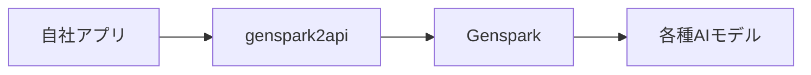

# Genspark API 調査レポート

> **調査日**: 2026-02-20 23:15  
> **調査者**: AI Assistant  
> **目的**: Genspark APIの利用可能性と自社システムへの統合検討

---

## 1. エグゼクティブサマリー

| 項目 | 結論 |
|------|------|
| **公式API** | ❌ 提供されていない（2026-02-20時点） |
| **非公式API** | ⚠️ コミュニティ製の逆向きエンジニアリングツールあり |
| **推奨** | 現状では**自社実装を維持**が最適 |
| **今後の監視** | 公式APIリリースを継続的に確認推奨 |

---

## 2. Gensparkとは

### 概要
- **提供元**: Mainfunc（米国企業）
- **サービス形態**: AI統合ワークスペース（Super Agent）
- **主要機能**:
  - AI Slides（プレゼン自動生成）
  - AI Sheets（スプレッドシート処理）
  - AI Docs（ドキュメント作成）
  - AI Developer（アプリ開発）
  - AI Designer（デザイン生成）
  - AI Chat（チャット）
  - AI Image/Video（画像・動画生成）

### 料金プラン（参考）
| プラン | 料金 | 特徴 |
|--------|------|------|
| Free | $0/月 | 制限付き利用 |
| Plus | ~$20-25/月 | 12,000クレジット |
| Pro | ~$40-249/月 | 125,000クレジット |
| Enterprise | カスタム | 優先サポート |

---

## 3. API提供状況

### 3.1 公式API

**結論: 提供されていない**

- Gensparkは現在、**エンドユーザー向けWebアプリケーション**として提供
- 開発者向けの公式APIドキュメントは存在しない
- Reddit等でのコミュニティ要望は多数あるが、未対応

### 3.2 非公式API（コミュニティ製）

#### genspark2api
- **リポジトリ**: https://github.com/deanxv/genspark2api
- **仕組み**: Cookieを使った逆向きエンジニアリング
- **提供形式**: OpenAI互換API（/chat/completions等）

**対応モデル例**:
```
gpt-5-minimal, gpt-5, gpt-5-high, gpt-5-pro
gpt-4.1, o1, o3, o3-pro, o4-mini-high
claude-3-7-sonnet-thinking, claude-3-7-sonnet
gemini-2.5-pro, gemini-2.5-flash
grok-4-0709, deep-seek-v3, deep-seek-r1
```

**機能**:
- チャット（ストリーミング/非ストリーミング）
- 画像生成（/images/generations）
- 動画生成（/videos/generations）
- ファイル/画像アップロード対応
- ネット検索（モデル名に`-search`追加）

**制約・リスク**:
| 項目 | 内容 |
|------|------|
| **認証方式** | Cookieベース（session_id必須） |
| **ReCaptcha** | V3検証必須（別途プロキシサービス要） |
| **レート制限** | IP単位での制限あり |
| **安定性** | 公式変更で動作不良のリスク |
| **利用規約** | おそらく違反（明記なしだが推奨されない） |

---

## 4. 技術的比較

### 現在の自社システム vs Genspark

| 項目 | 自社システム | Genspark |
|------|-------------|----------|
| **アーキテクチャ** | Next.js + Grok API | 独自Super Agent |
| **プロンプト制御** | ✅ 完全に制御可能 | ❌ ブラックボックス |
| **カスタマイズ** | ✅ 自由に実装可能 | ❌ 限定的 |
| **データ保持** | ✅ 自社DBで管理 | ❌ クラウド依存 |
| **セキュリティ** | ✅ 社内管理 | ⚠️ 外部サービス依存 |
| **コスト** | API使用量のみ | サブスクリプション |
| **スケーラビリティ** | ✅ 自在に調整可能 | ❌ プラン制限 |

### 特に重要な差異

#### 1. プロンプトサジェスト機能
| 項目 | 自社実装 | Genspark |
|------|---------|----------|
| **カスタマイズ** | 機能別に自由に設定可能 | 固定のアルゴリズム |
| **業務特化** | テレビ制作向けに最適化 | 汎用的 |
| **ブランド統一** | 社内用語・文体に統一 | 不可 |

#### 2. データ管理
- **自社システム**: 会話履歴、プロンプト、設定を全て自社DBで管理
- **Genspark**: クラウド上にデータが残る（セキュリティ・コンプライアンス懸念）

---

## 5. 統合検討シナリオ

### シナリオA: 非公式APIを使う場合



**メリット**:
- 複数モデルに一度にアクセス可能
- 画像・動画生成機能が使える

**デメリット**:
- 法的・セキュリティリスク
- メンテナンスコスト（破壊的変更への対応）
- ReCaptcha回避のための追加インフラ要

**評価**: ❌ **推奨しない**

### シナリオB: 公式APIリリース後に統合

**想定される統合ポイント**:
```typescript
// 例: 画像生成のみGensparkに委託
const generateImage = async (prompt: string) => {
  // 自社システムでプロンプト最適化
  const optimizedPrompt = await optimizeWithContext(prompt);
  
  // Genspark APIで画像生成
  const image = await genspark.images.generate({
    prompt: optimizedPrompt,
    model: "gpt-image-1"
  });
  
  // 自社DBに保存
  await saveToDatabase(image);
};
```

**評価**: ⏳ **公式APIリリースを待つ**

### シナリオC: 現状維持（自社実装）

**継続理由**:
1. テレビ制作業務に特化した設計
2. データの完全な管理
3. プロンプトエンジニアリングの自由度
4. セキュリティ・コンプライアンス

**評価**: ✅ **現時点で最適**

---

## 6. 推奨アクション

### 即座に実施
| 優先度 | アクション | 担当 |
|--------|-----------|------|
| P1 | 現状の自社実装を維持 | 開発チーム |
| P2 | Genspark公式APIリリースを監視 | 技術調査担当 |

### 継続的監視
| 項目 | 方法 | 頻度 |
|------|------|------|
| 公式API発表 | Gensparkブログ・Twitter | 週1回 |
| コミュニティ動向 | GitHub, Reddit | 月1回 |
| 競合動向 | OpenAI, Anthropic, Google | 月1回 |

### 将来的な検討事項
- **画像・動画生成**: 現状はGrok APIで代替、必要に応じてMidjourney等を検討
- **マルチモデル**: 現状はGrokで十分、必要に応じてOpenAI API追加検討

---

## 7. 結論

### 最終判断

**Genspark APIは現時点では導入しない**

理由:
1. **公式APIが存在しない** - 非公式APIはリスクが高い
2. **自社実装で十分** - テレビ制作特化の価値がある
3. **データ管理** - セキュリティ・コンプライアンス上重要
4. **コスト** - サブスクリプションよりAPI従量課金が予測しやすい

### 代替案

現状の**Grok API + 自社プロンプト管理**を継続し、以下を検討:

| 機能 | 現状 | 将来的な代替 |
|------|------|-------------|
| テキスト生成 | Grok API | 継続 |
| 画像生成 | 未実装 | DALL-E 3 / Midjourney API |
| 動画生成 | 未実装 | Runway / Pika API |
| プロンプトサジェスト | 自社実装 | 継続・改善 |

---

## 8. 参考リンク

| リンク | 内容 |
|--------|------|
| https://www.genspark.ai/ | Genspark公式サイト |
| https://github.com/deanxv/genspark2api | 非公式API（コミュニティ製） |
| https://www.genspark.ai/pricing | 料金プラン |
| https://www.reddit.com/r/genspark_ai/ | コミュニティ |

---

## 更新履歴

| 日時 | 内容 | 担当 |
|------|------|------|
| 2026-02-20 23:15 | 初版作成 | AI Assistant |
