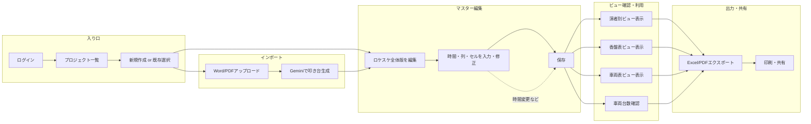

# ロケスケ・香盤表・車両表 ウェブアプリ実装プラン

**プロジェクト:** UNITED PRODUCTIONS様 — 業務9（ロケスケジュール・香盤表・車両表）ウェブアプリ  
**作成日:** 2026年2月12日  
**参照:** [業務洗い出しとソリューション.md](業務洗い出しとソリューション.md) / [LC開発プラン.md](LC開発プラン.md) PJ-E

---

## 1. 概要・目的

LC開発プランではPJ-Eとして「Googleスプレッドシート + GAS」でのロケスケ連動テンプレートが想定されている。本ドキュメントは、**同じ業務を自作ウェブアプリで実装する**ための実装プランである。ウェブアプリとする理由として、自社サーバーでの運用・UI・出力フォーマットのカスタマイズのしやすさ、およびスプレッドシートに依存しない環境での利用を想定する。

**目的:** ロケスケジュール（全体版）をマスターとし、時間変更を1箇所修正するだけで演者別版・香盤表・車両表に自動反映される仕組みをウェブアプリで構築する。これにより、現状の「Excelで別々に作成し整合性を手動で取る」課題を解消する。

**参考資料の所在:**  
`G:\共有ドライブ\UNITED PRODUCTIONS様\United Productions様 LangCore 共有用\ロケスケ・香盤表・車両表`

---

## 2. スコープと成果物

| 項目 | 内容 |
|------|------|
| **マスター** | ロケスケジュール（全体版）：時間軸・演者・スタッフ・場所・内容を1つのデータソースで管理 |
| **自動生成物** | 演者別版ロケスケ、香盤表、車両表をマスターから自動生成・表示 |
| **連動** | マスターの時間・内容変更が、演者別・香盤・車両の各ビューに自動反映 |
| **車両** | 同時刻に必要な車両数の自動算出（ロケバス発注の目安） |
| **エクスポート** | Excel / PDF 出力の要否は要件確定時に決定。**Excelは「マスター連動型」**（計算式で他シートをマスターに紐づけ、マスターだけ編集すれば演者別・香盤・車両が更新される形式）での出力が可能（後述）。 |
| **インポート** | Word / PDF 形式の「時間込みの流れ」ドキュメントをアップロードし、Gemini API 等で解析してマスターのロケスケの**叩き台**を自動生成する機能をスコープに含める（後述）。 |

**成果物:** 上記を満たすウェブアプリ（フロント＋バックエンド＋永続化）。本実装プランはその設計・開発の指針とする。

---

## 3. 参考資料の構造

参考資料フォルダ内のファイル一覧と、各表の構造の要点を以下に整理する。**Excelのセル単位の詳細は、実装時に参考資料（.xlsx）を開いて確認すること。**

### ファイル一覧

| 種類 | ファイル名 |
|------|------------|
| ロケスケ（全体版） | 【海保】ロケスケ全部いり1010決定稿.xlsx / .pdf |
| 香盤表 | 【海保】スタッフ香盤1010決.xlsx / .pdf |
| 車両表 | 海上保安庁_車両表1009★.xlsx / .pdf |

### ロケスケジュール（全体版）の構造

- **縦軸（行）：** 時間・分・備考。1行または複数行で「時間帯＋内容」を表現（例: 7:30〜9:25 / 1H55 / 【飛行機移動】、次の行に「羽田空港〜福岡空港」など）。
- **横軸（列）：** 制作（本隊）・技術、制作②（林D・三宅D・チェD）、櫻井翔様、末澤誠也様、アンガールズ田中卓志様、先回り：鼻野D など、**演者・スタッフグループごとの列**。各セルにその時間帯の「どこで・何をするか」が入る。
- **備考列:** 移動手段（飛行機・車両）や特記事項（お弁当到着、セッティング等）。

### 香盤表の構造

- **縦軸:** 時間・分（ロケスケと同様の時間軸）。
- **横軸 / 内容:** 制作（本隊）・技術などの**スタッフ単位**で、「いつ・どこで・何をするか」を細分化。ロケスケの「演者・スタッフ列」の情報を、スタッフ視点で再構成した表。
- 例: 「えんじ色車移動」「櫻井様車移動」「レンタカー返却」「前のり」など、スタッフ別の動きが列またはブロックで記載。

### 車両表の構造

- **列単位で1台の車両:** 運転手名・携帯番号が各列のヘッダ。1列＝1台。
- **行:** 移動の時間帯（例: 12:45〜13:10、13:10〜14:30）と、その時間帯の内容（「※福岡空港待機」「【13:10 福岡発】櫻井様 出発〜控え室」等）。乗車者・連絡先も同じ列内で管理。
- **用途:** ロケバス会社への発注・当日の乗車・連絡の把握。

---

## 4. データモデル案

マスターとなるデータを「ロケスケの1コマ」として定義し、そこから演者別・香盤・車両の各ビューを導出する。

### マスターエンティティ（案）

| 概念 | 説明 |
|------|------|
| **時間帯** | 開始時刻・終了時刻（または「分」の長さ）。同一時間帯が複数行にまたがる場合はグループIDなどで紐付け。 |
| **備考** | 時間帯に共通のメモ（【飛行機移動】、お弁当到着など）。 |
| **列（スロット）** | 演者またはスタッフグループ（例: 櫻井翔様、制作本隊・技術）。マスターでは「列ID・表示名・種別（演者/スタッフ/車両関連）」を管理。 |
| **セル内容** | 時間帯 × 列 の組み合わせに対する「場所・アクション・移動手段」などのテキスト。 |
| **車両割当** | どの時間帯にどの車両（運転手・連絡先）が誰を乗せてどこへ向かうか。マスターの「車両関連」列または別テーブルで管理。 |

### ビューへの変換ルール（概要）

- **演者別版:** マスターから「列が演者」のものだけを抽出し、演者ごとに1ビュー（1表）を生成。時間軸はマスターと同じ。
- **香盤表:** マスターの「列＝スタッフ/スタッフグループ」を軸に、時間軸で「いつ・どこで・何を」を並べる。スタッフ単位で行または列を再構成。
- **車両表:** マスターの「車両割当」および「誰がどの車に乗るか」を集約し、車両（運転手）を列、時間帯を行とした表を生成。乗車者・連絡先はマスターのスタッフ情報から結合。

実装時に、参考Excelのシート構成に合わせてエンティティ名・項目を調整する。

---

## 5. 機能要件

| # | 機能 | 内容 |
|---|------|------|
| F1 | マスター編集UI | ロケスケ（全体版）の時間・列・セル内容を一覧編集できる画面。行の追加・削除・並べ替え、列（演者・スタッフ）の追加・削除。 |
| F2 | 演者別ビュー自動生成 | マスター保存時に演者別版を自動生成し、画面で表示。演者を選択して1人分の表を表示。 |
| F3 | 香盤表ビュー自動生成 | マスターからスタッフ別「いつ・どこで・何を」を自動生成し、香盤表として表示。 |
| F4 | 車両表ビュー自動生成 | マスターの車両・乗車情報から車両表を自動生成。運転手・携帯・時間帯・乗車者を表示。 |
| F5 | 時間変更の一括反映 | マスターで時間を変更すると、演者別・香盤・車両の全ビューに即時反映（再計算・再表示）。 |
| F6 | 車両台数自動算出 | 同一時刻に必要な車両数を集計し、表示またはエクスポート用に出力。ロケバス発注の目安とする。 |
| F7 | エクスポート（要否は要件で決定） | 必要に応じて Excel / PDF でダウンロード。Excel は「マスター連動型」（計算式紐づけ）での出力を検討可能（下記参照）。 |
| F8 | **Word/PDFインポート → マスター叩き台生成** | 時間込みの流れが書かれた Word / PDF をアップロードし、AI（Gemini API 想定）でテキストを解析。時間帯・内容・演者/スタッフの区切りを抽出し、マスターのロケスケの叩き台データを生成。ユーザーは叩き台を確認・修正してから保存する（5.2 参照）。 |

### 5.1 Excel出力：マスター連動型（計算式で紐づけた出力）

**質問:** エクセル出力したときに計算式などで紐づいていて、マスターシートだけいじればいいように作れるか。

**結論:** **作れる。** エクスポート時に「1ブック内にマスターシート＋演者別・香盤・車両の各シートを用意し、他シートはマスターを参照する計算式（`=マスター!セル` 等）で埋める」形式にすれば、受け取った人が Excel 上でマスターシートだけ編集すれば、演者別・香盤・車両の各シートが自動更新される。

| 項目 | 内容 |
|------|------|
| **方式** | 出力する .xlsx を「マスター」シート（データのみ・ユーザーが編集）＋「演者別」「香盤表」「車両表」シート（マスター参照の数式のみ）で構成する。 |
| **演者別** | マスターの「時間」列＋該当演者列を参照する式で実現可能。例: 演者別シートの B5 = `=マスター!E5`（櫻井列が E 列の場合）。列位置は出力時にマスターの列定義から決める。 |
| **香盤表** | マスターの時間×スタッフ列を、スタッフ別のレイアウトに並べ替える形で参照。INDEX/MATCH や OFFSET で「行・列の対応」を式で表現する。構造が複雑な分、式の設計・検証に工数がかかる。 |
| **車両表** | マスターの車両・乗車情報を、車両（列）×時間帯（行）に並べる式で参照。同様に INDEX/MATCH 等で実現可能。 |
| **動的な行・列** | 時間帯や列の増減に対応するには、マスターをテーブル（リスト）化し、式側で範囲を可変にする（OFFSET/INDIRECT や Excel テーブル参照）必要がある。または「出力時点の行・列数で固定の式を生成」とし、増減時は再エクスポートで対応する。 |
| **注意点** | 式が複雑になるほど Excel の再計算が重くなる可能性、Google スプレッドシート等では挙動差が出る可能性がある。マスターのセル名・シート名を変更すると参照が壊れるため、エクスポート仕様で固定するか、受け取り側に注意を明記する。 |

**実装方針:** 要件で「Excel でもマスターだけ編集して連動させたい」が採用される場合、エクスポート機能で上記の「マスター連動型」ブックを生成する。まず演者別から式で紐づける形で実装し、香盤・車両はレイアウトが固まった後に式設計を追加するのが現実的。

### 5.2 Word/PDFインポート → マスター叩き台生成

**目的:** 既存の「時間込みの流れ」ドキュメント（Word や PDF）がある場合、それをアップロードして AI で解析し、マスターのロケスケの**叩き台**を自動生成する。手で一から入力する工数を減らし、ドキュメントの流れをそのままロケスケの土台にできる。

| 項目 | 内容 |
|------|------|
| **入力** | Word（.docx）または PDF。時間付きの進行・流れが書かれた文書（例: 台本の流れ、打ち合わせメモ、構成メモ）。 |
| **処理** | 1) アップロードされたファイルからテキストを抽出（Word: python-docx 等、PDF: PyMuPDF / pdfplumber 等）。2) 抽出テキストを **Gemini API** に送り、プロンプトで「時間・時刻・時間帯」「内容・場所・アクション」「演者・スタッフの区切り」を構造化して抽出。3) 出力をマスターのデータ構造（時間帯・列・セル内容）に変換し、叩き台として返す。 |
| **出力** | マスター編集画面に反映する用の叩き台データ（時間軸・列・セル内容の候補）。ユーザーは画面で確認・修正してから「保存」する。上書きではなく「新規プロジェクトの叩き台」または「既存マスターへの追記・置換」を選べるようにする。 |
| **AI** | **Gemini API** を想定。テキストの構造化・時刻と内容の対応付けに適している。プロンプトで「ロケスケジュールのマスター形式」の出力仕様（時間・分・備考、列ごとの内容）を明示する。 |
| **注意点** | 元ドキュメントのフォーマットがばらつくため、解析精度は文書の書き方に依存する。叩き台は必ず人が確認・修正する前提とする。PDF はスキャン画像の場合は OCR が必要（Gemini の PDF 入力や別途 OCR を検討）。 |

**実装方針:** バックエンドでファイル受信 → テキスト抽出 → Gemini API 呼び出し（プロンプトに「時間付きの流れをロケスケのマスター形式（時間帯・列・セル）に変換せよ」と定義）→ 返却 JSON をマスター用に整形 → フロントに返し、マスター編集画面にプレビュー表示 → ユーザーが編集・保存。

---

## 6. ユーザーフロー（実際の仕様）

利用者がアプリにログインしてから、ロケスケ・香盤表・車両表を完成させて共有するまでの流れを、実際の仕様に即して示す。

### 6.1 フロー全体図

### 6.2 ステップ別ユーザーフロー

| ステップ | ユーザー操作 | システムの動き | 備考 |
|----------|--------------|----------------|------|
| **1. 入室** | アプリにアクセス。認証が必要ならログイン。 | 認証後、プロジェクト一覧（またはダッシュボード）を表示。 | 初回は「新規プロジェクト」から。 |
| **2. プロジェクト選択** | 「新規作成」でロケ日・タイトルを入力して作成、または既存プロジェクトを選択。 | プロジェクトが作成/選択され、マスター編集画面またはホームに遷移。 | 既存選択時は直近保存のマスターが読み込まれる。 |
| **2'. インポートで叩き台作成（任意）** | Word/PDF（時間込みの流れドキュメント）をアップロードし「叩き台を生成」を実行。 | ファイルからテキスト抽出 → Gemini API で解析 → マスター形式の叩き台データを返却。マスター編集画面にプレビュー表示。 | 新規作成時や「叩き台から始めたい」ときに利用。叩き台は確認・修正後に保存。 |
| **3. マスター編集** | ロケスケ（全体版）の時間軸・列（演者・スタッフ）・各セルの内容を入力・編集。行の追加・削除・並べ替え、列の追加・削除。インポートした叩き台があればそれを修正。 | 編集内容をローカルまたはオート保存で保持。保存ボタンでサーバに送信。 | ここが唯一の編集ポイント。時間変更はここだけでよい。 |
| **4. 保存** | 「保存」を実行。 | マスターを永続化。演者別・香盤・車両の各ビューを自動再計算。 | 保存後、各ビューは常にマスターと整合。 |
| **5. 演者別ビュー確認** | ナビから「演者別」を選択。必要なら演者（列）を1人選択。 | マスターから該当演者の列だけを抽出した表を表示。 | 出演者への共有用・印刷用。 |
| **6. 香盤表ビュー確認** | ナビから「香盤表」を選択。 | マスターからスタッフ別「いつ・どこで・何を」を再構成して表示。 | 制作・AD用の細かい動きの確認。 |
| **7. 車両表ビュー確認** | ナビから「車両表」を選択。 | マスターの車両・乗車情報から、運転手別・時間帯・乗車者を表示。車両台数も表示。 | ロケバス発注・当日の乗車確認用。 |
| **8. 車両台数確認** | 車両表画面または専用エリアで、時間帯別の必要車両数を確認。 | 同一時刻の乗車需要から車両数を自動算出して表示。 | 発注台数の目安。 |
| **9. 再編集** | 時間変更や内容修正が必要な場合、マスター編集に戻り該当箇所を修正して保存。 | 保存後、演者別・香盤・車両の全ビューが即時更新。 | 1箇所直せば全資料が連動する。 |
| **10. エクスポート・共有** | 必要に応じて「Excel出力」「PDF出力」を実行。 | 選択したビュー（全体・演者別・香盤・車両）を指定形式でダウンロード。 | 要件でエクスポート要否を決定。 |
| **11. 印刷・共有** | ブラウザの印刷や、ダウンロードしたファイルをメール・共有ドライブで配布。 | 特になし。 | 現行のExcel/PDF共有の代替。 |

### 6.3 典型的な利用シーン（シナリオ）

- **初回作成:** ログイン → 新規プロジェクト作成 → マスター編集で時間軸・演者・スタッフ列を設定 → セル内容を入力 → 保存 → 演者別・香盤・車両を確認 → 必要ならエクスポートして共有。
- **ドキュメントから叩き台作成:** ログイン → 新規プロジェクト作成 → 「Word/PDF から叩き台を生成」で時間込みの流れドキュメントをアップロード → Gemini が解析してマスター叩き台を表示 → 確認・修正して保存 → 演者別・香盤・車両を確認 → 必要ならエクスポート。
- **時間変更対応:** 既存プロジェクトを開く → マスター編集で該当時間を修正 → 保存 → 全ビューが自動更新されたことを確認 → 必要なら再エクスポート。
- **出演者への渡し:** マスター完成後 → 演者別ビューで該当演者を選択 → 表示またはエクスポート → 印刷またはファイルで渡す。

---

## 7. 技術スタック案

| レイヤ | 候補 | 備考 |
|--------|------|------|
| **フロントエンド** | Next.js / React | 表の編集・表示が主なため、テーブルUI・状態管理がしやすい構成。インポート用のファイルアップロードUIを追加。 |
| **バックエンド** | Node.js (Next.js API Routes) または Python (FastAPI) | 他LC開発（PJ-C等）がFastAPIを採用している場合は合わせる選択肢あり。 |
| **永続化** | SQLite（開発・小規模） / PostgreSQL（本番想定） | マスターの時間帯・列・セル・車両割当をリレーションで保持。 |
| **認証** | 必要に応じて Google Workspace SSO | 社内利用に限定する場合は認証を入れる。 |
| **インポート（叩き台生成）** | **Gemini API**（テキスト構造化）、Word: python-docx 等でテキスト抽出、PDF: PyMuPDF / pdfplumber 等でテキスト抽出。スキャンPDFは OCR または Gemini の PDF 入力機能を検討。 | セクション 5.2 参照。 |
| **エクスポート** | Excel: openpyxl または xlsx 等（マスター連動型は「マスター」シート＋他シートに参照式を書き込む形で生成）。PDF: ライブラリで表をレンダリング | 要件確定後に採用ライブラリを決定。計算式連動型はセクション 5.1 参照。 |

---

## 8. 画面・API概要

### 画面一覧（案）

| 画面 | 役割 |
|------|------|
| マスター編集 | ロケスケ全体版の編集。時間軸・列（演者・スタッフ）・セル内容のCRUD。**「Word/PDFから叩き台を生成」**の入口（アップロードボタン）を同一画面またはモーダルで提供。 |
| インポート（叩き台生成） | Word/PDF をアップロードし、Gemini で叩き台を生成。結果をマスター編集にプレビュー表示（新規用 or 既存への取り込みを選択可能）。 |
| 演者別ビュー | 演者を選択し、その演者用のロケスケを表示（読み取りまたは簡易印刷用）。 |
| 香盤表ビュー | 香盤表を表示。スタッフ別の「いつ・どこで・何を」一覧。 |
| 車両表ビュー | 車両表を表示。運転手別・時間帯・乗車者・連絡先。 |
| 設定 | プロジェクト名・ロケ日・列のデフォルトなど、マスターのメタ情報の編集（必要に応じて）。 |

### API概要（案）

| 種別 | エンドポイント例 | 説明 |
|------|------------------|------|
| CRUD | GET/POST/PUT/DELETE `/api/schedules` または `/api/master` | マスターの取得・保存・更新。 |
| **インポート** | **POST `/api/import/draft`** | Word/PDF を multipart で送信。テキスト抽出 → Gemini API で解析 → マスター叩き台の JSON を返却。 |
| 生成 | GET `/api/views/cast/:castId` | 演者別ビュー取得。 |
| 生成 | GET `/api/views/kouban` | 香盤表ビュー取得。 |
| 生成 | GET `/api/views/vehicles` | 車両表ビュー取得。 |
| 算出 | GET `/api/views/vehicle-counts` | 時間帯別車両台数。 |

※ ルート設計は実装時に REST または tRPC 等で統一する。

---

## 9. フェーズ・マイルストーン

LC開発プラン上、PJ-E（ロケスケ連動）は「5月以降」スコープのため、ウェブアプリ版も同様に5月以降の着手を想定する。

| フェーズ | 内容 | 成果物 |
|----------|------|--------|
| 1. 要件確定 | 参考Excelを開き、列・行・セルルールを確定。エクスポート要否・認証要否を決定。 | 要件書・データ項目一覧 |
| 2. データモデル・画面設計 | 上記データモデル案の具体化、画面ワイヤー・API仕様。 | 設計書・API一覧 |
| 3. 実装（マスター→自動生成） | マスター編集UI、保存、演者別・香盤・車両の自動生成ロジックと表示。**Word/PDFインポート→叩き台生成**（Gemini API・テキスト抽出）の実装（5.2 参照）。 | α版アプリ |
| 4. エクスポート（必要なら） | Excel / PDF 出力の実装。Excel は「マスター連動型」（計算式で他シートをマスターに紐づけたブック）の出力を検討（5.1 参照）。 | 出力機能 |
| 5. テスト・反映 | 実資料での動作確認、時間変更の一括反映の検証。 | リリース版 |

---

## 10. 成果物・参照

- **本ドキュメント:** `C:\Users\kb2hh\OneDrive\Documents\20260205会議\ロケスケ香盤車両表_ウェブアプリ実装プラン.md`
- **参考資料:** `G:\共有ドライブ\UNITED PRODUCTIONS様\United Productions様 LangCore 共有用\ロケスケ・香盤表・車両表`
- **業務定義:** [業務洗い出しとソリューション.md](業務洗い出しとソリューション.md) — 9. ロケスケジュール・香盤表・車両表の作成
- **LC開発全体:** [LC開発プラン.md](LC開発プラン.md) — PJ-E: ロケスケ連動テンプレート（GAS案）。本ウェブアプリは同業務の別実装方針として位置づける。
