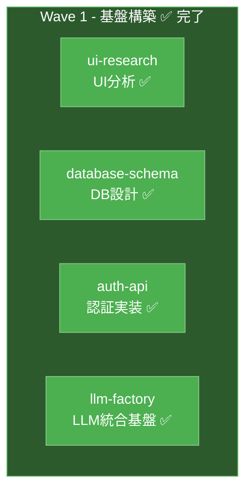
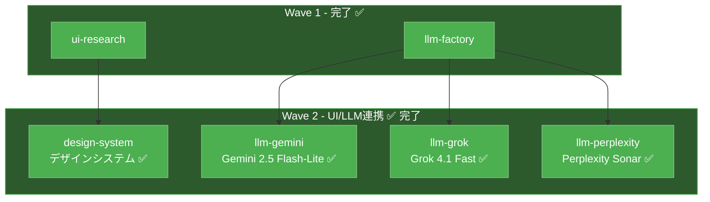
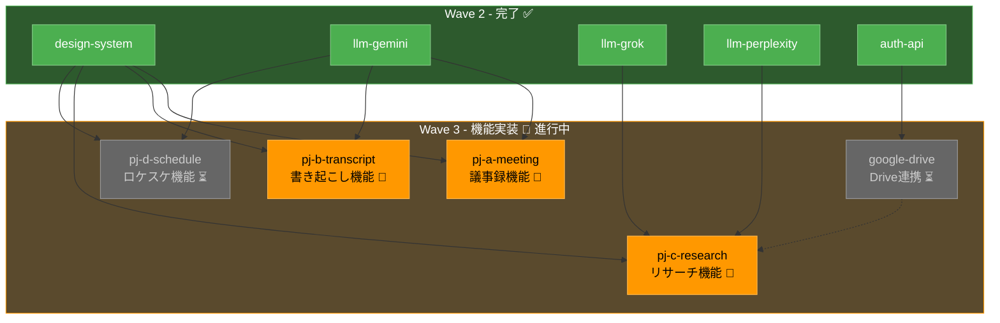
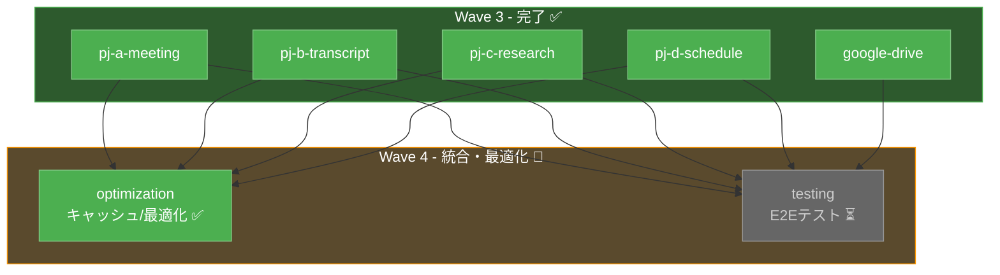
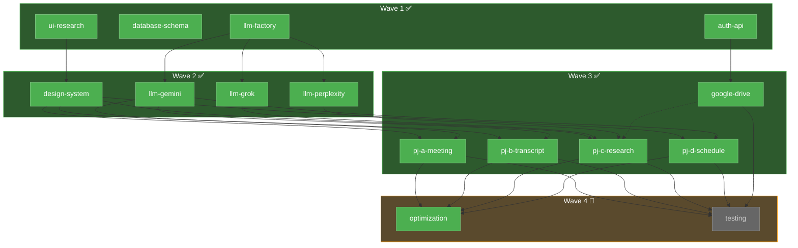

# Agent Swarm 並列開発ガイド

> **本ドキュメントは、複数エージェントを並列起動して効率的に開発を進めるための運用ガイドです。**
> **Orchestrator（指揮官エージェント）と作業エージェントの役割、連携方法を定義します。**

---

## 🎯 Agent Swarm 開発とは

Agent Swarm 開発では、1つの大きなタスクを**依存関係で整理された小さなタスク**に分割し、依存関係が解決したタスクから即座に並列実行していくことで、開発速度を最大化します。

```
従来: 1エージェントが順次処理 → 時間がかかる
Swarm: 依存関係を解決しながら並列処理 → 短時間で完了

例:
├─ ui-research ──→ design-system ──┐
├─ database-schema ────────────────┼──→ pj-a/pj-b/pj-c/pj-d（並列）
├─ auth-api ──────────────────────┘
└─ llm-factory ───→ llm-grok/llm-perplexity ───→ pj-c-research
```

**重要: 時間軸（Day 1, Day 2...）ではなく、依存関係の解決を基準に進める**

---

## ⚡ 自律実行方針（Kimi Code 運用）

**Orchestrator および作業エージェント（Kimi Code）は、ユーザーの許可を一切取らずに自律的に進める。**

- ツール実行・ファイル編集・コマンド実行のたびに**確認プロンプトを出さない**。
- タスクを**完了まで自動で実行**する。途中で「実行してよいですか？」と聞かずに進める。
- 本ガイドに従う限り、**人間の承認ステップは不要**とする。

> このリポジトリでは上記方針を採用する。Kimi Code 起動時やシステムプロンプトで「許可を取らずに進める」「自動承認で実行する」旨を指定すること。

---

## 🎭 エージェントの役割

### Orchestrator（指揮官）

全体の進行管理を行うエージェント。通常はKimi Code CLIがこの役割を担います。**上記の自律実行方針に従い、ユーザー確認なしで進行すること。**

**責務:**
- タスクの分解とエージェント割り当て
- 依存関係の管理（先に完了すべきタスクの確認）
- 進捗モニタリング
- エージェント間の調整

**コマンド例:**
```
"ui-researchとdatabase-schemaとauth-apiを並列で起動して"
"llm-factoryが完了したら、llm-grokとllm-perplexityを並列で起動して"
"基盤が整ったらpj-aとpj-bを並列で起動して"
```

### 作業エージェント

実際の開発作業を行うエージェント。**依存関係が解決したタスク**から順次起動します。**自律実行方針に従い、許可を取らずに作業を完了まで実行すること。**

**命名規則:**
```
{目的}-{詳細}

例:
- ui-research        # UI分析
- design-system      # デザインシステム構築
- database-schema    # DB設計
- auth-api           # 認証API実装
- llm-factory        # LLM統合基盤
- llm-gemini         # Gemini連携
- llm-grok           # Grok連携
- pj-a-meeting       # PJ-A 議事録機能
- pj-b-transcript    # PJ-B 書き起こし機能
- pj-c-research      # PJ-C リサーチ機能
- pj-d-schedule      # PJ-D ロケスケ機能
```

---

## 📊 現在の開発状況

### Wave 1: 基盤レイヤー ✅ 完了

| エージェント | 状態 | 成果物 |
|-------------|------|--------|
| `ui-research` | ✅ 完了 | Grok UI分析済み、カラーパレット・コンポーネント仕様抽出 |
| `database-schema` | ✅ 完了 | `prisma/schema.prisma` 作成済み、マイグレーション完了 |
| `auth-api` | ✅ 完了 | NextAuth.js 実装済み、Google OAuth連携完了 |
| `llm-factory` | ✅ 完了 | 複数LLM統合基盤完成、統一インターフェース実装 |

### Wave 2: UI/LLM連携レイヤー ✅ 完了

| エージェント | 状態 | 成果物 |
|-------------|------|--------|
| `design-system` | ✅ 完了 | shadcn/ui + カスタムテーマ適用、Grok UI風コンポーネント |
| `llm-gemini` | ✅ 完了 | Gemini 2.5 Flash-Lite 対応実装 |
| `llm-grok` | ✅ 完了 | Grok 4.1 Fast 対応実装 |
| `llm-perplexity` | ✅ 完了 | Perplexity Sonar 対応実装 |

### Wave 3: 機能実装レイヤー ✅ 完了

| エージェント | 状態 | 作業内容 |
|-------------|------|----------|
| `pj-a-meeting` | ✅ 完了 | 議事録機能実装完了 |
| `pj-b-transcript` | ✅ 完了 | 書き起こし機能実装完了 |
| `pj-c-research` | ✅ 完了 | リサーチ機能実装完了 |
| `pj-d-schedule` | ✅ 完了 | ロケスケ機能実装完了 |
| `google-drive` | ✅ 完了 | Drive連携実装完了 |

**完了日**: 2026年2月16日

---

## 🔗 依存関係グラフ

### Wave 1: 基盤レイヤー（完了済み）



### Wave 2: UI/LLM連携レイヤー（完了済み）



### Wave 3: 機能実装レイヤー（進行中）



### Wave 4: 統合・最適化 🔄 進行中



### 全体依存関係図



---

## 🚀 並列実行の進め方

### Wave 1: 基盤構築（独立タスクを一斉起動）✅ 完了

**即座に並列実行可能:**

| エージェント | 依存 | 作業内容 | 状態 |
|-------------|------|----------|------|
| `ui-research` | なし | Grok UI分析、カラーパレット抽出 | ✅ 完了 |
| `database-schema` | なし | Prismaスキーマ、マイグレーション | ✅ 完了 |
| `auth-api` | なし | NextAuth.js認証実装 | ✅ 完了 |
| `llm-factory` | なし | LLM統合インターフェース | ✅ 完了 |

**完了条件**: Gemini 2.5 Flash-Lite で動作確認 ✅

### Wave 2: UI/LLM連携（Wave 1 完了後に並列実行）✅ 完了

**Wave 1の成果を使って並列実行:**

| エージェント | 依存 | 作業内容 | 状態 |
|-------------|------|----------|------|
| `design-system` | ui-research | shadcn/uiカスタマイズ | ✅ 完了 |
| `llm-gemini` | llm-factory | Gemini 2.5 Flash-Lite連携 | ✅ 完了 |
| `llm-grok` | llm-factory | Grok 4.1 Fast連携 | ✅ 完了 |
| `llm-perplexity` | llm-factory | Perplexity Sonar連携 | ✅ 完了 |

**完了条件**: LLM切り替えが動作 ✅

### Wave 3: 機能実装（Wave 2 完了後に並列実行）✅ 完了

**基盤（Wave 1+2）が整ったら全て並列実行:**

| エージェント | 依存 | 作業内容 | 状態 |
|-------------|------|----------|------|
| `pj-a-meeting` | design-system, llm-gemini | 議事録機能 | ✅ 完了 |
| `pj-b-transcript` | design-system, llm-gemini | 書き起こし機能 | ✅ 完了 |
| `pj-c-research` | design-system, llm-grok, llm-perplexity, google-drive | リサーチ機能 | ✅ 完了 |
| `pj-d-schedule` | design-system, llm-gemini | ロケスケ機能 | ✅ 完了 |

**完了報告**:
```
[COMPLETE] Wave 3 完了報告 - 2026年2月16日

完了タスク:
- [x] pj-a-meeting → 議事録機能 ✅
- [x] pj-b-transcript → 書き起こし機能 ✅
- [x] pj-c-research → リサーチ機能 ✅
- [x] pj-d-schedule → ロケスケ機能 ✅
- [x] google-drive → Drive連携 ✅

次のWaveで開始可能:
- optimization（キャッシュ・最適化）
- testing（E2Eテスト）

推奨アクション:
「Wave 4を開始してください」
```

### Wave 4: 統合・最適化（Wave 3 完了後に実行）🔄 進行中

| エージェント | 依存 | 作業内容 | 状態 |
|-------------|------|----------|------|
| `optimization` | 全機能 | キャッシュ、パフォーマンス最適化 | ✅ 完了（キャッシュ実装済み） |
| `testing` | 全機能 | E2Eテスト、統合テスト | ⏳ 未開始 |
| `deployment` | 全機能 | Vercel本番デプロイ | ⏳ 未開始 |

---

## 📋 次のアクション

### 即座に実行可能

Wave 4の進行中タスクを継続して開発を進めます：

1. **testing** - E2Eテストの実装を開始
2. **deployment** - Vercel本番デプロイの準備

### Wave 4計画

| フェーズ | タスク | 目的 | 状態 |
|----------|--------|------|------|
| 統合 | `optimization` | キャッシュ戦略、パフォーマンス最適化 | ✅ 完了 |
| 品質保証 | `testing` | E2Eテスト、統合テスト実装 | ⏳ 未開始 |
| デプロイ | `deployment` | Vercel本番デプロイ、ドメイン設定 | ⏳ 未開始 |

### 推奨タイムライン

- **2月中**: E2Eテスト実装完了
- **3月初旬**: Vercel本番デプロイ
- **3月中**: チーム展開・運用開始

---

## 👤 人間の介入ポイント

詳細は別ドキュメントを参照してください。

→ **[人間の介入ポイント](./human-intervention-points.md)**

---

## 📋 エージェント起動テンプレート

### 基本パターン

```markdown
## タスク: {タスク名}

### 依存関係（完了している必要がある）
- [x] {前提タスク1}（完了済み）
- [x] {前提タスク2}（完了済み）

### ブロック条件（これらが未完了なら待機）
- [ ] {待機対象1}
- [ ] {待機対象2}

### 入力資料
- {参照すべきドキュメント}
- {Wave Xの成果物}

### 作業内容
1. {作業項目1}
2. {作業項目2}

### 完了条件
- [ ] {チェック項目1}
- [ ] {チェック項目2}

### 出力
- {作成するファイル/成果物}
```

### 実際の起動例

**Wave 1: ui-research（依存なし）✅ 完了**
```markdown
## タスク: Grok UI分析

### 依存関係
- なし（Wave 1 - 最初に実行）

### 入力資料
- docs/assets/images/grok-ui-screenshots/
- docs/initial_dev/initial_dev_plan.md（UI要件セクション）

### 作業内容
1. Grok UIのスクリーンショット分析
2. カラーパレット・コンポーネント仕様の抽出
3. design-systemドキュメント作成

### 完了条件
- [x] カラーパレット定義（HEX/Tailwind対応表）
- [x] 主要コンポーネント仕様（MessageBubble, LLMSelector等）
- [x] docs/ui-analysis.md作成

### 次のWaveで使用される
- design-systemエージェントの入力資料
```

**Wave 2: design-system（依存あり）✅ 完了**
```markdown
## タスク: デザインシステム構築

### 依存関係（完了済み）
- [x] ui-research（Wave 1完了）

### ブロック条件
- なし（依存は完了済み）

### 入力資料
- docs/ui-analysis.md（ui-researchの成果物）
- shadcn/ui ベースコード

### 作業内容
1. Grok UI風のカラーパレット適用
2. MessageBubbleコンポーネント実装
3. LLMSelectorコンポーネント実装
4. レイアウトコンポーネント（Sidebar, Header）実装

### 完了条件
- [x] Tailwind設定更新
- [x] UIコンポーネント実装
- [x] ストーリーブック（必要なら）

### 次のWaveで使用される
- pj-a/pj-b/pj-c/pj-d全てのUI実装で使用
```

**Wave 3: pj-c-research（複数依存）🔄 進行中**
```markdown
## タスク: PJ-C リサーチ・考査機能実装

### 依存関係（完了済み）
- [x] design-system（Wave 2完了）
- [x] llm-grok（Wave 2完了）
- [x] llm-perplexity（Wave 2完了）

### ブロック条件
- [ ] google-drive（並列進行中 - 完了待ち）

### 入力資料
- src/components/ui/（design-systemの成果物）
- src/lib/llm/clients/grok.ts
- src/lib/llm/clients/perplexity.ts

### 作業内容
1. リサーチ画面レイアウト
2. LLM選択UI実装
3. 人探し機能（Grok連携）
4. エビデンス検索（Perplexity連携）
5. Drive連携（完了後統合）

### 完了条件
- [ ] リサーチ画面実装
- [ ] Grok/Perplexity連携動作
- [ ] 結果表示・エクスポート機能
```

---

## 📝 ログ記録の徹底

### 必須ログエントリ

すべてのエージェントは以下を記録します：

| タイミング | TYPE | 内容 |
|-----------|------|------|
| セッション開始 | [INIT] | タスク受領、依存関係宣言 |
| 5分ごと | [PROGRESS] | 進捗率、現在の作業 |
| 他エージェント連絡 | [QUERY] | 問い合わせ内容 |
| 問い合わせ回答 | [ANSWER] | 回答内容 |
| 成果物作成 | [ARTIFACT] | ファイルパス、概要 |
| タスク完了 | [COMPLETE] | 完了報告、次のアクション |
| エラー発生 | [ERROR] | エラー詳細、対応状況 |
| ブロック | [BLOCKED] | 依存未解決で待機中 |

### Wave完了の報告フォーマット

```markdown
[COMPLETE] Wave X 完了報告

完了タスク:
- [x] {エージェント名1} → {成果物}
- [x] {エージェント名2} → {成果物}

次のWaveで開始可能:
- {エージェント名3}（依存が解決）
- {エージェント名4}（依存が解決）

推奨アクション:
「Wave X+1を並列で開始してください」
```

---

## ⚡ 並列開発のベストプラクティス

### DO（推奨）

✅ **依存関係が解決したら即座に開始**
- 待機時間を最小化
- Orchestratorが積極的に進捗確認

✅ **タスクを小さく分割**
- 1エージェント = 1時間以内で完了する粒度
- 大きすぎるタスクはさらに分割

✅ **ログを詳細に記録**
- [INIT]で依存関係を明確に宣言
- [COMPLETE]で次のWaveへの手がかりを残す

✅ **成果物は即座にコミット**
- 他エージェントが参照できるように
- ブランチ戦略: `feature/{agent-name}`

✅ **必要に応じてエージェント統合・分割**
- 進捗が遅い場合はエージェント追加
- 完了が早い場合は次のWaveに進む

### DON'T（禁止）

❌ **依存未解決で勝手に開始**
- コンフリクトや手戻りの原因

❌ **長時間の沈黙**
- 5分ごとに進捗報告
- 詰まったら即座に[BLOCKED]報告

❌ **ログなしでの作業**
- 後から追跡不可能になる

❌ **ファイルの直接競合**
- 同じファイルを編集する場合は順序化

---

## 🛠️ ユーティリティコマンド

### Wave進行状況の確認

```bash
# Wave 1の完了状況
grep "Wave 1" docs/logs/*.md | grep "\[COMPLETE\]"

# 各Waveの進捗
grep "Wave 1\|Wave 2\|Wave 3" docs/logs/*.md | grep "\[PROGRESS\]"

# ブロック中のエージェント
grep "\[BLOCKED\]" docs/logs/*.md

# 次に開始可能なエージェント
grep "開始可能\|ready to start" docs/logs/*.md
```

### 依存関係の追跡

```bash
# 特定エージェントの依存関係
grep -A5 "依存関係" docs/logs/*{agent-name}*.md

# 完了済みタスクの一覧
grep "\[COMPLETE\]" docs/logs/*.md | awk '{print $3}' | sort -u
```

---

## 📚 関連ドキュメント

| ドキュメント | 用途 |
|-------------|------|
| `initial_dev_plan.md` | 技術仕様、データモデル |
| `llm-integration.md` | LLM連携の詳細設計 |
| `../logs/README.md` | ログ仕様の詳細 |
| `../logs/template.md` | ログエントリテンプレート |

---

**原則: 「依存関係が解決できれば即座に開始」「並列で最大限進めて早く完成させる」**
