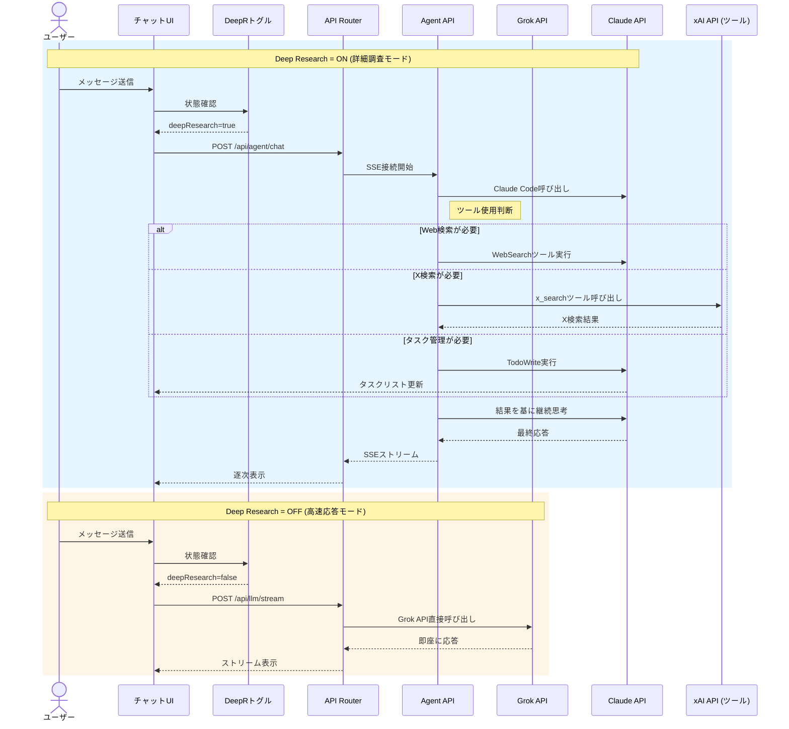
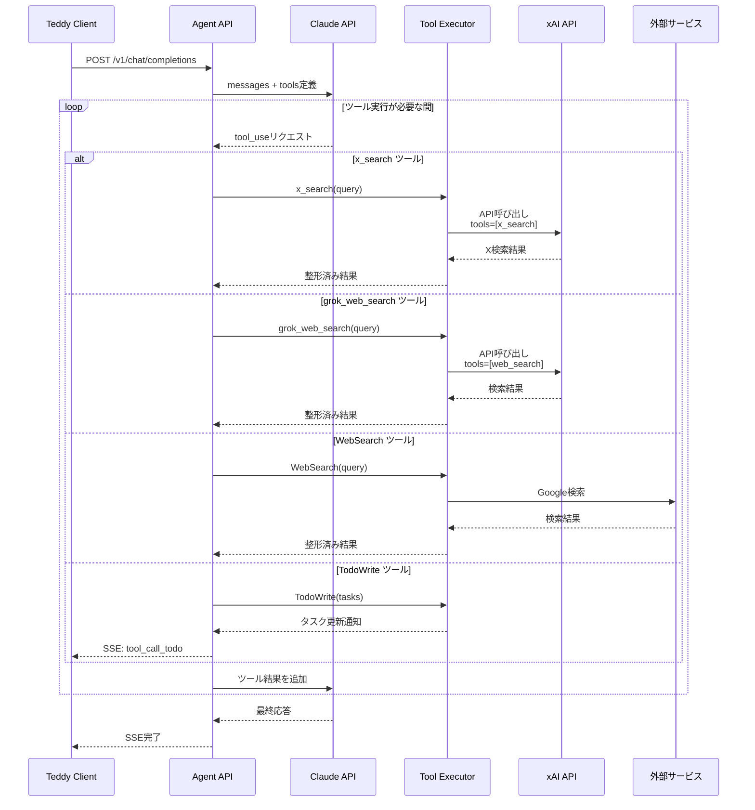
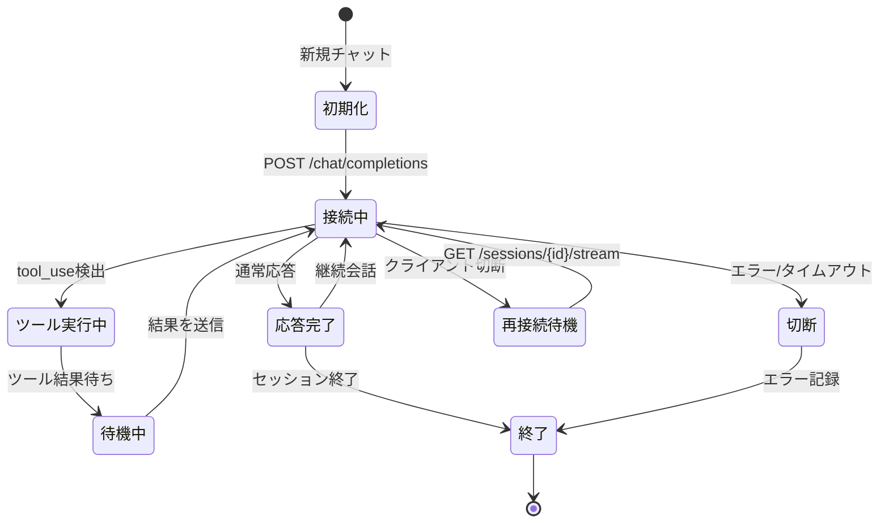
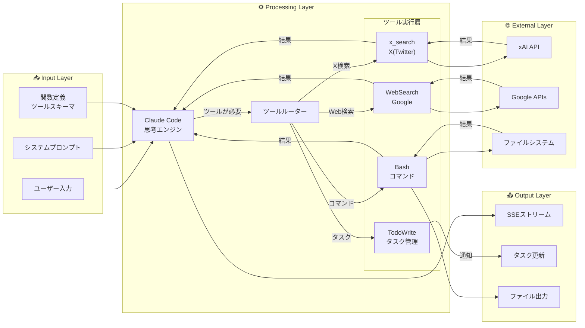

# Claude Code Agent API 統合計画（大幅改訂版）

> **作成日**: 2026-03-07  
> **改訂日**: 2026-03-07  
> **目的**: Teddy（AI Hub）の既存機能をClaude Codeに移行し、Claude Codeが必要に応じてGrok（xAI）を呼び出す設計に変更  
> **統合方式**: Agent APIラッパー + xAI API連携（ハイブリッド）

---

## 関連ドキュメント

| ドキュメント | 内容 | リンク |
|-------------|------|--------|
| **neta-researcher移植検討** | United Productionsからの移植調査結果 | [`/docs/backlog/research-neta-researcher-porting.md`](/docs/backlog/research-neta-researcher-porting.md) |
| **LLM APIツール比較** | 各種LLM APIのツール比較 | [`/docs/backlog/research-llm-api-tools-comparison.md`](/docs/backlog/research-llm-api-tools-comparison.md) |
| **参考: United Productions Agent** | Agent APIラッパーの参考実装 | [`/reference/up-web-legacy/agent/`](/reference/up-web-legacy/agent/) |
| **エージェンティック設計** | Teddyのエージェンティック設計 | [`/docs/plans/agentic-chat-design.md`](/docs/plans/agentic-chat-design.md) |

---

## 1. 概要（改訂）

### 1.1 設計方針の変更

**旧設計**: Claude Codeを新規機能として追加し、Grokと併用  
**新設計**: **既存機能をClaude Codeに全面移行**し、Claude Codeが必要に応じてGrok（xAI API）を呼び出す

### 1.2 新アーキテクチャ

```
┌─────────────────────────────────────────────────────────────────┐
│                        Frontend (Next.js)                        │
│  ┌──────────────┐  ┌──────────────┐  ┌──────────────┐          │
│  │ 一般チャット  │  │ 出演者リサーチ │  │ エビデンス    │  ...   │
│  │ (DeepR ON/OFF)│  │ (Claude Code) │  │ (Claude Code)│        │
│  └──────┬───────┘  └──────┬───────┘  └──────┬───────┘        │
└─────────┼─────────────────┼─────────────────┼──────────────────┘
          │                 │                 │
          │     ┌───────────┴─────────────────┘
          │     │ 全機能 → Agent API（Claude Code）
          │     ▼
          │  ┌─────────────────────────────────────┐
          │  │  /api/agent/chat                    │
          │  │  - Claude Code（メイン思考エンジン） │
          │  │  - WebSearch, TodoWrite, Bash等     │
          │  │  - Google Drive MCP連携             │
          │  └──────────────┬──────────────────────┘
          │                 │
          │    ┌────────────┴────────────┐
          │    │ ツールとしてxAI API呼び出し │
          │    │ （必要に応じてGrokを使用）  │
          │    ▼
          │  ┌───────────────────────────────┐
          │  │  x_search（X検索）            │
          │  │  web_search（必要時）         │
          │  │  その他Grok特有の機能         │
          │  └───────────────────────────────┘
          │
          ▼（Deep Research OFF時）
        ┌───────────────────────────────┐
        │  /api/llm/stream（簡易モード） │
        │  - Grok直接（軽量・高速応答）   │
        └───────────────────────────────┘
```

### 1.3 機能別設定

| 機能 | メインエンジン | xAI API呼び出し | Deep Research |
|------|---------------|----------------|---------------|
| **一般チャット** | Claude Code | 必要時 | ON/OFF選択可能 |
| **出演者リサーチ** | Claude Code | X検索等 | 常時ON |
| **エビデンスリサーチ** | Claude Code | X検索等 | 常時ON |
| **新企画立案** | Claude Code | X検索等 | 常時ON |
| **議事録作成** | Claude Code | なし | 常時OFF（軽量） |

---

## 2. 詳細アーキテクチャ（マーメイド図）

### 2.1 全体システム構成

```mermaid
flowchart TB
    subgraph Frontend["🖥️ Frontend (Next.js)"]
        Sidebar["サイドバー<br/>機能選択"]
        ChatUI["チャットUI"]
        DeepRToggle["🔘 Deep Research<br/>ON/OFFトグル"]
        ToolIndicator["🔧 ToolCallIndicator<br/>ツール実行状態表示"]
        TaskList["📝 TaskList<br/>TodoWrite連携"]
    end

    subgraph APILayer["🔌 API Layer (Next.js API Routes)"]
        direction TB
        Router["リクエスト振り分け"]
        
        subgraph AgentAPIRoutes["/api/agent/*"]
            AgentChat[/api/agent/chat<br/>POST]
            AgentStream[/api/agent/sessions/{id}/stream<br/>GET]
            AgentBuffer[/api/agent/sessions/{id}/buffer<br/>GET]
        end
        
        subgraph GrokAPIRoutes["/api/llm/*"]
            GrokStream[/api/llm/stream<br/>POST]
        end
    end

    subgraph AgentService["🤖 Agent API Service (FastAPI)"]
        direction TB
        OpenAIEndpoint[/v1/chat/completions<br/>OpenAI互換]
        SessionMgr["SessionManager"]
        ToolRegistry["ToolRegistry"]
        
        subgraph Tools["利用可能ツール"]
            WebSearch["🔍 WebSearch<br/>Web検索"]
            TodoWrite["📝 TodoWrite<br/>タスク管理"]
            Bash["⚡ Bash<br/>コマンド実行"]
            GDrive["📁 Google Drive<br/>MCP連携"]
            XSearch["🐦 x_search<br/>X(Twitter)検索"]
            GrokSearch["🌐 grok_web_search<br/>Grok検索"]
        end
    end

    subgraph ExternalAPIs["🌐 External APIs"]
        ClaudeAPI["Anthropic API<br/>Claude Code"]
        XAIAPI["xAI API<br/>Grok (ツール呼び出し用)"]
        GoogleAPI["Google API<br/>検索/Drive"]
    end

    subgraph DataStore["💾 Data Store"]
        SessionDB[(Session DB<br/>SQLite/Postgres)]
        FileStore[(File Storage<br/>一時ファイル)]
    end

    %% フロントエンド → API層
    Sidebar --> Router
    DeepRToggle --> Router
    ChatUI --> Router

    %% ルーティング分岐
    Router -->|DeepR=ON| AgentChat
    Router -->|DeepR=OFF| GrokStream

    %% Agent API接続
    AgentChat --> OpenAIEndpoint
    AgentStream --> SessionMgr
    AgentBuffer --> SessionDB

    %% セッション管理
    SessionMgr --> SessionDB
    OpenAIEndpoint --> SessionMgr

    %% ツール実行
    SessionMgr --> ToolRegistry
    ToolRegistry --> WebSearch
    ToolRegistry --> TodoWrite
    ToolRegistry --> Bash
    ToolRegistry --> GDrive
    ToolRegistry --> XSearch
    ToolRegistry --> GrokSearch

    %% 外部API呼び出し
    SessionMgr -->|Claude API| ClaudeAPI
    WebSearch --> GoogleAPI
    XSearch -->|ツール実行| XAIAPI
    GrokSearch -->|ツール実行| XAIAPI
    GDrive --> GoogleAPI
    Bash --> FileStore

    %% UI連携
    ToolRegistry -->|ツール実行状態| ToolIndicator
    TodoWrite -->|タスク更新| TaskList
```

### 2.2 Deep Research ON/OFF フロー比較



### 2.3 ツール実行フロー（Agent API内部）



### 2.4 セッション管理アーキテクチャ



### 2.5 データフロー図



---

## 3. 詳細設計

### 3.1 Agent APIの拡張（xAI連携）

Agent API（FastAPI）にxAI APIを呼び出すツールを追加する。

```python
# Agent API側のツール定義
TOOLS = {
    # 既存のClaude Codeツール
    "WebSearch": web_search_tool,
    "TodoWrite": todo_write_tool,
    "Bash": bash_tool,
    "gdrive_upload_file": gdrive_tool,
    
    # 新規: xAI連携ツール
    "x_search": {
        "description": "X（Twitter）検索 - リアルタイムSNS情報取得",
        "execute": lambda query: call_xai_api({
            "model": "grok-4-1-fast-reasoning",
            "tools": [{"type": "x_search"}],
            "input": [{"role": "user", "content": query}]
        })
    },
    "grok_web_search": {
        "description": "Grok Web検索 - 必要に応じて使用",
        "execute": lambda query: call_xai_api({
            "model": "grok-4-1-fast-reasoning",
            "tools": [{"type": "web_search"}],
            "input": [{"role": "user", "content": query}]
        })
    }
}
```

### 3.2 一般チャットのDeep Research設定

```typescript
// UIコンポーネント
interface ChatConfig {
  deepResearch: boolean;  // ON: Claude Code, OFF: Grok直接
}

// リクエスト先の分岐
if (deepResearch) {
  // Deep Research ON: Claude Code（詳細調査・ツール使用）
  return fetch('/api/agent/chat', {
    body: JSON.stringify({
      messages,
      enable_tools: true,
      reasoning_effort: 'high'  // 深く考える
    })
  });
} else {
  // Deep Research OFF: Grok直接（軽量・高速）
  return fetch('/api/llm/stream', {
    body: JSON.stringify({
      messages,
      provider: 'grok-4-1-fast-reasoning'
    })
  });
}
```

### 3.3 プロンプト設計

```markdown
## ツール使用ガイドライン

### 基本方針
あなたは高度なリサーチアシスタントです。必要に応じて以下のツールを使用してください。

### ツール選択基準

| 状況 | 使用ツール | 理由 |
|------|-----------|------|
| Web検索（一般） | WebSearch | 標準的なWeb検索 |
| X（Twitter）検索 | **x_search** | リアルタイムSNS情報はX検索が最適 |
| X検索が必要なWeb検索 | **grok_web_search** | Grokの自動閲覧機能を活用 |
| タスク管理 | TodoWrite | 進捗可視化 |
| ファイル保存 | gdrive_upload_file | 成果物保存 |
| Python実行 | Bash | データ分析等 |

### 特記事項
- **X検索が必要な場合は必ず x_search を優先して使用**
- x_searchとWebSearchは組み合わせて使用可能
- Grok（xAI）のツールを使用する際は、その結果を自分の言葉で整理して出力
```

---

## 4. UI/UX設計

### 4.1 サイドバー（変更なし・統合済み）

既存のサイドバーメニューをそのまま使用。裏側のエンジンがClaude Codeに変更される。

```
Sidebar
├── チャット（一般）
│   └── Deep Research [ON/OFF]  ← 新規トグルボタン
├── 出演者リサーチ（Claude Code）
├── エビデンスリサーチ（Claude Code）
├── 議事録作成（Claude Code - 軽量）
├── 新企画立案（Claude Code）
└── 履歴
```

### 4.2 Deep Researchトグルボタン

```tsx
// components/chat/DeepResearchToggle.tsx
export function DeepResearchToggle({ 
  enabled, 
  onChange 
}: { 
  enabled: boolean; 
  onChange: (v: boolean) => void;
}) {
  return (
    <div className="flex items-center gap-2">
      <span className="text-sm text-gray-600">
        {enabled ? '🧠 Deep Research' : '⚡ クイック回答'}
      </span>
      <Switch 
        checked={enabled}
        onCheckedChange={onChange}
      />
      <Tooltip content={enabled 
        ? "Claude Codeが詳細に調査・複数ツールを使用" 
        : "Grokが即座に回答（軽量・高速）"
      } />
    </div>
  );
}
```

### 4.3 表示切り替え

| モード | 表示 | 応答時間 | ツール使用 |
|--------|------|---------|-----------|
| **Deep Research ON** | 🤔 思考中... → 🔍 検索... → ✓ 完了 | 30秒〜5分 | 積極的に使用 |
| **Deep Research OFF** | 即座に回答 | 1〜5秒 | なし（または最小限） |

---

## 5. 実装タスク（改訂版）

### Phase 1: Agent APIセットアップ + xAI連携（2日）

| # | タスク | 詳細 | 工数 |
|---|--------|------|------|
| 1.1 | Agent API準備 | `reference/up-web-legacy/agent/` をコピー | 2時間 |
| 1.2 | **xAI連携ツール追加** | `x_search`, `grok_web_search` ツール実装 | 4時間 |
| 1.3 | 環境変数設定 | `XAI_API_KEY` をAgent APIに追加 | 30分 |
| 1.4 | 起動・接続テスト | Agent API ↔ xAI API 疎通確認 | 2時間 |

### Phase 2: Teddy API実装（2日）

| # | タスク | 詳細 | 工数 |
|---|--------|------|------|
| 2.1 | `/api/agent/chat` | Agent API Proxy実装 | 4時間 |
| 2.2 | `/api/agent/sessions/[id]/stream` | SSE Proxy | 4時間 |
| 2.3 | SSE変換ロジック | Agent API形式 → Teddy形式 | 4時間 |
| 2.4 | エラーハンドリング | 両APIのエラー統合 | 2時間 |

### Phase 3: フロントエンド統合（2日）

| # | タスク | 詳細 | 工数 |
|---|--------|------|------|
| 3.1 | **Deep Researchトグル** | ON/OFFボタン実装 | 2時間 |
| 3.2 | **API分岐ロジック** | DeepR状態でAPI先切り替え | 2時間 |
| 3.3 | useAgentStreamフック | Agent API用フック | 4時間 |
| 3.4 | ToolCallIndicator統合 | ツール実行状態表示 | 4時間 |
| 3.5 | TaskList実装 | TodoWrite連携 | 4時間 |

### Phase 4: 既存機能移行（1日）

| # | タスク | 詳細 | 工数 |
|---|--------|------|------|
| 4.1 | 出演者リサーチ移行 | Grok → Agent API | 2時間 |
| 4.2 | エビデンスリサーチ移行 | Grok → Agent API | 2時間 |
| 4.3 | 新企画立案移行 | Grok → Agent API | 2時間 |
| 4.4 | 議事録作成移行 | Grok → Agent API（軽量設定） | 2時間 |

### Phase 5: 統合テスト（1日）

| # | タスク | 詳細 | 工数 |
|---|--------|------|------|
| 5.1 | Deep Research ON/OFFテスト | 両モードの動作確認 | 2時間 |
| 5.2 | x_search連携テスト | X検索→結果表示 | 2時間 |
| 5.3 | 全機能テスト | 各機能のエンドツーエンド | 4時間 |

**合計**: 8日

---

## 6. 技術仕様

### 6.1 環境変数

```bash
# Teddy側
AGENT_API_URL=http://localhost:8230
AGENT_API_TIMEOUT=600000

# Agent API側
ANTHROPIC_API_KEY=sk-ant-xxx
XAI_API_KEY=xai-xxx  # 新規: xAI連携用
```

### 6.2 新規作成ファイル

```
app/
├── api/
│   ├── agent/
│   │   ├── chat/route.ts
│   │   └── sessions/[sessionId]/
│   │       ├── stream/route.ts
│   │       └── buffer/route.ts
│   └── llm/
│       └── stream/route.ts（既存、変更なし）
├── hooks/
│   └── useAgentStream.ts
└── components/
    ├── chat/
    │   ├── DeepResearchToggle.tsx  # 新規
    │   ├── ToolCallIndicator.tsx
    │   └── TaskList.tsx
    └── sidebar/
        └── AgentSelector.tsx（変更なし、裏側変更）

agent/（新規ディレクトリ）
├── src/
│   ├── main.py
│   ├── tools/
│   │   ├── xai_tools.py  # xAI連携ツール
│   │   └── ...
│   └── ...
├── pyproject.toml
└── Dockerfile
```

---

## 7. リスクと対策

| リスク | 影響 | 対策 |
|--------|------|------|
| Agent API停止 | 高 | Docker自動再起動、ヘルスチェック |
| xAI APIレート制限 | 中 | リトライロジック、フォールバック（WebSearch） |
| 2つのAPIキー管理 | 低 | 環境変数一元管理、ローテーション対応 |
| Deep Research ON時の長時間実行 | 中 | タイムアウト設定（10分）、進捗表示 |
| セッション消失 | 中 | バッファリング、再接続対応 |

---

## 8. 今後の拡張

| 拡張 | 優先度 | 説明 |
|------|--------|------|
| neta-researcher完全移植 | 高 | 画像収集、インフォグラフィック等 |
| Google Drive統合 | 高 | MCP連携で完全なファイル管理 |
| 複数Agent切り替えUI | 中 | ユーザーが手動でGrok↔Claude切り替え |
| 自動モード選択 | 低 | AIが質問内容で最適なエンジンを自動選択 |

---

## 9. 参考リンク

- **Agent API実装**: [`reference/up-web-legacy/agent/`](/reference/up-web-legacy/agent/)
- **United Productions API Proxy**: [`reference/up-web-legacy/up_web/app/api/chat/completions/route.ts`](/reference/up-web-legacy/up_web/app/api/chat/completions/route.ts)
- **Claude Agent SDK**: https://github.com/anthropics/claude-agent-sdk
- **neta-researcher移植検討**: [`/docs/backlog/research-neta-researcher-porting.md`](/docs/backlog/research-neta-researcher-porting.md)
- **Teddy Grok実装**: [`lib/llm/clients/grok.ts`](/lib/llm/clients/grok.ts)

---

## 10. 更新履歴

| 日付 | 更新内容 |
|------|---------|
| 2026-03-07 | 初版作成 |
| 2026-03-07 | **大幅改訂**: 既存機能移行方針に変更、Deep Researchトグル追加、Claude↔Grok連携設計を追加 |
| 2026-03-07 | **マーメイド図追加**: システム構成図、シーケンス図、状態遷移図、データフロー図を追加 |
