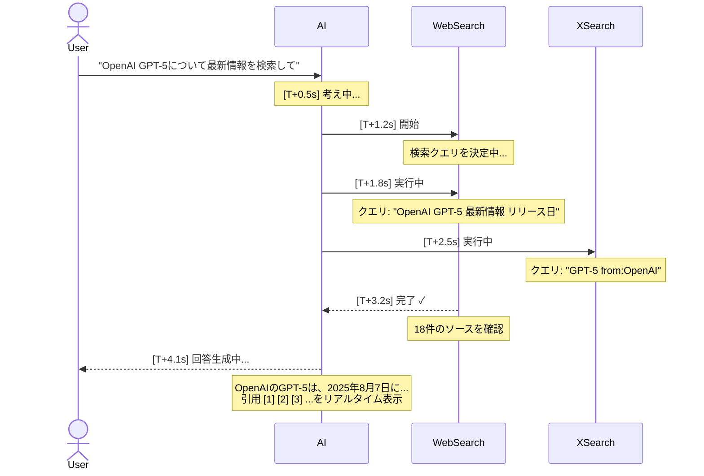
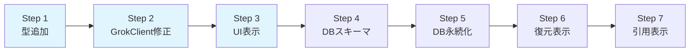

# ツール詳細表示機能 実装計画（テスト駆動）

> **作成日**: 2026-02-26  
> **Phase 1 完了日**: 2026-02-26  
> **優先度**: Medium → High（リアルタイム体験向上のため）  
> **関連**: ストリーミング表示改善、UX向上

---

## 目標: リアルタイムで何が起きているかを可視化

現在、ユーザーはツール使用中「Web検索を実行中」のような簡易表示しか見られない。以下の情報を**リアルタイム**で表示することで、AIがどの情報源に基づいて回答を生成しているかを理解できるようにする。



---

## 実装方針: 小さくテストしながら進める

### 基本ルール

1. **1ステップ = 1コミット**: 各変更を独立したコミットとして記録
2. **各ステップでビルド・テスト**: 必ず `npm run build` と手動テストを実行
3. **問題があれば即座にロールバック**: `git revert` で前の状態に戻せるようにする
4. **動作確認後に次へ**: 各ステップの「テスト項目」を全てクリアしてから次に進む

### 実装ステップ一覧



---

## Step 1: 型定義の追加（15分）

### 変更内容

**対象**: `lib/llm/types.ts`

```typescript
// SSEEvent の tool_call に input を追加
export type SSEEvent =
  | { type: "start" }
  | {
      type: "tool_call";
      id: string;
      name: GrokToolType;
      displayName: string;
      status: "running" | "completed";
      input?: string;  // ← 追加
    }
  // ... 他の型
```

### テスト項目

- [ ] `npm run build` が成功する
- [ ] TypeScriptエラーがない
- [ ] `npx tsc --noEmit` で型チェックが通る

### ロールバック方法

```bash
git revert HEAD
```

---

## Step 2: GrokClient の修正（30分）

### 変更内容

**対象**: `lib/llm/clients/grok.ts`

```typescript
// parseToolCallEvent メソッドを修正
private parseToolCallEvent(
  item: NonNullable<XAIStreamEvent["item"]>,
  status: "running" | "completed",
): (SSEEvent & { type: "tool_call" }) | null {
  const toolType = XAI_TOOL_TYPE_MAP[item.type];
  if (!toolType) return null;

  const baseEvent = {
    type: "tool_call" as const,
    id: item.id,
    name: toolType,
    displayName: TOOL_DISPLAY_NAMES[toolType],
    status,
  };

  // Web検索: action.query を抽出
  if (item.type === "web_search_call" && item.action?.query) {
    return {
      ...baseEvent,
      input: item.action.query,
    };
  }

  // X検索: input をパース
  if (item.type === "custom_tool_call" && item.input) {
    try {
      const inputData = JSON.parse(item.input);
      return {
        ...baseEvent,
        input: inputData.query || item.input,
      };
    } catch {
      return baseEvent;
    }
  }

  return baseEvent;
}
```

### テスト項目

- [ ] `npm run build` が成功する
- [ ] チャット画面を開いてメッセージを送信
- [ ] ブラウザのDevToolsでConsoleを確認し、エラーがない
- [ ] Networkタブで `/api/llm/stream` のレスポンスを確認
  - `tool_call` イベントに `input` フィールドが含まれていることを確認

### デバッグ方法

```typescript
// 確認用ログ（一時的に追加）
console.log("Tool call event:", {
  type: item.type,
  input: item.action?.query || item.input,
  result: toolEvent,
});
```

### ロールバック方法

```bash
git revert HEAD
```

---

## Step 3: UI表示の追加（30分）

### 変更内容

**対象**: `components/chat/messages/ToolCallMessage.tsx`

```typescript
// クエリ表示を追加（シンプルに）
<div className="flex items-center gap-2">
  {status === "running" ? (
    <Loader2 className="w-4 h-4 animate-spin text-blue-600" />
  ) : (
    <CheckCircle2 className="w-4 h-4 text-green-600" />
  )}
  <span className="font-medium">{config.label}</span>
  
  {toolCall.input && (
    <code className="text-xs bg-blue-100/70 px-1.5 py-0.5 rounded text-blue-800 truncate max-w-[200px]">
      {toolCall.input}
    </code>
  )}
</div>
```

### テスト項目

- [ ] `npm run build` が成功する
- [ ] チャットでWeb検索を実行
- [ ] **表示確認**: ツール実行中に検索クエリが表示される
  - 例: "🔍 Web検索 `OpenAI GPT-5 最新情報`"
- [ ] **表示確認**: X検索でもクエリが表示される
- [ ] **レスポンシブ**: 長いクエリは切り詰めて表示される

### 問題があれば確認

```bash
# フロントエンドのstateを確認
cat components/chat/messages/ToolCallMessage.tsx | grep -A5 "toolCall.input"
```

### ロールバック方法

```bash
git revert HEAD
```

---

## Step 4: DBスキーマの追加（30分）

### 変更内容

**対象**: `prisma/schema.prisma`

```prisma
// 既存の ResearchMessage にリレーション追加
model ResearchMessage {
  id        String       @id @default(uuid())
  chatId    String
  role      String
  content   String       @db.Text
  thinking  String?      @db.Text
  
  // 新規: リレーション
  toolCalls ToolCall[]
  llmUsage  LLMUsage?
  
  createdAt DateTime     @default(now())

  @@index([chatId, createdAt])
}

// 新規: ツール呼び出し履歴
model ToolCall {
  id              String   @id @default(uuid())
  messageId       String
  message         ResearchMessage @relation(fields: [messageId], references: [id], onDelete: Cascade)
  
  externalId      String?
  toolType        String
  name            String?
  status          String
  inputJson       Json?
  inputQuery      String?  @db.Text
  
  createdAt       DateTime @default(now())
  
  @@index([messageId])
}

// 新規: LLM使用状況
model LLMUsage {
  id              String   @id @default(uuid())
  messageId       String   @unique
  message         ResearchMessage @relation(fields: [messageId], references: [id], onDelete: Cascade)
  
  inputTokens     Int
  outputTokens    Int
  totalTokens     Int
  costUsd         Float
  
  createdAt       DateTime @default(now())
  
  @@index([messageId])
}
```

### テスト項目

- [ ] `npx prisma validate` が成功する
- [ ] `npx prisma migrate dev --name add_tool_calls` が成功する
- [ ] `npx prisma generate` が成功する
- [ ] `npx prisma studio` で新しいテーブルが表示される

### ロールバック方法

```bash
# マイグレーションをリセット
npx prisma migrate reset

# またはマイグレーションファイルを削除
git checkout prisma/migrations/xxx_add_tool_calls
```

---

## Step 5: DB永続化の実装（1時間）

### 5.1: Message型の拡張（15分）

**対象**: `components/ui/FeatureChat.tsx`

```typescript
export interface Message {
  id: string;
  role: "user" | "assistant";
  content: string;
  timestamp: Date;
  llmProvider?: LLMProvider;
  // 追加
  toolCalls?: {
    id: string;
    name: string;
    displayName: string;
    status: string;
    input?: string;
  }[];
  usage?: {
    inputTokens: number;
    outputTokens: number;
    cost: number;
  };
}
```

### 5.2: API Routeの修正（30分）

**対象**: `app/api/chat/feature/route.ts`

```typescript
// POST: ツール呼び出し・Usageを保存
export async function POST(request: NextRequest): Promise<Response> {
  // ... バリデーション ...
  
  await prisma.$transaction(async (tx) => {
    // メッセージ作成
    const message = await tx.researchMessage.create({
      data: {
        chatId: chat.id,
        role: msg.role.toUpperCase(),
        content: msg.content,
      },
    });
    
    // toolCalls 保存
    if (msg.toolCalls?.length > 0) {
      await tx.toolCall.createMany({
        data: msg.toolCalls.map(tc => ({
          messageId: message.id,
          toolType: tc.name + '_call',
          status: tc.status,
          inputQuery: tc.input,
        }))
      });
    }
    
    // usage 保存
    if (msg.usage) {
      await tx.lLMUsage.create({
        data: {
          messageId: message.id,
          inputTokens: msg.usage.inputTokens,
          outputTokens: msg.usage.outputTokens,
          totalTokens: msg.usage.inputTokens + msg.usage.outputTokens,
          costUsd: msg.usage.cost,
        }
      });
    }
  });
}
```

### 5.3: useConversationSaveの修正（15分）

**対象**: `hooks/useConversationSave.ts`

```typescript
const saveConversation = useCallback(
  async (updatedMessages: Message[], chatId: string | undefined) => {
    const response = await fetch("/api/chat/feature", {
      method: "POST",
      headers: { "Content-Type": "application/json" },
      body: JSON.stringify({
        chatId,
        featureId,
        messages: updatedMessages.map((msg) => ({
          ...msg,
          toolCalls: msg.toolCalls,
          usage: msg.usage,
        })),
      }),
    });
    // ...
  },
  [featureId, onChatCreated]
);
```

### テスト項目

- [ ] `npm run build` が成功する
- [ ] チャットでメッセージを送信
- [ ] Prisma Studioで確認
  - [ ] `ToolCall` テーブルにレコードが追加されている
  - [ ] `LLMUsage` テーブルにレコードが追加されている
- [ ] コンソールにエラーがない

### デバッグ方法

```bash
# Prisma Studioで確認
npx prisma studio

# またはDB直接確認
npx prisma db execute --stdin <<EOF
SELECT * FROM "ToolCall" ORDER BY "createdAt" DESC LIMIT 5;
EOF
```

### ロールバック方法

```bash
git revert HEAD~2..HEAD  # 3コミット分（5.1-5.3）を戻す
```

---

## Step 6: 履歴復元表示（30分）

### 6.1: API RouteのGET修正（15分）

**対象**: `app/api/chat/feature/route.ts`

```typescript
// GET: ツール呼び出しを含めて返す
export async function GET(request: NextRequest): Promise<Response> {
  const chat = await prisma.researchChat.findFirst({
    where: { id: chatId, userId },
    include: {
      messages: {
        orderBy: { createdAt: "asc" },
        include: {
          toolCalls: true,
          llmUsage: true,
        }
      },
    },
  });

  const messages = chat.messages.map((m) => ({
    id: m.id,
    role: m.role.toLowerCase(),
    content: m.content,
    timestamp: m.createdAt,
    llmProvider: chat.llmProvider,
    toolCalls: m.toolCalls.map(tc => ({
      id: tc.id,
      name: tc.toolType.replace('_call', ''),
      displayName: getToolDisplayName(tc.toolType),
      status: tc.status,
      input: tc.inputQuery,
    })),
    usage: m.llmUsage ? {
      inputTokens: m.llmUsage.inputTokens,
      outputTokens: m.llmUsage.outputTokens,
      cost: m.llmUsage.costUsd,
    } : null,
  }));

  return new Response(JSON.stringify({ messages }), {
    headers: { "Content-Type": "application/json" },
  });
}
```

### 6.2: 動作確認（15分）

### テスト項目

- [ ] `npm run build` が成功する
- [ ] チャットで会話を行う
- [ ] ページをリロード
- [ ] **確認**: 過去のツール使用履歴（クエリ）が表示される
- [ ] **確認**: ツールアイコンの横にクエリが表示される

### ロールバック方法

```bash
git revert HEAD
```

---

## Step 7: 引用URL表示（フル機能）（1-2時間）

### 7.1: ToolCitationモデル追加（15分）

**対象**: `prisma/schema.prisma`

```prisma
model ToolCitation {
  id          String   @id @default(uuid())
  toolCallId  String
  toolCall    ToolCall @relation(fields: [toolCallId], references: [id], onDelete: Cascade)
  
  url         String   @db.Text
  title       String?
  domain      String?
  
  @@index([toolCallId])
}

// ToolCallにリレーション追加
model ToolCall {
  // ... 既存フィールド ...
  citations   ToolCitation[]
}
```

```bash
npx prisma migrate dev --name add_citations
```

### 7.2: citations収集（30分）

**対象**: `lib/llm/clients/grok.ts`

```typescript
// message イベントから citations を抽出
private parseMessageCitations(item: any): Array<{url: string, title: string}> {
  const citations: Array<{url: string, title: string}> = [];
  
  if (item.content) {
    for (const content of item.content) {
      if (content.annotations) {
        for (const annotation of content.annotations) {
          if (annotation.type === "url_citation") {
            citations.push({
              url: annotation.url,
              title: annotation.title,
            });
          }
        }
      }
    }
  }
  
  return citations;
}
```

### 7.3: WebSearchDetailsコンポーネント作成（30分）

**対象**: `components/chat/messages/WebSearchDetails.tsx`

```typescript
"use client";

import { useState } from "react";
import { ChevronDown, ChevronUp, ExternalLink } from "lucide-react";

interface WebSearchDetailsProps {
  query: string;
  citations: Array<{ url: string; title: string }>;
}

export function WebSearchDetails({ query, citations }: WebSearchDetailsProps) {
  const [isExpanded, setIsExpanded] = useState(false);
  
  if (citations.length === 0) {
    return (
      <div className="mt-2 text-xs text-blue-600/70">
        検索: <span className="font-mono">{query}</span>
      </div>
    );
  }
  
  return (
    <div className="mt-2">
      <div className="text-xs text-blue-700/80 mb-1">
        <span className="font-medium">検索:</span>
        <code className="ml-1.5 bg-blue-100/70 px-1.5 py-0.5 rounded text-blue-800">
          {query}
        </code>
      </div>
      
      <button
        onClick={() => setIsExpanded(!isExpanded)}
        className="flex items-center gap-1 text-xs text-blue-600 hover:text-blue-800"
      >
        {isExpanded ? <ChevronUp className="w-3.5 h-3.5" /> : <ChevronDown className="w-3.5 h-3.5" />}
        <span>参照ソース ({citations.length}件)</span>
      </button>
      
      {isExpanded && (
        <div className="mt-1.5 space-y-1 max-h-40 overflow-y-auto">
          {citations.map((citation, i) => (
            <a
              key={i}
              href={citation.url}
              target="_blank"
              rel="noopener noreferrer"
              className="flex items-start gap-1.5 p-1.5 rounded bg-white/60 hover:bg-white/80 text-xs"
            >
              <span className="text-blue-500 font-medium shrink-0">[{i + 1}]</span>
              <div className="min-w-0 flex-1">
                <div className="text-blue-700 truncate hover:underline">
                  {citation.title}
                </div>
                <div className="text-[10px] text-blue-400/80 truncate">
                  {new URL(citation.url).hostname}
                </div>
              </div>
              <ExternalLink className="w-3 h-3 text-blue-400 shrink-0" />
            </a>
          ))}
        </div>
      )}
    </div>
  );
}
```

### 7.4: APIと保存ロジックの更新（15分）

### テスト項目

- [ ] `npm run build` が成功する
- [ ] Web検索を実行
- [ ] **表示確認**: 「参照ソース (N件) ▼」が表示される
- [ ] **動作確認**: クリックで展開され、URLリストが表示される
- [ ] **動作確認**: URLをクリックすると新規タブで開く
- [ ] **永続化確認**: ページリロード後も引用URLが表示される

### ロールバック方法

```bash
git revert HEAD~3..HEAD  # Step 7全体を戻す
```

---

## テストチェックリスト（総合）

### 単体テスト実行

```bash
# 各ステップ後に実行
npm run build
npx tsc --noEmit
npm run lint

# 必要に応じて
npm test -- --run
```

### 手動テストシナリオ

#### シナリオ1: 基本的なWeb検索
1. チャットを開く
2. "OpenAIについて教えて" と送信
3. Web検索が実行されることを確認
4. 検索クエリが表示されることを確認
5. 回答が表示されることを確認
6. ページをリロード
7. 検索クエリが表示されたままであることを確認

#### シナリオ2: 複数ツール使用
1. "GPT-5とClaudeの違いを教えて" と送信
2. Web検索とX検索の両方が実行されることを確認
3. 両方のクエリが表示されることを確認

#### シナリオ3: エラーハンドリング
1. ネットワークを切断してメッセージ送信
2. エラーが適切に表示されることを確認
3. ツール呼び出しが失敗してもアプリがクラッシュしないことを確認

---

## トラブルシューティング

### よくある問題と対処

| 問題 | 原因 | 対処 |
|-----|------|------|
| `input` が表示されない | GrokClientでinputが抽出されていない | DevToolsで `tool_call` イベントを確認 |
| DB保存が失敗する | 型不一致 | PrismaスキーマとAPIの型を比較 |
| 履歴が復元されない | GET APIでincludeを忘れている | `include: { toolCalls: true }` を確認 |
| citationsが表示されない | parseMessageCitationsで抽出失敗 | console.logで中間結果を確認 |

### 緊急時のロールバック

```bash
# 全変更を破棄して初期状態に戻す
git stash
git checkout main

# または特定のステップまで戻す
git log --oneline  # コミット履歴確認
git reset --hard <commit-hash>
```

---

## 関連ドキュメント

- [xAI Responses API 仕様](../specs/api-integration/xai-responses-api-spec.md)
- [DB設計詳細](./tool-details-display.md#db設計案b-独立テーブル)
- `scripts/investigate-tool-response.ts`
