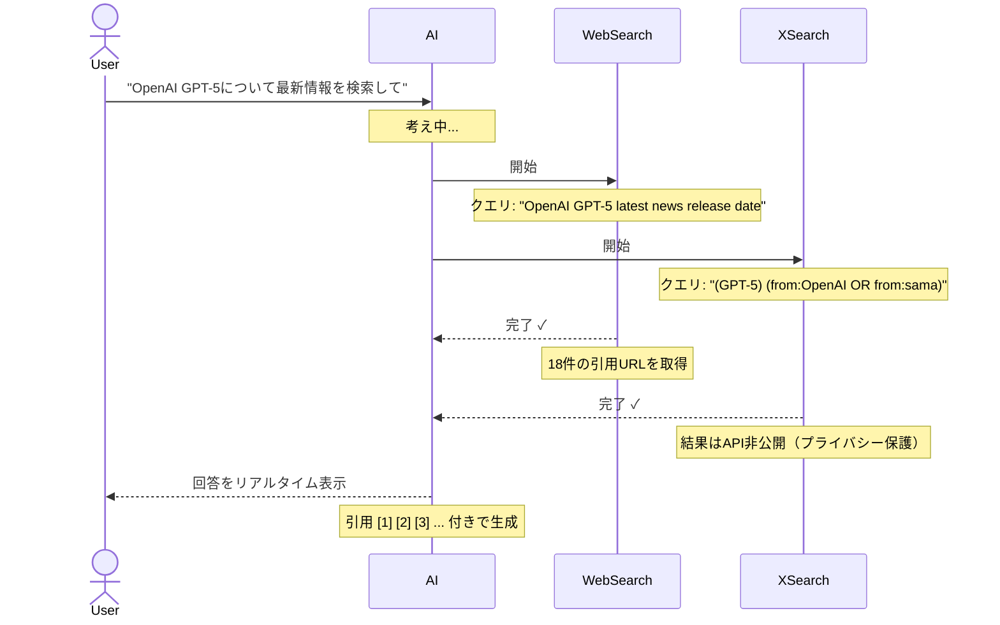

# ツール詳細表示・永続化 実装計画

> **作成日**: 2026-02-26
> **更新日**: 2026-02-27
> **状態**: ⚠️ 一部未実装（ストリーミング中のcitations表示）
> **優先度**: High（リアルタイム体験向上 + データ永続化）
> **関連**: [xAI Responses API 仕様](../specs/api-integration/xai-responses-api-spec.md)

---

## 目標

ツール呼び出し情報（検索クエリ、引用URL、トークン使用量）を**リアルタイム表示**し、**DBに永続化**して、履歴復元時にも表示できるようにする。



---

## 実装状況サマリー

### ✅ 実装完了（2026-02-27時点）

| Step | 項目 | ファイル | コミット |
|------|------|----------|----------|
| 1 | GrokClientのクエリ抽出修正 | `lib/llm/clients/grok.ts` | 5c9e0f1 |
| 2 | Citations抽出（Inline annotations） | `lib/llm/clients/grok.ts` | 5c9e0f1 |
| 3 | フロントエンドcitations対応 | `hooks/useLLMStream/index.ts` | 5c9e0f1 |
| 4 | DBスキーマ変更 | `prisma/schema.prisma` | 5c9e0f1 |
| 5 | API route修正 | `app/api/chat/feature/route.ts` | 5c9e0f1 |
| 6 | useConversationSave対応 | `hooks/useConversationSave.ts` | -（そのまま動作） |
| 7 | FeatureChatでの蓄積 | `components/ui/FeatureChat.tsx` | 5c9e0f1 |
| 8 | 履歴復元時の表示 | `components/ui/FeatureChat.tsx` | 5c9e0f1 |
| 9 | CitationsList UI | `components/chat/messages/CitationsList.tsx` | 5c9e0f1 |

### ⚠️ 未実装・既知の問題

| 問題 | 影響 | 優先度 |
|------|------|--------|
| **ストリーミング中のcitations表示** | 回答生成中に引用URLが見えない | Medium |
| **ToolCallMessageのクリック展開** | ツール詳細を確認できない | Low |

---

## 現状と課題

### 実装済み

| レイヤー | 状態 | 根拠 |
|----------|------|------|
| SSEEvent型に `input?` フィールド | ✅ 済 | `lib/llm/types.ts:37` |
| GrokClientの `parseToolCallEvent` | ✅ 済 | `lib/llm/clients/grok.ts` |
| ToolCallMessage UIの基本表示 | ✅ 済 | `components/chat/messages/ToolCallMessage.tsx` |
| useLLMStreamでcitationsをstate管理 | ✅ 済 | `hooks/useLLMStream/index.ts:52` |
| CitationsListコンポーネント | ✅ 済 | `components/chat/messages/CitationsList.tsx` |
| DB永続化（toolCallsJson, citationsJson, usage） | ✅ 済 | `prisma/schema.prisma:167-173` |
| API route（保存・取得） | ✅ 済 | `app/api/chat/feature/route.ts` |
| 履歴復元時の表示 | ✅ 済 | `components/ui/FeatureChat.tsx:318-321` |

### 未実装（課題）

| 課題 | 詳細 | ファイル |
|------|------|----------|
| **ストリーミング中のcitations表示** | `StreamingSteps` に `citations` が渡されていない | `components/ui/FeatureChat.tsx:327-337` |
| **ToolCallMessageの展開機能** | クリックしても詳細が表示されない | `components/chat/messages/ToolCallMessage.tsx` |

---

## DB設計

### ResearchMessage への追加カラム（実装済み）

```prisma
model ResearchMessage {
  id        String       @id @default(uuid())
  chatId    String
  chat      ResearchChat @relation(fields: [chatId], references: [id], onDelete: Cascade)
  role      String       // USER | ASSISTANT | SYSTEM
  content   String       @db.Text
  thinking  String?      @db.Text

  // usage（1:1 → カラム展開）
  inputTokens   Int?
  outputTokens  Int?
  costUsd       Float?

  // toolCalls・citations（1:N → Json）
  toolCallsJson Json?
  citationsJson Json?

  createdAt DateTime @default(now())
  @@index([chatId, createdAt])
}
```

### マイグレーション履歴

```bash
# 実施済み（2026-02-26）
npx prisma migrate dev --name add_tool_details_and_usage
```

---

## X検索のcitationsについて

xAI API調査（`docs/specs/api-integration/xai-responses-api-spec.md`）の結論：

| ツール | citations取得 | 理由 |
|--------|--------------|------|
| **Web検索** | 可能 | `response.output_text.annotation.added` で取得 |
| **X検索** | **可能** | Web検索と同様に取得可能（URLパターンで区別） |

**重要**: X検索もWeb検索と同じ `url_citation` 形式でcitationsを返す。
調査結果: [`docs/backlog/research-xai-citations-behavior.md`](../backlog/research-xai-citations-behavior.md)

---

## 未実装項目の詳細

### Issue 1: ストリーミング中のcitations表示

**問題**: 回答生成中（ストリーミング中）はcitationsが表示されない

**該当コード**:
```tsx
// components/ui/FeatureChat.tsx
<StreamingSteps
  content={content}
  toolCalls={toolCalls}
  summarizationEvents={summarizationEvents}
  usage={usage}
  provider={provider}
  isComplete={isComplete}
/>
// → citations が渡されていない！
```

**修正方法**:
1. `StreamingSteps` に `citations` プロパティを追加
2. ストリーミング中に `CitationsList` を表示

```tsx
// 修正後
<StreamingSteps
  content={content}
  toolCalls={toolCalls}
  citations={citations}  // ← 追加
  summarizationEvents={summarizationEvents}
  usage={usage}
  provider={provider}
  isComplete={isComplete}
/>
```

### Issue 2: ToolCallMessageのクリック展開

**問題**: ツール呼び出しメッセージをクリックしても詳細が表示されない

**該当コード**:
```tsx
// components/chat/messages/ToolCallMessage.tsx
export function ToolCallMessage({ toolCall, status, provider }: ToolCallMessageProps) {
  // クリックハンドラーなし、展開機能なし
  return <div className="...">...</div>;
}
```

**対応案**:
- 案A: クリックでクエリ全文を表示（簡易）
- 案B: ツール詳細ドロワー（検索結果サマリー等）

---

## 検証方法

### 実装時（Claude実行）

コード変更後に以下を実行：

```bash
npm run build
npx tsc --noEmit
npm run lint
```

### 実装完了後（ユーザー確認）

本番環境で以下を確認：

1. **基本動作**: チャットでWeb検索が発動するメッセージを送信し、クエリと引用URLが表示されるか
2. **永続化**: ページリロード後もツール情報・引用・usage が復元されるか
3. **既存データ**: 過去のチャット履歴が壊れていないか
4. **エッジケース**: ツールなしの通常チャットが従来通り動作するか

---

## トラブルシューティング

| 問題 | 原因 | 対処 |
|------|------|------|
| Web検索クエリが空 | `action.query` が `output_item.added` 時点では空、`done` で確定 | `done` イベントのみで `input` を更新 |
| X検索inputがJSON文字列で表示 | パース漏れ | `parseToolCallEvent` の JSON.parse を確認 |
| 既存チャットでマイグレーションエラー | nullable でないカラムを追加した | 全カラム nullable（`?`付き）であることを確認 |
| リロード後にtoolCallsが表示されない | GET APIで `toolCallsJson` を返していない | route.ts GET のレスポンスマッピングを確認 |

---

## 関連ドキュメント

- [xAI Responses API 仕様](../specs/api-integration/xai-responses-api-spec.md) - ストリームイベントの実データ
- [xAI Citations 詳細調査](../backlog/research-xai-citations-behavior.md) - 15パターンの検証結果
- [3月実装プラン](./implementation-plan-2026-03.md) - 全体スケジュール
- [ストリーミング改善バックログ](../backlog/todo-featurechat-streaming-improvements.md) - 既知の課題
