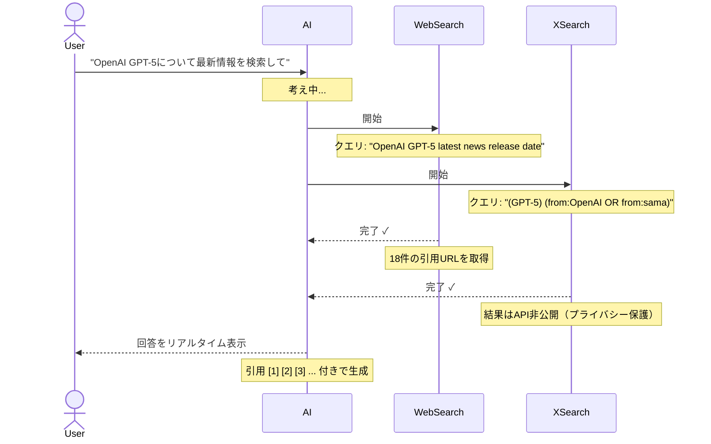
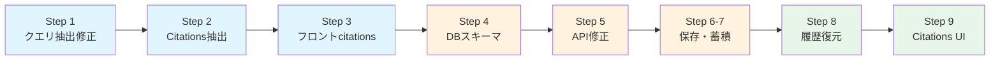

# ツール詳細表示・永続化 実装計画

> **作成日**: 2026-02-26
> **更新日**: 2026-02-26
> **優先度**: High（リアルタイム体験向上 + データ永続化）
> **関連**: [xAI Responses API 仕様](../specs/api-integration/xai-responses-api-spec.md)

---

## 目標

ツール呼び出し情報（検索クエリ、引用URL、トークン使用量）を**リアルタイム表示**し、**DBに永続化**して、履歴復元時にも表示できるようにする。



---

## 現状と課題

### 実装済み

| レイヤー | 状態 | 根拠 |
|----------|------|------|
| SSEEvent型に `input?` フィールド | 済 | `lib/llm/types.ts:37` |
| GrokClientの `parseToolCallEvent` | 済（不完全） | `lib/llm/clients/grok.ts:196-211` |
| ToolCallMessage UIの基本表示 | 済 | `components/chat/messages/ToolCallMessage.tsx` |
| useLLMStreamでtoolCallsをstate管理 | 済 | `hooks/useLLMStream/index.ts:43` |

### 未実装（本プランで対応）

| 課題 | 影響 |
|------|------|
| Web検索クエリが取得できていない | `XAIStreamEvent.item` の型に `action` がない。Web検索は `action.query` にクエリが入るが、現在の型では `item.input` しか見ていない |
| X検索クエリがJSON文字列のまま | `input` が `{"query":"...","limit":10}` というJSON文字列。パースしてquery部分を抽出する必要がある |
| 引用URL（citations）が未取得 | `response.output_text.annotation.added` イベントを処理していない |
| DBにツール情報が保存されない | ResearchMessageに `content` と `thinking` しかない |
| API routeがツール情報を送受信しない | saveRequestSchemaに `toolCalls` / `citations` / `usage` がない |
| Message型にツール情報がない | FeatureChat.tsxの `Message` インターフェースが `content` のみ |
| 履歴復元時にツール情報が失われる | ページリロードでtoolCalls/citations/usageが全て消える |

---

## DB設計

### ResearchMessage への追加カラム

```prisma
model ResearchMessage {
  id        String       @id @default(uuid())
  chatId    String
  chat      ResearchChat @relation(fields: [chatId], references: [id], onDelete: Cascade)
  role      String
  content   String       @db.Text
  thinking  String?      @db.Text

  // usage（1:1 → カラム展開）
  inputTokens   Int?
  outputTokens  Int?
  costUsd       Float?

  // toolCalls・citations（1:N → Json）
  toolCallsJson Json?
  citationsJson Json?

  createdAt DateTime @default(now())
  @@index([chatId, createdAt])
}
```

### 設計判断の理由

- **usage → カラム**: 1メッセージにつき1セット。ほぼ全assistantメッセージにある。`WHERE costUsd > 0.1` のような直接クエリが書ける
- **toolCalls → Json**: 1メッセージに0〜6件（可変長）。用途は保存→復元表示が主。JsonbならPostgresの関数で集計も可能
- **citations → Json**: 同上。0〜18件以上（可変長）。用途は表示のみ

### 具体的なデータ例

調査スクリプト（`scripts/investigate-tool-response.ts`）の実データに基づく。

**ユーザー入力**: `"OpenAI GPT-5について最新情報を検索して"`

#### userメッセージ行

| カラム | 値 |
|--------|-----|
| role | `USER` |
| content | `OpenAI GPT-5について最新情報を検索して` |
| inputTokens | `null` |
| outputTokens | `null` |
| costUsd | `null` |
| toolCallsJson | `null` |
| citationsJson | `null` |

#### assistantメッセージ行

| カラム | 値 |
|--------|-----|
| role | `ASSISTANT` |
| content | `### OpenAI GPT-5の最新情報...（本文）` |
| inputTokens | `11716` |
| outputTokens | `2393` |
| costUsd | `0.229637` |
| toolCallsJson | 下記 |
| citationsJson | 下記 |

**toolCallsJson**:
```json
[
  {
    "id": "ws_xxxxx_call_001",
    "name": "web_search",
    "displayName": "Web検索",
    "status": "completed",
    "input": "OpenAI GPT-5 latest news release date"
  },
  {
    "id": "ws_xxxxx_call_002",
    "name": "web_search",
    "displayName": "Web検索",
    "status": "completed",
    "input": "GPT-5 features capabilities benchmark"
  },
  {
    "id": "ctc_xxxxx_xs_001",
    "name": "x_search",
    "displayName": "X検索",
    "status": "completed",
    "input": "(\"GPT-5\" OR \"GPT 5\") (from:OpenAI OR from:sama)"
  },
  {
    "id": "ctc_xxxxx_xs_002",
    "name": "x_search",
    "displayName": "X検索",
    "status": "completed",
    "input": "OpenAI GPT-5 release updates"
  }
]
```

**citationsJson**（18件中抜粋）:
```json
[
  { "url": "https://openai.com/index/introducing-gpt-5", "title": "1" },
  { "url": "https://techcrunch.com/2025/08/07/openai-gpt-5/", "title": "2" },
  { "url": "https://www.theverge.com/openai-gpt-5-release", "title": "3" }
]
```

> **注**: `startIndex`/`endIndex` は保存しない。テキスト加工（マークダウン処理等）で位置がずれる可能性があるため、URLリストとして保持する。

#### ツールなしの通常メッセージ

| カラム | 値 |
|--------|-----|
| role | `ASSISTANT` |
| content | `はい、他にも質問がありましたらお聞きください。` |
| inputTokens | `1200` |
| outputTokens | `45` |
| costUsd | `0.001832` |
| toolCallsJson | `null` |
| citationsJson | `null` |

---

## X検索のcitationsについて

xAI API調査（`docs/specs/api-integration/xai-responses-api-spec.md`）の結論：

| ツール | citations取得 | 理由 |
|--------|--------------|------|
| **Web検索** | 可能 | `message.annotations` に `url_citation` として含まれる |
| **X検索** | **不可** | プライバシー保護のため、APIレスポンスに結果が含まれない |

X検索のcitationsは現時点ではAPIの制約で取得できない。将来xAI側が対応した場合に追加する。

---

## 実装ステップ



各Stepで `npm run build` + `npx tsc --noEmit` + `npm run lint` を実行して確認。
全Step完了後にユーザーが本番環境で動作確認する。

---

### Step 1: GrokClientのクエリ抽出修正

**対象**: `lib/llm/clients/grok.ts`

**問題**: `XAIStreamEvent.item` の型に `action` フィールドがない。Web検索は `item.action.query` にクエリが入るが、型定義が不足。

**変更内容**:

1. `XAIStreamEvent.item` の型に `action?: { type?: string; query?: string }` を追加
2. `parseToolCallEvent` でWeb検索の場合 `item.action?.query` を抽出
3. X検索の場合 `item.input`（JSON文字列）をパースして `query` を抽出

```typescript
// XAIStreamEvent.item の型修正
item?: {
  id: string;
  type: string;
  status: string;
  name?: string;
  input?: string;
  call_id?: string;
  action?: { type?: string; query?: string };  // 追加
};

// parseToolCallEvent の修正
private parseToolCallEvent(
  item: NonNullable<XAIStreamEvent["item"]>,
  status: "running" | "completed",
): (SSEEvent & { type: "tool_call" }) | null {
  const toolType = XAI_TOOL_TYPE_MAP[item.type];
  if (!toolType) return null;

  let input: string | undefined;

  // Web検索: action.query から抽出
  if (item.action?.query) {
    input = item.action.query;
  }
  // X検索: input JSONから query を抽出
  else if (item.input) {
    try {
      const parsed = JSON.parse(item.input);
      input = parsed.query ?? item.input;
    } catch {
      input = item.input;
    }
  }

  return {
    type: "tool_call",
    id: item.id,
    name: toolType,
    displayName: TOOL_DISPLAY_NAMES[toolType],
    status,
    ...(input ? { input } : {}),
  };
}
```

---

### Step 2: Citations抽出の追加

**対象**: `lib/llm/types.ts`, `lib/llm/clients/grok.ts`

**問題**: `response.output_text.annotation.added` イベントを処理していないため、引用URLが取得できない。

**変更内容**:

1. SSEEvent型に `citation` イベントを追加
2. `XAIStreamEvent` に `annotation` フィールドを追加
3. `processEvent` で annotation イベントを処理

```typescript
// lib/llm/types.ts - SSEEvent に追加
| {
    type: "citation";
    url: string;
    title: string;
  }
```

```typescript
// lib/llm/clients/grok.ts - XAIStreamEvent に追加
annotation?: {
  type: string;
  url?: string;
  title?: string;
};

// processEvent に追加
if (event.type === "response.output_text.annotation.added" && event.annotation) {
  if (event.annotation.type === "url_citation" && event.annotation.url) {
    return {
      type: "citation",
      url: event.annotation.url,
      title: event.annotation.title ?? "",
    };
  }
}
```

---

### Step 3: フロントエンドのcitations対応

**対象**: `hooks/useLLMStream/types.ts`, `hooks/useLLMStream/index.ts`

**変更内容**:

1. `CitationInfo` 型を追加
2. `useLLMStream` に `citations` state を追加
3. `citation` イベント受信時に citations を蓄積
4. `resetStream` で citations もリセット

```typescript
// types.ts に追加
export interface CitationInfo {
  url: string;
  title: string;
}
```

---

### Step 4: DBスキーマ変更

**対象**: `prisma/schema.prisma`

**変更内容**: ResearchMessage に5カラム追加（全て nullable）

```prisma
model ResearchMessage {
  // ...既存フィールド...

  inputTokens   Int?
  outputTokens  Int?
  costUsd       Float?
  toolCallsJson Json?
  citationsJson Json?

  // ...既存インデックス...
}
```

```bash
npx prisma migrate dev --name add_tool_details_and_usage
```

---

### Step 5: Message型の拡張とAPI route修正

**対象**: `components/ui/FeatureChat.tsx`, `app/api/chat/feature/route.ts`

**変更内容**:

1. `Message` インターフェースに `toolCalls`, `citations`, `usage` を追加
2. `saveRequestSchema` を拡張
3. POST: `createMany` で新カラムを保存
4. GET: レスポンスに新カラムを含める

```typescript
// FeatureChat.tsx
export interface Message {
  id: string;
  role: "user" | "assistant";
  content: string;
  timestamp: Date;
  llmProvider?: LLMProvider;
  toolCalls?: Array<{
    id: string;
    name: string;
    displayName: string;
    status: string;
    input?: string;
  }>;
  citations?: Array<{ url: string; title: string }>;
  usage?: { inputTokens: number; outputTokens: number; cost: number };
}
```

```typescript
// route.ts POST - createMany の data を修正
data: messages.map((msg) => ({
  chatId: chat.id,
  role: msg.role.toUpperCase(),
  content: msg.content,
  inputTokens: msg.usage?.inputTokens ?? null,
  outputTokens: msg.usage?.outputTokens ?? null,
  costUsd: msg.usage?.cost ?? null,
  toolCallsJson: msg.toolCalls?.length ? msg.toolCalls : undefined,
  citationsJson: msg.citations?.length ? msg.citations : undefined,
})),

// route.ts GET - messages マッピングを修正
const messages = chat.messages.map((m) => ({
  id: m.id,
  role: m.role.toLowerCase(),
  content: m.content,
  timestamp: m.createdAt,
  llmProvider: chat.llmProvider,
  toolCalls: m.toolCallsJson ?? undefined,
  citations: m.citationsJson ?? undefined,
  usage: m.inputTokens != null ? {
    inputTokens: m.inputTokens,
    outputTokens: m.outputTokens,
    cost: m.costUsd,
  } : undefined,
})),
```

---

### Step 6: useConversationSaveの修正

**対象**: `hooks/useConversationSave.ts`

**変更内容**: `saveConversation` で toolCalls/citations/usage を送信する。

現在の `body: JSON.stringify({ chatId, featureId, messages: updatedMessages })` で `Message` 型に追加したフィールドはそのまま送信される。`saveRequestSchema` の拡張（Step 5で対応済み）により受け入れ可能になる。

---

### Step 7: FeatureChatでのtoolCalls/citations/usage蓄積

**対象**: `components/ui/FeatureChat.tsx`

**変更内容**: ストリーム完了後に `useLLMStream` の `toolCalls`, `citations`, `usage` を `Message` に含めて保存する。

現在の実装ではストリーム完了時に `content` のみでMessage を作成している。ここに `toolCalls`, `citations`, `usage` を追加する。

---

### Step 8: 履歴復元時のツール表示

**対象**: `components/ui/FeatureChat.tsx` のメッセージ表示部分

**変更内容**: 読み込んだ履歴メッセージに `toolCalls` がある場合、各メッセージの上に ToolCallMessage を表示する。

---

### Step 9: Citations UI（Web検索引用表示）

**対象**: 新規 `components/chat/messages/CitationsList.tsx`

**変更内容**: メッセージ末尾に引用URLリストを折りたたみ表示するコンポーネントを作成。

```
[メッセージ本文]
▶ 参照ソース（18件）
  [1] openai.com - Introducing GPT-5
  [2] techcrunch.com - OpenAI GPT-5
  ...
```

---

## 検証方法

### 実装時（Claude実行）

各Stepのコード変更後に以下を実行：

```bash
npm run build
npx tsc --noEmit
npm run lint
```

### 実装完了後（ユーザー確認）

本番環境で以下を確認：

1. **基本動作**: チャットでWeb検索が発動するメッセージを送信し、クエリと引用URLが表示されるか
2. **永続化**: ページリロード後もツール情報・引用・usage が復元されるか
3. **既存データ**: 過去のチャット履歴が壊れていないか
4. **エッジケース**: ツールなしの通常チャットが従来通り動作するか

---

## トラブルシューティング

| 問題 | 原因 | 対処 |
|------|------|------|
| Web検索クエリが空 | `action.query` が `output_item.added` 時点では空、`done` で確定 | `done` イベントのみで `input` を更新 |
| X検索inputがJSON文字列で表示 | パース漏れ | `parseToolCallEvent` の JSON.parse を確認 |
| 既存チャットでマイグレーションエラー | nullable でないカラムを追加した | 全カラム nullable（`?`付き）であることを確認 |
| リロード後にtoolCallsが表示されない | GET APIで `toolCallsJson` を返していない | route.ts GET のレスポンスマッピングを確認 |

---

## 関連ドキュメント

- [xAI Responses API 仕様](../specs/api-integration/xai-responses-api-spec.md) - ストリームイベントの実データ
- [3月実装プラン](./implementation-plan-2026-03.md) - 全体スケジュール
- [ストリーミング改善バックログ](../backlog/todo-featurechat-streaming-improvements.md) - 既知の課題
