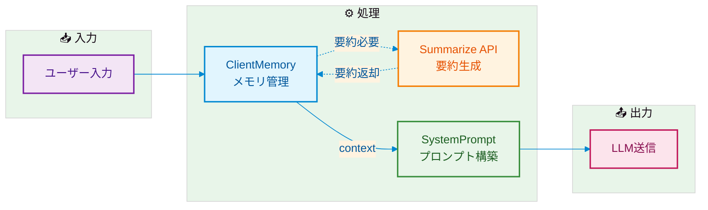
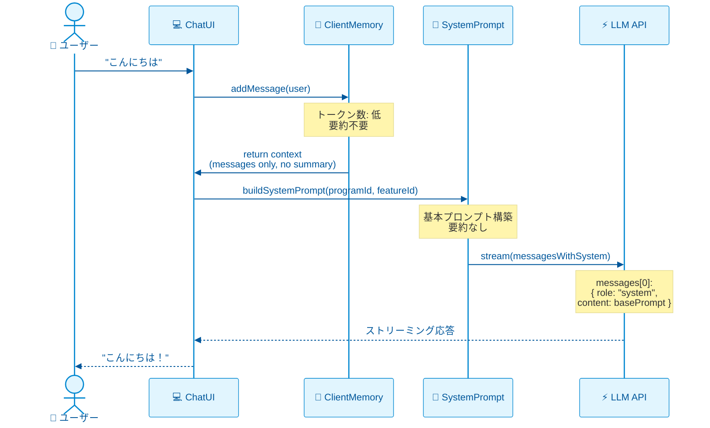
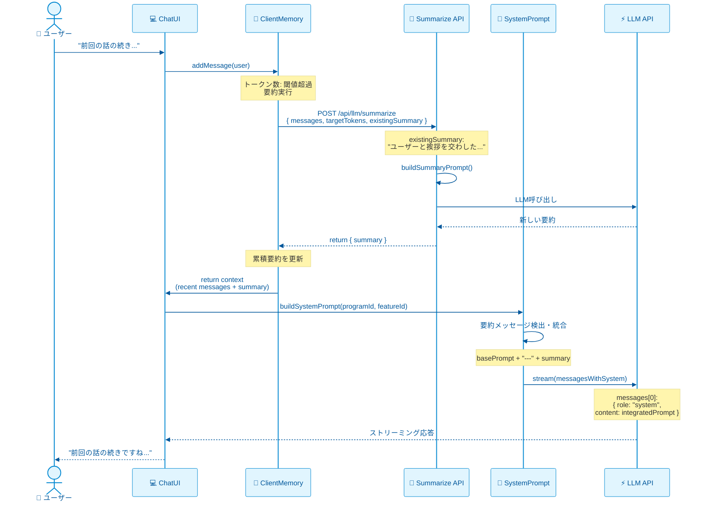
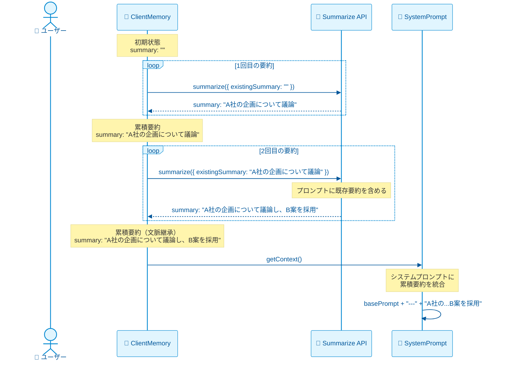
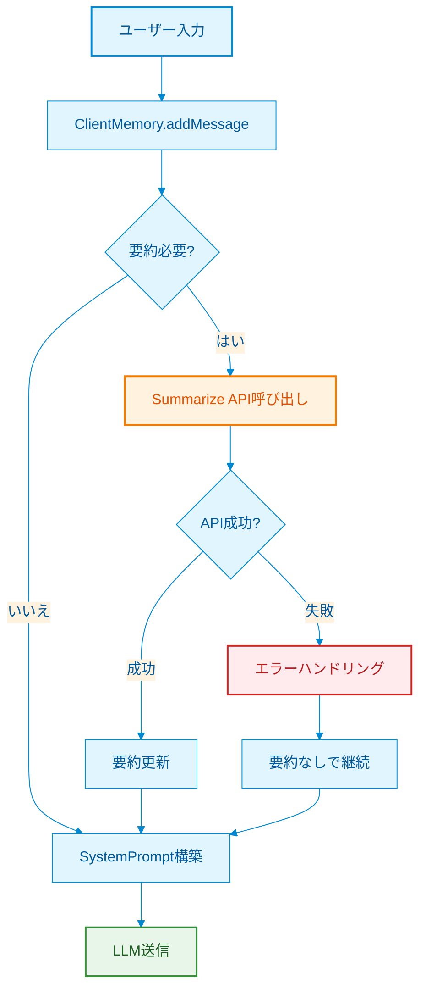

# 会話コンテキスト管理フロー

> **Memory → Summarization → SystemPrompt のend-to-endデータフロー**
>
> **最終更新**: 2026-03-20 14:35

---

## 概要

本ドキュメントは、ユーザー入力からLLM送信までの会話コンテキスト管理の全体フローを説明します。3つの主要コンポーネントが連携して、長時間の会話でも文脈を維持します。

### コンポーネント構成



---

## 責任分界

| コンポーネント | 責任 | 所在 |
|-------------|------|------|
| **ClientMemory** | メッセージ管理・トークン計算・要約トリガー | `lib/llm/memory/client-memory.ts` |
| **Summarize API** | プロンプト構築・LLM呼び出し・要約生成 | `app/api/llm/summarize/route.ts` |
| **SystemPrompt** | プロンプト構築・要約統合・LLM送信 | `lib/prompts/system-prompt.ts`<br/>`app/api/llm/stream/route.ts` |

---

## シナリオ別フロー

### シナリオA: 新規会話（要約なし）



### シナリオB: 継続会話（要約あり）



### シナリオC: 長時間会話（累積要約）



---

## データ構造の変遷

### Stage 1: ClientMemory内

```typescript
// 新規会話時
{
  messages: [
    { role: "user", content: "こんにちは" },
    { role: "assistant", content: "こんにちは！" }
  ],
  summary: "",
  metadata: { totalMessages: 2, summaryTokens: 0, recentTokens: 50 }
}

// 要約後
{
  messages: [],  // 要約済みメッセージはクリア
  summary: "ユーザーと挨拶を交わした。",
  metadata: { totalMessages: 0, summaryTokens: 20, recentTokens: 0 }
}

// 新メッセージ追加後
{
  messages: [
    { role: "user", content: "今日の天気は？" }
  ],
  summary: "ユーザーと挨拶を交わした。",
  metadata: { totalMessages: 1, summaryTokens: 20, recentTokens: 15 }
}
```

### Stage 2: SystemPrompt構築時

```typescript
// 要約なしの場合
const messagesWithSystem = [
  { role: "system", content: basePrompt },
  { role: "user", content: "こんにちは" }
];

// 要約ありの場合
const messagesWithSystem = [
  { 
    role: "system", 
    content: `${basePrompt}\n\n---\n\nこれまでの会話の要約：ユーザーと挨拶を交わした。`
  },
  { role: "user", content: "今日の天気は？" }
];
```

---

## 統合ポイント詳細

### 1. ClientMemory → Summarize API

```typescript
// ClientMemory.updateSummary()
const response = await fetch("/api/llm/summarize", {
  method: "POST",
  body: JSON.stringify({
    messages: this.messages,           // 要約対象
    provider: this.provider,           // LLMプロバイダー
    targetTokens: calculatedTokens,    // 動的圧縮率で計算
    existingSummary: this.summary,     // 累積要約の文脈
  }),
});
```

### 2. Summarize API → GrokClient

```typescript
// app/api/llm/summarize/route.ts
const prompt = buildSummaryPrompt(
  messages,
  targetChars,
  existingSummary  // 累積要約をプロンプトに含める
);

const client = new GrokClient(provider);
const summary = await client.summarizeWithPrompt(prompt);
```

### 3. ClientMemory → SystemPrompt

```typescript
// hooks/useLLMStream/index.ts
const context = memory.getContext();
// { messages, summary, metadata }

// app/api/llm/stream/route.ts
const baseSystemPrompt = await buildSystemPrompt({ 
  programId, 
  featureId,
  userId 
});

// 要約メッセージを検出・統合
const summaryMessage = messages.find(
  m => m.role === "system" && m.content.startsWith("これまでの会話の要約")
);

const systemPrompt = summaryMessage
  ? `${baseSystemPrompt}\n\n---\n\n${summaryMessage.content}`
  : baseSystemPrompt;
```

---

## エラーフロー



---

## パフォーマンス特性

| 項目 | 値 | 備考 |
|-----|-----|------|
| トークン計算 | O(n) | n=文字数 |
| 要約API呼び出し | ~500-2000ms | LLM応答時間依存 |
| メモリ使用量 | ~数MB | 会話履歴サイズ依存 |
| クライアントサイド処理 | <10ms | 要約除く |

---

## 関連ファイル

| ファイル | 役割 |
|---------|------|
| `lib/llm/memory/client-memory.ts` | ClientMemory実装 |
| `app/api/llm/summarize/route.ts` | 要約API |
| `lib/prompts/system-prompt.ts` | システムプロンプト構築 |
| `app/api/llm/stream/route.ts` | ストリーミングAPI（要約統合） |
| `hooks/useLLMStream/index.ts` | フック実装 |

---

## 関連ドキュメント

- [memory-management.md](./memory-management.md) - ClientMemory詳細設計
- [summarization-api.md](./summarization-api.md) - 要約API仕様
- [system-prompt-management.md](./system-prompt-management.md) - システムプロンプト管理

---

## 変更履歴

| 日付 | 変更内容 |
|------|---------|
| 2026-03-20 | 関連ドキュメントリンクを更新 |
| 2026-02-25 | 初版作成 |

---

## 変更履歴

| 日付 | 変更内容 |
|------|---------|
| 2026-02-25 | 初版作成 |
