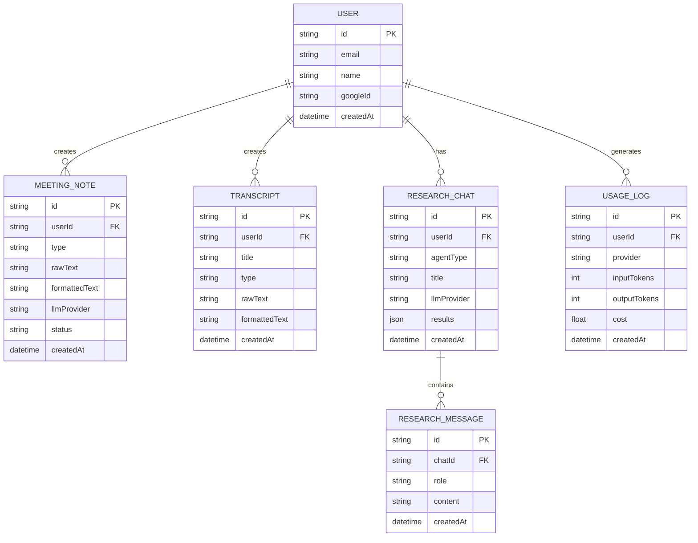

# データベーススキーマ

> **Prismaスキーマ定義と設計方針**

## 概要

| 項目 | 内容 |
|------|------|
| ORM | Prisma v5.22.0 |
| データベース | PostgreSQL（Neon Serverless） |
| スキーマファイル | `prisma/schema.prisma` |
| 接続設定 | `lib/prisma.ts` |

## ER図



## 主要テーブル

### User
ユーザーアカウント（NextAuth連携）

| カラム | 型 | 制約 |
|--------|-----|------|
| `id` | String | PK, UUID |
| `email` | String | UNIQUE |
| `name` | String? | |
| `googleId` | String? | UNIQUE |
| `createdAt` | DateTime | default: now() |

### MeetingNote
議事録データ

| カラム | 型 | 説明 |
|--------|-----|------|
| `id` | String | PK |
| `userId` | String | FK → User |
| `type` | String | `MEETING` \| `INTERVIEW` |
| `rawText` | String | 元の文字起こし |
| `formattedText` | String? | 整形後テキスト |
| `status` | String | `DRAFT` \| `COMPLETED` |

### ResearchChat / ResearchMessage
リサーチチャット

| テーブル | 説明 |
|---------|------|
| `ResearchChat` | チャットセッション |
| `ResearchMessage` | メッセージ履歴 |

**ResearchChatカラム:**

| カラム | 型 | 説明 |
|--------|-----|------|
| `id` | String | PK, UUID |
| `userId` | String | FK → User |
| `agentType` | String | `PEOPLE` \| `LOCATION` \| `EVIDENCE` |
| `title` | String? | チャットタイトル（自動生成） |
| `llmProvider` | LLMProvider | 使用プロバイダー |
| `results` | Json? | リサーチ結果 |
| `createdAt` | DateTime | 作成日時 |
| `updatedAt` | DateTime | 更新日時 |

**タイトル自動生成:**
- 新規チャット作成時、最初のユーザーメッセージからGrok(grok-4-0709)で自動生成
- バックグラウンド実行（レスポンスを遅延させない）

### UsageLog
LLM使用量ログ

| カラム | 型 | 説明 |
|--------|-----|------|
| `provider` | LLMProvider | 使用プロバイダー |
| `inputTokens` | Int | 入力トークン |
| `outputTokens` | Int | 出力トークン |
| `cost` | Float | 推定コスト（USD） |

## Enum定義

```prisma
enum LLMProvider {
  GEMINI_25_FLASH_LITE
  GEMINI_30_FLASH
  GROK_4_1_FAST_REASONING
  GROK_4_0709
  GPT_4O_MINI
  GPT_5
  CLAUDE_SONNET_45
  CLAUDE_OPUS_46
  PERPLEXITY_SONAR
  PERPLEXITY_SONAR_PRO
}
```

## インデックス

| テーブル | インデックス | 用途 |
|---------|-----------|------|
| MeetingNote | `(userId, status, createdAt)` | ステータス別一覧 |
| ResearchChat | `(userId, agentType, createdAt)` | エージェント別一覧 |
| UsageLog | `(userId, provider, createdAt)` | 利用統計 |

詳細なインデックス一覧: `prisma/schema.prisma` 参照

## マイグレーション

| # | マイグレーション | 主な変更 |
|---|----------------|---------|
| 1 | `20260215181608_init` | 初期スキーマ |
| 2 | `20260216045708_add_refresh_token_expires_in` | Account更新 |
| 3 | `20260219105000_add_system_prompts` | SystemPrompt追加 |
| 4 | `20260220000000_update_grok_enum` | Grok Enum更新 |
| 5 | `20260221000000_add_chat_title` | ResearchChatにtitleカラム追加 |

実行コマンド:
```bash
npx prisma migrate dev    # 開発環境
npx prisma migrate deploy # 本番環境
```

## 関連仕様

| 項目 | 参照先 |
|-----|--------|
| 接続設定 | `lib/prisma.ts` |
| 環境構築 | [guides/setup/database-cache.md](../guides/setup/database-cache.md) |
| パフォーマンス | [performance.md](./performance.md#データベース最適化) |
