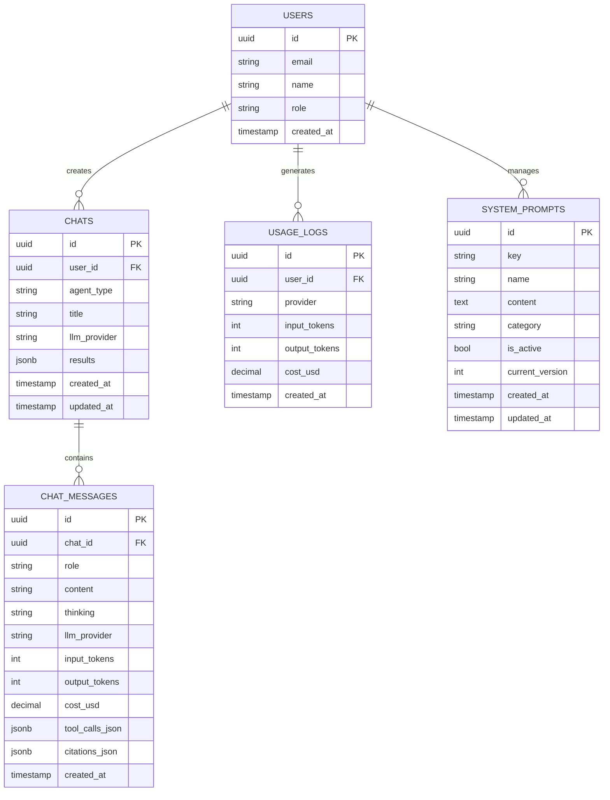

# データベーススキーマ

> **Supabaseデータベース設計とスキーマ定義**
> 
> **最終更新**: 2026-03-20 14:35

---

## 概要

| 項目 | 内容 |
|------|------|
| データベース | PostgreSQL（Supabase） |
| 認証 | Supabase Auth |
| クライアント | `@supabase/supabase-js` |
| サーバークライアント | `lib/supabase/server.ts` |
| ミドルウェア | `lib/supabase/middleware.ts` |

---

## ER図



---

## 主要テーブル

### users（Supabase Auth管理）

ユーザーアカウントはSupabase Authで管理されます。`auth.users`テーブルと連携。

| カラム | 型 | 制約 | 説明 |
|--------|-----|------|------|
| `id` | UUID | PK | Supabase AuthのユーザーID |
| `email` | TEXT | UNIQUE | メールアドレス |
| `name` | TEXT | | 表示名 |
| `role` | TEXT | DEFAULT 'USER' | USER / ADMIN |
| `created_at` | TIMESTAMPTZ | DEFAULT NOW() | 作成日時 |

### chats

チャットセッション

| カラム | 型 | 説明 |
|--------|-----|------|
| `id` | UUID | PK, 自動生成 |
| `user_id` | UUID | FK → users(id) |
| `agent_type` | TEXT | `RESEARCH-CAST` \| `RESEARCH-EVIDENCE` \| `MINUTES` \| `PROPOSAL` \| `GENERAL-CHAT` |
| `title` | TEXT | チャットタイトル（自動生成） |
| `llm_provider` | llm_provider | 使用LLMプロバイダー |
| `results` | JSONB | リサーチ結果等 |
| `created_at` | TIMESTAMPTZ | 作成日時 |
| `updated_at` | TIMESTAMPTZ | 更新日時 |

**タイトル自動生成:**
- 新規チャット作成時、最初のユーザーメッセージからGrok(grok-4-1-fast-reasoning)で自動生成
- バックグラウンド実行（レスポンスを遅延させない）

### chat_messages

チャットメッセージ履歴

| カラム | 型 | 説明 |
|--------|-----|------|
| `id` | UUID | PK, 自動生成 |
| `chat_id` | UUID | FK → chats(id) ON DELETE CASCADE |
| `role` | TEXT | `USER` \| `ASSISTANT` \| `SYSTEM` |
| `content` | TEXT | メッセージ本文 |
| `thinking` | TEXT | AIの思考プロセス（内部用） |
| `llm_provider` | llm_provider | 使用したLLM |
| `input_tokens` | INTEGER | 入力トークン数 |
| `output_tokens` | INTEGER | 出力トークン数 |
| `cost_usd` | DECIMAL(10,6) | 推定コスト（USD） |
| `tool_calls_json` | JSONB | ツール呼び出し情報 |
| `citations_json` | JSONB | 引用情報 |
| `created_at` | TIMESTAMPTZ | 作成日時 |

### usage_logs

LLM使用量ログ

| カラム | 型 | 説明 |
|--------|-----|------|
| `id` | UUID | PK |
| `user_id` | UUID | FK → users(id) |
| `provider` | TEXT | 使用プロバイダー |
| `input_tokens` | INTEGER | 入力トークン |
| `output_tokens` | INTEGER | 出力トークン |
| `cost_usd` | DECIMAL(10,6) | 推定コスト（USD） |
| `created_at` | TIMESTAMPTZ | 作成日時 |

### system_prompts

システムプロンプト管理

| カラム | 型 | 説明 |
|--------|-----|------|
| `id` | UUID | PK |
| `key` | TEXT | UNIQUE, 識別子（MINUTES等） |
| `name` | TEXT | 表示名 |
| `content` | TEXT | プロンプト本文 |
| `category` | TEXT | カテゴリ |
| `is_active` | BOOLEAN | 有効/無効 |
| `current_version` | INTEGER | 現在のバージョン番号 |
| `created_at` | TIMESTAMPTZ | 作成日時 |
| `updated_at` | TIMESTAMPTZ | 更新日時 |

---

## Enum定義

### llm_provider

```sql
CREATE TYPE llm_provider AS ENUM (
  'GEMINI_25_FLASH_LITE',
  'GEMINI_30_FLASH',
  'GROK_4_1_FAST_REASONING',
  'GROK_4_0709',
  'GPT_4O_MINI',
  'GPT_5',
  'CLAUDE_SONNET_45',
  'CLAUDE_OPUS_46',
  'PERPLEXITY_SONAR',
  'PERPLEXITY_SONAR_PRO'
);
```

---

## インデックス

| テーブル | インデックス | 用途 |
|---------|-----------|------|
| chats | `idx_chats_user_agent_created` | エージェント別一覧 |
| chats | `idx_chats_user_created` | ユーザー別一覧 |
| chats | `idx_chats_agent_type` | エージェントタイプ検索 |
| chat_messages | `idx_chat_messages_chat_created` | チャットメッセージ取得 |
| usage_logs | `(user_id, created_at)` | 利用統計 |

---

## Row Level Security（RLS）

### chatsテーブル

```sql
CREATE POLICY "Users can CRUD own chats" ON chats
  FOR ALL USING (auth.uid() = user_id);
```

### chat_messagesテーブル

```sql
CREATE POLICY "Users can CRUD messages in own chats" ON chat_messages
  FOR ALL USING (
    chat_id IN (SELECT id FROM chats WHERE user_id = auth.uid())
  );
```

---

## マイグレーション履歴

| # | マイグレーション | 主な変更 |
|---|----------------|---------|
| 1 | `20260309000000_initial_schema` | 初期スキーマ作成 |
| 2 | `20260311135420_rename_and_cleanup_tables` | テーブル名変更（research_chats→chats, research_messages→chat_messages）、未使用テーブル削除 |
| 3 | `20260312000000_add_handle_new_user_trigger` | 新規ユーザー自動作成トリガー追加 |
| 4 | `20260319000000_add_program_id_to_chats` | chatsテーブルにprogram_idカラム追加 |

実行コマンド:
```bash
# 開発環境
supabase db push

# 新規マイグレーション作成
supabase migration new <migration-name>
```

### マイグレーションファイルの場所

```
supabase/migrations/
├── 20260309000000_initial_schema.sql
├── 20260311135420_rename_and_cleanup_tables.sql
├── 20260312000000_add_handle_new_user_trigger.sql
└── 20260319000000_add_program_id_to_chats.sql
```

---

## 関連ファイル

| 項目 | 参照先 |
|-----|--------|
| サーバークライアント | `lib/supabase/server.ts` |
| ミドルウェア | `lib/supabase/middleware.ts` |
| クライアント | `lib/supabase/client.ts` |
| 管理者クライアント | `lib/supabase/admin.ts` |
| マイグレーション | `supabase/migrations/` |
| 環境構築 | [guides/setup/database-cache.md](../guides/setup/database-cache.md) |
| プロンプト管理 | [system-prompt-management.md](./system-prompt-management.md) |
| 認証 | [authentication.md](./authentication.md) |
