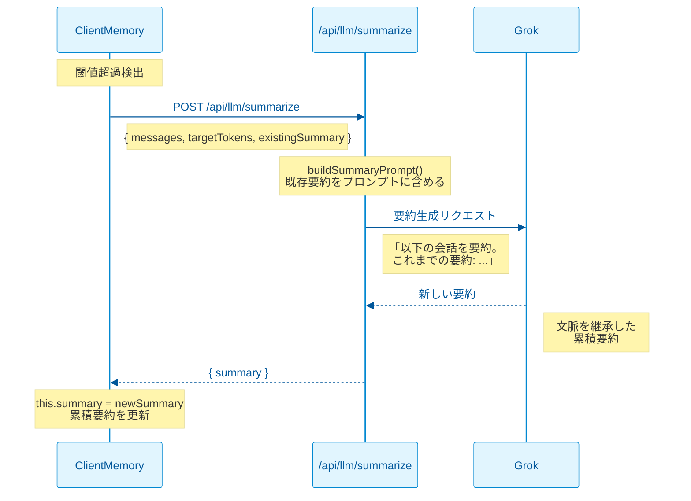

# Memory管理（ClientMemory）

> **クライアントサイド会話履歴管理と動的圧縮**
>
> **最終更新**: 2026-02-25 14:30

---

## 概要

`ClientMemory`はブラウザ側で動作する会話履歴管理クラスです。トークン数に基づく動的圧縮と累積要約を実現し、長時間の会話でもコンテキストを維持します。

### 責任範囲

| 責任 | 説明 |
|------|------|
| **メッセージ管理** | 会話履歴の追加・取得・削除 |
| **トークン計算** | 概算トークン数の計算（1文字≈0.25トークン） |
| **圧縮率決定** | 会話量に応じた動的圧縮率の計算 |
| **要約トリガー** | 閾値超過時の要約API呼び出し |
| **累積要約管理** | 既存要約の保持と文脈継承 |

---

## アーキテクチャ

```mermaid
%%{init: {'theme': 'base', 'themeVariables': { 'primaryColor': '#e1f5fe', 'primaryTextColor': '#01579b', 'primaryBorderColor': '#0288d1', 'lineColor': '#0288d1', 'secondaryColor': '#fff3e0', 'tertiaryColor': '#e8f5e9', 'background': '#fafafa'}}}%%
flowchart TB
    subgraph Client["🌐 ブラウザ"]
        direction TB
        CM[ClientMemory]
        State[メッセージ配列<br/>要約テキスト]
    end
    
    subgraph API["⚙️ API"]
        SUM[/api/llm/summarize]
    end
    
    subgraph LLM["🤖 LLM"]
        Grok[xAI Grok]
    end
    
    CM -->|addMessage| State
    State -->|閾値超過| CM
    CM -->|要約リクエスト| SUM
    SUM -->|プロンプト構築| Grok
    Grok -->|要約生成| SUM
    SUM -->|新要約| CM
    
    style CM fill:#e1f5fe,stroke:#0288d1,stroke-width:2px,color:#01579b
    style State fill:#fff3e0,stroke:#f57c00,stroke-width:2px,color:#e65100
    style SUM fill:#e8f5e9,stroke:#388e3c,stroke-width:2px,color:#1b5e20
    style Grok fill:#f3e5f5,stroke:#7b1fa2,stroke-width:2px,color:#4a148c
```

---

## クラス設計

### ClientMemory

```typescript
// lib/llm/memory/client-memory.ts
export class ClientMemory {
  private messages: LLMMessage[] = [];
  private summary = "";
  private tokenThreshold: number;
  private compressionRates: CompressionRateEntry[];
  private maxSummaryTokens: number;
  
  constructor(provider: LLMProvider, options?: ClientMemoryOptions);
  
  // 公開メソッド
  addMessage(message: LLMMessage): Promise<void>;
  getContext(): MemoryContext;
  clear(): void;
  
  // 内部メソッド
  private calculateTokens(text: string): number;
  private calculateCompressionRate(tokens: number): number;
  private calculateTargetSummaryTokens(tokens: number): number;
  private async updateSummary(): Promise<void>;
}
```

### 型定義

```typescript
// lib/llm/memory/types.ts
export interface CompressionRateEntry {
  threshold: number;  // トークン閾値
  rate: number;       // 圧縮率（0-1）
}

export interface BaseMemoryOptions {
  tokenThreshold?: number;           // 要約トリガー閾値
  maxRecentTurns?: number;           // 保持する直近ターン数
  compressionRates?: CompressionRateEntry[];  // 圧縮率テーブル
  maxSummaryTokens?: number;         // 要約最大トークン数
}

export interface MemoryContext {
  messages: LLMMessage[];  // 最近のメッセージ
  summary?: string;        // 要約（あれば）
  metadata: {
    totalMessages: number;
    summaryTokens: number;
    recentTokens: number;
  };
}

// デフォルト圧縮率テーブル
export const DEFAULT_COMPRESSION_RATES: CompressionRateEntry[] = [
  { threshold: 100_000, rate: 0.05 },   // 10万以下: 5%
  { threshold: 500_000, rate: 0.03 },   // 50万以下: 3%
  { threshold: 1_000_000, rate: 0.02 }, // 100万以下: 2%
  { threshold: Infinity, rate: 0.01 },  // それ以上: 1%
];
```

---

## 動的圧縮率

### アルゴリズム

会話の累積トークン数に応じて、要約時の圧縮率を動的に調整します。

```typescript
private calculateCompressionRate(tokens: number): number {
  for (const entry of this.compressionRates) {
    if (tokens <= entry.threshold) {
      return entry.rate;
    }
  }
  return 0.01; // フォールバック
}

private calculateTargetSummaryTokens(tokens: number): number {
  const rate = this.calculateCompressionRate(tokens);
  return Math.min(
    Math.floor(tokens * rate),
    this.maxSummaryTokens
  );
}
```

### 圧縮率テーブル

| 累積トークン | 圧縮率 | 100万トークンの場合 |
|-------------|--------|-------------------|
| ≤ 100,000 | 5% | 5,000トークン |
| ≤ 500,000 | 3% | 15,000トークン |
| ≤ 1,000,000 | 2% | 20,000トークン |
| > 1,000,000 | 1% | 10,000トークン（上限適用） |

### 目的

- **短い会話**: 高圧縮率（5%）で詳細を保持
- **長い会話**: 低圧縮率（1%）で文脈を維持しつつサイズ抑制
- **上限設定**: `maxSummaryTokens`（デフォルト20,000）で暴走防止

---

## 累積要約

### フロー



### 実装

```typescript
private async updateSummary(): Promise<void> {
  const tokensToSummarize = this.calculateTokens(
    this.messages.map(m => m.content).join("\n")
  );
  
  const targetTokens = this.calculateTargetSummaryTokens(tokensToSummarize);
  
  const response = await fetch("/api/llm/summarize", {
    method: "POST",
    headers: { "Content-Type": "application/json" },
    body: JSON.stringify({
      messages: this.messages,
      provider: this.provider,
      targetTokens,
      existingSummary: this.summary, // 累積要約の文脈
    }),
  });
  
  const data = await response.json();
  this.summary = data.summary; // 累積要約を更新
  
  // 要約済みメッセージをクリア
  this.messages = [];
}
```

### メリット

| 観点 | 効果 |
|------|------|
| **文脈継承** | 過去の要約内容が新しい要約に反映される |
| **一貫性** | 長時間会話でもトピックの一貫性を維持 |
| **情報損失軽減** | 繰り返し要約による情報の段階的劣化を抑制 |

---

## 使用例

### 基本的な使用

```typescript
import { ClientMemory } from "@/lib/llm/memory";

// Memory初期化
const memory = new ClientMemory("grok-4-1-fast-reasoning", {
  tokenThreshold: 100_000,
  maxRecentTurns: 10,
  maxSummaryTokens: 20_000,
});

// メッセージ追加（自動で要約判定）
await memory.addMessage({ role: "user", content: "こんにちは" });
await memory.addMessage({ role: "assistant", content: "こんにちは！" });

// コンテキスト取得
const context = memory.getContext();
console.log(context);
// {
//   messages: [...],      // 最近のメッセージ
//   summary: "...",       // 要約（あれば）
//   metadata: { ... }
// }
```

### カスタム圧縮率

```typescript
const memory = new ClientMemory("grok-4-1-fast-reasoning", {
  compressionRates: [
    { threshold: 50_000, rate: 0.10 },   // 5万以下: 10%
    { threshold: 200_000, rate: 0.05 },  // 20万以下: 5%
    { threshold: Infinity, rate: 0.02 }, // それ以上: 2%
  ],
});
```

---

## 関連ファイル

| ファイル | 役割 |
|---------|------|
| `lib/llm/memory/client-memory.ts` | ClientMemoryクラス実装 |
| `lib/llm/memory/types.ts` | 共通型定義 |
| `lib/llm/memory/index.ts` | エクスポート統合 |
| `app/api/llm/summarize/route.ts` | 要約APIエンドポイント |

---

## 関連ドキュメント

- [summarization-api.md](./summarization-api.md) - 要約API仕様
- [conversation-context-flow.md](./conversation-context-flow.md) - end-to-endデータフロー
- [system-prompt-generation.md](./system-prompt-generation.md) - システムプロンプト生成

---

## 変更履歴

| 日付 | 変更内容 |
|------|---------|
| 2026-02-25 | 初版作成 |
