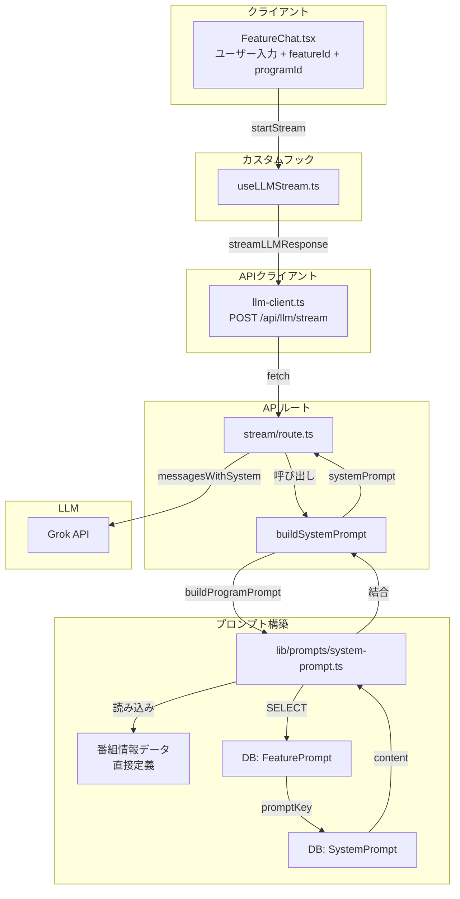
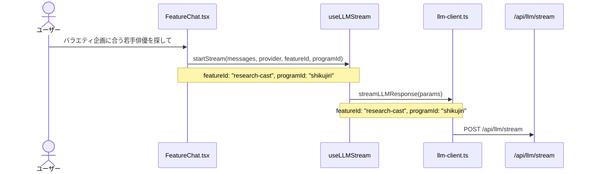
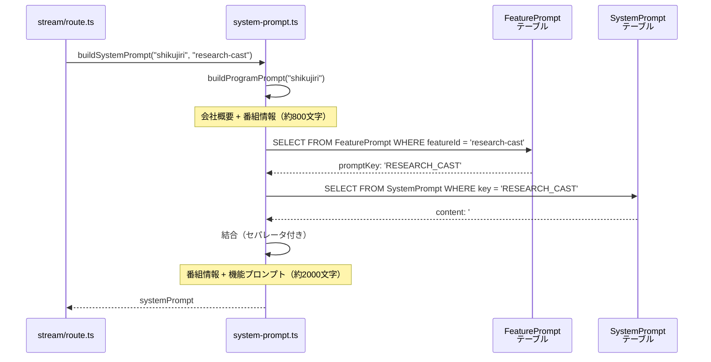
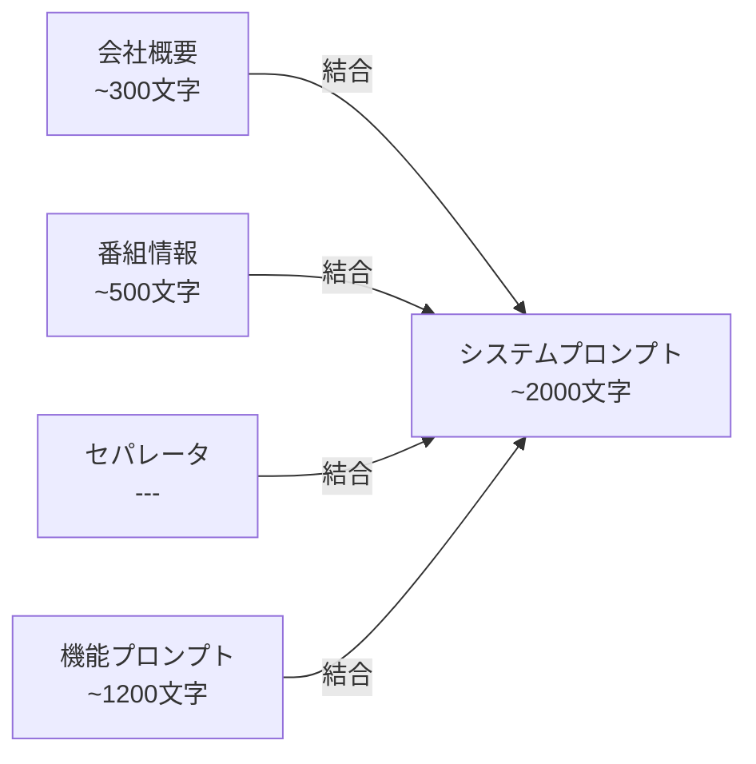
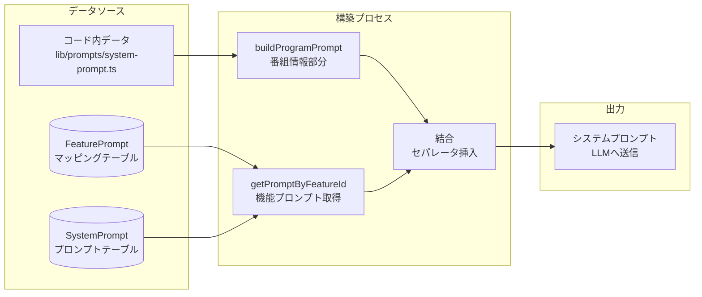
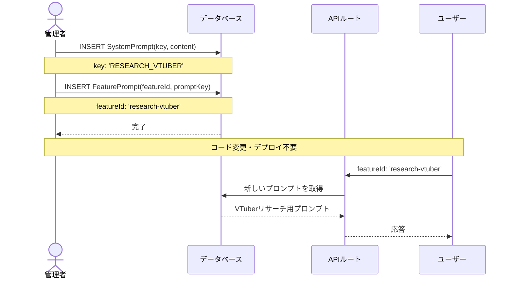
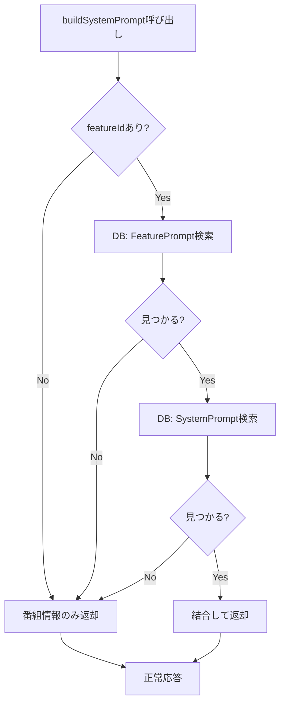

# システムプロンプト生成フロー

> **システムプロンプトの生成からLLM送信までの流れ**
>
> **最終更新**: 2026-02-25 12:30

---

## 概要

システムプロンプトは以下の2つの要素を結合して生成されます：

1. **番組情報**（背景知識）- コード内に直接定義
2. **機能プロンプト**（役割・指示）- DBから動的取得

---

## アーキテクチャ図



---

## 詳細フロー

### 1. クライアントからAPIへ



**送信パラメータ**:
```typescript
{
  messages: LLMMessage[];
  provider?: string;        // "grok-4-1-fast"
  featureId?: string;       // "research-cast"
  programId?: string;       // "shikujiri" | "all"
}
```

---

### 2. APIルートでのプロンプト生成



---

### 3. 生成されるプロンプト構造



**実際のプロンプト構成**:

```markdown
# United Productions 会社概要

## 基本情報
- 社名: 株式会社UNITED PRODUCTIONS...
...

---

## しくじり先生 俺みたいになるな!!

- 放送局: テレビ朝日系列
- 放送時間: 毎週月曜 23:15〜
- MC/出演者: ギャル曽根
...

---

上記の詳細な番組情報を前提知識として保持してください。
...

---

## 機能固有の指示

## 出演者リサーチ

あなたはテレビ制作の出演者リサーチ専門家です。

### 情報収集（重要）
**最新情報や詳細な情報が必要な場合は、積極的にツールを使用してください：**
- **Web検索**: 出演者の最新情報...
- **X検索**: ソーシャルメディアでの話題性...
...
```

---

## データフロー図



---

## ファイル構成

```
lib/prompts/
├── system-prompt.ts      # 一元管理ファイル
│   ├── COMPANY_INFO      # 会社概要データ
│   ├── PROGRAMS          # 番組情報データ（13本）
│   ├── formatCompany()   # フォーマット関数
│   ├── formatProgram()   # フォーマット関数
│   ├── getPromptByFeatureId()  # DB取得
│   └── buildSystemPrompt()     # 公開API
│
└── （他のファイルは削除済み）

prisma/schema.prisma
├── SystemPrompt          # プロンプト本体
└── FeaturePrompt         # featureId → promptKey マッピング
```

---

## 新機能追加フロー



**手順**:

1. **SystemPromptテーブルにINSERT**
   ```sql
   INSERT INTO "SystemPrompt" ("id", "key", "name", "content", "category", "isActive")
   VALUES (
     'prompt_research_vtuber',
     'RESEARCH_VTUBER',
     'VTuberリサーチ',
     '## VTuberリサーチ\n\nあなたはVTuberリサーチ専門家です...',
     'research',
     true
   );
   ```

2. **FeaturePromptテーブルにINSERT**
   ```sql
   INSERT INTO "FeaturePrompt" ("id", "featureId", "promptKey", "isActive")
   VALUES (
     'fp_research_vtuber',
     'research-vtuber',
     'RESEARCH_VTUBER',
     true
   );
   ```

3. **完了** - フロントエンドから `featureId: "research-vtuber"` を送信するだけで動作

---

## エラーハンドリング



**フォールバック動作**:
- FeaturePromptが見つからない → 番組情報のみ
- SystemPromptが見つからない → 番組情報のみ
- DBエラー → エラーを投げる（呼び出し元で処理）

---

## 関連ファイル

| ファイル | 役割 |
|---------|------|
| `lib/prompts/system-prompt.ts` | プロンプト構築の中核 |
| `app/api/llm/stream/route.ts` | APIエンドポイント |
| `prisma/schema.prisma` | DBスキーマ定義 |
| `hooks/useLLMStream/index.ts` | ストリーミング制御 |
| `components/ui/FeatureChat.tsx` | ユーザーインターフェース |

---

## パフォーマンス考慮事項

| 項目 | 現状 | 備考 |
|-----|------|------|
| DBクエリ回数 | 2回（FeaturePrompt + SystemPrompt） | 必要最小限 |
| キャッシュ | なし | プロンプト変更即時反映のため |
| プロンプトサイズ | 約800〜3000文字 | 機能により変動 |
| 生成時間 | < 10ms | DBレイテンシ除く |

**将来的な最適化**（必要に応じて）:
- Next.js `unstable_cache` でプロンプトをキャッシュ（TTL: 5分）
- Redisキャッシュ（高負荷時）
