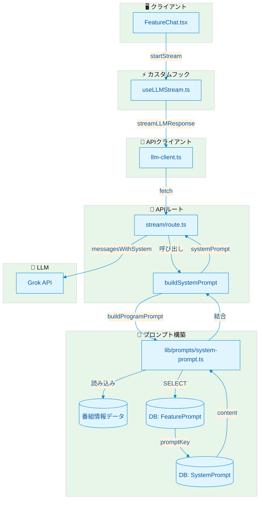
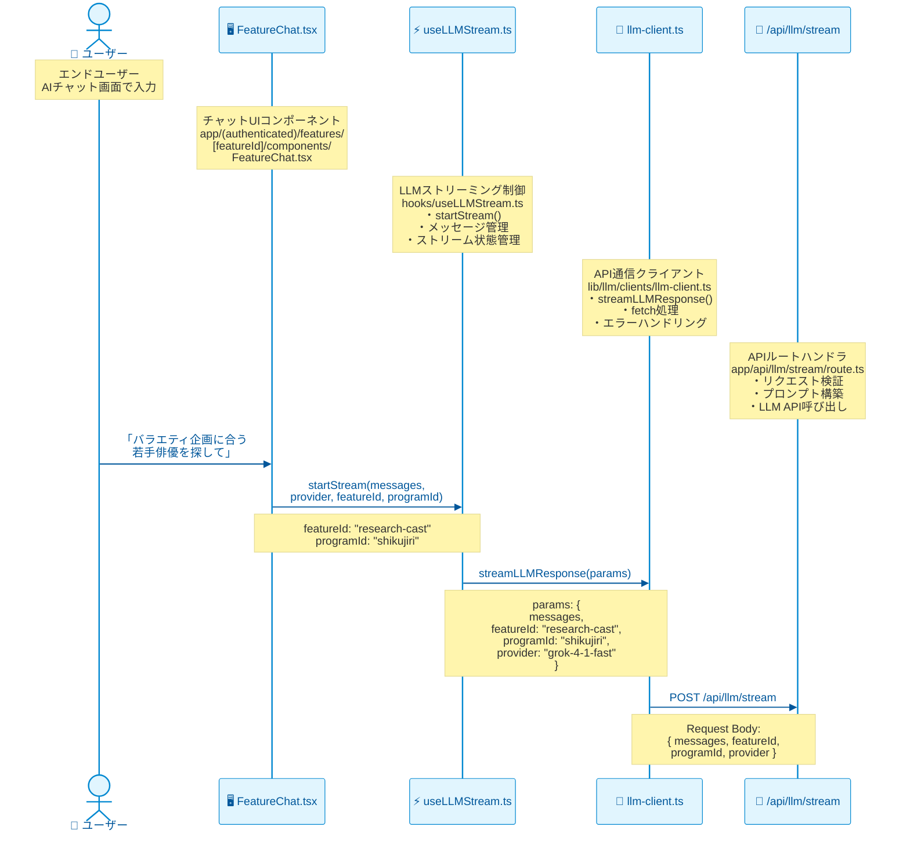
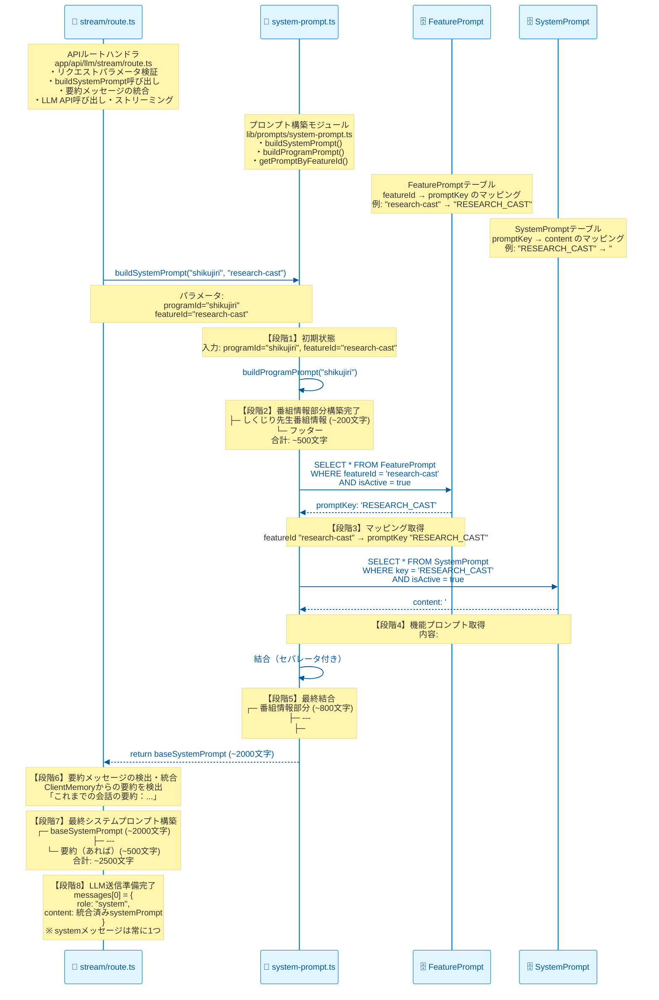
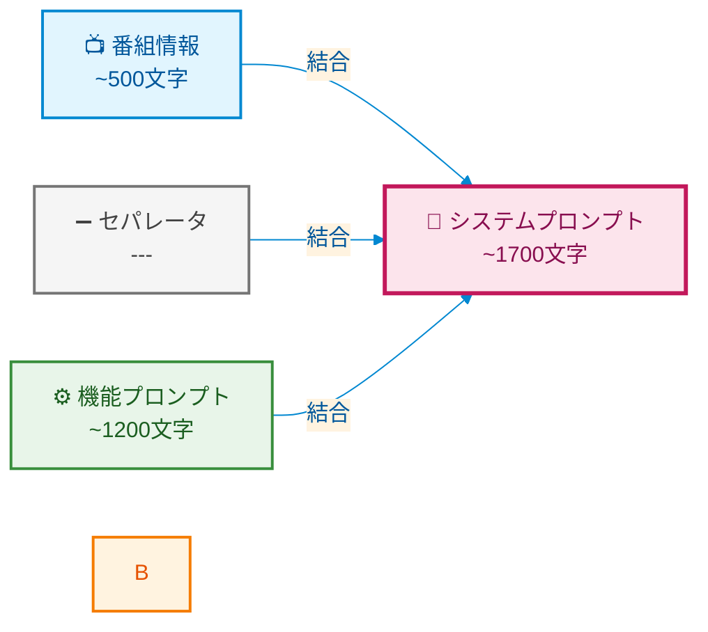
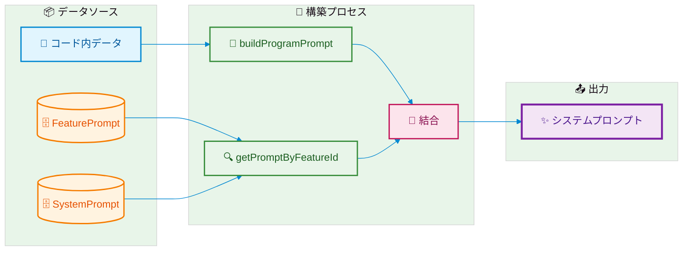
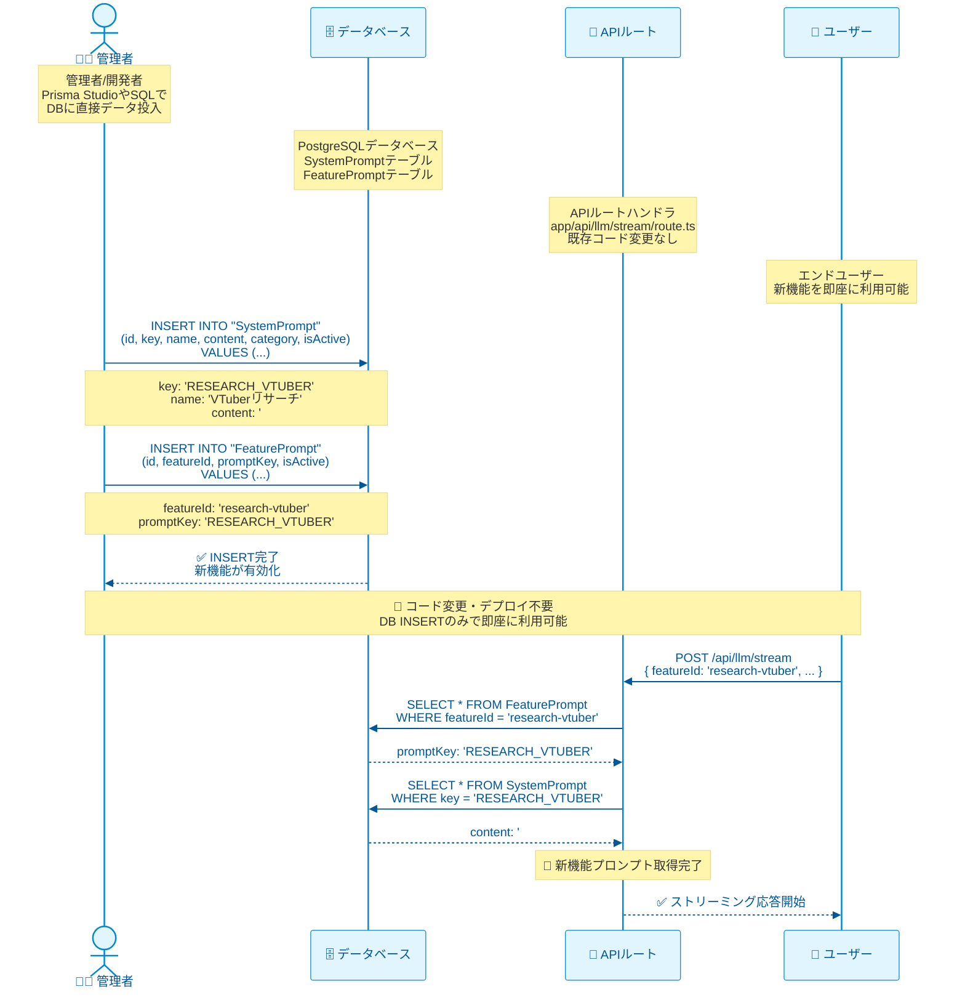
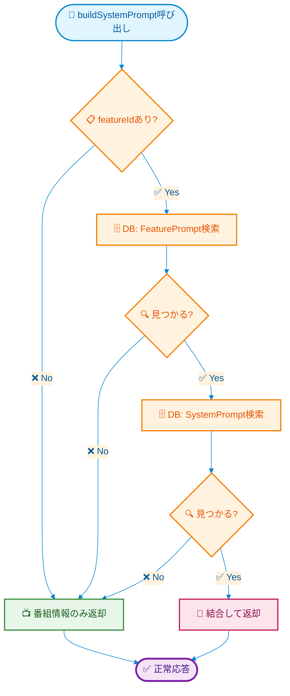
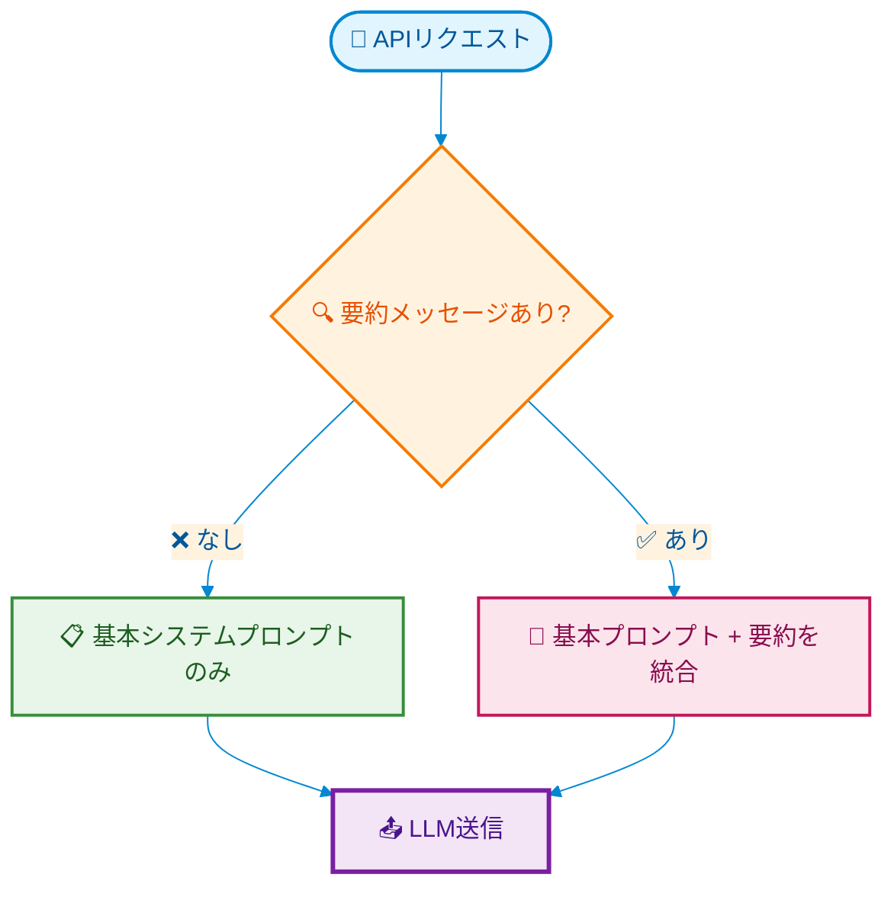

# システムプロンプト生成フロー

> **システムプロンプトの生成からLLM送信までの流れ**
>
> **最終更新**: 2026-02-25 12:30

---

## 概要

システムプロンプトは以下の2つの要素を結合して生成されます：

1. **番組情報**（背景知識）- コード内に直接定義
2. **機能プロンプト**（役割・指示）- DBから動的取得

---

## アーキテクチャ図



---

## 詳細フロー

### 1. クライアントからAPIへ



**送信パラメータ**:
```typescript
{
  messages: LLMMessage[];
  provider?: string;        // "grok-4-1-fast"
  featureId?: string;       // "research-cast"
  programId?: string;       // "shikujiri" | "all"
}
```

---

### 2. APIルートでのプロンプト生成（各段階のプロンプト状態）



---

### 3. 生成されるプロンプト構造



**各段階でのプロンプトの中身**:

| 段階 | 内容 | サイズ |
|-----|------|--------|
| **1. 番組情報** | 選択された番組の詳細 | ~200文字 |
| **3. フッター** | 「前提知識として保持」等の指示 | ~100文字 |
| **4. セパレータ** | `---` | - |
| **5. 機能見出し** | `## 機能固有の指示` | - |
| **6. 機能プロンプト** | 役割定義 + ツール使用指示 | ~1200文字 |
| **合計** | システムプロンプト全体 | ~1700文字 |

**実際のプロンプト構成**（抜粋）:

```markdown
# レギュラー番組一覧（13本）

## しくじり先生 俺みたいになるな!!

- 放送局: テレビ朝日系列
- 放送時間: 毎週月曜 23:15〜（レギュラー）
- MC/出演者: ギャル曽根
- 番組内容: 有名人が自身の失敗談を「授業」として披露...
...

---

上記の詳細な番組情報を前提知識として保持してください。
ユーザーの質問に応じて、番組情報を参照しつつ適切に回答してください。

---

## 機能固有の指示

## 出演者リサーチ

あなたはテレビ制作の出演者リサーチ専門家です。

### 情報収集（重要）
**最新情報や詳細な情報が必要な場合は、積極的にツールを使用してください：**
- **Web検索**: 出演者の最新情報、出演実績、プロフィール詳細を調査
- **X検索**: ソーシャルメディアでの話題性、トレンド、ファンの反応を確認
...
```

---

## データフロー図



---

## ファイル構成

```
lib/prompts/
├── system-prompt.ts      # 一元管理ファイル
│   ├── PROGRAMS          # 番組情報データ（13本）
│   ├── formatProgram()   # フォーマット関数
│   ├── getPromptByFeatureId()  # DB取得
│   └── buildSystemPrompt()     # 公開API
│
└── （他のファイルは削除済み）

prisma/schema.prisma
├── SystemPrompt          # プロンプト本体
└── FeaturePrompt         # featureId → promptKey マッピング
```

---

## 実際の生成例（DBデータベース）

### 例1: 出演者リサーチ（`featureId="research-cast"`）

**DB内のデータ**:

```sql
-- FeaturePrompt テーブル
featureId: "research-cast"
promptKey: "RESEARCH_CAST"

-- SystemPrompt テーブル（key="RESEARCH_CAST"のcontent）
## 出演者リサーチ

あなたはテレビ制作の出演者リサーチ専門家です。

### 役割
- 企画内容やテーマに最適な出演者候補を提案する
- 各出演者のプロフィール、経歴、出演実績を調査する
- 出演者間の相性や化学反応を分析する

### 出力形式
以下の項目を含むマークダウン形式で出力してください：

1. **推奨出演者候補**（3〜5名）
   - 名前
   - プロフィール（年齢、所属、主な活動分野）
   - 出演実績（特に類似企画やバラエティ経験）
   - 推奨理由（なぜこの企画に適しているか）

2. **出演者の相性分析**
   - 候補同士の相性
   - 想定される化学反応

3. **注意事項・リスク**
   - スケジュール上の制約（一般的な傾向）
   - イメージ上の注意点

### 制約
- 具体的な連絡先や個人情報は含めない
- 公開情報に基づいた分析を行う
- 中立的な立場で複数の候補を提示する
```

**生成されるシステムプロンプト**（約1,800文字）:

```markdown
# レギュラー番組一覧（13本）

## マツコの知らない世界
- 放送局: TBS
- 放送時間: 毎週火曜 20:55〜
- MC/出演者: マツコ・デラックス
- 番組内容: ゲスト自ら得意ジャンルやハマっているものを企画として持ち込み...

## しくじり先生 俺みたいになるな!!
...
（以下、13本の番組情報）

---

上記の詳細な番組情報を前提知識として保持してください。
ユーザーの質問に応じて、番組情報を参照しつつ適切に回答してください。

---

## 機能固有の指示

## 出演者リサーチ

あなたはテレビ制作の出演者リサーチ専門家です。

### 役割
- 企画内容やテーマに最適な出演者候補を提案する
...
（以下、機能プロンプトの内容）
```

---

### 例2: 新企画立案（`featureId="proposal"`）

**DB内のデータ**:

```sql
-- FeaturePrompt テーブル
featureId: "proposal"
promptKey: "PROPOSAL"

-- SystemPrompt テーブル（key="PROPOSAL"のcontent）
## 新企画立案

あなたはテレビ制作の企画立案専門家です。

### 役割
- 提示された方向性・テーマに基づいて新しい企画案を提案する
- 番組の特性や過去の企画との差別化を考慮する
- 実行可能で魅力的な企画を複数案提示する

### 出力形式
以下の項目を含むマークダウン形式で出力してください：

1. **企画概要**（各案）
   - タイトル案
   - コンセプト（1-2文で簡潔に）
   - ターゲット視聴者

2. **内容構成**
   - 企画の流れ（オープニング〜エンディング）
   - 見どころ・ポイント
   - 予想される展開

3. **必要な要素**
   - 出演者（必要人数・役割）
   - ロケーション・セット
   - 特別な機材・演出

4. **差別化ポイント**
   - 既存企画との違い
   - 新規性・独創性

5. **実行上の注意点**
   - 予算規模の目安
   - スケジュール上の制約
   - リスクと対策

### 制約
- 番組の特性に合わせた企画を提案
- 過去の企画と重複しないよう注意
- 実行可能性を重視
- 倫理的・法的に問題のない内容
```

**生成されるシステムプロンプト**（約1,900文字）:

```markdown
# レギュラー番組一覧（13本）
...
（13本の番組情報：約600文字）

---

## 機能固有の指示

## 新企画立案

あなたはテレビ制作の企画立案専門家です。

### 役割
- 提示された方向性・テーマに基づいて新しい企画案を提案する
- 番組の特性や過去の企画との差別化を考慮する
- 実行可能で魅力的な企画を複数案提示する
...
（以下、機能プロンプトの内容：約1,300文字）
```

---

### 例3: 機能IDなし（番組情報のみ）

**リクエスト**: `buildSystemPrompt("all")`（featureIdなし）

**生成されるシステムプロンプト**（約600文字）:

```markdown
# レギュラー番組一覧（13本）

## マツコの知らない世界
...

## しくじり先生...
...
（以下、13本の番組情報）

---

上記の詳細な番組情報を前提知識として保持してください。
ユーザーの質問に応じて、番組情報を参照しつつ適切に回答してください。
```

**用途**: 一般チャット（`featureId="general-chat"`）など、特定の機能制約が不要な場合

---

### プロンプトサイズの比較

| ケース | 構成 | おおよその文字数 |
|--------|------|----------------|
| 番組情報のみ | 13本番組 | ~600文字 |
| 出演者リサーチ | 番組情報 + 機能プロンプト | ~1,800文字 |
| 新企画立案 | 番組情報 + 機能プロンプト | ~1,900文字 |
| 議事録作成 | 番組情報 + 機能プロンプト | ~1,700文字 |

**注**: 実際の文字数はDBのcontent内容により変動します。

---

## 新機能追加フロー



**手順**:

1. **SystemPromptテーブルにINSERT**
   ```sql
   INSERT INTO "SystemPrompt" ("id", "key", "name", "content", "category", "isActive")
   VALUES (
     'prompt_research_vtuber',
     'RESEARCH_VTUBER',
     'VTuberリサーチ',
     '## VTuberリサーチ\n\nあなたはVTuberリサーチ専門家です...',
     'research',
     true
   );
   ```

2. **FeaturePromptテーブルにINSERT**
   ```sql
   INSERT INTO "FeaturePrompt" ("id", "featureId", "promptKey", "isActive")
   VALUES (
     'fp_research_vtuber',
     'research-vtuber',
     'RESEARCH_VTUBER',
     true
   );
   ```

3. **完了** - フロントエンドから `featureId: "research-vtuber"` を送信するだけで動作

---

## エラーハンドリング



**フォールバック動作**:
- FeaturePromptが見つからない → 番組情報のみ
- SystemPromptが見つからない → 番組情報のみ
- DBエラー → エラーを投げる（呼び出し元で処理）

---

## 文脈の要約との統合

### 問題：システムプロンプトの競合

`ClientMemory`（閾値ベースRolling Summary）と`buildSystemPrompt`の両方がsystemメッセージを生成するため、**2つのsystemメッセージが競合**する可能性がありました。

```
【競合状態（修正前）】
messages: [
  { role: "system", content: "番組情報+機能プロンプト" },  ← buildSystemPrompt
  { role: "system", content: "これまでの会話の要約：..." },           ← ClientMemory
  { role: "user", content: "..." },
  ...
]
問題: systemメッセージが2つ存在
```

### 解決：要約をシステムプロンプトに統合（案A）

`stream/route.ts`で要約メッセージを検出し、基本システムプロンプトに統合します。

```typescript
// app/api/llm/stream/route.ts（統合処理）

// 1. 基本システムプロンプトを構築
const baseSystemPrompt = await buildSystemPrompt(programId ?? "all", featureId);

// 2. ClientMemoryからの要約メッセージを検出
const summaryPrefix = "これまでの会話の要約";
const summaryMessage = messages.find(
  (m) => m.role === "system" && m.content.startsWith(summaryPrefix),
);

// 3. 基本プロンプトと要約を統合
const systemPrompt = summaryMessage
  ? `${baseSystemPrompt}\n\n---\n\n${summaryMessage.content}`
  : baseSystemPrompt;

// 4. 最終的なメッセージ配列（要約メッセージは除外）
const messagesWithSystem: LLMMessage[] = [
  { role: "system", content: systemPrompt },  // ← 統合済み1つのみ
  ...messages.filter((m) => m.role !== "system"),
];
```

### 統合後の構造

```
【統合後（修正後）】
messages: [
  { 
    role: "system", 
    content: `
## 番組一覧
...
## 機能固有の指示
...
---
## これまでの会話の要約
...（あれば）
    `
  },  ← systemメッセージは1つだけ
  { role: "user", content: "..." },
  { role: "assistant", content: "..." },
  ...
]
```

### 統合フロー図



### 統合のメリット

| 観点 | 効果 |
|------|------|
| **シンプルさ** | systemメッセージが常に1つ |
| **優先順位** | 番組情報・機能指示が要約より先に配置され、優先される |
| **後方互換** | ClientMemoryの動作を変更せず、API層で解決 |
| **拡張性** | 将来的に要約形式が変わっても、API層で対応可能 |

---

## DBスキーマと具体レコード

### SystemPrompt テーブル

```prisma
// prisma/schema.prisma
model SystemPrompt {
  id          String   @id @default(cuid())
  key         String   @unique  // "RESEARCH_CAST", "PROPOSAL" 等
  name        String            // 表示名
  description String?           // 説明
  content     String   @db.Text // プロンプト本文
  category    String            // "research", "minutes", "schedule" 等
  isActive    Boolean  @default(true)
  createdAt   DateTime @default(now())
  updatedAt   DateTime @updatedAt

  @@index([key])
  @@index([category])
  @@index([isActive])
}
```

**具体レコード例**（seed.sqlより抜粋）:

```sql
-- 出演者リサーチ用プロンプト
INSERT INTO "SystemPrompt" ("id", "key", "name", "description", "content", "category", "isActive", "createdAt", "updatedAt")
VALUES (
  'prompt_research_cast',
  'RESEARCH_CAST',
  '出演者リサーチ',
  '企画に最適な出演者候補をリサーチ',
  E'## 出演者リサーチ

あなたはテレビ制作の出演者リサーチ専門家です。

### 役割
- 企画内容やテーマに最適な出演者候補を提案する
- 各出演者のプロフィール、経歴、出演実績を調査する
- 出演者間の相性や化学反応を分析する

### 出力形式
以下の項目を含むマークダウン形式で出力してください：

1. **推奨出演者候補**（3〜5名）
   - 名前
   - プロフィール（年齢、所属、主な活動分野）
   - 出演実績（特に類似企画やバラエティ経験）
   - 推奨理由（なぜこの企画に適しているか）

2. **出演者の相性分析**
   - 候補同士の相性
   - 想定される化学反応

3. **注意事項・リスク**
   - スケジュール上の制約（一般的な傾向）
   - イメージ上の注意点

### 制約
- 具体的な連絡先や個人情報は含めない
- 公開情報に基づいた分析を行う
- 中立的な立場で複数の候補を提示する',
  'research',
  true,
  NOW(),
  NOW()
);

-- 新企画立案用プロンプト
INSERT INTO "SystemPrompt" ("id", "key", "name", "description", "content", "category", "isActive", "createdAt", "updatedAt")
VALUES (
  'prompt_proposal',
  'PROPOSAL',
  '新企画立案',
  '番組情報を基に新しい企画案を提案',
  E'## 新企画立案

あなたはテレビ制作の企画立案専門家です。

### 役割
- 提示された方向性・テーマに基づいて新しい企画案を提案する
- 番組の特性や過去の企画との差別化を考慮する
- 実行可能で魅力的な企画を複数案提示する

### 出力形式
以下の項目を含むマークダウン形式で出力してください：

1. **企画概要**（各案）
   - タイトル案
   - コンセプト（1-2文で簡潔に）
   - ターゲット視聴者

2. **内容構成**
   - 企画の流れ（オープニング〜エンディング）
   - 見どころ・ポイント
   - 予想される展開

3. **必要な要素**
   - 出演者（必要人数・役割）
   - ロケーション・セット
   - 特別な機材・演出

4. **差別化ポイント**
   - 既存企画との違い
   - 新規性・独創性

5. **実行上の注意点**
   - 予算規模の目安
   - スケジュール上の制約
   - リスクと対策

### 制約
- 番組の特性に合わせた企画を提案
- 過去の企画と重複しないよう注意
- 実行可能性を重視
- 倫理的・法的に問題のない内容',
  'document',
  true,
  NOW(),
  NOW()
);

-- 議事録作成用プロンプト（一部抜粋）
INSERT INTO "SystemPrompt" ("id", "key", "name", "description", "content", "category", "isActive", "createdAt", "updatedAt")
VALUES (
  'prompt_minutes',
  'MINUTES',
  '議事録作成',
  'Zoom文字起こしから議事録を作成',
  E'## 議事録作成

あなたはテレビ制作の議事録作成専門家です。

### 役割
- 文字起こしテキストから構造化された議事録を作成する
- 重要な決定事項・TODO・担当者を抽出する
- 読みやすく整理された形式で出力する

### 出力形式
以下の項目を含むマークダウン形式で出力してください：

1. **会議概要**
   - 会議テーマ（推定）
   - 参加者（発話から推定）
   - 日時（テキスト内にあれば記載）

2. **議題別まとめ**
   - 議題ごとの主要な議論内容
   - 出た意見・案の整理

3. **決定事項**
   - 決定された内容
   - 採用された案

4. **TODO・担当者**
   - タスク内容
   - 担当者（特定できれば）
   - 期限（言及されていれば）

5. **次回までの課題**
   - 継続検討事項
   - 追加調査が必要な項目

### 制約
- 事実に基づいた記載のみ行う
- 推測で補完する場合は「推定」と明記
- 発言者は可能な限り特定する（不明な場合は「発言者A」等）
- 専門用語は適宜注釈を追加',
  'minutes',
  true,
  NOW(),
  NOW()
);
```

---

### FeaturePrompt テーブル

```prisma
// prisma/schema.prisma
model FeaturePrompt {
  id          String   @id @default(cuid())
  featureId   String   @unique  // 機能ID（例: "research-cast", "proposal"）
  promptKey   String            // 紐付くプロンプトキー（例: "RESEARCH_CAST"）
  description String?           // 説明
  isActive    Boolean  @default(true)
  createdAt   DateTime @default(now())
  updatedAt   DateTime @updatedAt

  @@index([featureId])
  @@index([promptKey])
  @@index([isActive])
}
```

**具体レコード例**（seed.sqlより）:

```sql
-- FeaturePrompt 初期データ投入
-- 既存のSystemPromptと紐付け

INSERT INTO "FeaturePrompt" ("id", "featureId", "promptKey", "description", "isActive", "createdAt", "updatedAt")
VALUES
  ('fp_general_chat',    'general-chat',      'GENERAL_CHAT',      '一般チャット',      true, NOW(), NOW()),
  ('fp_research_cast',   'research-cast',     'RESEARCH_CAST',     '出演者リサーチ',    true, NOW(), NOW()),
  ('fp_research_location','research-location','RESEARCH_LOCATION', '場所リサーチ',      true, NOW(), NOW()),
  ('fp_research_info',   'research-info',     'RESEARCH_INFO',     '情報リサーチ',      true, NOW(), NOW()),
  ('fp_research_evidence','research-evidence','RESEARCH_EVIDENCE', 'エビデンスリサーチ', true, NOW(), NOW()),
  ('fp_minutes',         'minutes',           'MINUTES',           '議事録作成',        true, NOW(), NOW()),
  ('fp_proposal',        'proposal',          'PROPOSAL',          '新企画立案',        true, NOW(), NOW()),
  ('fp_na_script',       'na-script',         'TRANSCRIPT',        'NA原稿作成',        true, NOW(), NOW());
```

---

### テーブル間の関係

```
┌─────────────────┐         ┌─────────────────┐
│  FeaturePrompt  │         │  SystemPrompt   │
├─────────────────┤         ├─────────────────┤
│ featureId (PK)  │────────▶│ key (PK)        │
│ promptKey (FK)  │         │ content         │
│ isActive        │         │ isActive        │
└─────────────────┘         └─────────────────┘

例:
featureId="research-cast"  →  promptKey="RESEARCH_CAST"  →  content="## 出演者リサーチ..."
featureId="proposal"       →  promptKey="PROPOSAL"       →  content="## 新企画立案..."
featureId="minutes"        →  promptKey="MINUTES"        →  content="## 議事録作成..."
```

**なぜ2つのテーブルに分けるのか**:

| 観点 | メリット |
|------|---------|
| **柔軟性** | featureIdを変更せずにpromptKeyを切り替え可能（A/Bテスト） |
| **再利用** | 同じSystemPromptを複数のfeatureIdで共有可能 |
| **バージョニング** | SystemPromptのバージョン管理と独立して機能マッピングを管理 |
| **環境差分** | 環境ごとに異なるプロンプトを割り当て可能 |

---

## 関連ファイル

| ファイル | 役割 |
|---------|------|
| `lib/prompts/system-prompt.ts` | プロンプト構築の中核 |
| `app/api/llm/stream/route.ts` | APIエンドポイント |
| `prisma/schema.prisma` | DBスキーマ定義 |
| `hooks/useLLMStream/index.ts` | ストリーミング制御 |
| `components/ui/FeatureChat.tsx` | ユーザーインターフェース |

## 関連ドキュメント

| ドキュメント | 内容 |
|-------------|------|
| [memory-management.md](./memory-management.md) | ClientMemory詳細設計（動的圧縮率・累積要約） |
| [summarization-api.md](./summarization-api.md) | 要約API仕様（`/api/llm/summarize`） |
| [conversation-context-flow.md](./conversation-context-flow.md) | Memory→Summarization→SystemPrompt統合フロー |

---

## パフォーマンス考慮事項

| 項目 | 現状 | 備考 |
|-----|------|------|
| DBクエリ回数 | 2回（FeaturePrompt + SystemPrompt） | 必要最小限 |
| キャッシュ | なし | プロンプト変更即時反映のため |
| プロンプトサイズ | 約800〜3000文字 | 機能により変動 |
| 生成時間 | < 10ms | DBレイテンシ除く |

**将来的な最適化**（必要に応じて）:
- Next.js `unstable_cache` でプロンプトをキャッシュ（TTL: 5分）
- Redisキャッシュ（高負荷時）

---

## テスト結果

### 実装検証済み（2026-02-25）

統合処理の実装とテストが完了し、**すべてのテストがパス**しました。

| テストカテゴリ | テスト数 | 結果 |
|--------------|---------|------|
| 統合ロジックの基本動作 | 5 | ✅ パス |
| 実使用シナリオ | 3 | ✅ パス |
| エッジケース | 6 | ✅ パス |
| レスポンス形式の検証 | 2 | ✅ パス |
| **合計** | **16** | **✅ 全パス** |

### 検証されたシナリオ

1. **シナリオA**: 新規会話（要約なし）- 基本プロンプトのみ
2. **シナリオB**: 継続会話（要約あり）- 要約が統合される
3. **シナリオC**: 長時間会話（累積要約）- 複数項目の要約が統合

### エッジケース検証

- ✅ 空のmessages配列
- ✅ 空文字の要約
- ✅ 要約プレフィックスのみ
- ✅ 特殊文字を含む要約（¥, /, <>, 「」等）
- ✅ 非常に長い会話履歴（100ターン）
- ✅ 要約でないsystemメッセージの無視

### テストファイル

- `tests/api/llm/stream.test.ts` - 統合テスト
- `tests/api/llm/README.md` - テスト説明

実行方法:
```bash
npx vitest run tests/api/llm/stream.test.ts
```

---

## ネクストアクション

### 即時対応不要（将来の改善候補）

| 優先度 | 項目 | 内容 | 判断理由 |
|--------|------|------|---------|
| ⏸️ 低 | キャッシュ導入 | Next.js unstable_cache または Redis | 現状のDBクエリ2回は許容範囲。高負荷時に問題が出たら検討。 |
| ⏸️ 低 | トークン数の正確な計算 | tiktoken等の導入 | 現在の概算（1文字≈0.25トークン）で十分実用的。 |
| ⏸️ 低 | 要約サイズの動的調整 | プロンプトサイズに応じた要約圧縮率の調整 | 現状の固定圧縮率で問題なし。 |

### 監視項目

| 項目 | 閾値 | アクション |
|------|------|-----------|
| プロンプトサイズ | > 4000文字 | 要約圧縮率の見直し検討 |
| DBクエリ時間 | > 50ms | インデックス見直しまたはキャッシュ検討 |
| LLMレスポンス時間 | 著しい劣化 | プロンプトサイズ縮小検討 |

### 完了済みタスク

- ✅ システムプロンプトと要約の統合処理実装
- ✅ 統合テストの作成と実行
- ✅ ドキュメント更新
- ✅ テストファイルの整理
- ✅ **動的圧縮率の実装（2026-02-25追加）**
  - `ClientMemory`に動的圧縮率を追加
  - デフォルト圧縮率テーブル:
    - 10万トークン以下: 5%
    - 50万トークン以下: 3%
    - 100万トークン以下: 2%
    - それ以上: 1%
  - `/api/llm/summarize` APIに`targetTokens`パラメータを追加
  - `GrokClient.summarize()`に`targetTokens`パラメータを追加
- ✅ **累積要約の文脈統合（2026-02-25追加）**
  - `/api/llm/summarize` APIに`existingSummary`パラメータを追加
  - API側で`buildSummaryPrompt`関数を実装
  - 既存の要約を新しい要約プロンプトに含める
  - `GrokClient.summarizeWithPrompt()`メソッドを追加
  - 責任分離: Clientはコンテキスト構築、APIはプロンプト構築と実行
- ✅ **コードリファクタリング（2026-02-25追加）**
  - 共通型の抽出（`lib/llm/memory/types.ts`）
  - `CompressionRateEntry`、`MemoryContext`の共通化
  - `DEFAULT_COMPRESSION_RATES`の共通化
  - `ThresholdRollingSummaryMemory`の削除（ClientMemoryに完全移行）
  - `lib/llm/memory/index.ts`でエクスポートを統合

---

## 変更履歴

| 日付 | 変更内容 | 担当 |
|------|---------|------|
| 2026-02-25 | 初版作成 | - |
| 2026-02-25 | 文脈の要約統合を追加 | - |
| 2026-02-25 | テスト結果を追加 | - |
| 2026-02-25 | 動的圧縮率・累積要約・コードリファクタリングを追加 | - |
