# AI Hub (Teddy) - コード構造概説（Mermaid版）

> **最終更新**: 2026-02-22 00:20

このドキュメントは、AI Hub（Teddy）アプリケーションのコード構造をMermaidダイアグラムで視覚化したものです。

---

## 目次

1. [全体アーキテクチャ（概要）](#1-全体アーキテクチャ概要)
2. [レイヤー構成詳細](#2-レイヤー構成詳細)
3. [認証フロー](#3-認証フロー)
4. [チャット機能の流れ](#4-チャット機能の流れ)
5. [Gem（機能別チャット）システム](#5-gem機能別チャットシステム)
6. [コンポーネント階層](#6-コンポーネント階層)
7. [データベーススキーマ](#7-データベーススキーマ)
8. [ファイル依存関係](#8-ファイル依存関係)

---

## 1. 全体アーキテクチャ（概要）

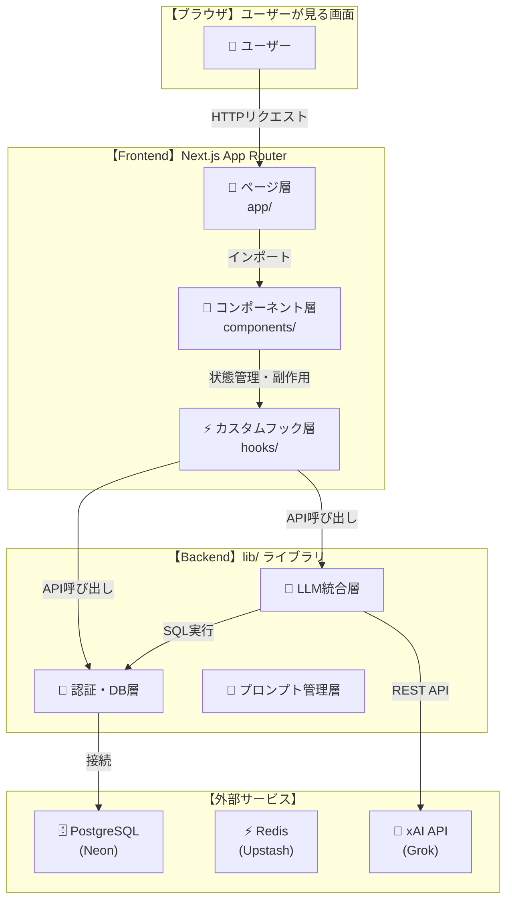

### 図の説明

| レイヤー | 役割 | 主要ディレクトリ |
|---------|------|----------------|
| Frontend | ユーザーインターフェース | `app/`, `components/`, `hooks/` |
| Backend | ビジネスロジック | `lib/` |
| 外部サービス | データ永続化・AI処理 | PostgreSQL, Redis, xAI API |

---

## 2. レイヤー構成詳細

### 2.1 ページ層（app/）

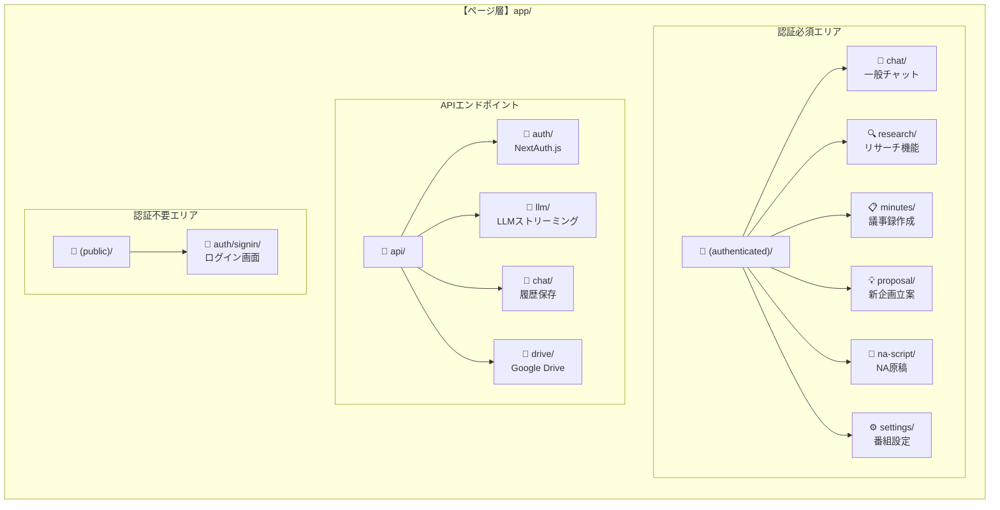

**ファイルの役割:**
- `(authenticated)/layout.tsx` → ログイン必須。未ログイン時は/signinへリダイレクト
- `(public)/layout.tsx` → ログイン不要。ログイン画面で使用
- `api/*` → クライアントから呼ばれるバックエンドAPI

---

### 2.2 コンポーネント層（components/）

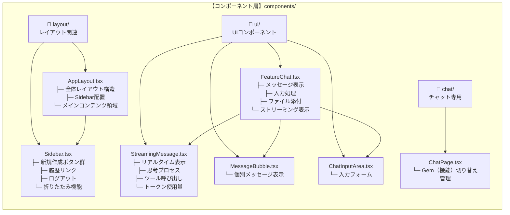

**ファイルの役割:**
- `AppLayout.tsx` → 認証済みページの共通レイアウト（Sidebar + メイン領域）
- `Sidebar.tsx` → 左側のナビゲーション。新規作成ボタン8つ + 履歴 + ログアウト
- `FeatureChat.tsx` → 各機能のチャットUI本体。メッセージの表示・入力・保存を担当
- `StreamingMessage.tsx` → AIの返答をリアルタイムで表示。思考プロセスやツール使用状況も表示

---

### 2.3 カスタムフック層（hooks/）

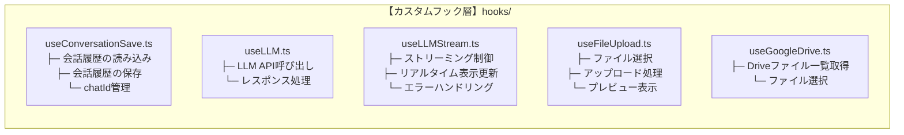

**ファイルの役割:**
- `useConversationSave.ts` → チャット履歴の保存と読み込みを担当
- `useLLMStream.ts` → AIからのストリーミングレスポンスを管理
- `useFileUpload.ts` → ファイル添付機能
- `useGoogleDrive.ts` → Google Drive連携

---

### 2.4 バックエンド層（lib/）

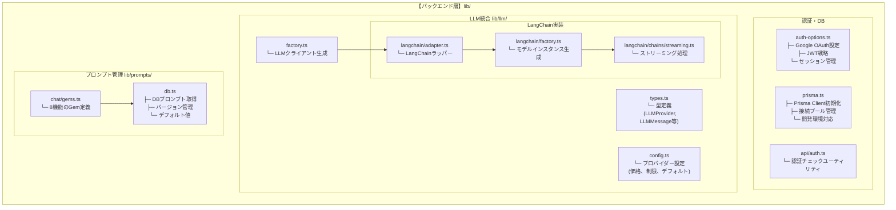

**ファイルの役割:**
- `auth-options.ts` → NextAuth.jsの設定。Google OAuth、JWT戦略、セッション管理
- `prisma.ts` → データベース接続。開発環境でのホットリロード対応
- `lib/llm/factory.ts` → LLMクライアントを生成するファクトリ
- `lib/llm/langchain/*.ts` → LangChainを使ったLLM連携実装
- `lib/prompts/db.ts` → データベース管理のプロンプトを取得・更新
- `lib/chat/gems.ts` → 8つの機能別チャット（Gem）の定義

---

## 3. 認証フロー

### 3.1 シーケンス図

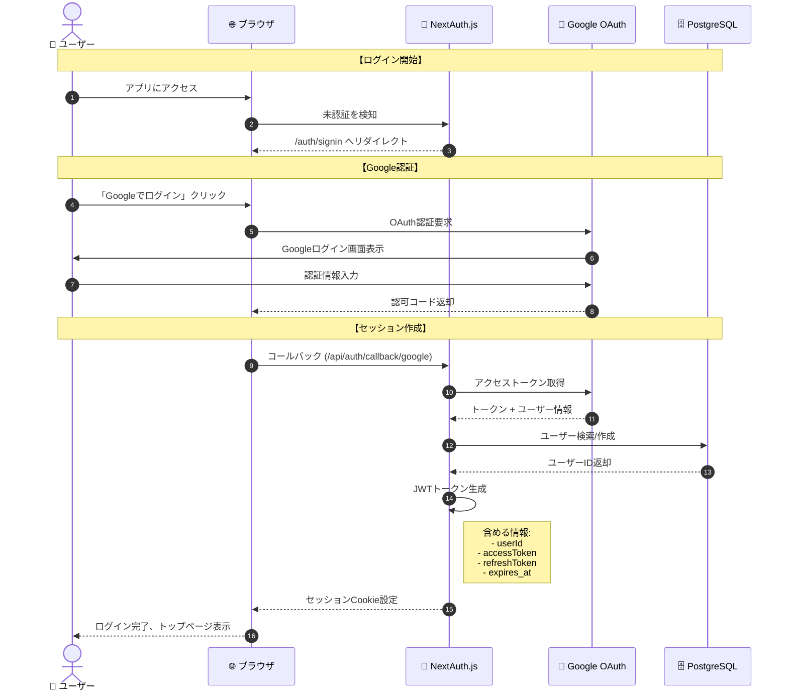

### 3.2 認証状態の遷移

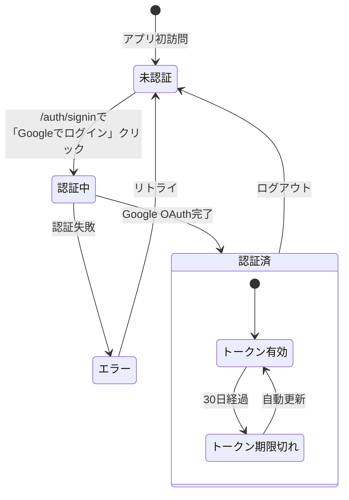

---

## 4. チャット機能の流れ

### 4.1 全体フロー概要

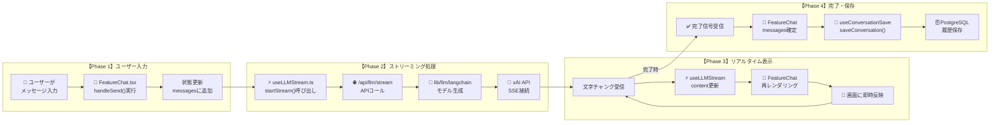

---

### 4.2 詳細シーケンス：メッセージ送信からDB保存まで

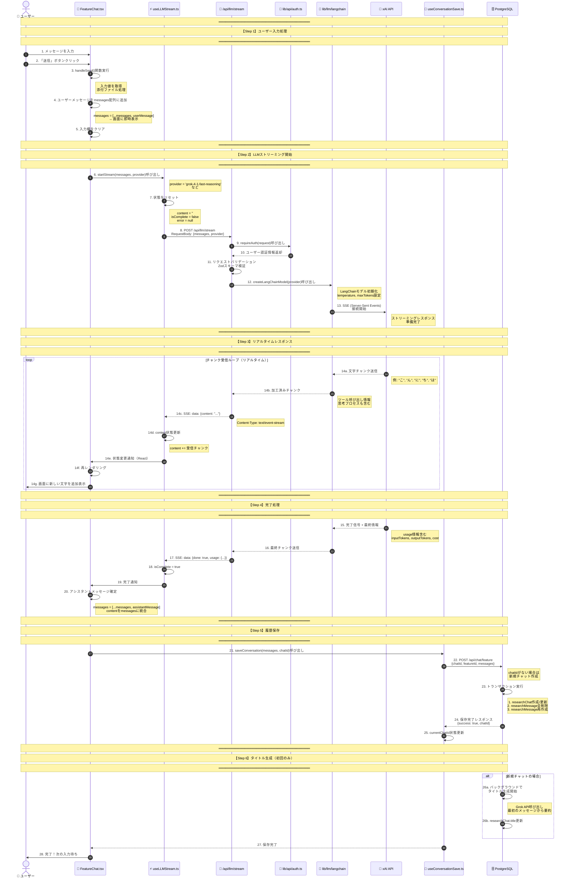

---

### 4.3 FeatureChatコンポーネントの内部構造

#### 【変更前】複雑なテキストを含むバージョン

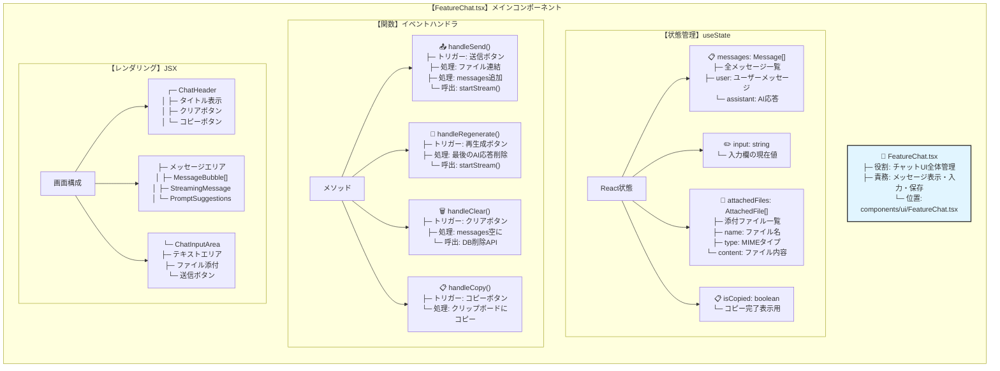

#### 【変更後】シンプルなサブグラフ版

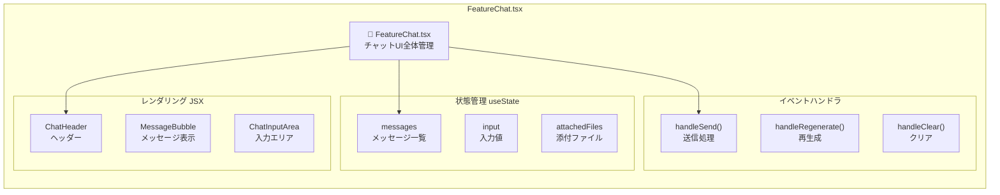

#### 【変更後】詳細は表形式で別記

| カテゴリ | 名前 | 型/戻り値 | 説明 |
|---------|------|----------|------|
| **状態** | `messages` | `Message[]` | 全メッセージ一覧（user/assistant） |
| **状態** | `input` | `string` | 入力欄の現在値 |
| **状態** | `attachedFiles` | `AttachedFile[]` | 添付ファイル（name, type, content） |
| **状態** | `isCopied` | `boolean` | コピー完了表示用 |
| **関数** | `handleSend()` | `void` | 送信ボタンクリック時。ファイル連結→messages追加→startStream()呼出 |
| **関数** | `handleRegenerate()` | `void` | 再生成ボタン。最後のAI応答削除→startStream()呼出 |
| **関数** | `handleClear()` | `void` | クリアボタン。messages空に→DB削除API呼出 |
| **関数** | `handleCopy()` | `void` | コピーボタン。クリップボードにコピー |
| **UI** | `ChatHeader` | コンポーネント | タイトル表示、クリア/コピーボタン |
| **UI** | `MessageBubble` | コンポーネント | 個別メッセージ表示 |
| **UI** | `StreamingMessage` | コンポーネント | AIのリアルタイム応答表示 |
| **UI** | `ChatInputArea` | コンポーネント | テキストエリア、ファイル添付、送信ボタン |

---

### 4.4 useLLMStreamフックの詳細

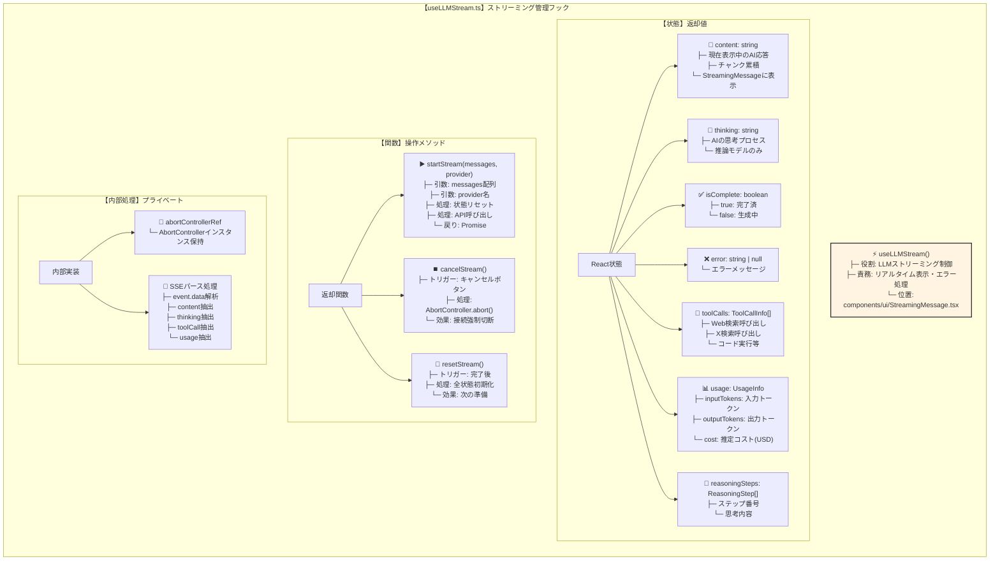

---

### 4.5 useConversationSaveフックの詳細

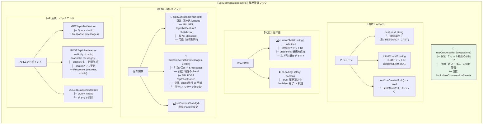

---

### 4.6 コンポーネント・フック間のデータフロー

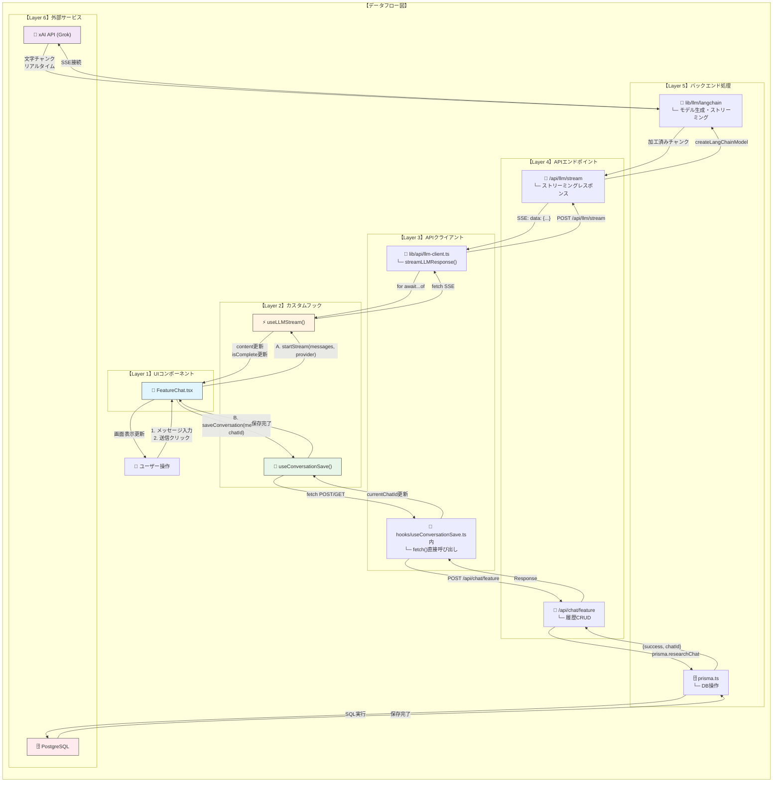

---

### 4.7 状態遷移図：メッセージのライフサイクル

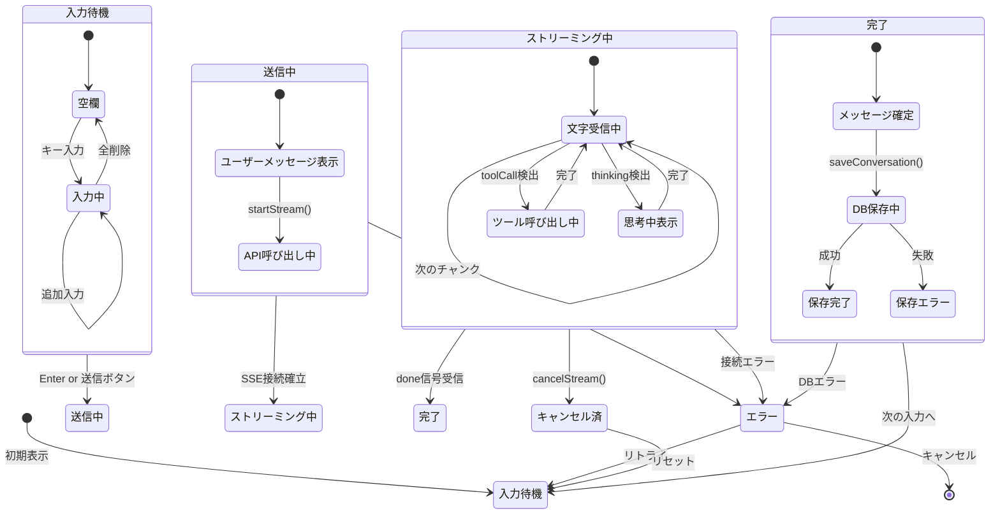

---

### 4.8 主要ファイルの対応関係まとめ

| レイヤー | ファイルパス | 役割 | 主な関数/状態 |
|---------|-------------|------|-------------|
| **UI** | `components/ui/FeatureChat.tsx` | チャット画面全体 | `messages`, `input`, `handleSend()` |
| **UI** | `components/ui/StreamingMessage.tsx` | ストリーミング表示 | `useLLMStream()`フック含む |
| **UI** | `components/ui/MessageBubble.tsx` | 個別メッセージ | 表示専用 |
| **Hook** | `hooks/useConversationSave.ts` | 履歴管理 | `currentChatId`, `saveConversation()` |
| **API** | `app/api/llm/stream/route.ts` | LLMストリーミングAPI | `POST`ハンドラ |
| **API** | `app/api/chat/feature/route.ts` | 履歴CRUD API | `GET`, `POST`, `DELETE` |
| **Lib** | `lib/llm/langchain/factory.ts` | LangChainモデル生成 | `createLangChainModel()` |
| **Lib** | `lib/llm/langchain/chains/streaming.ts` | ストリーミング実行 | `executeStreamingChat()` |
| **Lib** | `lib/api/llm-client.ts` | APIクライアント | `streamLLMResponse()` |

---

## 5. Gem（機能別チャット）システム

### 5.1 Gemとは

Gem = 特定の用途に特化したチャット機能（GeminiのGemと同様）

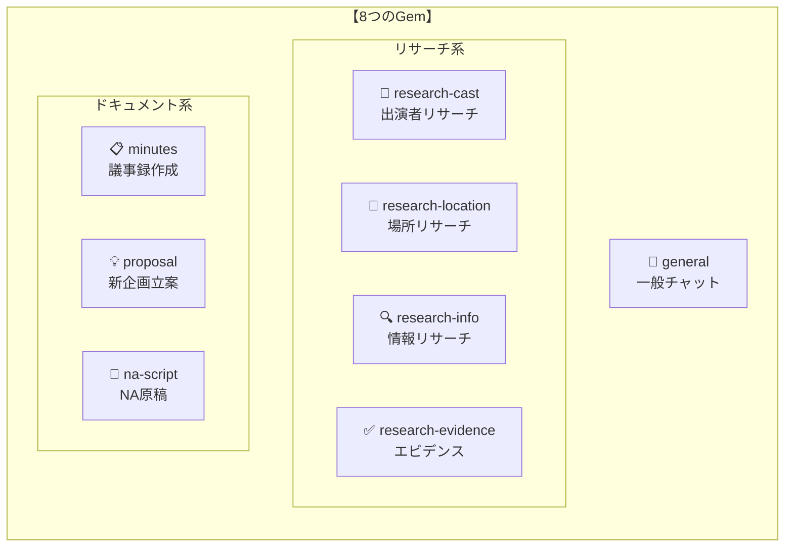

### 5.2 Gemの構造

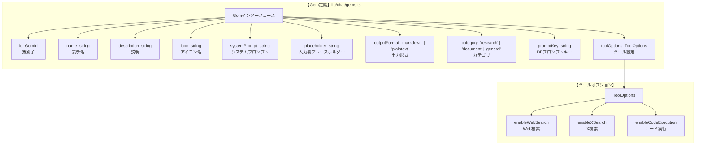

### 5.3 各Gemのツール設定

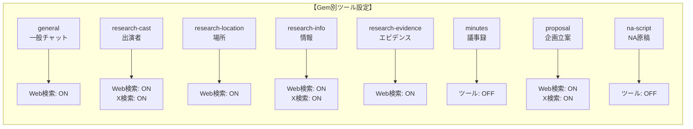

### 5.4 プロンプト管理フロー

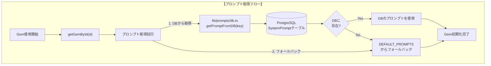

---

## 6. コンポーネント階層

### 6.1 ページ構成

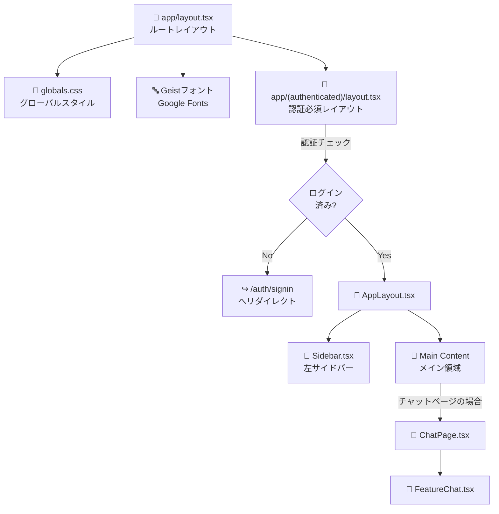

### 6.2 FeatureChatの内部構造

```mermaid
graph TB
    subgraph "【FeatureChat.tsx】内部構造"
        FC["FeatureChat"]

        FC --> HEADER["┌─ ChatHeader.tsx<br/>│  ├─ タイトル表示<br/>│  ├─ コピー/クリアボタン<br/>│  └─ Wordエクスポート"]

        FC --> MESSAGES["├─ メッセージ表示エリア<br/>│  ├─ 履歴メッセージ<br/>│  │   └─ MessageBubble.tsx<br/>│  ├─ ストリーミング中<br/>│  │   └─ StreamingMessage.tsx<br/>│  ├─ プロンプトサジェスト<br/>│  │   └─ PromptSuggestions.tsx<br/>│  └─ 再生成ボタン"]

        FC --> INPUT["└─ ChatInputArea.tsx<br/>   ├─ テキスト入力<br/>   ├─ ファイル添付<br/>   └─ 送信ボタン"]
    end

    subgraph "【MessageBubble.tsx】"
        BUBBLE["MessageBubble"]
        BUBBLE --> AVATAR["アバター<br/>ユーザー/AI"]
        BUBBLE --> CONTENT["コンテンツ<br/>MarkdownRenderer"]
        BUBBLE --> META["メタ情報<br/>時刻/プロバイダー"]
    end

    subgraph "【StreamingMessage.tsx】"
        STREAM["StreamingMessage"]
        STREAM --> TOOL["ツール呼び出し表示"]
        STREAM --> THINK["思考プロセス表示"]
        STREAM --> TEXT["生成中テキスト"]
        STREAM --> USAGE["トークン使用量"]
    end

    MESSAGES --> BUBBLE
    MESSAGES --> STREAM
```

---

## 7. データベーススキーマ

### 7.1 主要テーブル関係

```mermaid
erDiagram
    USER ||--o{ RESEARCH_CHAT : "1人が複数のチャット"
    USER ||--o{ MEETING_NOTE : "1人が複数の議事録"
    USER ||--o{ TRANSCRIPT : "1人が複数の文字起こし"
    USER ||--o{ USAGE_LOG : "1人が複数の使用ログ"
    USER ||--o{ PROGRAM_SETTINGS : "1人が1つの設定"
    USER ||--o{ GROK_TOOL_SETTINGS : "1人が1つの設定"
    USER ||--o{ ACCOUNT : "1人が複数の認証"
    USER ||--o{ SESSION : "1人が複数のセッション"

    RESEARCH_CHAT ||--o{ RESEARCH_MESSAGE : "1チャットが複数のメッセージ"

    USER {
        string id PK "UUID"
        string email UK "メールアドレス"
        string name "表示名"
        string image "プロフィール画像URL"
        string role "ADMIN or USER"
        datetime emailVerified "メール認証日時"
        string googleId UK "Google ID"
        datetime createdAt "作成日時"
        datetime updatedAt "更新日時"
    }

    RESEARCH_CHAT {
        string id PK "UUID"
        string userId FK "ユーザーID"
        string agentType "PEOPLE/LOCATION/INFO/EVIDENCE"
        string title "チャットタイトル"
        enum llmProvider "使用したLLM"
        json results "結果JSON"
        datetime createdAt "作成日時"
        datetime updatedAt "更新日時"
    }

    RESEARCH_MESSAGE {
        string id PK "UUID"
        string chatId FK "チャットID"
        string role "USER/ASSISTANT/SYSTEM"
        string content "メッセージ内容"
        string thinking "思考プロセス"
        datetime createdAt "作成日時"
    }

    MEETING_NOTE {
        string id PK "UUID"
        string userId FK "ユーザーID"
        string type "MEETING/INTERVIEW"
        string rawText "元テキスト"
        string formattedText "整形済みテキスト"
        enum llmProvider "使用したLLM"
        string status "DRAFT/FORMATTING/COMPLETED"
        datetime createdAt "作成日時"
        datetime updatedAt "更新日時"
    }

    TRANSCRIPT {
        string id PK "UUID"
        string userId FK "ユーザーID"
        string rawText "元テキスト"
        string formattedText "整形済みテキスト"
        enum llmProvider "使用したLLM"
        datetime createdAt "作成日時"
        datetime updatedAt "更新日時"
    }

    USAGE_LOG {
        string id PK "UUID"
        string userId FK "ユーザーID"
        enum provider "使用したプロバイダー"
        int inputTokens "入力トークン数"
        int outputTokens "出力トークン数"
        float cost "コスト(USD)"
        json metadata "追加情報"
        datetime createdAt "作成日時"
    }

    PROGRAM_SETTINGS {
        string id PK "UUID"
        string userId FK UK "ユーザーID(一意)"
        string programInfo "番組情報"
        string pastProposals "過去の企画案"
        datetime updatedAt "更新日時"
    }

    GROK_TOOL_SETTINGS {
        string id PK "UUID"
        string userId FK UK "ユーザーID(一意)"
        json settings "ツール設定JSON"
        datetime updatedAt "更新日時"
    }

    ACCOUNT {
        string id PK "UUID"
        string userId FK "ユーザーID"
        string type "oauth等"
        string provider "google等"
        string providerAccountId "プロバイダー側ID"
        string refresh_token "リフレッシュトークン"
        string access_token "アクセストークン"
        int expires_at "有効期限"
    }

    SESSION {
        string id PK "UUID"
        string sessionToken UK "セッショントークン"
        string userId FK "ユーザーID"
        datetime expires "有効期限"
    }
```

### 7.2 インデックス設計

```mermaid
graph LR
    subgraph "【インデックス設計】パフォーマンス最適化"
        I1["User.email<br/>UK"]
        I2["User.googleId<br/>UK"]

        I3["ResearchChat<br/>(userId, agentType, createdAt)<br/>複合インデックス"]
        I4["ResearchChat<br/>(userId, createdAt)"]

        I5["ResearchMessage<br/>(chatId, createdAt)"]

        I6["MeetingNote<br/>(userId, status, createdAt)<br/>複合インデックス"]

        I7["UsageLog<br/>(userId, provider, createdAt)<br/>複合インデックス"]
        I8["UsageLog<br/>(createdAt, cost)"]

        I9["AppLog<br/>(level, createdAt)"]
        I10["AppLog<br/>(category, createdAt)"]
    end
```

---

## 8. ファイル依存関係

### 8.1 認証系ファイルの関係

```mermaid
graph TB
    subgraph "【認証系】ファイル依存関係"
        MIDDLEWARE["middleware.ts<br/>ミドルウェア"]

        AUTH_ROUTE["app/api/auth/[...nextauth]/route.ts<br/>認証APIエンドポイント"]

        AUTH_OPTS["lib/auth-options.ts<br/>認証設定"]

        PRISMA["lib/prisma.ts<br/>DB接続"]

        ENV[".env.local<br/>環境変数"]
    end

    MIDDLEWARE -->|"認証チェック<br/>next-auth.session-token<br/>Cookie確認"| AUTH_ROUTE

    AUTH_ROUTE -->|"import<br/>authOptions"| AUTH_OPTS

    AUTH_OPTS -->|"import<br/>PrismaAdapter"| PRISMA
    AUTH_OPTS -->|"参照<br/>GOOGLE_CLIENT_ID<br/>GOOGLE_CLIENT_SECRET"| ENV

    PRISMA -->|"参照<br/>DATABASE_URL"| ENV

    style ENV fill:#f9f,stroke:#333
    style AUTH_OPTS fill:#bbf,stroke:#333
```

### 8.2 LLM系ファイルの関係

```mermaid
graph TB
    subgraph "【LLM系】ファイル依存関係"
        STREAM_API["app/api/llm/stream/route.ts<br/>ストリーミングAPI"]

        LLM_FACTORY["lib/llm/factory.ts<br/>LLMファクトリ"]

        LC_ADAPTER["lib/llm/langchain/adapter.ts<br/>LangChainアダプター"]

        LC_FACTORY["lib/llm/langchain/factory.ts<br/>LangChainモデル生成"]

        LC_STREAM["lib/llm/langchain/chains/streaming.ts<br/>ストリーミング処理"]

        LLM_TYPES["lib/llm/types.ts<br/>型定義"]

        LLM_CONFIG["lib/llm/config.ts<br/>設定"]

        AUTH_UTIL["lib/api/auth.ts<br/>認証ユーティリティ"]
    end

    STREAM_API -->|"import<br/>createLangChainModel"| LLM_FACTORY
    STREAM_API -->|"import<br/>requireAuth"| AUTH_UTIL

    LLM_FACTORY -->|"import<br/>createLangChainClient"| LC_ADAPTER

    LC_ADAPTER -->|"import<br/>LLMProvider型"| LLM_TYPES
    LC_ADAPTER -->|"import<br/>PROVIDER_CONFIG"| LLM_CONFIG

    LC_ADAPTER -->|"import<br/>createLangChainModel"| LC_FACTORY

    LC_FACTORY -->|"import<br/>executeStreamingChat"| LC_STREAM

    style LLM_TYPES fill:#bfb,stroke:#333
    style LLM_CONFIG fill:#bfb,stroke:#333
```

### 8.3 チャット機能ファイルの関係

```mermaid
graph TB
    subgraph "【チャット機能】ファイル依存関係"
        CHAT_PAGE["app/chat/page.tsx<br/>チャットページ"]

        CHAT_COMP["components/chat/ChatPage.tsx<br/>チャットコンポーネント"]

        FEATURE["components/ui/FeatureChat.tsx<br/>機能別チャットUI"]

        USE_CONV["hooks/useConversationSave.ts<br/>履歴保存フック"]

        USE_STREAM["components/ui/StreamingMessage.tsx<br/>useLLMStreamフック"]

        CHAT_API["app/api/chat/feature/route.ts<br/>チャットAPI"]

        LLM_CLIENT["lib/api/llm-client.ts<br/>LLMクライアント"]

        GEMS["lib/chat/gems.ts<br/>Gem定義"]

        PROMPT_DB["lib/prompts/db.ts<br/>プロンプトDB"]
    end

    CHAT_PAGE -->|"import<br/>ChatPage"| CHAT_COMP

    CHAT_COMP -->|"import<br/>FeatureChat"| FEATURE
    CHAT_COMP -->|"import<br/>getGemById"| GEMS

    FEATURE -->|"use<br/>useConversationSave"| USE_CONV
    FEATURE -->|"use<br/>useLLMStream"| USE_STREAM

    USE_CONV -->|"fetch<br/>POST /api/chat/feature"| CHAT_API

    USE_STREAM -->|"import<br/>streamLLMResponse"| LLM_CLIENT

    GEMS -->|"import<br/>getPromptFromDB"| PROMPT_DB

    style FEATURE fill:#bbf,stroke:#333
    style GEMS fill:#fbf,stroke:#333
```

### 8.4 プロンプト管理ファイルの関係

```mermaid
graph TB
    subgraph "【プロンプト管理】ファイル依存関係"
        GEMS["lib/chat/gems.ts<br/>Gem定義"]

        PROMPT_INDEX["lib/prompts/index.ts<br/>統合エクスポート"]

        PROMPT_DB["lib/prompts/db.ts<br/>DB管理（メイン）"]

        PRISMA["lib/prisma.ts<br/>DB接続"]

        ADMIN_API["app/api/admin/prompts/route.ts<br/>管理API"]

        CHAT_API["app/api/chat/feature/route.ts<br/>チャットAPI"]
    end

    GEMS -->|"import<br/>DEFAULT_PROMPTS等"| PROMPT_INDEX

    PROMPT_INDEX -->|"re-export<br/>from './db'"| PROMPT_DB

    PROMPT_DB -->|"import<br/>prisma"| PRISMA

    ADMIN_API -->|"import<br/>プロンプト操作関数"| PROMPT_DB

    CHAT_API -->|"import<br/>createLLMClient"| LLM
    CHAT_API -->|"バックグラウンドで<br/>タイトル生成"| GEMS

    style PROMPT_DB fill:#fbb,stroke:#333
    style GEMS fill:#fbf,stroke:#333
```

---

## 9. 関連ドキュメント

- [システムアーキテクチャ](./system-architecture.md)
- [API仕様書](../api-integration/api-specification.md)
- [データベーススキーマ](../api-integration/database-schema.md)
- [開発ワークフロー](../../guides/development/workflow-standards.md)
