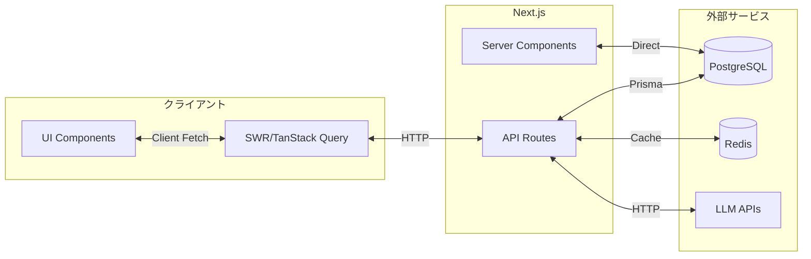

# データフロー仕様

> **データの流れとフェッチ戦略**
> 
> **最終更新**: 2026-02-20 13:10

## データフロー概略



## フェッチ戦略

| 戦略 | 用途 | 実装 |
|-----|------|------|
| **Server Fetch** | 初期データ、SEO重要 | Server Componentで直接DB/API |
| **Client Fetch** | インタラクティブデータ | SWR / TanStack Query |
| **Static** | 変更頻度低いデータ | `generateStaticParams` |
| **Streaming** | LLMレスポンス | Server-Sent Events |

## Server/Client境界

### Server Component（推奨）

```typescript
// データ取得はServer Componentで
async function ResearchPage() {
  const history = await getChatHistory('research-cast');
  return <ResearchClient initialData={history} />;
}
```

### Client Component

```typescript
"use client";

// インタラクションはClient Componentで
function ResearchClient({ initialData }) {
  const [messages, setMessages] = useState(initialData);
  
  const sendMessage = async (content: string) => {
    const response = await fetch('/api/research', {
      method: 'POST',
      body: JSON.stringify({ query: content }),
    });
    // ...
  };
}
```

## キャッシュ戦略

### レイヤー別キャッシュ

| レイヤー | 方法 | TTL |
|---------|------|-----|
| ブラウザ | SWRキャッシュ | 5分 |
| CDN | Vercel Edge | 1時間 |
| API | Next.js fetch cache | 指定なし（force-cache） |
| DB | Prismaクエリキャッシュ | なし |
| Redis | LLMレスポンス | 24時間 |

### キャッシュ無効化

```typescript
// SWRの再検証
const { mutate } = useSWR('/api/chat/history');
mutate(); // 手動再検証

// Next.jsキャッシュ
fetch('/api/data', { next: { revalidate: 60 } });
```

## エラーハンドリング

| フェーズ | エラー | 対応 |
|---------|--------|------|
| Server Fetch | DB接続エラー | error.tsxで表示 |
| Client Fetch | ネットワークエラー | リトライ + トースト通知 |
| Streaming | LLMエラー | エラーメッセージをストリームに挿入 |

詳細: [error-handling.md](./error-handling.md)

## 関連ファイル

- `lib/prisma.ts` - DB接続
- `lib/cache/redis.ts` - Redisキャッシュ
- [performance.md](./performance.md) - パフォーマンス最適化
