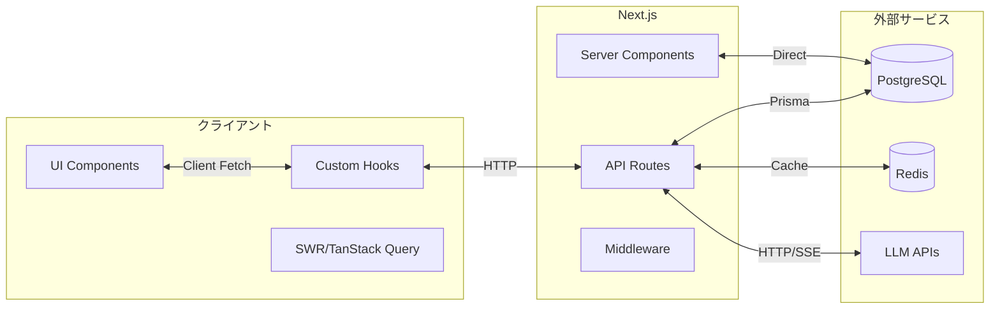

# データフロー仕様

> **データの流れとフェッチ戦略**
> 
> **最終更新**: 2026-02-22 00:17

---

## データフロー概略



---

## フェッチ戦略

| 戦略 | 用途 | 実装 |
|-----|------|------|
| **Server Fetch** | 初期データ、SEO重要 | Server Componentで直接DB/API |
| **Client Fetch** | インタラクティブデータ | SWR / TanStack Query |
| **Static** | 変更頻度低いデータ | `generateStaticParams` |
| **Streaming** | LLMレスポンス | Server-Sent Events (SSE) |
| **Server Actions** | フォーム送信、ミューテーション | Next.js Server Actions |

---

## Server/Client境界

### Server Component（推奨）

```typescript
// データ取得はServer Componentで
async function ResearchPage() {
  const history = await getChatHistory('research-cast');
  return <ResearchClient initialData={history} />;
}
```

### Client Component

```typescript
"use client";

// インタラクションはClient Componentで
function ResearchClient({ initialData }) {
  const [messages, setMessages] = useState(initialData);
  
  const sendMessage = async (content: string) => {
    const response = await fetch('/api/chat', {
      method: 'POST',
      body: JSON.stringify({ featureId: 'research-cast', message: content }),
    });
    // ...
  };
}
```

### Server Actions

```typescript
// app/actions/chat.ts
'use server';

export async function saveMessage(formData: FormData) {
  const message = formData.get('message');
  // サーバー側で直接DB操作
  await prisma.message.create({ data: { content: message } });
  revalidatePath('/chat');
}
```

---

## キャッシュ戦略

### レイヤー別キャッシュ

| レイヤー | 方法 | TTL |
|---------|------|-----|
| ブラウザ | SWRキャッシュ | 5分 |
| CDN | Vercel Edge | 1時間 |
| API | Next.js fetch cache | 指定なし（force-cache） |
| DB | Prismaクエリキャッシュ | なし |
| Redis | LLMレスポンス、レート制限 | 24時間 / 可変 |

### キャッシュ無効化

```typescript
// SWRの再検証
const { mutate } = useSWR('/api/chat/history');
mutate(); // 手動再検証

// Next.jsキャッシュ
fetch('/api/data', { next: { revalidate: 60 } });

// タグベース再検証
revalidateTag('chat-history');
```

---

## ストリーミング（SSE）

### LLMレスポンスのストリーミング

```typescript
// app/api/chat/stream/route.ts
export async function POST(request: Request) {
  const { messages, model } = await request.json();
  
  const stream = await createLLMStream(messages, model);
  
  return new Response(stream, {
    headers: {
      'Content-Type': 'text/event-stream',
      'Cache-Control': 'no-cache',
    },
  });
}
```

### クライアント側の処理

```typescript
// hooks/use-llm.ts
const eventSource = new EventSource('/api/chat/stream');
eventSource.onmessage = (event) => {
  const data = JSON.parse(event.data);
  setStreamingContent((prev) => prev + data.content);
};
```

---

## エラーハンドリング

| フェーズ | エラー | 対応 |
|---------|--------|------|
| Server Fetch | DB接続エラー | error.tsxで表示 |
| Client Fetch | ネットワークエラー | リトライ + トースト通知 |
| Streaming | LLMエラー | エラーメッセージをストリームに挿入 |
| Server Action | バリデーションエラー | useFormStateで表示 |

詳細: [error-handling.md](../operations/error-handling.md)

---

## データフロー例

### チャットメッセージ送信

```
1. ユーザー入力
   ↓
2. Client Component: use-llm.ts
   - メッセージ状態更新
   - APIリクエスト送信
   ↓
3. API Route: /api/chat
   - 認証チェック（Middleware）
   - レート制限チェック
   ↓
4. Service Layer: lib/llm/
   - LLM Provider選択
   - プロンプト構築
   ↓
5. LLM API呼び出し
   - Streamingレスポンス
   ↓
6. クライアントへSSE返却
   ↓
7. UI更新（StreamingMessage）
   ↓
8. 会話履歴保存（DB）
```

### ファイルアップロード

```
1. ファイル選択（FileUpload.tsx）
   ↓
2. Client: useFileUpload.ts
   - バリデーション
   - Base64エンコード
   ↓
3. API Route: /api/upload
   - ファイルサイズチェック
   - ストレージ保存
   ↓
4. レスポンス返却（URL）
   ↓
5. チャットメッセージに添付
```

---

## 関連ファイル

- `lib/prisma.ts` - DB接続
- `lib/cache/redis.ts` - Redisキャッシュ
- `hooks/use-llm.ts` - LLM通信フック
- `hooks/useFileUpload.ts` - ファイルアップロード
- `middleware.ts` - 認証・レート制限
- [performance.md](../operations/performance.md) - パフォーマンス最適化
- [error-handling.md](../operations/error-handling.md) - エラーハンドリング詳細
