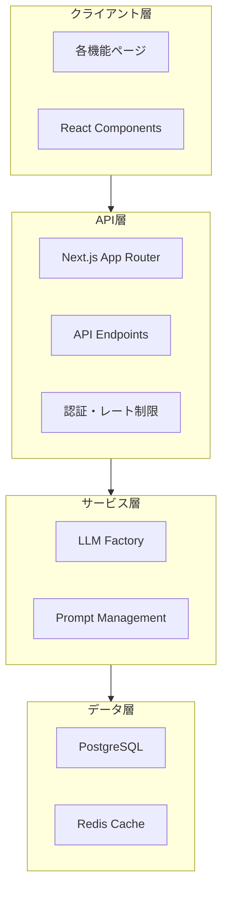

# システムアーキテクチャ

> **全体構成と設計原則**

## 概要

AI HubはNext.jsベースの統合プラットフォーム。複数LLMを統合し制作業務を支援。

## システム構成図



## レイヤードアーキテクチャ

```
┌─────────────────────────────────────┐
│  Presentation Layer                 │  UI Components
│  - React Server/Client Components   │
├─────────────────────────────────────┤
│  API Layer                          │  Next.js API Routes
│  - REST API Endpoints               │
│  - Middleware (Auth, Rate Limit)    │
├─────────────────────────────────────┤
│  Service Layer                      │  Business Logic
│  - LLM Factory Pattern              │
│  - Prompt Management                │
├─────────────────────────────────────┤
│  Data Access Layer                  │  Prisma / Redis
│  - Database Operations              │
│  - Cache Operations                 │
└─────────────────────────────────────┘
```

## 主要設計パターン

### 1. Factory Pattern (LLM)

複数LLMを統一インターフェースで扱う。

詳細: [llm-integration.md](./llm-integration.md)

### 2. FeatureChat Pattern

各機能で共通のチャットUIを使用。

```typescript
interface FeatureChatProps {
  featureId: string;
  systemPrompt: string;
  // ...
}
```

### 3. Prompt Management

システムプロンプトを `lib/prompts/` で集中管理。

## ページ構成

| ページ | パス | 機能 |
|--------|------|------|
| 出演者リサーチ | `/research/cast` | 出演者候補提案 |
| 場所リサーチ | `/research/location` | ロケ地調査 |
| 情報リサーチ | `/research/info` | 情報収集・整理 |
| エビデンスリサーチ | `/research/evidence` | 情報検証 |
| 議事録作成 | `/minutes` | 議事録作成 |
| 新企画立案 | `/proposal` | 企画提案 |
| 文字起こし変換 | `/transcript` | テキスト整形 |
| NA原稿作成 | `/transcript/na` | ナレーション原稿 |
| 番組設定 | `/settings/program` | 番組情報管理 |

## 関連仕様

| 項目 | 参照先 |
|-----|--------|
| データモデル詳細 | [database-schema.md](./database-schema.md) |
| LLM統合詳細 | [llm-integration.md](./llm-integration.md) |
| 認証・認可 | [authentication.md](./authentication.md) |
| セキュリティ | [security.md](./security.md) |
| パフォーマンス | [performance.md](./performance.md) |
| エラーハンドリング | [error-handling.md](./error-handling.md) |
| ログ・監視 | [logging-monitoring.md](./logging-monitoring.md) |
