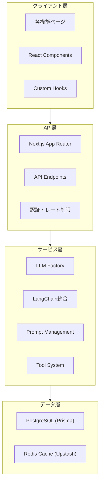

# システムアーキテクチャ

> **全体構成と設計原則**
> 
> **最終更新**: 2026-02-22 00:17

---

## 概要

AI HubはNext.js 16 + React 19ベースの統合プラットフォーム。複数LLM（OpenAI、Anthropic、Google Gemini、Grok）を統合し、制作業務を支援。

---

## システム構成図



---

## レイヤードアーキテクチャ

```
┌─────────────────────────────────────┐
│  Presentation Layer                 │  UI Components
│  - React Server/Client Components   │  - Server Components (デフォルト)
│  - Custom Hooks                     │  - Client Components (インタラクション)
├─────────────────────────────────────┤
│  API Layer                          │  Next.js API Routes
│  - REST API Endpoints               │  - Route Handlers (app/api/)
│  - Middleware (Auth, Rate Limit)    │  - Streaming Response
├─────────────────────────────────────┤
│  Service Layer                      │  Business Logic
│  - LLM Factory Pattern              │  - lib/llm/
│  - LangChain Integration            │  - lib/llm/langchain/
│  - Prompt Management                │  - lib/prompts/
│  - Tool System                      │  - lib/tools/
├─────────────────────────────────────┤
│  Data Access Layer                  │  Prisma / Redis
│  - Database Operations              │  - lib/prisma.ts
│  - Cache Operations                 │  - lib/cache/redis.ts
└─────────────────────────────────────┘
```

---

## 主要設計パターン

### 1. Factory Pattern (LLM)

複数LLMを統一インターフェースで扱う。

```typescript
// lib/llm/factory.ts
const provider = createLLMProvider('openai', config);
const response = await provider.generate(messages);
```

詳細: [llm-integration.md](../api-integration/llm-integration.md)

### 2. LangChain Integration

Agentic AI機能を実現するためのLangChain統合。

```
lib/llm/langchain/
├── agents/       # Agent実装
├── chains/       # Chain定義
├── memory/       # メモリ管理
├── prompts/      # プロンプトテンプレート
├── rag/          # RAG実装
└── tools/        # ツール定義
```

### 3. FeatureChat Pattern

各機能で共通のチャットUIを使用。

```typescript
interface FeatureChatProps {
  featureId: string;
  systemPrompt: string;
  model?: string;
  enableStreaming?: boolean;
}
```

### 4. Prompt Management

システムプロンプトを `lib/prompts/` で集中管理。

---

## ディレクトリ構成

```
app/
├── (authenticated)/     # 認証必須ルート
│   ├── chat/           # チャット機能
│   ├── research/       # リサーチ機能
│   ├── meeting-notes/  # 議事録機能
│   ├── transcripts/    # 書き起こし機能
│   ├── minutes/        # 議事録作成
│   ├── proposal/       # 企画提案
│   ├── na-script/      # NA原稿作成
│   └── settings/       # 設定
├── (public)/           # 公開ルート
├── api/                # APIエンドポイント
├── admin/              # 管理画面
└── auth/               # 認証関連

components/
├── ui/                 # shadcn/ui ベース
├── layout/             # レイアウトコンポーネント
├── chat/               # チャット関連
├── agent-thinking/     # エージェント思考表示
├── research/           # リサーチ機能
├── meeting-notes/      # 議事録機能
└── transcripts/        # 書き起こし機能

lib/
├── llm/                # LLM統合
│   └── langchain/      # LangChain実装
├── prompts/            # プロンプト管理
├── chat/               # チャット設定
├── research/           # リサーチ設定
├── settings/           # 設定管理
├── cache/              # キャッシュ
├── tools/              # ツール設定
└── prisma.ts           # DB接続

hooks/                  # カスタムフック
types/                  # 型定義
```

---

## ページ構成

| ページ | パス | 機能 |
|--------|------|------|
| チャット | `/chat` | 汎用チャット |
| 出演者リサーチ | `/research/cast` | 出演者候補提案 |
| 場所リサーチ | `/research/location` | ロケ地調査 |
| 情報リサーチ | `/research/info` | 情報収集・整理 |
| エビデンスリサーチ | `/research/evidence` | 情報検証 |
| 議事録作成 | `/minutes` | 議事録作成 |
| 新企画立案 | `/proposal` | 企画提案 |
| 文字起こし変換 | `/transcripts` | テキスト整形 |
| NA原稿作成 | `/na-script` | ナレーション原稿 |
| 会議メモ | `/meeting-notes` | ファイルアップロードチャット |
| 番組設定 | `/settings/program` | 番組情報管理 |
| 管理画面 | `/admin` | ユーザー・使用量管理 |

---

## 関連仕様

| 項目 | 参照先 |
|-----|--------|
| データモデル詳細 | [database-schema.md](../api-integration/database-schema.md) |
| LLM統合詳細 | [llm-integration.md](../api-integration/llm-integration.md) |
| 認証・認可 | [authentication.md](../api-integration/authentication.md) |
| セキュリティ | [security.md](../operations/security.md) |
| パフォーマンス | [performance.md](../operations/performance.md) |
| エラーハンドリング | [error-handling.md](../operations/error-handling.md) |
| ログ・監視 | [logging-monitoring.md](../operations/logging-monitoring.md) |
| コンポーネント設計 | [component-design.md](./component-design.md) |
| データフロー | [data-flow.md](./data-flow.md) |
| 状態管理 | [state-management.md](./state-management.md) |
