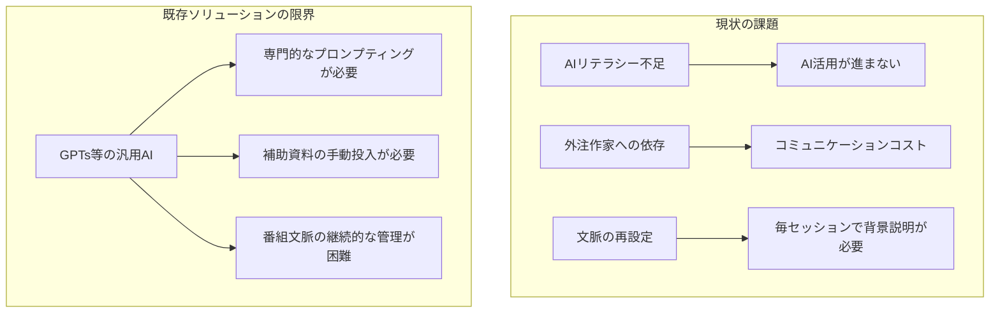
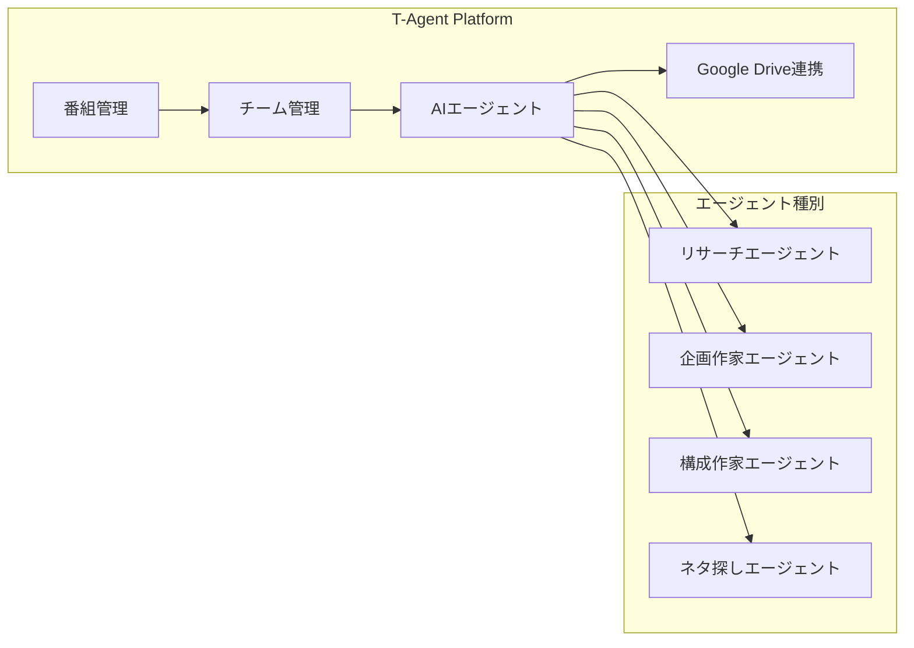
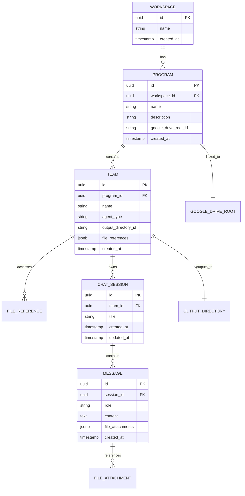
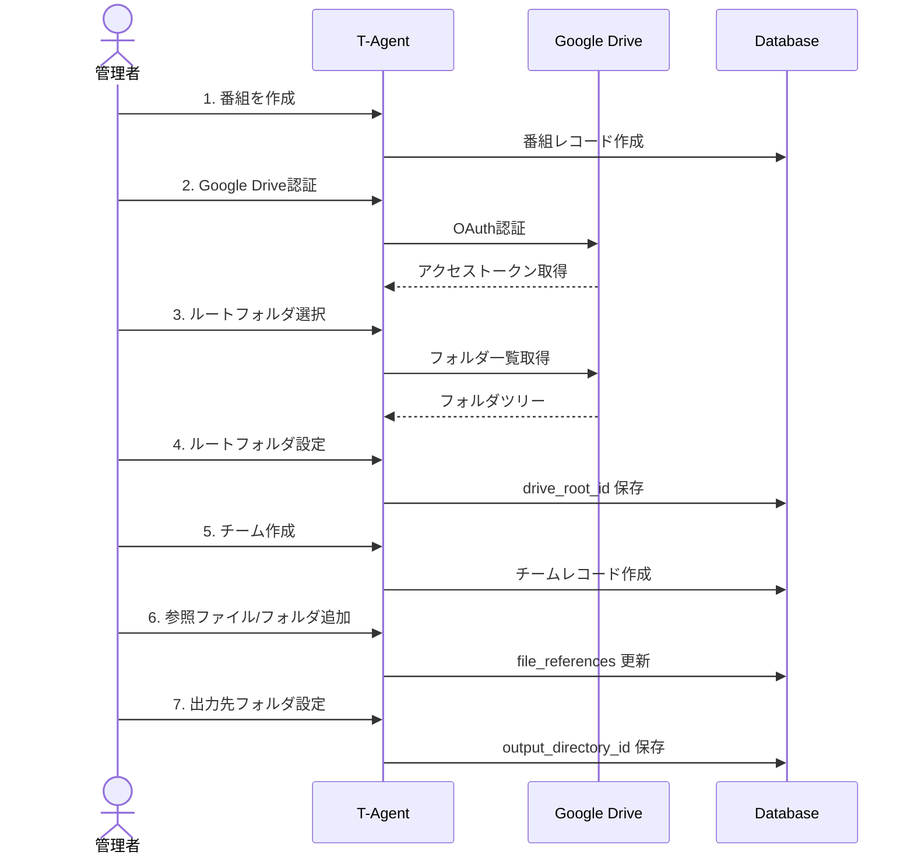
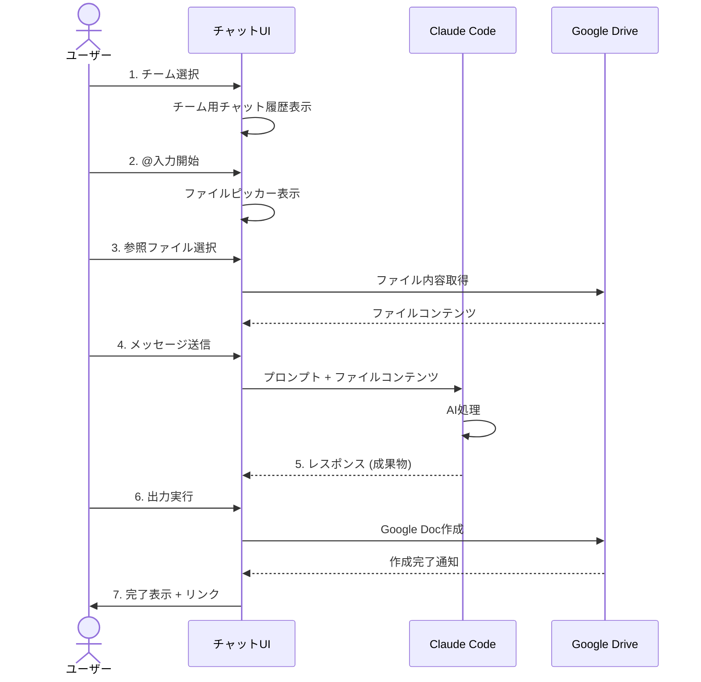
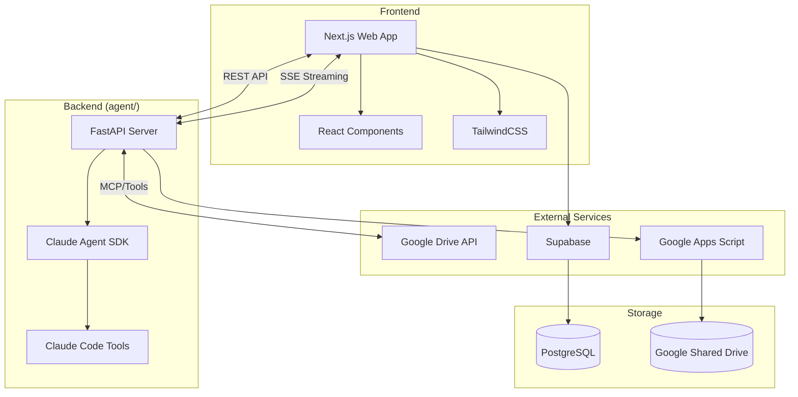
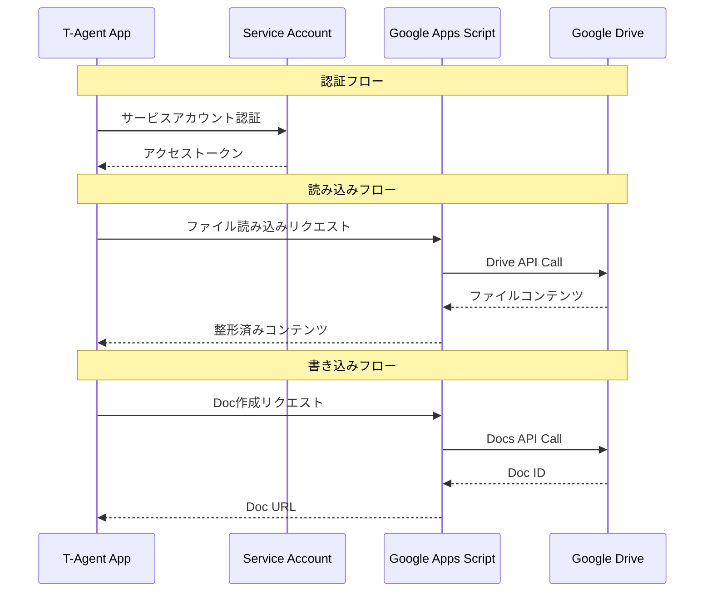
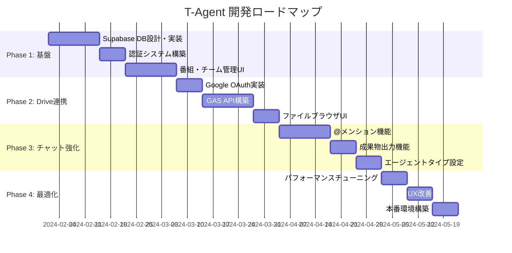

# T-Agent PRD (Product Requirements Document)

## 1. エグゼクティブサマリー

**プロダクト名**: T-Agent (仮称)
**対象ユーザー**: テレビ番組制作会社のスタッフ（ディレクター、AD、構成作家、調査作家等）
**プロダクトカテゴリ**: 業務特化型AIチャットボットプラットフォーム

### ビジョン

番組制作現場における「AIリテラシーの壁」と「非効率な外注コミュニケーション」を解決し、制作スタッフが直接AIエージェントを活用して調査・企画・構成作業を効率化できるプラットフォームを提供する。

---

## 2. 課題と背景

### 2.1 現状の課題



| 課題 | 詳細 |
|------|------|
| **AIリテラシーの壁** | AD・作家等はAI活用の専門家ではなく、効果的なプロンプティングができない |
| **外注コミュニケーションコスト** | 構成作家・調査作家への依頼・確認・修正サイクルが非効率 |
| **文脈の喪失** | GPTs等では毎回番組・企画の背景情報を再設定する必要がある |
| **参照資料の手動管理** | 必要な補助資料を毎回手動でアップロードする負担 |

### 2.2 機会

- 制作現場では既にGoogle共有ドライブでファイル管理を行っている
- 作業の定型化が可能（調査→企画→構成の流れ）
- チーム単位での作業分担が明確

---

## 3. ソリューション概要



### コアバリュー

1. **番組・チーム単位のコンテキスト管理**: 文脈を保持し、毎回の再設定を不要に
2. **Google Drive統合**: 既存のワークフローに自然に統合
3. **役割別エージェント**: 目的に最適化されたAIアシスタント
4. **@メンション式ファイル参照**: 直感的な操作でドライブ内ファイルを参照

---

## 4. 情報アーキテクチャ



### 階層構造

```
Workspace (ワークスペース)
└── Program (番組)
    ├── Google Drive Root (番組ルートディレクトリ)
    └── Team (チーム)
        ├── File References (参照可能ファイル/フォルダ)
        ├── Output Directory (出力先ディレクトリ)
        └── Chat Sessions (チャット履歴)
            └── Messages (メッセージ)
```

---

## 5. ユーザーフロー

### 5.1 初期セットアップフロー



### 5.2 日常利用フロー



### 5.3 エージェントワークフロー例

```mermaid
flowchart TD
    subgraph Phase1[フェーズ1: リサーチ]
        A[リサーチエージェント] --> B[調査資料作成]
        B --> C[Drive出力: 調査レポート.doc]
    end

    subgraph Phase2[フェーズ2: 企画]
        D[企画作家エージェント]
        C -.-> |@参照| D
        D --> E[企画資料作成]
        E --> F[Drive出力: 企画案.doc]
    end

    subgraph Phase3[フェーズ3: 構成]
        G[構成作家エージェント]
        F -.-> |@参照| G
        G --> H[構成資料作成]
        H --> I[Drive出力: 構成台本.doc]
    end

    Phase1 --> Phase2 --> Phase3
```

---

## 6. 機能要件

### 6.1 番組管理

| 機能 | 優先度 | 詳細 |
|------|--------|------|
| 番組作成 | P0 | 名前、説明、Google Driveルート設定 |
| 番組一覧 | P0 | 所属番組の一覧表示 |
| 番組編集 | P1 | 設定変更 |
| 番組削除 | P2 | 論理削除 |

### 6.2 チーム管理

| 機能 | 優先度 | 詳細 |
|------|--------|------|
| チーム作成 | P0 | 名前、エージェントタイプ、参照範囲設定 |
| ファイル参照追加 | P0 | フォルダ/ファイル単位で追加（再帰的読み込み対応） |
| ファイル参照削除 | P0 | 参照解除 |
| 出力先設定 | P0 | Google Doc出力先フォルダ |
| チーム編集 | P1 | 設定変更 |
| チーム削除 | P2 | 論理削除 |

### 6.3 チャット機能

| 機能 | 優先度 | 詳細 |
|------|--------|------|
| セッション作成 | P0 | 新規チャット開始 |
| セッション一覧 | P0 | チーム単位の履歴表示 |
| メッセージ送信 | P0 | テキスト入力、@メンション対応 |
| @ファイル参照 | P0 | 参照可能ファイルからの選択・添付 |
| ストリーミング応答 | P0 | リアルタイムレスポンス表示 |
| 成果物出力 | P0 | Google Docとしてドライブ出力 |
| セッション削除 | P2 | 履歴削除 |

### 6.4 Google Drive連携

| 機能 | 優先度 | 詳細 |
|------|--------|------|
| OAuth認証 | P0 | Workspace共有ドライブアクセス |
| フォルダブラウズ | P0 | ディレクトリツリー表示 |
| ファイル読み込み | P0 | PDF, Doc, Sheets等の内容取得 |
| Google Doc作成 | P0 | 成果物のDoc形式出力 |
| ファイル検索 | P1 | @メンション時の高速検索 |

### 6.5 エージェント設定

| 機能 | 優先度 | 詳細 |
|------|--------|------|
| エージェントタイプ選択 | P0 | リサーチ/企画/構成等 |
| システムプロンプト設定 | P1 | チーム単位でのカスタマイズ |
| 出力フォーマット設定 | P1 | テンプレート定義 |

---

## 7. 技術アーキテクチャ



### 技術スタック

| レイヤー | 技術 | パス |
|---------|------|------|
| Frontend | Next.js, React, TailwindCSS | `up_webapp/` |
| API Server | FastAPI (Python) + Claude Agent SDK | `agent/` |
| AI Engine | Claude Agent SDK | `agent/src/claude_cli.py` |
| Database | Supabase (PostgreSQL) | `supabase/` |
| File Storage | Google Workspace Shared Drive | - |
| Authentication | Supabase Auth + Google OAuth | - |
| Drive Integration | Google Apps Script API | - |

### Google Drive連携アーキテクチャ



---

## 8. UI/UXデザイン

### 8.1 画面構成

```mermaid
graph LR
    subgraph MainLayout
        A[サイドバー] --> B[番組セレクター]
        A --> C[チームリスト]
        A --> D[チャット履歴]

        E[メインエリア] --> F[チャット画面]
        F --> G[メッセージ一覧]
        F --> H[入力エリア]
        H --> I[@ファイルピッカー]
    end
```

### 8.2 主要画面

1. **ダッシュボード**: 番組・チーム一覧
2. **番組設定**: Google Drive連携、チーム管理
3. **チーム設定**: 参照ファイル/フォルダ管理、出力先設定
4. **チャット画面**: セッション履歴 + チャットUI

### 8.3 @メンションファイルピッカー

```
┌─────────────────────────────────────────┐
│ 📁 参照可能ファイル                      │
├─────────────────────────────────────────┤
│ 🔍 検索...                              │
├─────────────────────────────────────────┤
│ 📁 企画資料/                            │
│   📄 番組概要.pdf                       │
│   📄 今期目標.doc                       │
│ 📁 会議録/                              │
│   📄 2024-01-15_企画会議.doc           │
│   📄 2024-01-20_進捗確認.doc           │
└─────────────────────────────────────────┘
```

---

## 9. セキュリティ考慮事項

| 項目 | 対策 |
|------|------|
| 認証 | Supabase Auth + Google OAuth |
| 認可 | 番組・チーム単位のアクセス制御 |
| データ保護 | HTTPS, 暗号化ストレージ |
| Drive アクセス | サービスアカウント + 最小権限原則 |
| 監査 | 操作ログ記録 |

---

## 10. 開発フェーズ



### マイルストーン

| フェーズ | 目標 |
|----------|------|
| Phase 1 | 基盤構築: DB、認証、基本UI |
| Phase 2 | Google Drive完全連携 |
| Phase 3 | チャット機能強化 |
| Phase 4 | 本番リリース |

---

## 11. 現状と次のステップ

### 実装済み

- [x] Claude Code Wrapperの基本実装
- [x] 基本的なチャットUI
- [x] ローカルファイル参照機能（@メンション）

### 未実装（優先度順）

1. [ ] Supabase データベース接続
2. [ ] ユーザー認証（ログイン）
3. [ ] 番組作成・管理機能
4. [ ] チーム作成・管理機能
5. [ ] Google Drive OAuth連携
6. [ ] Google Apps Script API構築
7. [ ] @メンションのDriveファイル対応
8. [ ] 成果物のDrive出力機能

---

## 12. 成功指標 (KPI)

| 指標 | 目標値 |
|------|--------|
| 調査作業時間削減率 | 50%以上 |
| 外注依頼頻度削減率 | 30%以上 |
| ユーザー採用率 | 対象スタッフの80%以上 |
| チャットセッション数/週 | 100+（チームあたり） |
| 成果物出力数/週 | 50+（番組あたり） |

---

## 付録A: エージェントタイプ定義

| タイプ | 役割 | 主な出力 |
|--------|------|----------|
| リサーチエージェント | 情報収集・調査 | 調査レポート |
| ネタ探しエージェント | トレンド・話題発掘 | ネタリスト |
| 企画作家エージェント | 企画立案・構想 | 企画書 |
| 構成作家エージェント | 台本・構成作成 | 構成台本 |

## 付録B: 用語集

| 用語 | 定義 |
|------|------|
| ワークスペース (Workspace) | 組織・会社単位の最上位コンテナ |
| 番組 (Program) | ワークスペース内の制作プロジェクト単位 |
| チーム (Team) | 番組内の作業グループ |
| エージェント | 特定役割に最適化されたAIアシスタント |
| セッション | 1つのチャット会話スレッド |
| @メンション | ファイル参照のためのトリガー構文 |
