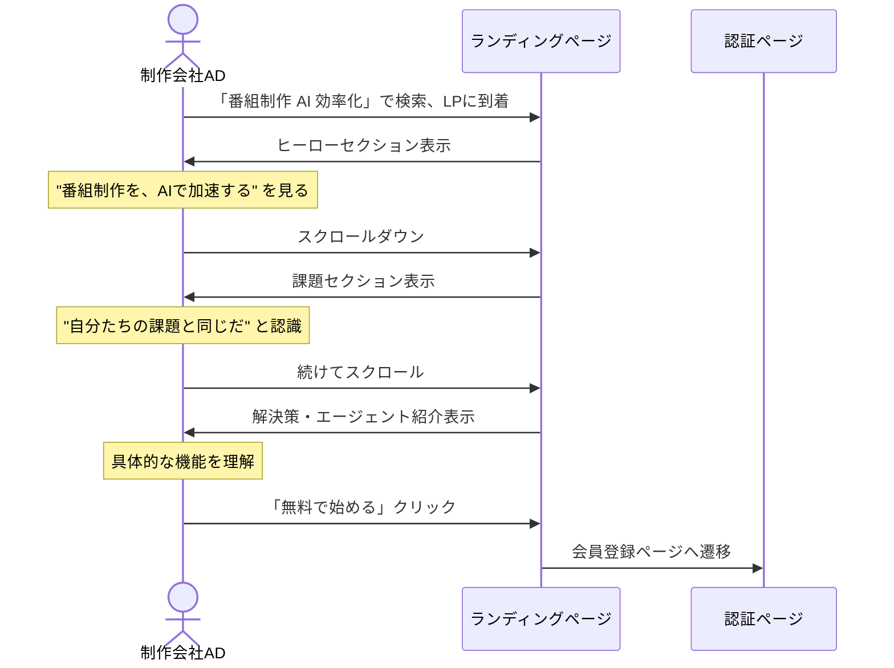
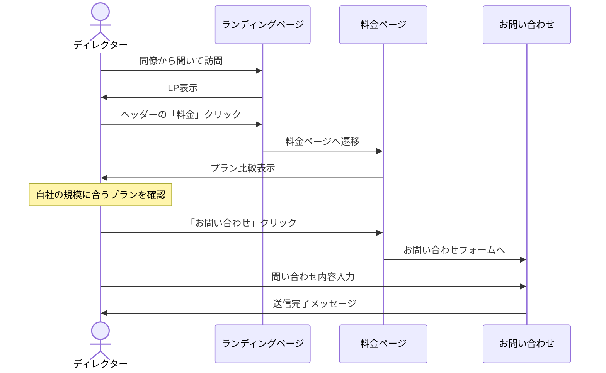
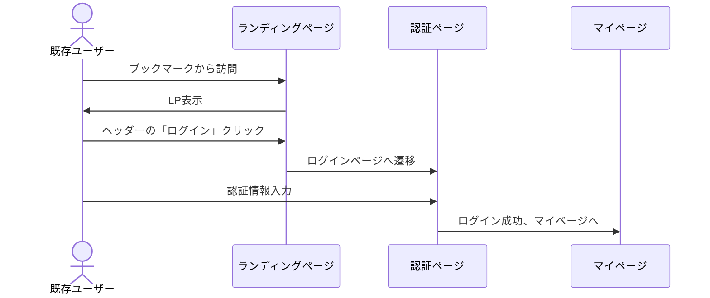

# 1. Public (LP) - ランディングページ画面設計

## 概要

T-Agentのランディングページ。未ログインユーザーに対してサービスの価値を訴求し、会員登録・ログインへ誘導する。

## 画面一覧

| 画面ID | 画面名 | パス | 説明 |
|--------|--------|------|------|
| LP-001 | ランディングページ | `/` | メインLP |
| LP-002 | 料金プラン | `/pricing` | 料金体系 |
| LP-003 | 機能紹介 | `/features` | 詳細機能説明 |
| LP-004 | お問い合わせ | `/contact` | 問い合わせフォーム |

---

## LP-001: ランディングページ

### ワイヤーフレーム

```
┌─────────────────────────────────────────────────────────────────────────────┐
│ [HEADER]                                                                     │
│ ┌─────────────────────────────────────────────────────────────────────────┐ │
│ │  🎬 T-Agent                      機能  料金  お問い合わせ  │ログイン│   │ │
│ └─────────────────────────────────────────────────────────────────────────┘ │
├─────────────────────────────────────────────────────────────────────────────┤
│ [HERO SECTION]                                                               │
│                                                                              │
│                     ┌────────────────────────────────────┐                  │
│                     │                                    │                  │
│                     │    番組制作を、AIで加速する。       │                  │
│                     │                                    │                  │
│                     │  リサーチ・企画・構成作業を         │                  │
│                     │  専門AIエージェントがサポート       │                  │
│                     │                                    │                  │
│                     │  ┌──────────────┐ ┌──────────────┐ │                  │
│                     │  │ 無料で始める │ │ デモを見る   │ │                  │
│                     │  └──────────────┘ └──────────────┘ │                  │
│                     └────────────────────────────────────┘                  │
│                                                                              │
├─────────────────────────────────────────────────────────────────────────────┤
│ [PROBLEM SECTION]                                                            │
│                                                                              │
│   ┌───────────────────────────────────────────────────────────────────────┐ │
│   │                     こんな課題を抱えていませんか？                      │ │
│   ├───────────────────────────────────────────────────────────────────────┤ │
│   │                                                                       │ │
│   │  ┌─────────────────┐  ┌─────────────────┐  ┌─────────────────┐       │ │
│   │  │ 😰              │  │ 💸              │  │ ⏰              │       │ │
│   │  │ AIの使い方が    │  │ 外注コストが    │  │ 毎回背景説明   │       │ │
│   │  │ わからない      │  │ かさむ          │  │ が必要         │       │ │
│   │  │                 │  │                 │  │                 │       │ │
│   │  │ 専門的なプロン   │  │ 構成作家・調査  │  │ ChatGPTでは   │       │ │
│   │  │ プティングが    │  │ 作家への依頼    │  │ 毎回番組の     │       │ │
│   │  │ 必要            │  │ コストが増加    │  │ 背景を説明     │       │ │
│   │  └─────────────────┘  └─────────────────┘  └─────────────────┘       │ │
│   └───────────────────────────────────────────────────────────────────────┘ │
│                                                                              │
├─────────────────────────────────────────────────────────────────────────────┤
│ [SOLUTION SECTION]                                                           │
│                                                                              │
│   ┌───────────────────────────────────────────────────────────────────────┐ │
│   │                    T-Agentが解決します                                 │ │
│   ├───────────────────────────────────────────────────────────────────────┤ │
│   │                                                                       │ │
│   │  ┌─────────────────┐  ┌─────────────────┐  ┌─────────────────┐       │ │
│   │  │ 🎯              │  │ 📁              │  │ 🤖              │       │ │
│   │  │ 番組×チーム     │  │ Google Drive    │  │ 専門             │       │ │
│   │  │ でコンテキスト  │  │ 連携            │  │ エージェント    │       │ │
│   │  │ 管理            │  │                 │  │                 │       │ │
│   │  │                 │  │ 既存のドライブ  │  │ リサーチ/企画   │       │ │
│   │  │ 毎回の背景説明  │  │ ファイルを      │  │ /構成に特化     │       │ │
│   │  │ が不要          │  │ @メンションで   │  │ したAI          │       │ │
│   │  │                 │  │ 参照            │  │                 │       │ │
│   │  └─────────────────┘  └─────────────────┘  └─────────────────┘       │ │
│   └───────────────────────────────────────────────────────────────────────┘ │
│                                                                              │
├─────────────────────────────────────────────────────────────────────────────┤
│ [AGENT TYPES SECTION]                                                        │
│                                                                              │
│   ┌───────────────────────────────────────────────────────────────────────┐ │
│   │                    4つの専門エージェント                               │ │
│   ├───────────────────────────────────────────────────────────────────────┤ │
│   │                                                                       │ │
│   │  ┌────────────┐  ┌────────────┐  ┌────────────┐  ┌────────────┐      │ │
│   │  │ 🔍         │  │ 💡         │  │ 📝         │  │ 🎬         │      │ │
│   │  │ リサーチ   │  │ ネタ探し   │  │ 企画作家   │  │ 構成作家   │      │ │
│   │  │            │  │            │  │            │  │            │      │ │
│   │  │ 情報収集   │  │ トレンド   │  │ 企画立案   │  │ 台本作成   │      │ │
│   │  │ 調査資料   │  │ 話題発掘   │  │ 企画書作成 │  │ 構成作成   │      │ │
│   │  │ 作成       │  │            │  │            │  │            │      │ │
│   │  └────────────┘  └────────────┘  └────────────┘  └────────────┘      │ │
│   └───────────────────────────────────────────────────────────────────────┘ │
│                                                                              │
├─────────────────────────────────────────────────────────────────────────────┤
│ [WORKFLOW SECTION]                                                           │
│                                                                              │
│   ┌───────────────────────────────────────────────────────────────────────┐ │
│   │                      シンプルなワークフロー                            │ │
│   ├───────────────────────────────────────────────────────────────────────┤ │
│   │                                                                       │ │
│   │      ①                  ②                  ③                  ④     │ │
│   │   ┌──────┐           ┌──────┐           ┌──────┐           ┌──────┐  │ │
│   │   │番組  │ ───────▶ │チーム│ ───────▶ │@で   │ ───────▶ │成果物│  │ │
│   │   │作成  │           │作成  │           │参照  │           │出力  │  │ │
│   │   └──────┘           └──────┘           └──────┘           └──────┘  │ │
│   │                                                                       │ │
│   │   番組単位で         エージェント       ドライブの         Google    │ │
│   │   Google Drive       タイプを選択       ファイルを         Docとして │ │
│   │   を連携             して作成           @メンションで      自動出力   │ │
│   │                                         参照                          │ │
│   └───────────────────────────────────────────────────────────────────────┘ │
│                                                                              │
├─────────────────────────────────────────────────────────────────────────────┤
│ [CTA SECTION]                                                                │
│                                                                              │
│   ┌───────────────────────────────────────────────────────────────────────┐ │
│   │                                                                       │ │
│   │                     今すぐ始めましょう                                 │ │
│   │                                                                       │ │
│   │          番組制作の効率化を、T-Agentで体験してください                │ │
│   │                                                                       │ │
│   │                    ┌──────────────────────┐                           │ │
│   │                    │   無料で始める →     │                           │ │
│   │                    └──────────────────────┘                           │ │
│   │                                                                       │ │
│   └───────────────────────────────────────────────────────────────────────┘ │
│                                                                              │
├─────────────────────────────────────────────────────────────────────────────┤
│ [FOOTER]                                                                     │
│ ┌─────────────────────────────────────────────────────────────────────────┐ │
│ │  T-Agent   │  プライバシーポリシー  │  利用規約  │  お問い合わせ        │ │
│ │            │                        │            │                      │ │
│ │  © 2025 T-Agent. All rights reserved.                                  │ │
│ └─────────────────────────────────────────────────────────────────────────┘ │
└─────────────────────────────────────────────────────────────────────────────┘
```

### コンポーネント構成

| コンポーネント | 説明 | 状態 |
|---------------|------|------|
| `Header` | ナビゲーションバー | スクロール時に固定表示 |
| `HeroSection` | メインキャッチコピー + CTA | アニメーション付き |
| `ProblemSection` | 課題提示カード x 3 | ホバーエフェクト |
| `SolutionSection` | 解決策カード x 3 | ホバーエフェクト |
| `AgentTypesSection` | エージェント紹介 x 4 | カルーセル（モバイル） |
| `WorkflowSection` | ステップ図解 | フローアニメーション |
| `CTASection` | 登録誘導 | ボタン強調 |
| `Footer` | フッターリンク | - |

---

## ユーザーシナリオ

### シナリオ 1: 初回訪問（検索流入）



### シナリオ 2: 比較検討中のユーザー



### シナリオ 3: 既存ユーザーの再訪問



---

## LP-002: 料金プランページ

### ワイヤーフレーム

```
┌─────────────────────────────────────────────────────────────────────────────┐
│ [HEADER] 共通                                                                │
├─────────────────────────────────────────────────────────────────────────────┤
│                                                                              │
│                          料金プラン                                          │
│                                                                              │
│   ┌────────────────────┐ ┌────────────────────┐ ┌────────────────────┐      │
│   │ STARTER            │ │ PRO (推奨)         │ │ ENTERPRISE         │      │
│   │                    │ │ ★                  │ │                    │      │
│   │ ¥0 /月             │ │ ¥29,800 /月        │ │ お問い合わせ       │      │
│   │                    │ │                    │ │                    │      │
│   │ ・番組 1つまで     │ │ ・番組 無制限      │ │ ・番組 無制限      │      │
│   │ ・チーム 3つまで   │ │ ・チーム 無制限    │ │ ・チーム 無制限    │      │
│   │ ・月100メッセージ  │ │ ・月5000メッセージ │ │ ・メッセージ無制限 │      │
│   │                    │ │ ・優先サポート     │ │ ・専任サポート     │      │
│   │ ┌──────────────┐   │ │ ┌──────────────┐   │ │ ┌──────────────┐   │      │
│   │ │ 無料で始める │   │ │ │ 始める       │   │ │ │ お問い合わせ │   │      │
│   │ └──────────────┘   │ │ └──────────────┘   │ │ └──────────────┘   │      │
│   └────────────────────┘ └────────────────────┘ └────────────────────┘      │
│                                                                              │
├─────────────────────────────────────────────────────────────────────────────┤
│ [FEATURE COMPARISON TABLE]                                                   │
│                                                                              │
│   ┌─────────────────────────────────────────────────────────────────────┐   │
│   │ 機能比較                                                            │   │
│   ├─────────────────┬───────────┬───────────┬───────────────────────────┤   │
│   │ 機能            │ STARTER   │ PRO       │ ENTERPRISE              │   │
│   ├─────────────────┼───────────┼───────────┼───────────────────────────┤   │
│   │ 番組数          │ 1         │ 無制限    │ 無制限                   │   │
│   │ チーム数        │ 3         │ 無制限    │ 無制限                   │   │
│   │ メッセージ/月   │ 100       │ 5,000     │ 無制限                   │   │
│   │ Google Drive連携│ ✓         │ ✓         │ ✓                        │   │
│   │ 成果物出力      │ ✓         │ ✓         │ ✓                        │   │
│   │ カスタムプロンプト│ -       │ ✓         │ ✓                        │   │
│   │ API アクセス    │ -         │ -         │ ✓                        │   │
│   │ 専任サポート    │ -         │ -         │ ✓                        │   │
│   │ SLA保証         │ -         │ -         │ ✓                        │   │
│   └─────────────────┴───────────┴───────────┴───────────────────────────┘   │
│                                                                              │
├─────────────────────────────────────────────────────────────────────────────┤
│ [FAQ SECTION]                                                                │
│                                                                              │
│   よくある質問                                                               │
│                                                                              │
│   ▼ プラン変更はいつでも可能ですか？                                        │
│   ▼ 解約時のデータはどうなりますか？                                        │
│   ▼ 無料トライアルはありますか？                                            │
│                                                                              │
├─────────────────────────────────────────────────────────────────────────────┤
│ [FOOTER] 共通                                                                │
└─────────────────────────────────────────────────────────────────────────────┘
```

---

## LP-003: 機能紹介ページ

### ワイヤーフレーム

```
┌─────────────────────────────────────────────────────────────────────────────┐
│ [HEADER] 共通                                                                │
├─────────────────────────────────────────────────────────────────────────────┤
│                                                                              │
│                          機能紹介                                            │
│                                                                              │
│   ┌───────────────────────────────────────────────────────────────────────┐ │
│   │ [FEATURE 1: 番組・チーム管理]                                          │ │
│   │                                                                       │ │
│   │ ┌─────────────────────────────┐  ┌─────────────────────────────────┐  │ │
│   │ │ [スクリーンショット画像]    │  │ 番組×チームでコンテキスト管理   │  │ │
│   │ │                             │  │                                 │  │ │
│   │ │                             │  │ 番組ごとにGoogle Driveと連携   │  │ │
│   │ │                             │  │ チームごとに参照ファイルを設定 │  │ │
│   │ │                             │  │ 毎回の背景説明が不要に          │  │ │
│   │ └─────────────────────────────┘  └─────────────────────────────────┘  │ │
│   └───────────────────────────────────────────────────────────────────────┘ │
│                                                                              │
│   ┌───────────────────────────────────────────────────────────────────────┐ │
│   │ [FEATURE 2: @メンション参照]                                           │ │
│   │                                                                       │ │
│   │ ┌─────────────────────────────────┐  ┌─────────────────────────────┐  │ │
│   │ │ @メンションでファイル参照       │  │ [スクリーンショット画像]   │  │ │
│   │ │                                 │  │                             │  │ │
│   │ │ チャット中に@を入力するだけで   │  │                             │  │ │
│   │ │ ドライブ内のファイルを参照      │  │                             │  │ │
│   │ │ PDFやDoc、スプレッドシート対応  │  │                             │  │ │
│   │ └─────────────────────────────────┘  └─────────────────────────────┘  │ │
│   └───────────────────────────────────────────────────────────────────────┘ │
│                                                                              │
│   ┌───────────────────────────────────────────────────────────────────────┐ │
│   │ [FEATURE 3: 成果物出力]                                                │ │
│   │                                                                       │ │
│   │ ┌─────────────────────────────┐  ┌─────────────────────────────────┐  │ │
│   │ │ [スクリーンショット画像]    │  │ ワンクリックでGoogle Doc出力    │  │ │
│   │ │                             │  │                                 │  │ │
│   │ │                             │  │ AIの回答をそのまま成果物に     │  │ │
│   │ │                             │  │ チーム設定の出力先に自動保存   │  │ │
│   │ │                             │  │ 編集可能なGoogle Docで出力      │  │ │
│   │ └─────────────────────────────┘  └─────────────────────────────────┘  │ │
│   └───────────────────────────────────────────────────────────────────────┘ │
│                                                                              │
├─────────────────────────────────────────────────────────────────────────────┤
│ [CTA]                                                                        │
│                     ┌──────────────────────┐                                 │
│                     │   無料で始める →     │                                 │
│                     └──────────────────────┘                                 │
├─────────────────────────────────────────────────────────────────────────────┤
│ [FOOTER] 共通                                                                │
└─────────────────────────────────────────────────────────────────────────────┘
```

---

## LP-004: お問い合わせページ

### ワイヤーフレーム

```
┌─────────────────────────────────────────────────────────────────────────────┐
│ [HEADER] 共通                                                                │
├─────────────────────────────────────────────────────────────────────────────┤
│                                                                              │
│                          お問い合わせ                                        │
│                                                                              │
│   ┌───────────────────────────────────────────────────────────────────────┐ │
│   │                                                                       │ │
│   │  ┌─────────────────────────────────────────────────────────────────┐  │ │
│   │  │ お問い合わせ種別 *                                              │  │ │
│   │  │ ┌─────────────────────────────────────────────────────────────┐ │  │ │
│   │  │ │ 選択してください                                       ▼   │ │  │ │
│   │  │ └─────────────────────────────────────────────────────────────┘ │  │ │
│   │  │   ○ 導入のご相談                                               │  │ │
│   │  │   ○ 料金について                                               │  │ │
│   │  │   ○ 技術的な質問                                               │  │ │
│   │  │   ○ その他                                                     │  │ │
│   │  └─────────────────────────────────────────────────────────────────┘  │ │
│   │                                                                       │ │
│   │  ┌─────────────────────────────────────────────────────────────────┐  │ │
│   │  │ 会社名 *                                                        │  │ │
│   │  │ ┌─────────────────────────────────────────────────────────────┐ │  │ │
│   │  │ │                                                             │ │  │ │
│   │  │ └─────────────────────────────────────────────────────────────┘ │  │ │
│   │  └─────────────────────────────────────────────────────────────────┘  │ │
│   │                                                                       │ │
│   │  ┌─────────────────────────────────────────────────────────────────┐  │ │
│   │  │ お名前 *                                                        │  │ │
│   │  │ ┌─────────────────────────────────────────────────────────────┐ │  │ │
│   │  │ │                                                             │ │  │ │
│   │  │ └─────────────────────────────────────────────────────────────┘ │  │ │
│   │  └─────────────────────────────────────────────────────────────────┘  │ │
│   │                                                                       │ │
│   │  ┌─────────────────────────────────────────────────────────────────┐  │ │
│   │  │ メールアドレス *                                                │  │ │
│   │  │ ┌─────────────────────────────────────────────────────────────┐ │  │ │
│   │  │ │                                                             │ │  │ │
│   │  │ └─────────────────────────────────────────────────────────────┘ │  │ │
│   │  └─────────────────────────────────────────────────────────────────┘  │ │
│   │                                                                       │ │
│   │  ┌─────────────────────────────────────────────────────────────────┐  │ │
│   │  │ お問い合わせ内容 *                                              │  │ │
│   │  │ ┌─────────────────────────────────────────────────────────────┐ │  │ │
│   │  │ │                                                             │ │  │ │
│   │  │ │                                                             │ │  │ │
│   │  │ │                                                             │ │  │ │
│   │  │ │                                                             │ │  │ │
│   │  │ └─────────────────────────────────────────────────────────────┘ │  │ │
│   │  └─────────────────────────────────────────────────────────────────┘  │ │
│   │                                                                       │ │
│   │  ┌─────────────────────────────────────────────────────────────────┐  │ │
│   │  │ ☐ プライバシーポリシーに同意する                                │  │ │
│   │  └─────────────────────────────────────────────────────────────────┘  │ │
│   │                                                                       │ │
│   │                    ┌──────────────────────┐                           │ │
│   │                    │      送信する        │                           │ │
│   │                    └──────────────────────┘                           │ │
│   │                                                                       │ │
│   └───────────────────────────────────────────────────────────────────────┘ │
│                                                                              │
├─────────────────────────────────────────────────────────────────────────────┤
│ [FOOTER] 共通                                                                │
└─────────────────────────────────────────────────────────────────────────────┘
```

---

## レスポンシブ対応

### ブレークポイント

| ブレークポイント | 幅 | 対応 |
|-----------------|-----|------|
| モバイル | < 768px | 1カラム、ハンバーガーメニュー |
| タブレット | 768px - 1024px | 2カラム |
| デスクトップ | > 1024px | フル表示 |

### モバイル対応のポイント

- ヘッダー: ハンバーガーメニューに変更
- カード類: 縦1列に配置
- エージェント紹介: カルーセル表示
- フォーム: フルワイド入力フィールド

---

## 共通コンポーネント

### PublicHeader

```
┌─────────────────────────────────────────────────────────────────────────────┐
│  🎬 T-Agent            機能  料金  お問い合わせ              │ ログイン │  │
└─────────────────────────────────────────────────────────────────────────────┘
```

- ロゴ: クリックでLPトップへ
- ナビゲーション: 機能、料金、お問い合わせ
- CTAボタン: ログイン（未認証時）

### PublicFooter

```
┌─────────────────────────────────────────────────────────────────────────────┐
│  T-Agent                                                                     │
│                                                                              │
│  サービス           会社情報           サポート                              │
│  ・機能紹介         ・会社概要         ・お問い合わせ                        │
│  ・料金プラン       ・採用情報         ・ヘルプセンター                      │
│  ・導入事例                            ・利用規約                            │
│                                        ・プライバシーポリシー                │
│                                                                              │
│  © 2025 T-Agent. All rights reserved.                                       │
└─────────────────────────────────────────────────────────────────────────────┘
```
