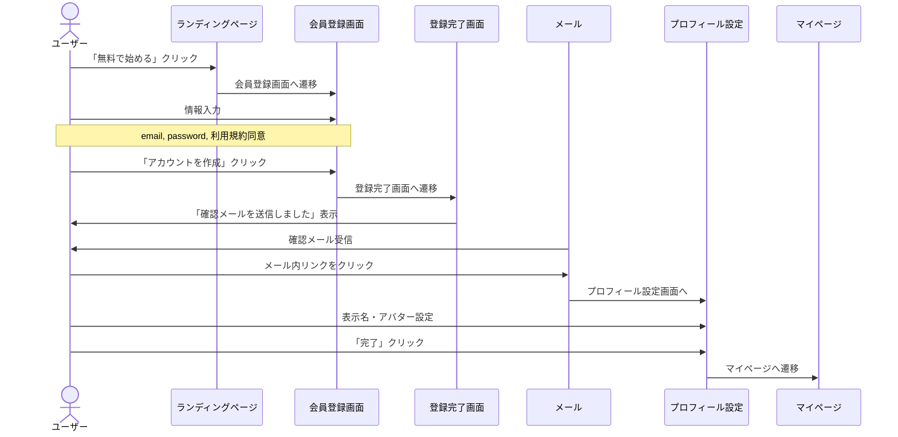
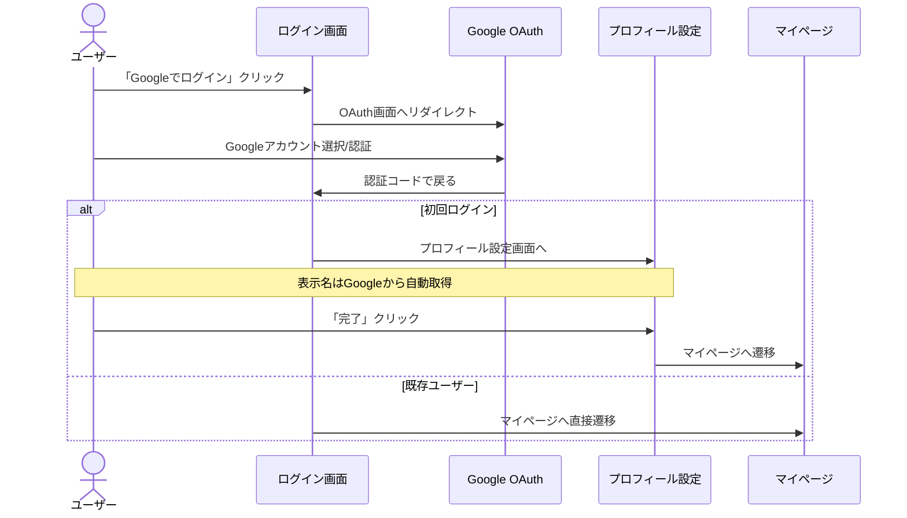
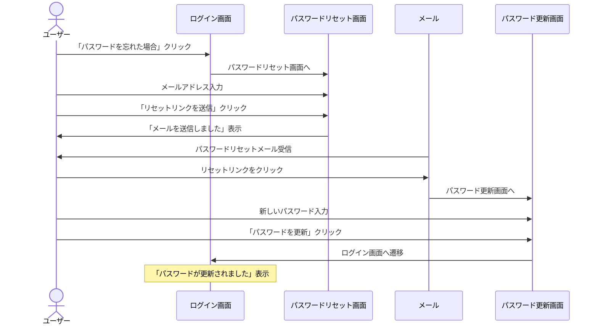
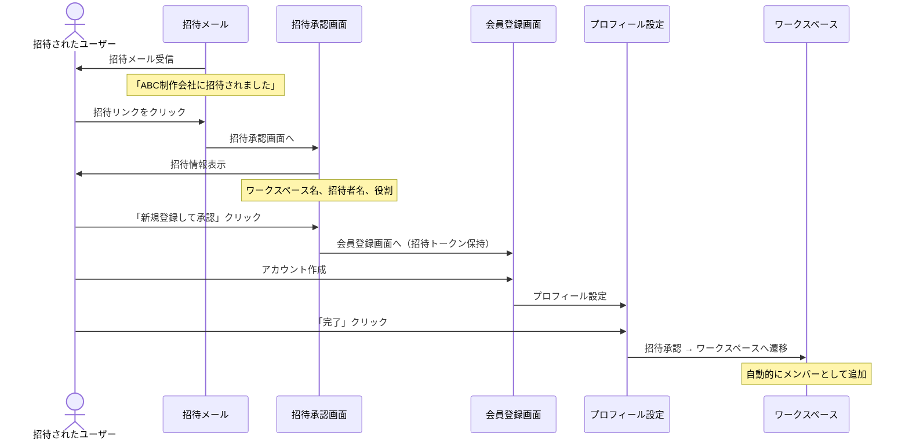
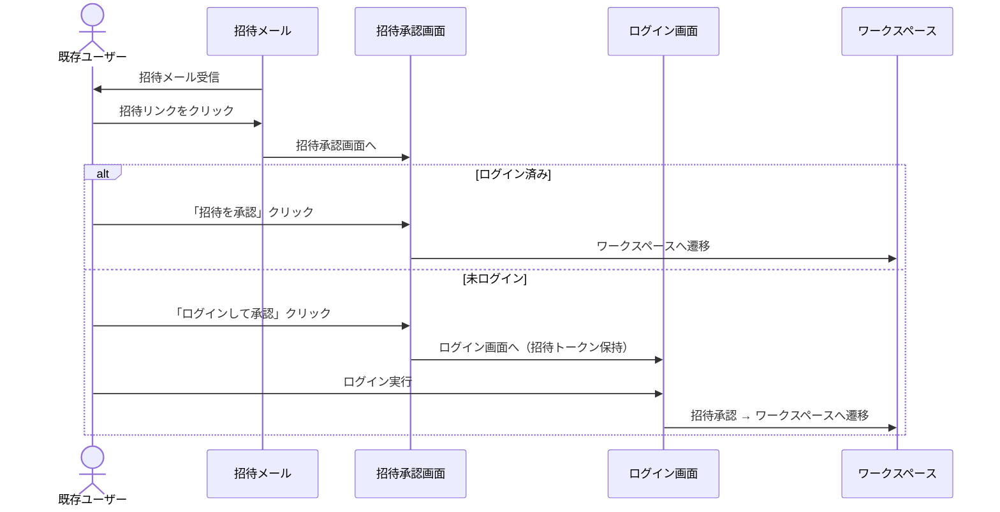

# 2. Auth - 認証画面設計

## 概要

T-Agentの認証関連画面。Supabase Authを使用し、メール/パスワード認証およびGoogle OAuth認証をサポート。

## 画面一覧

| 画面ID | 画面名 | パス | 説明 |
|--------|--------|------|------|
| AUTH-001 | ログイン | `/auth/login` | メイン認証画面 |
| AUTH-002 | 会員登録 | `/auth/sign-up` | 新規アカウント作成 |
| AUTH-003 | 登録完了 | `/auth/sign-up-success` | 確認メール送信通知 |
| AUTH-004 | パスワードリセット | `/auth/forgot-password` | パスワード再設定依頼 |
| AUTH-005 | パスワード更新 | `/auth/update-password` | 新パスワード設定 |
| AUTH-006 | プロフィール完成 | `/auth/complete-profile` | 初回ログイン時のプロフィール設定 |
| AUTH-007 | 招待承認 | `/invitations/[token]` | ワークスペース招待の承認 |
| AUTH-008 | 認証エラー | `/auth/error` | エラーメッセージ表示 |

---

## AUTH-001: ログイン画面

### ワイヤーフレーム

```
┌─────────────────────────────────────────────────────────────────────────────┐
│                                                                              │
│                                                                              │
│                                                                              │
│                     ┌─────────────────────────────────────┐                 │
│                     │                                     │                 │
│                     │        🎬 T-Agent                   │                 │
│                     │                                     │                 │
│                     │        ログイン                     │                 │
│                     │                                     │                 │
│                     │  ┌────────────────────────────────┐ │                 │
│                     │  │ 📧 メールアドレス              │ │                 │
│                     │  │ ┌──────────────────────────┐   │ │                 │
│                     │  │ │ example@company.com      │   │ │                 │
│                     │  │ └──────────────────────────┘   │ │                 │
│                     │  └────────────────────────────────┘ │                 │
│                     │                                     │                 │
│                     │  ┌────────────────────────────────┐ │                 │
│                     │  │ 🔒 パスワード                  │ │                 │
│                     │  │ ┌──────────────────────────┐   │ │                 │
│                     │  │ │ ••••••••••           👁  │   │ │                 │
│                     │  │ └──────────────────────────┘   │ │                 │
│                     │  └────────────────────────────────┘ │                 │
│                     │                                     │                 │
│                     │  ┌────────────────────────────────┐ │                 │
│                     │  │         ログイン               │ │                 │
│                     │  └────────────────────────────────┘ │                 │
│                     │                                     │                 │
│                     │  ─────────── または ───────────    │                 │
│                     │                                     │                 │
│                     │  ┌────────────────────────────────┐ │                 │
│                     │  │ 🔵 Google でログイン           │ │                 │
│                     │  └────────────────────────────────┘ │                 │
│                     │                                     │                 │
│                     │  ┌────────────────────────────────┐ │                 │
│                     │  │ パスワードを忘れた場合          │ │                 │
│                     │  └────────────────────────────────┘ │                 │
│                     │                                     │                 │
│                     │  ─────────────────────────────────  │                 │
│                     │                                     │                 │
│                     │  アカウントをお持ちでない方         │                 │
│                     │  ┌────────────────────────────────┐ │                 │
│                     │  │ 新規登録はこちら →             │ │                 │
│                     │  └────────────────────────────────┘ │                 │
│                     │                                     │                 │
│                     └─────────────────────────────────────┘                 │
│                                                                              │
│                                                                              │
└─────────────────────────────────────────────────────────────────────────────┘
```

### コンポーネント構成

| コンポーネント | Props | 説明 |
|---------------|-------|------|
| `LoginForm` | - | ログインフォーム全体 |
| `EmailInput` | `value`, `onChange`, `error` | メールアドレス入力 |
| `PasswordInput` | `value`, `onChange`, `error`, `showPassword` | パスワード入力（表示切替付き） |
| `SubmitButton` | `loading`, `disabled` | ログインボタン |
| `OAuthButton` | `provider`, `onClick` | ソーシャルログインボタン |
| `FormDivider` | `text` | 「または」区切り線 |
| `TextLink` | `href`, `children` | テキストリンク |

### 状態管理

```typescript
interface LoginFormState {
  email: string;
  password: string;
  showPassword: boolean;
  isLoading: boolean;
  error: {
    email?: string;
    password?: string;
    general?: string;
  };
}
```

### バリデーション

| フィールド | ルール | エラーメッセージ |
|-----------|--------|-----------------|
| email | 必須、メール形式 | 「有効なメールアドレスを入力してください」 |
| password | 必須、最小8文字 | 「パスワードは8文字以上で入力してください」 |

---

## AUTH-002: 会員登録画面

### ワイヤーフレーム

```
┌─────────────────────────────────────────────────────────────────────────────┐
│                                                                              │
│                     ┌─────────────────────────────────────┐                 │
│                     │                                     │                 │
│                     │        🎬 T-Agent                   │                 │
│                     │                                     │                 │
│                     │        新規登録                     │                 │
│                     │                                     │                 │
│                     │  ┌────────────────────────────────┐ │                 │
│                     │  │ 📧 メールアドレス              │ │                 │
│                     │  │ ┌──────────────────────────┐   │ │                 │
│                     │  │ │                          │   │ │                 │
│                     │  │ └──────────────────────────┘   │ │                 │
│                     │  └────────────────────────────────┘ │                 │
│                     │                                     │                 │
│                     │  ┌────────────────────────────────┐ │                 │
│                     │  │ 🔒 パスワード                  │ │                 │
│                     │  │ ┌──────────────────────────┐   │ │                 │
│                     │  │ │                      👁  │   │ │                 │
│                     │  │ └──────────────────────────┘   │ │                 │
│                     │  │ ・8文字以上 ・大文字/小文字    │ │                 │
│                     │  └────────────────────────────────┘ │                 │
│                     │                                     │                 │
│                     │  ┌────────────────────────────────┐ │                 │
│                     │  │ 🔒 パスワード（確認）          │ │                 │
│                     │  │ ┌──────────────────────────┐   │ │                 │
│                     │  │ │                      👁  │   │ │                 │
│                     │  │ └──────────────────────────┘   │ │                 │
│                     │  └────────────────────────────────┘ │                 │
│                     │                                     │                 │
│                     │  ┌────────────────────────────────┐ │                 │
│                     │  │ ☐ 利用規約とプライバシーポリシ │ │                 │
│                     │  │   ーに同意します               │ │                 │
│                     │  └────────────────────────────────┘ │                 │
│                     │                                     │                 │
│                     │  ┌────────────────────────────────┐ │                 │
│                     │  │        アカウントを作成        │ │                 │
│                     │  └────────────────────────────────┘ │                 │
│                     │                                     │                 │
│                     │  ─────────── または ───────────    │                 │
│                     │                                     │                 │
│                     │  ┌────────────────────────────────┐ │                 │
│                     │  │ 🔵 Google で登録               │ │                 │
│                     │  └────────────────────────────────┘ │                 │
│                     │                                     │                 │
│                     │  ─────────────────────────────────  │                 │
│                     │                                     │                 │
│                     │  すでにアカウントをお持ちの方       │                 │
│                     │  ┌────────────────────────────────┐ │                 │
│                     │  │ ログインはこちら →             │ │                 │
│                     │  └────────────────────────────────┘ │                 │
│                     │                                     │                 │
│                     └─────────────────────────────────────┘                 │
│                                                                              │
└─────────────────────────────────────────────────────────────────────────────┘
```

### バリデーション

| フィールド | ルール | エラーメッセージ |
|-----------|--------|-----------------|
| email | 必須、メール形式、未登録 | 「このメールアドレスは既に登録されています」 |
| password | 必須、8文字以上、英大文字含む | 「パスワードは8文字以上で、大文字と小文字を含む必要があります」 |
| confirmPassword | passwordと一致 | 「パスワードが一致しません」 |
| terms | 必須チェック | 「利用規約への同意が必要です」 |

---

## AUTH-003: 登録完了画面

### ワイヤーフレーム

```
┌─────────────────────────────────────────────────────────────────────────────┐
│                                                                              │
│                     ┌─────────────────────────────────────┐                 │
│                     │                                     │                 │
│                     │            ✉️                       │                 │
│                     │                                     │                 │
│                     │      確認メールを送信しました       │                 │
│                     │                                     │                 │
│                     │  ┌────────────────────────────────┐ │                 │
│                     │  │                                │ │                 │
│                     │  │ example@company.com 宛に       │ │                 │
│                     │  │ 確認メールを送信しました。     │ │                 │
│                     │  │                                │ │                 │
│                     │  │ メール内のリンクをクリックして │ │                 │
│                     │  │ アカウントを有効化してください │ │                 │
│                     │  │                                │ │                 │
│                     │  └────────────────────────────────┘ │                 │
│                     │                                     │                 │
│                     │  ┌────────────────────────────────┐ │                 │
│                     │  │   メールが届かない場合          │ │                 │
│                     │  │   ・迷惑メールフォルダを確認    │ │                 │
│                     │  │   ・確認メールを再送信 →       │ │                 │
│                     │  └────────────────────────────────┘ │                 │
│                     │                                     │                 │
│                     │  ┌────────────────────────────────┐ │                 │
│                     │  │      ログイン画面へ戻る        │ │                 │
│                     │  └────────────────────────────────┘ │                 │
│                     │                                     │                 │
│                     └─────────────────────────────────────┘                 │
│                                                                              │
└─────────────────────────────────────────────────────────────────────────────┘
```

---

## AUTH-004: パスワードリセット画面

### ワイヤーフレーム

```
┌─────────────────────────────────────────────────────────────────────────────┐
│                                                                              │
│                     ┌─────────────────────────────────────┐                 │
│                     │                                     │                 │
│                     │        🎬 T-Agent                   │                 │
│                     │                                     │                 │
│                     │    パスワードをリセット             │                 │
│                     │                                     │                 │
│                     │  ┌────────────────────────────────┐ │                 │
│                     │  │                                │ │                 │
│                     │  │ 登録したメールアドレスを入力   │ │                 │
│                     │  │ してください。パスワードリセ   │ │                 │
│                     │  │ ット用のリンクを送信します。   │ │                 │
│                     │  │                                │ │                 │
│                     │  └────────────────────────────────┘ │                 │
│                     │                                     │                 │
│                     │  ┌────────────────────────────────┐ │                 │
│                     │  │ 📧 メールアドレス              │ │                 │
│                     │  │ ┌──────────────────────────┐   │ │                 │
│                     │  │ │                          │   │ │                 │
│                     │  │ └──────────────────────────┘   │ │                 │
│                     │  └────────────────────────────────┘ │                 │
│                     │                                     │                 │
│                     │  ┌────────────────────────────────┐ │                 │
│                     │  │     リセットリンクを送信       │ │                 │
│                     │  └────────────────────────────────┘ │                 │
│                     │                                     │                 │
│                     │  ┌────────────────────────────────┐ │                 │
│                     │  │     ← ログイン画面へ戻る       │ │                 │
│                     │  └────────────────────────────────┘ │                 │
│                     │                                     │                 │
│                     └─────────────────────────────────────┘                 │
│                                                                              │
└─────────────────────────────────────────────────────────────────────────────┘
```

---

## AUTH-005: パスワード更新画面

### ワイヤーフレーム

```
┌─────────────────────────────────────────────────────────────────────────────┐
│                                                                              │
│                     ┌─────────────────────────────────────┐                 │
│                     │                                     │                 │
│                     │        🎬 T-Agent                   │                 │
│                     │                                     │                 │
│                     │      新しいパスワードを設定         │                 │
│                     │                                     │                 │
│                     │  ┌────────────────────────────────┐ │                 │
│                     │  │ 🔒 新しいパスワード            │ │                 │
│                     │  │ ┌──────────────────────────┐   │ │                 │
│                     │  │ │                      👁  │   │ │                 │
│                     │  │ └──────────────────────────┘   │ │                 │
│                     │  │ ・8文字以上 ・大文字/小文字    │ │                 │
│                     │  └────────────────────────────────┘ │                 │
│                     │                                     │                 │
│                     │  ┌────────────────────────────────┐ │                 │
│                     │  │ 🔒 パスワード（確認）          │ │                 │
│                     │  │ ┌──────────────────────────┐   │ │                 │
│                     │  │ │                      👁  │   │ │                 │
│                     │  │ └──────────────────────────┘   │ │                 │
│                     │  └────────────────────────────────┘ │                 │
│                     │                                     │                 │
│                     │  ┌────────────────────────────────┐ │                 │
│                     │  │      パスワードを更新          │ │                 │
│                     │  └────────────────────────────────┘ │                 │
│                     │                                     │                 │
│                     └─────────────────────────────────────┘                 │
│                                                                              │
└─────────────────────────────────────────────────────────────────────────────┘
```

---

## AUTH-006: プロフィール完成画面

### ワイヤーフレーム

```
┌─────────────────────────────────────────────────────────────────────────────┐
│                                                                              │
│                     ┌─────────────────────────────────────┐                 │
│                     │                                     │                 │
│                     │        🎬 T-Agent                   │                 │
│                     │                                     │                 │
│                     │      プロフィールを設定             │                 │
│                     │                                     │                 │
│                     │  ┌────────────────────────────────┐ │                 │
│                     │  │         ┌──────────┐           │ │                 │
│                     │  │         │   👤     │           │ │                 │
│                     │  │         │  写真    │           │ │                 │
│                     │  │         └──────────┘           │ │                 │
│                     │  │         画像をアップロード      │ │                 │
│                     │  └────────────────────────────────┘ │                 │
│                     │                                     │                 │
│                     │  ┌────────────────────────────────┐ │                 │
│                     │  │ 表示名 *                       │ │                 │
│                     │  │ ┌──────────────────────────┐   │ │                 │
│                     │  │ │ 山田 太郎                │   │ │                 │
│                     │  │ └──────────────────────────┘   │ │                 │
│                     │  └────────────────────────────────┘ │                 │
│                     │                                     │                 │
│                     │  ┌────────────────────────────────┐ │                 │
│                     │  │ 役職（任意）                   │ │                 │
│                     │  │ ┌──────────────────────────┐   │ │                 │
│                     │  │ │ ディレクター             │   │ │                 │
│                     │  │ └──────────────────────────┘   │ │                 │
│                     │  └────────────────────────────────┘ │                 │
│                     │                                     │                 │
│                     │  ┌────────────────────────────────┐ │                 │
│                     │  │          完了                  │ │                 │
│                     │  └────────────────────────────────┘ │                 │
│                     │                                     │                 │
│                     │  ┌────────────────────────────────┐ │                 │
│                     │  │       あとで設定する →         │ │                 │
│                     │  └────────────────────────────────┘ │                 │
│                     │                                     │                 │
│                     └─────────────────────────────────────┘                 │
│                                                                              │
└─────────────────────────────────────────────────────────────────────────────┘
```

---

## AUTH-007: 招待承認画面

### ワイヤーフレーム

```
┌─────────────────────────────────────────────────────────────────────────────┐
│                                                                              │
│                     ┌─────────────────────────────────────┐                 │
│                     │                                     │                 │
│                     │        🎬 T-Agent                   │                 │
│                     │                                     │                 │
│                     │    ワークスペースへの招待           │                 │
│                     │                                     │                 │
│                     │  ┌────────────────────────────────┐ │                 │
│                     │  │  ┌──────────────────────────┐  │ │                 │
│                     │  │  │    🏢 ABC制作会社        │  │ │                 │
│                     │  │  │                          │  │ │                 │
│                     │  │  │ 田中様からの招待          │  │ │                 │
│                     │  │  │                          │  │ │                 │
│                     │  │  │ 役割: メンバー           │  │ │                 │
│                     │  │  └──────────────────────────┘  │ │                 │
│                     │  └────────────────────────────────┘ │                 │
│                     │                                     │                 │
│                     │  [未ログインの場合]                 │                 │
│                     │  ┌────────────────────────────────┐ │                 │
│                     │  │ 招待を承認するにはログインが    │ │                 │
│                     │  │ 必要です                       │ │                 │
│                     │  │                                │ │                 │
│                     │  │ ┌────────────────────────────┐ │ │                 │
│                     │  │ │ ログインして承認           │ │ │                 │
│                     │  │ └────────────────────────────┘ │ │                 │
│                     │  │                                │ │                 │
│                     │  │ アカウントをお持ちでない場合   │ │                 │
│                     │  │ ┌────────────────────────────┐ │ │                 │
│                     │  │ │ 新規登録して承認           │ │ │                 │
│                     │  │ └────────────────────────────┘ │ │                 │
│                     │  └────────────────────────────────┘ │                 │
│                     │                                     │                 │
│                     │  [ログイン済みの場合]               │                 │
│                     │  ┌────────────────────────────────┐ │                 │
│                     │  │         招待を承認             │ │                 │
│                     │  └────────────────────────────────┘ │                 │
│                     │  ┌────────────────────────────────┐ │                 │
│                     │  │         辞退する               │ │                 │
│                     │  └────────────────────────────────┘ │                 │
│                     │                                     │                 │
│                     └─────────────────────────────────────┘                 │
│                                                                              │
└─────────────────────────────────────────────────────────────────────────────┘
```

---

## ユーザーシナリオ

### シナリオ 1: 新規ユーザーの会員登録（メール認証）



### シナリオ 2: Google OAuth でログイン



### シナリオ 3: パスワードリセット



### シナリオ 4: 招待からの参加（新規ユーザー）



### シナリオ 5: 招待からの参加（既存ユーザー）



---

## エラー状態

### AUTH-008: 認証エラー画面

```
┌─────────────────────────────────────────────────────────────────────────────┐
│                                                                              │
│                     ┌─────────────────────────────────────┐                 │
│                     │                                     │                 │
│                     │            ⚠️                       │                 │
│                     │                                     │                 │
│                     │        認証エラー                   │                 │
│                     │                                     │                 │
│                     │  ┌────────────────────────────────┐ │                 │
│                     │  │                                │ │                 │
│                     │  │ [エラーメッセージ]              │ │                 │
│                     │  │                                │ │                 │
│                     │  │ 例:                            │ │                 │
│                     │  │ ・メール確認リンクが無効です   │ │                 │
│                     │  │ ・セッションが期限切れです     │ │                 │
│                     │  │ ・招待が無効または期限切れです │ │                 │
│                     │  │                                │ │                 │
│                     │  └────────────────────────────────┘ │                 │
│                     │                                     │                 │
│                     │  ┌────────────────────────────────┐ │                 │
│                     │  │      ログイン画面へ戻る        │ │                 │
│                     │  └────────────────────────────────┘ │                 │
│                     │                                     │                 │
│                     └─────────────────────────────────────┘                 │
│                                                                              │
└─────────────────────────────────────────────────────────────────────────────┘
```

### エラーメッセージ一覧

| エラーコード | メッセージ | 対処 |
|-------------|-----------|------|
| `invalid_credentials` | メールアドレスまたはパスワードが正しくありません | 再入力を促す |
| `email_not_confirmed` | メールアドレスが確認されていません | 確認メール再送リンク表示 |
| `user_already_exists` | このメールアドレスは既に登録されています | ログイン画面へ誘導 |
| `expired_token` | リンクが期限切れです | 再送信を促す |
| `invalid_token` | 無効なリンクです | ログイン画面へ誘導 |
| `invitation_expired` | 招待が期限切れです | 再招待を依頼するよう案内 |

---

## セキュリティ考慮事項

| 項目 | 対策 |
|------|------|
| パスワード強度 | 最低8文字、大文字・小文字必須 |
| レート制限 | ログイン試行5回/分まで |
| セッション管理 | JWT + リフレッシュトークン |
| CSRF対策 | Supabase Auth 標準対応 |
| XSS対策 | 入力値サニタイズ |
