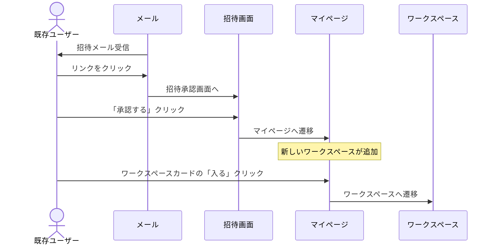
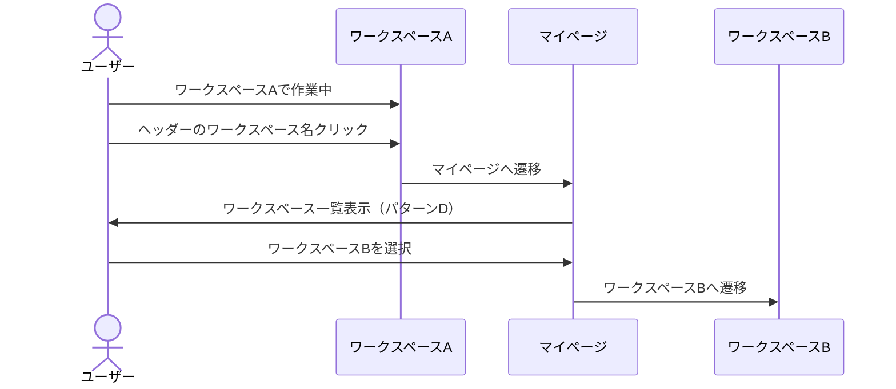
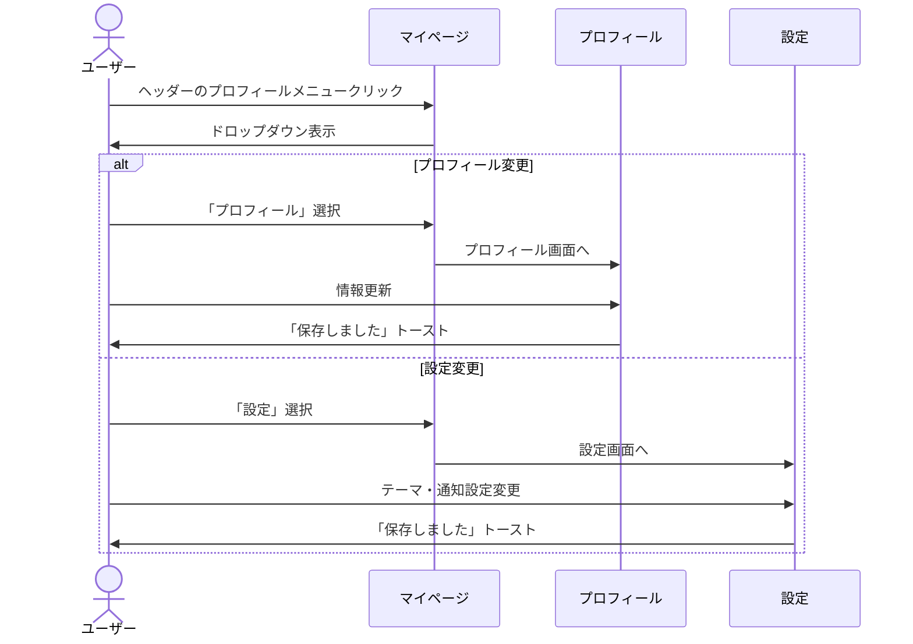

# 3. MyPage - マイページ画面設計

## 概要

ログイン後のユーザーポータル。ワークスペース選択、チーム選択、ユーザー設定などを行うハブ画面。

## 画面一覧

| 画面ID | 画面名 | パス | 説明 |
|--------|--------|------|------|
| MY-001 | マイページトップ | `/mypage` | ワークスペース選択画面 |
| MY-002 | ワークスペース一覧 | `/mypage/workspaces` | 参加中ワークスペース一覧 |
| MY-003 | ワークスペース作成 | `/mypage/create-workspace` | 新規ワークスペース作成 |
| MY-004 | ワークスペース退出 | `/mypage/workspaces/[id]/leave` | ワークスペース退出確認 |
| MY-005 | プロフィール設定 | `/mypage/profile` | ユーザープロフィール編集 |
| MY-006 | アカウント設定 | `/mypage/settings` | 通知・テーマ設定 |
| MY-007 | システム管理 | `/mypage/system-admin` | システム管理者専用 |

---

## MY-001: マイページトップ（ワークスペース選択）

### 状態パターン

マイページは以下の4つの状態パターンがあります：

| パターン | 条件 | 表示内容 |
|---------|------|----------|
| A: Empty State | ワークスペース0件、招待0件 | 空状態 + 作成CTA |
| B: Invitations Only | ワークスペース0件、招待あり | 招待一覧 + 作成CTA |
| C: Single Workspace | ワークスペース1件 | ワークスペースカード + 招待（あれば） |
| D: Multiple Workspaces | ワークスペース複数 | ワークスペース一覧 + 招待 |

### パターン A: 空状態

```
┌─────────────────────────────────────────────────────────────────────────────┐
│ [HEADER]                                                                     │
│ ┌─────────────────────────────────────────────────────────────────────────┐ │
│ │  🎬 T-Agent                               プロフィール ▼  │ ログアウト │ │
│ └─────────────────────────────────────────────────────────────────────────┘ │
├─────────────────────────────────────────────────────────────────────────────┤
│                                                                              │
│                                                                              │
│                                                                              │
│                     ┌─────────────────────────────────────┐                 │
│                     │                                     │                 │
│                     │            🏢                       │                 │
│                     │                                     │                 │
│                     │    ワークスペースがありません       │                 │
│                     │                                     │                 │
│                     │  ワークスペースを作成するか、        │                 │
│                     │  招待を待ってください                │                 │
│                     │                                     │                 │
│                     │  ┌────────────────────────────────┐ │                 │
│                     │  │  + ワークスペースを作成        │ │                 │
│                     │  └────────────────────────────────┘ │                 │
│                     │                                     │                 │
│                     └─────────────────────────────────────┘                 │
│                                                                              │
│                                                                              │
│                                                                              │
└─────────────────────────────────────────────────────────────────────────────┘
```

### パターン B: 招待のみ

```
┌─────────────────────────────────────────────────────────────────────────────┐
│ [HEADER]                                                                     │
├─────────────────────────────────────────────────────────────────────────────┤
│                                                                              │
│                     ┌─────────────────────────────────────────────────────┐ │
│                     │                                                     │ │
│                     │              招待が届いています                     │ │
│                     │                                                     │ │
│                     │ 招待を承認してワークスペースに参加するか、          │ │
│                     │ 新しいワークスペースを作成してください              │ │
│                     │                                                     │ │
│                     └─────────────────────────────────────────────────────┘ │
│                                                                              │
│   ┌───────────────────────────────────────────────────────────────────────┐ │
│   │ 📬 保留中の招待 (2件)                                                 │ │
│   ├───────────────────────────────────────────────────────────────────────┤ │
│   │                                                                       │ │
│   │   ┌─────────────────────────────────────────────────────────────────┐ │ │
│   │   │ 🏢 ABC制作会社                                                  │ │ │
│   │   │                                                                 │ │ │
│   │   │ 田中様からの招待 • メンバーとして                                │ │ │
│   │   │ 有効期限: 2025-01-25                                            │ │ │
│   │   │                                                                 │ │ │
│   │   │ ┌─────────────────┐  ┌─────────────────┐                        │ │ │
│   │   │ │    承認する     │  │    辞退する     │                        │ │ │
│   │   │ └─────────────────┘  └─────────────────┘                        │ │ │
│   │   └─────────────────────────────────────────────────────────────────┘ │ │
│   │                                                                       │ │
│   │   ┌─────────────────────────────────────────────────────────────────┐ │ │
│   │   │ 🏢 XYZプロダクション                                            │ │ │
│   │   │                                                                 │ │ │
│   │   │ 鈴木様からの招待 • メンバーとして                                │ │ │
│   │   │ 有効期限: 2025-01-30                                            │ │ │
│   │   │                                                                 │ │ │
│   │   │ ┌─────────────────┐  ┌─────────────────┐                        │ │ │
│   │   │ │    承認する     │  │    辞退する     │                        │ │ │
│   │   │ └─────────────────┘  └─────────────────┘                        │ │ │
│   │   └─────────────────────────────────────────────────────────────────┘ │ │
│   │                                                                       │ │
│   └───────────────────────────────────────────────────────────────────────┘ │
│                                                                              │
│   ───────────────────────── または ─────────────────────────                │
│                                                                              │
│                     ┌──────────────────────────────────┐                    │
│                     │  + 新しいワークスペースを作成    │                    │
│                     └──────────────────────────────────┘                    │
│                                                                              │
└─────────────────────────────────────────────────────────────────────────────┘
```

### パターン C: 単一ワークスペース

```
┌─────────────────────────────────────────────────────────────────────────────┐
│ [HEADER]                                                                     │
├─────────────────────────────────────────────────────────────────────────────┤
│                                                                              │
│                     ┌─────────────────────────────────────────────────────┐ │
│                     │                                                     │ │
│                     │            あなたのワークスペース                    │ │
│                     │                                                     │ │
│                     │  ワークスペースに入るか、招待を承認してください      │ │
│                     │                                                     │ │
│                     └─────────────────────────────────────────────────────┘ │
│                                                                              │
│   ┌───────────────────────────────────────────────────────────────────────┐ │
│   │                                                                       │ │
│   │   ┌─────────────────────────────────────────────────────────────────┐ │ │
│   │   │                                                                 │ │ │
│   │   │  ┌────────┐  ABC制作会社                                        │ │ │
│   │   │  │  🏢   │                                                     │ │ │
│   │   │  │  Logo  │  役割: 管理者                                       │ │ │
│   │   │  └────────┘  メンバー: 12名                                     │ │ │
│   │   │                                                                 │ │ │
│   │   │                                   ┌───────────────────────────┐ │ │ │
│   │   │                                   │ ワークスペースに入る →   │ │ │ │
│   │   │                                   └───────────────────────────┘ │ │ │
│   │   │                                                                 │ │ │
│   │   └─────────────────────────────────────────────────────────────────┘ │ │
│   │                                                                       │ │
│   └───────────────────────────────────────────────────────────────────────┘ │
│                                                                              │
│   ┌───────────────────────────────────────────────────────────────────────┐ │
│   │ 📬 保留中の招待 (1件)                                                 │ │
│   ├───────────────────────────────────────────────────────────────────────┤ │
│   │   [招待カード...]                                                     │ │
│   └───────────────────────────────────────────────────────────────────────┘ │
│                                                                              │
└─────────────────────────────────────────────────────────────────────────────┘
```

### パターン D: 複数ワークスペース

```
┌─────────────────────────────────────────────────────────────────────────────┐
│ [HEADER]                                                                     │
├─────────────────────────────────────────────────────────────────────────────┤
│                                                                              │
│                     ┌─────────────────────────────────────────────────────┐ │
│                     │                                                     │ │
│                     │            ワークスペースを選択                     │ │
│                     │                                                     │ │
│                     │  続けるワークスペースを選択するか、                  │ │
│                     │  新しいワークスペースを作成してください              │ │
│                     │                                                     │ │
│                     └─────────────────────────────────────────────────────┘ │
│                                                                              │
│   ┌───────────────────────────────────────────────────────────────────────┐ │
│   │ 参加中のワークスペース (3件)                                          │ │
│   ├───────────────────────────────────────────────────────────────────────┤ │
│   │                                                                       │ │
│   │   ┌─────────────────────────────┐  ┌─────────────────────────────┐   │ │
│   │   │ ┌────────┐                  │  │ ┌────────┐                  │   │ │
│   │   │ │  🏢   │  ABC制作会社     │  │ │  🏢   │  XYZプロダクション │   │ │
│   │   │ │  Logo  │                  │  │ │  Logo  │                  │   │ │
│   │   │ └────────┘                  │  │ └────────┘                  │   │ │
│   │   │ 役割: 管理者                │  │ 役割: メンバー             │   │ │
│   │   │ メンバー: 12名              │  │ メンバー: 8名              │   │ │
│   │   │ 番組: 5つ                   │  │ 番組: 3つ                  │   │ │
│   │   │                             │  │                             │   │ │
│   │   │ ┌─────────────────────────┐ │  │ ┌─────────────────────────┐ │   │ │
│   │   │ │      入る →            │ │  │ │      入る →            │ │   │ │
│   │   │ └─────────────────────────┘ │  │ └─────────────────────────┘ │   │ │
│   │   └─────────────────────────────┘  └─────────────────────────────┘   │ │
│   │                                                                       │ │
│   │   ┌─────────────────────────────┐                                     │ │
│   │   │ ┌────────┐                  │                                     │ │
│   │   │ │  🏢   │  テスト制作      │                                     │ │
│   │   │ │  Logo  │                  │                                     │ │
│   │   │ └────────┘                  │                                     │ │
│   │   │ 役割: オーナー              │                                     │ │
│   │   │ メンバー: 2名               │                                     │ │
│   │   │ 番組: 1つ                   │                                     │ │
│   │   │                             │                                     │ │
│   │   │ ┌─────────────────────────┐ │                                     │ │
│   │   │ │      入る →            │ │                                     │ │
│   │   │ └─────────────────────────┘ │                                     │ │
│   │   └─────────────────────────────┘                                     │ │
│   │                                                                       │ │
│   └───────────────────────────────────────────────────────────────────────┘ │
│                                                                              │
│   ┌───────────────────────────────────────────────────────────────────────┐ │
│   │ 📬 保留中の招待 (1件)                                   ▼ 展開/折畳  │ │
│   └───────────────────────────────────────────────────────────────────────┘ │
│                                                                              │
│                     ┌──────────────────────────────────┐                    │
│                     │  + 新しいワークスペースを作成    │                    │
│                     └──────────────────────────────────┘                    │
│                                                                              │
└─────────────────────────────────────────────────────────────────────────────┘
```

### コンポーネント構成

| コンポーネント | Props | 説明 |
|---------------|-------|------|
| `WorkspaceEmptyState` | - | 空状態表示 |
| `InvitationsList` | `invitations[]` | 招待一覧 |
| `InvitationCard` | `invitation` | 個別招待カード |
| `WorkspaceSelector` | `workspaces[]` | ワークスペース選択グリッド |
| `WorkspaceCard` | `workspace` | 個別ワークスペースカード |
| `PendingInvitationsSection` | - | 折りたたみ可能な招待セクション |

---

## MY-002: ワークスペース一覧

```
┌─────────────────────────────────────────────────────────────────────────────┐
│ [HEADER]                                                                     │
├─────────────────────────────────────────────────────────────────────────────┤
│ [SIDEBAR]           │ [MAIN CONTENT]                                        │
│ ┌─────────────────┐ │                                                       │
│ │ マイページ      │ │   ワークスペース一覧                                  │
│ │                 │ │                                                       │
│ │ ├ ワークスペース│ │   ┌─────────────────────────────────────────────────┐ │
│ │ ├ プロフィール  │ │   │ 🔍 検索...                                      │ │
│ │ └ 設定          │ │   └─────────────────────────────────────────────────┘ │
│ │                 │ │                                                       │
│ │ [システム管理]  │ │   ┌─────────────────────────────────────────────────┐ │
│ │ (admin only)    │ │   │ ABC制作会社                       [入る] [⋮]   │ │
│ │                 │ │   │ 役割: 管理者 • メンバー12名 • 番組5つ           │ │
│ └─────────────────┘ │   └─────────────────────────────────────────────────┘ │
│                     │                                                       │
│                     │   ┌─────────────────────────────────────────────────┐ │
│                     │   │ XYZプロダクション                 [入る] [⋮]   │ │
│                     │   │ 役割: メンバー • メンバー8名 • 番組3つ          │ │
│                     │   └─────────────────────────────────────────────────┘ │
│                     │                                                       │
│                     │   ┌─────────────────────────────────────────────────┐ │
│                     │   │ テスト制作                       [入る] [⋮]   │ │
│                     │   │ 役割: オーナー • メンバー2名 • 番組1つ          │ │
│                     │   └─────────────────────────────────────────────────┘ │
│                     │                                                       │
│                     │   ┌──────────────────────────────────┐                │
│                     │   │  + 新しいワークスペースを作成    │                │
│                     │   └──────────────────────────────────┘                │
│                     │                                                       │
└─────────────────────────────────────────────────────────────────────────────┘
```

### [⋮] メニュー項目

| メニュー項目 | 条件 | アクション |
|-------------|------|----------|
| 設定 | 管理者のみ | ワークスペース設定画面へ |
| メンバー管理 | 管理者のみ | メンバー管理画面へ |
| 退出する | オーナー以外 | 退出確認画面へ |
| 削除する | オーナーのみ | 削除確認ダイアログ |

---

## MY-003: ワークスペース作成

```
┌─────────────────────────────────────────────────────────────────────────────┐
│ [HEADER]                                                                     │
├─────────────────────────────────────────────────────────────────────────────┤
│                                                                              │
│   ← 戻る                                                                    │
│                                                                              │
│                     ┌─────────────────────────────────────────────────────┐ │
│                     │                                                     │ │
│                     │        新しいワークスペースを作成                    │ │
│                     │                                                     │ │
│                     │  ┌───────────────────────────────────────────────┐  │ │
│                     │  │              ┌──────────┐                     │  │ │
│                     │  │              │    🏢   │                     │  │ │
│                     │  │              │   Logo   │                     │  │ │
│                     │  │              └──────────┘                     │  │ │
│                     │  │              ロゴをアップロード               │  │ │
│                     │  └───────────────────────────────────────────────┘  │ │
│                     │                                                     │ │
│                     │  ┌───────────────────────────────────────────────┐  │ │
│                     │  │ ワークスペース名 *                            │  │ │
│                     │  │ ┌─────────────────────────────────────────┐   │  │ │
│                     │  │ │ ABC制作会社                             │   │  │ │
│                     │  │ └─────────────────────────────────────────┘   │  │ │
│                     │  └───────────────────────────────────────────────┘  │ │
│                     │                                                     │ │
│                     │  ┌───────────────────────────────────────────────┐  │ │
│                     │  │ スラッグ（URL） *                             │  │ │
│                     │  │ ┌─────────────────────────────────────────┐   │  │ │
│                     │  │ │ abc-production                         │   │  │ │
│                     │  │ └─────────────────────────────────────────┘   │  │ │
│                     │  │ t-agent.app/abc-production                    │  │ │
│                     │  └───────────────────────────────────────────────┘  │ │
│                     │                                                     │ │
│                     │  ┌───────────────────────────────────────────────┐  │ │
│                     │  │ 説明（任意）                                  │  │ │
│                     │  │ ┌─────────────────────────────────────────┐   │  │ │
│                     │  │ │                                         │   │  │ │
│                     │  │ │                                         │   │  │ │
│                     │  │ └─────────────────────────────────────────┘   │  │ │
│                     │  └───────────────────────────────────────────────┘  │ │
│                     │                                                     │ │
│                     │  ┌───────────────────────────────────────────────┐  │ │
│                     │  │ ウェブサイトURL（任意）                       │  │ │
│                     │  │ ┌─────────────────────────────────────────┐   │  │ │
│                     │  │ │ https://abc-production.co.jp           │   │  │ │
│                     │  │ └─────────────────────────────────────────┘   │  │ │
│                     │  └───────────────────────────────────────────────┘  │ │
│                     │                                                     │ │
│                     │  ┌───────────────────────────────────────────────┐  │ │
│                     │  │            ワークスペースを作成              │  │ │
│                     │  └───────────────────────────────────────────────┘  │ │
│                     │                                                     │ │
│                     └─────────────────────────────────────────────────────┘ │
│                                                                              │
└─────────────────────────────────────────────────────────────────────────────┘
```

### バリデーション

| フィールド | ルール | エラーメッセージ |
|-----------|--------|-----------------|
| name | 必須、2-50文字 | 「ワークスペース名は2文字以上50文字以内で入力してください」 |
| slug | 必須、英数字とハイフン、ユニーク | 「このスラッグは既に使用されています」 |
| description | 任意、500文字以内 | - |
| website_url | 任意、URL形式 | 「有効なURLを入力してください」 |

---

## MY-005: プロフィール設定

```
┌─────────────────────────────────────────────────────────────────────────────┐
│ [HEADER]                                                                     │
├─────────────────────────────────────────────────────────────────────────────┤
│ [SIDEBAR]           │ [MAIN CONTENT]                                        │
│ ┌─────────────────┐ │                                                       │
│ │ マイページ      │ │   プロフィール設定                                    │
│ │                 │ │                                                       │
│ │ ├ ワークスペース│ │   ┌─────────────────────────────────────────────────┐ │
│ │ ├ プロフィール◀│ │   │                                                 │ │
│ │ └ 設定          │ │   │  ┌──────────┐                                   │ │
│ │                 │ │   │  │    👤   │  画像を変更                        │ │
│ └─────────────────┘ │   │  │  Avatar  │                                   │ │
│                     │   │  └──────────┘                                   │ │
│                     │   │                                                 │ │
│                     │   └─────────────────────────────────────────────────┘ │
│                     │                                                       │
│                     │   ┌─────────────────────────────────────────────────┐ │
│                     │   │ 表示名 *                                        │ │
│                     │   │ ┌───────────────────────────────────────────┐   │ │
│                     │   │ │ 山田 太郎                                 │   │ │
│                     │   │ └───────────────────────────────────────────┘   │ │
│                     │   └─────────────────────────────────────────────────┘ │
│                     │                                                       │
│                     │   ┌─────────────────────────────────────────────────┐ │
│                     │   │ メールアドレス                                  │ │
│                     │   │ ┌───────────────────────────────────────────┐   │ │
│                     │   │ │ yamada@abc-production.co.jp    (変更不可) │   │ │
│                     │   │ └───────────────────────────────────────────┘   │ │
│                     │   └─────────────────────────────────────────────────┘ │
│                     │                                                       │
│                     │   ┌─────────────────────────────────────────────────┐ │
│                     │   │                  保存する                       │ │
│                     │   └─────────────────────────────────────────────────┘ │
│                     │                                                       │
│                     │   ────────────────────────────────────────────────   │
│                     │                                                       │
│                     │   パスワード変更                                      │
│                     │   ┌─────────────────────────────────────────────────┐ │
│                     │   │              パスワードを変更 →                 │ │
│                     │   └─────────────────────────────────────────────────┘ │
│                     │                                                       │
└─────────────────────────────────────────────────────────────────────────────┘
```

---

## MY-006: アカウント設定

```
┌─────────────────────────────────────────────────────────────────────────────┐
│ [HEADER]                                                                     │
├─────────────────────────────────────────────────────────────────────────────┤
│ [SIDEBAR]           │ [MAIN CONTENT]                                        │
│ ┌─────────────────┐ │                                                       │
│ │ マイページ      │ │   アカウント設定                                      │
│ │                 │ │                                                       │
│ │ ├ ワークスペース│ │   ┌─────────────────────────────────────────────────┐ │
│ │ ├ プロフィール  │ │   │ 外観                                            │ │
│ │ └ 設定      ◀  │ │   ├─────────────────────────────────────────────────┤ │
│ │                 │ │   │                                                 │ │
│ └─────────────────┘ │   │ テーマ                                          │ │
│                     │   │ ┌───────────────────────────────────────────┐   │ │
│                     │   │ │ ○ ライト  ● ダーク  ○ システム設定     │   │ │
│                     │   │ └───────────────────────────────────────────┘   │ │
│                     │   │                                                 │ │
│                     │   └─────────────────────────────────────────────────┘ │
│                     │                                                       │
│                     │   ┌─────────────────────────────────────────────────┐ │
│                     │   │ 通知                                            │ │
│                     │   ├─────────────────────────────────────────────────┤ │
│                     │   │                                                 │ │
│                     │   │ メール通知                                      │ │
│                     │   │ ┌───────────────────────────────────────────┐   │ │
│                     │   │ │ ☑ 招待を受けた時                         │   │ │
│                     │   │ │ ☑ 新しいメッセージ（日次サマリー）       │   │ │
│                     │   │ │ ☐ プロモーション・ニュース               │   │ │
│                     │   │ └───────────────────────────────────────────┘   │ │
│                     │   │                                                 │ │
│                     │   │ 通知頻度                                        │ │
│                     │   │ ┌───────────────────────────────────────────┐   │ │
│                     │   │ │ ○ リアルタイム  ● 1日1回  ○ なし        │   │ │
│                     │   │ └───────────────────────────────────────────┘   │ │
│                     │   │                                                 │ │
│                     │   └─────────────────────────────────────────────────┘ │
│                     │                                                       │
│                     │   ┌─────────────────────────────────────────────────┐ │
│                     │   │                  保存する                       │ │
│                     │   └─────────────────────────────────────────────────┘ │
│                     │                                                       │
│                     │   ────────────────────────────────────────────────   │
│                     │                                                       │
│                     │   アカウント削除                                      │
│                     │   ┌─────────────────────────────────────────────────┐ │
│                     │   │ アカウントを削除すると、すべてのデータが       │ │
│                     │   │ 削除されます。この操作は取り消せません。       │ │
│                     │   │                                                 │ │
│                     │   │ ┌───────────────────────────────────────────┐   │ │
│                     │   │ │          アカウントを削除する             │   │ │
│                     │   │ └───────────────────────────────────────────┘   │ │
│                     │   └─────────────────────────────────────────────────┘ │
│                     │                                                       │
└─────────────────────────────────────────────────────────────────────────────┘
```

---

## MY-007: システム管理（システム管理者専用）

```
┌─────────────────────────────────────────────────────────────────────────────┐
│ [HEADER]                                                                     │
├─────────────────────────────────────────────────────────────────────────────┤
│ [SIDEBAR]           │ [MAIN CONTENT]                                        │
│ ┌─────────────────┐ │                                                       │
│ │ マイページ      │ │   システム管理                                        │
│ │                 │ │                                                       │
│ │ ├ ワークスペース│ │   ┌─────────────────────────────────────────────────┐ │
│ │ ├ プロフィール  │ │   │ 統計ダッシュボード                              │ │
│ │ └ 設定          │ │   ├─────────────────────────────────────────────────┤ │
│ │                 │ │   │                                                 │ │
│ │ システム管理 ◀ │ │   │  ┌───────────┐ ┌───────────┐ ┌───────────┐     │ │
│ │ ├ ダッシュボード│ │   │  │ユーザー   │ │ワークスペ │ │番組       │     │ │
│ │ ├ ユーザー管理  │ │   │  │   245     │ │ース 32    │ │   156     │     │ │
│ │ ├ ワークスペース│ │   │  └───────────┘ └───────────┘ └───────────┘     │ │
│ │ └ 請求管理      │ │   │                                                 │ │
│ └─────────────────┘ │   │  ┌───────────┐ ┌───────────┐                     │ │
│                     │   │  │メッセージ │ │今月の     │                     │ │
│                     │   │  │ 15,234    │ │利用額     │                     │ │
│                     │   │  │ /今月     │ │ ¥156,000  │                     │ │
│                     │   │  └───────────┘ └───────────┘                     │ │
│                     │   │                                                 │ │
│                     │   └─────────────────────────────────────────────────┘ │
│                     │                                                       │
│                     │   ┌─────────────────────────────────────────────────┐ │
│                     │   │ 最近のアクティビティ                            │ │
│                     │   ├─────────────────────────────────────────────────┤ │
│                     │   │ • 山田太郎がワークスペースを作成 - 5分前        │ │
│                     │   │ • 鈴木花子が新規登録 - 1時間前                  │ │
│                     │   │ • ABC制作会社が番組を作成 - 3時間前             │ │
│                     │   └─────────────────────────────────────────────────┘ │
│                     │                                                       │
└─────────────────────────────────────────────────────────────────────────────┘
```

---

## ユーザーシナリオ

### シナリオ 1: 新規ユーザーのワークスペース作成

```mermaid
sequenceDiagram
    actor User as 新規ユーザー
    participant MyPage as マイページ
    participant Create as ワークスペース作成
    participant Workspace as ワークスペース

    User->>MyPage: ログイン後、マイページへ
    MyPage->>User: 空状態表示（パターンA）

    User->>MyPage: 「ワークスペースを作成」クリック
    MyPage->>Create: ワークスペース作成画面へ

    User->>Create: 情報入力
    Note over User,Create: 名前、スラッグ、説明、ロゴ

    User->>Create: 「作成」クリック
    Create->>Workspace: ワークスペースダッシュボードへ
    Note over Workspace: オーナーとして自動設定
```

### シナリオ 2: 招待からワークスペースに参加



### シナリオ 3: 複数ワークスペースの切り替え



### シナリオ 4: プロフィール・設定の変更



---

## ヘッダーコンポーネント（認証後共通）

```
┌─────────────────────────────────────────────────────────────────────────────┐
│  🎬 T-Agent        [現在のワークスペース名 ▼]      👤 山田太郎 ▼           │
└─────────────────────────────────────────────────────────────────────────────┘

プロフィールドロップダウン:
┌─────────────────────┐
│ 👤 山田太郎         │
│ yamada@example.com  │
├─────────────────────┤
│ プロフィール        │
│ 設定                │
├─────────────────────┤
│ システム管理 *      │  (* is_system_admin のみ表示)
├─────────────────────┤
│ ログアウト          │
└─────────────────────┘
```

---

## レスポンシブ対応

### モバイル対応

- サイドバー: ハンバーガーメニューに格納
- ワークスペースカード: 1カラムに変更
- プロフィールメニュー: フルスクリーンモーダル
