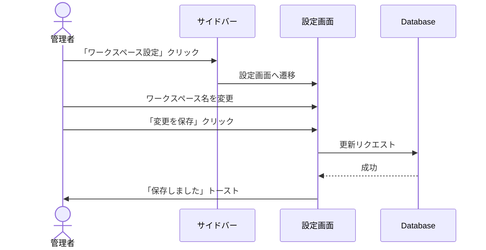
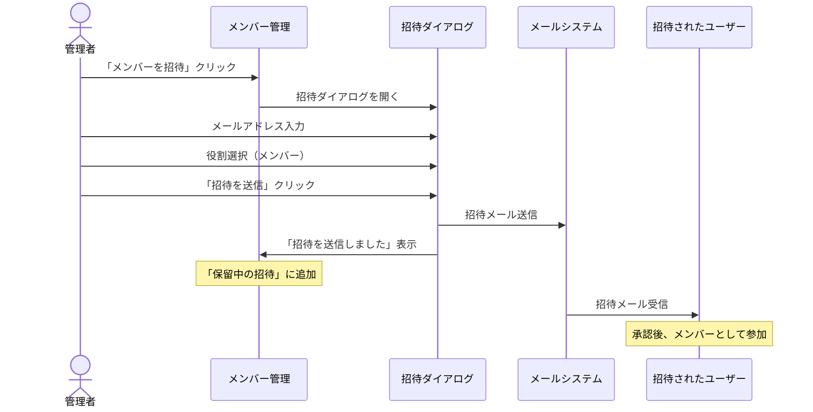
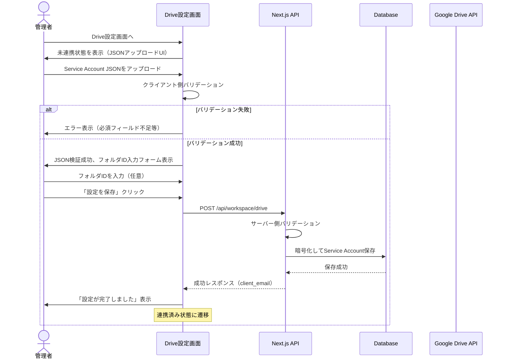
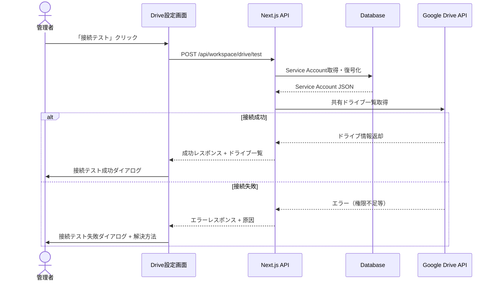
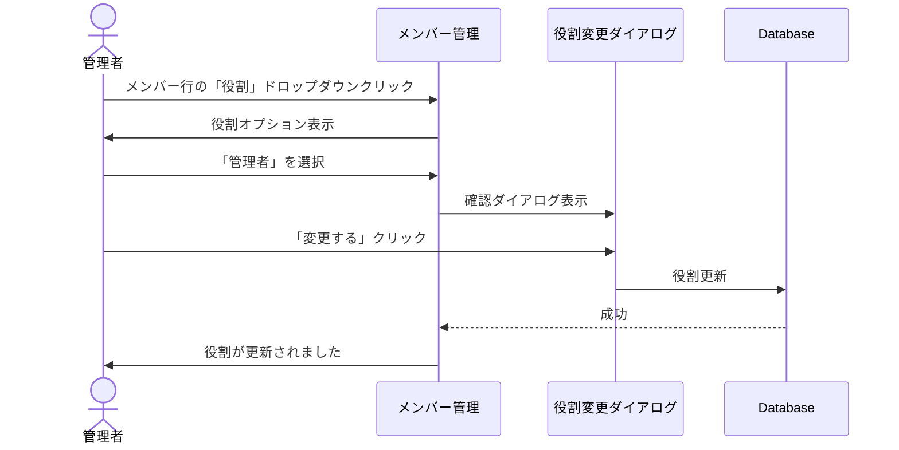

# 4. Workspace Settings - ワークスペース設定・管理画面設計

## 概要

ワークスペース内の設定・管理画面。管理者のみがアクセス可能。ワークスペース設定、メンバー管理、Google Drive連携などを行う。

## 画面一覧

| 画面ID | 画面名 | パス | 説明 | アクセス権限 |
|--------|--------|------|------|-------------|
| WS-001 | ダッシュボード | `/[slug]/dashboard` | ワークスペースホーム | 全メンバー |
| WS-002 | ワークスペース設定 | `/[slug]/settings` | 基本設定 | 管理者のみ |
| WS-003 | メンバー管理 | `/[slug]/members` | メンバー招待・管理 | 管理者のみ |
| WS-004 | Google Drive連携 | `/[slug]/settings/drive` | Drive接続設定 | 管理者のみ |

---

## 共通レイアウト

```
┌─────────────────────────────────────────────────────────────────────────────┐
│ [HEADER]                                                                     │
│ ┌─────────────────────────────────────────────────────────────────────────┐ │
│ │  🎬 T-Agent    ABC制作会社 ▼           🔔     👤 山田太郎 ▼            │ │
│ └─────────────────────────────────────────────────────────────────────────┘ │
├─────────────────────────────────────────────────────────────────────────────┤
│ [SIDEBAR]                        │ [MAIN CONTENT]                           │
│ ┌──────────────────────────────┐ │                                          │
│ │ 🏠 ダッシュボード            │ │                                          │
│ │                              │ │                                          │
│ │ 📺 番組                      │ │                                          │
│ │   ├ 朝の情報番組             │ │                                          │
│ │   ├ 夜のバラエティ           │ │                                          │
│ │   └ + 新しい番組             │ │                                          │
│ │                              │ │                                          │
│ │ ─────────────────────────    │ │                                          │
│ │                              │ │                                          │
│ │ ⚙️ ワークスペース設定        │ │                                          │
│ │ 👥 メンバー管理              │ │                                          │
│ │ 📁 Google Drive              │ │                                          │
│ │                              │ │                                          │
│ └──────────────────────────────┘ │                                          │
│                                  │                                          │
└─────────────────────────────────────────────────────────────────────────────┘
```

---

## WS-001: ダッシュボード

### ワイヤーフレーム

```
┌─────────────────────────────────────────────────────────────────────────────┐
│ [HEADER]                                                                     │
├─────────────────────────────────────────────────────────────────────────────┤
│ [SIDEBAR]          │ [MAIN CONTENT]                                         │
│                    │                                                        │
│                    │   ABC制作会社                                          │
│                    │   ワークスペースダッシュボード                          │
│                    │                                                        │
│                    │   ┌───────────────────────────────────────────────────┐│
│                    │   │ 統計サマリー                                      ││
│                    │   ├───────────────────────────────────────────────────┤│
│                    │   │                                                   ││
│                    │   │  ┌───────────┐ ┌───────────┐ ┌───────────┐       ││
│                    │   │  │ 番組      │ │ チーム    │ │ セッション│       ││
│                    │   │  │    5      │ │    12     │ │    156    │       ││
│                    │   │  └───────────┘ └───────────┘ └───────────┘       ││
│                    │   │                                                   ││
│                    │   └───────────────────────────────────────────────────┘│
│                    │                                                        │
│                    │   ┌───────────────────────────────────────────────────┐│
│                    │   │ 番組一覧                         + 新しい番組    ││
│                    │   ├───────────────────────────────────────────────────┤│
│                    │   │                                                   ││
│                    │   │  ┌─────────────────────────────────────────────┐  ││
│                    │   │  │ 🎬 朝の情報番組                             │  ││
│                    │   │  │                                             │  ││
│                    │   │  │ チーム: 3  •  セッション: 45  •  最終: 2時間前 │  ││
│                    │   │  │                                             │  ││
│                    │   │  │ [リサーチ] [企画] [構成]                     │  ││
│                    │   │  └─────────────────────────────────────────────┘  ││
│                    │   │                                                   ││
│                    │   │  ┌─────────────────────────────────────────────┐  ││
│                    │   │  │ 🎬 夜のバラエティ                           │  ││
│                    │   │  │                                             │  ││
│                    │   │  │ チーム: 4  •  セッション: 78  •  最終: 昨日   │  ││
│                    │   │  │                                             │  ││
│                    │   │  │ [ネタ探し] [リサーチ] [企画] [構成]           │  ││
│                    │   │  └─────────────────────────────────────────────┘  ││
│                    │   │                                                   ││
│                    │   └───────────────────────────────────────────────────┘│
│                    │                                                        │
│                    │   ┌───────────────────────────────────────────────────┐│
│                    │   │ 最近のアクティビティ                             ││
│                    │   ├───────────────────────────────────────────────────┤│
│                    │   │                                                   ││
│                    │   │ • 田中さんが「企画チーム」で成果物を出力 - 30分前 ││
│                    │   │ • 鈴木さんが「リサーチ」でセッション開始 - 1時間前││
│                    │   │ • 山田さんが新しいチームを作成 - 3時間前          ││
│                    │   │                                                   ││
│                    │   └───────────────────────────────────────────────────┘│
│                    │                                                        │
└─────────────────────────────────────────────────────────────────────────────┘
```

---

## WS-002: ワークスペース設定

### ワイヤーフレーム

```
┌─────────────────────────────────────────────────────────────────────────────┐
│ [HEADER]                                                                     │
├─────────────────────────────────────────────────────────────────────────────┤
│ [SIDEBAR]          │ [MAIN CONTENT]                                         │
│                    │                                                        │
│  ⚙️ 設定 ◀        │   ワークスペース設定                                   │
│                    │                                                        │
│                    │   ┌───────────────────────────────────────────────────┐│
│                    │   │ 基本情報                                         ││
│                    │   ├───────────────────────────────────────────────────┤│
│                    │   │                                                   ││
│                    │   │  ┌──────────────┐                                 ││
│                    │   │  │     🏢      │  ロゴを変更                      ││
│                    │   │  │    Logo     │                                 ││
│                    │   │  └──────────────┘                                 ││
│                    │   │                                                   ││
│                    │   │  ワークスペース名 *                               ││
│                    │   │  ┌─────────────────────────────────────────────┐  ││
│                    │   │  │ ABC制作会社                                 │  ││
│                    │   │  └─────────────────────────────────────────────┘  ││
│                    │   │                                                   ││
│                    │   │  スラッグ（URL）                                  ││
│                    │   │  ┌─────────────────────────────────────────────┐  ││
│                    │   │  │ abc-production                              │  ││
│                    │   │  └─────────────────────────────────────────────┘  ││
│                    │   │  t-agent.app/abc-production                      ││
│                    │   │                                                   ││
│                    │   │  説明                                             ││
│                    │   │  ┌─────────────────────────────────────────────┐  ││
│                    │   │  │ TV番組制作会社のAI活用ワークスペース       │  ││
│                    │   │  │                                             │  ││
│                    │   │  └─────────────────────────────────────────────┘  ││
│                    │   │                                                   ││
│                    │   │  ウェブサイトURL                                  ││
│                    │   │  ┌─────────────────────────────────────────────┐  ││
│                    │   │  │ https://abc-production.co.jp               │  ││
│                    │   │  └─────────────────────────────────────────────┘  ││
│                    │   │                                                   ││
│                    │   │  ┌──────────────────────┐                         ││
│                    │   │  │      変更を保存      │                         ││
│                    │   │  └──────────────────────┘                         ││
│                    │   │                                                   ││
│                    │   └───────────────────────────────────────────────────┘│
│                    │                                                        │
│                    │   ┌───────────────────────────────────────────────────┐│
│                    │   │ 危険な操作                                       ││
│                    │   ├───────────────────────────────────────────────────┤│
│                    │   │                                                   ││
│                    │   │  ワークスペースを削除                             ││
│                    │   │                                                   ││
│                    │   │  ⚠️ この操作は取り消せません。すべてのデータ      ││
│                    │   │  （番組、チーム、セッション）が削除されます。     ││
│                    │   │                                                   ││
│                    │   │  ┌──────────────────────┐                         ││
│                    │   │  │ ワークスペースを削除 │                         ││
│                    │   │  └──────────────────────┘                         ││
│                    │   │                                                   ││
│                    │   └───────────────────────────────────────────────────┘│
│                    │                                                        │
└─────────────────────────────────────────────────────────────────────────────┘
```

### 削除確認ダイアログ

```
┌─────────────────────────────────────────────────────────────────┐
│                                                                 │
│  ⚠️ ワークスペースを削除しますか？                             │
│                                                                 │
│  「ABC制作会社」を削除すると、以下のすべてが完全に             │
│  削除されます：                                                 │
│                                                                 │
│  • 5つの番組                                                    │
│  • 12のチーム                                                   │
│  • 156のチャットセッション                                      │
│  • すべての成果物                                               │
│                                                                 │
│  確認のため、ワークスペース名を入力してください：               │
│  ┌───────────────────────────────────────────────────────────┐  │
│  │                                                           │  │
│  └───────────────────────────────────────────────────────────┘  │
│                                                                 │
│  ┌───────────────────────┐  ┌───────────────────────┐          │
│  │      キャンセル       │  │    永久に削除する     │          │
│  └───────────────────────┘  └───────────────────────┘          │
│                                                                 │
└─────────────────────────────────────────────────────────────────┘
```

---

## WS-003: メンバー管理

### ワイヤーフレーム

```
┌─────────────────────────────────────────────────────────────────────────────┐
│ [HEADER]                                                                     │
├─────────────────────────────────────────────────────────────────────────────┤
│ [SIDEBAR]          │ [MAIN CONTENT]                                         │
│                    │                                                        │
│  👥 メンバー ◀    │   メンバー管理                                         │
│                    │                                                        │
│                    │   ┌───────────────────────────────────────────────────┐│
│                    │   │ 🔍 メンバーを検索...           + メンバーを招待   ││
│                    │   └───────────────────────────────────────────────────┘│
│                    │                                                        │
│                    │   ┌───────────────────────────────────────────────────┐│
│                    │   │ アクティブメンバー (12)                          ││
│                    │   ├───────────────────────────────────────────────────┤│
│                    │   │                                                   ││
│                    │   │ ┌─────────────────────────────────────────────┐   ││
│                    │   │ │ 👤 山田太郎                                 │   ││
│                    │   │ │ yamada@abc-production.co.jp                 │   ││
│                    │   │ │                                             │   ││
│                    │   │ │ 役割: [オーナー ▼]     参加日: 2024-01-15  │   ││
│                    │   │ └─────────────────────────────────────────────┘   ││
│                    │   │                                                   ││
│                    │   │ ┌─────────────────────────────────────────────┐   ││
│                    │   │ │ 👤 田中花子                                 │   ││
│                    │   │ │ tanaka@abc-production.co.jp                 │   ││
│                    │   │ │                                             │   ││
│                    │   │ │ 役割: [管理者 ▼]       参加日: 2024-02-01  │   ││
│                    │   │ │                                        [⋮] │   ││
│                    │   │ └─────────────────────────────────────────────┘   ││
│                    │   │                                                   ││
│                    │   │ ┌─────────────────────────────────────────────┐   ││
│                    │   │ │ 👤 鈴木一郎                                 │   ││
│                    │   │ │ suzuki@abc-production.co.jp                 │   ││
│                    │   │ │                                             │   ││
│                    │   │ │ 役割: [メンバー ▼]     参加日: 2024-03-10  │   ││
│                    │   │ │                                        [⋮] │   ││
│                    │   │ └─────────────────────────────────────────────┘   ││
│                    │   │                                                   ││
│                    │   │ [他10名を表示...]                                 ││
│                    │   │                                                   ││
│                    │   └───────────────────────────────────────────────────┘│
│                    │                                                        │
│                    │   ┌───────────────────────────────────────────────────┐│
│                    │   │ 保留中の招待 (2)                                 ││
│                    │   ├───────────────────────────────────────────────────┤│
│                    │   │                                                   ││
│                    │   │ ┌─────────────────────────────────────────────┐   ││
│                    │   │ │ ✉️ newmember@example.com                    │   ││
│                    │   │ │                                             │   ││
│                    │   │ │ 役割: メンバー  •  招待者: 山田太郎          │   ││
│                    │   │ │ 有効期限: 2025-01-25                        │   ││
│                    │   │ │                                             │   ││
│                    │   │ │             [招待を取消] [再送信]            │   ││
│                    │   │ └─────────────────────────────────────────────┘   ││
│                    │   │                                                   ││
│                    │   └───────────────────────────────────────────────────┘│
│                    │                                                        │
└─────────────────────────────────────────────────────────────────────────────┘
```

### メンバー招待ダイアログ

```
┌─────────────────────────────────────────────────────────────────┐
│                                                                 │
│  メンバーを招待                                                 │
│                                                                 │
│  ┌───────────────────────────────────────────────────────────┐  │
│  │ メールアドレス                                            │  │
│  │ ┌─────────────────────────────────────────────────────┐   │  │
│  │ │ example@company.com                                 │   │  │
│  │ └─────────────────────────────────────────────────────┘   │  │
│  │                                                           │  │
│  │ 複数のメールアドレスをカンマ区切りで入力できます          │  │
│  └───────────────────────────────────────────────────────────┘  │
│                                                                 │
│  ┌───────────────────────────────────────────────────────────┐  │
│  │ 役割                                                      │  │
│  │ ┌─────────────────────────────────────────────────────┐   │  │
│  │ │ ○ 管理者 - すべての設定と管理が可能                │   │  │
│  │ │ ● メンバー - 番組とチームの利用が可能               │   │  │
│  │ └─────────────────────────────────────────────────────┘   │  │
│  └───────────────────────────────────────────────────────────┘  │
│                                                                 │
│  ┌───────────────────────────────────────────────────────────┐  │
│  │ 招待メッセージ（任意）                                    │  │
│  │ ┌─────────────────────────────────────────────────────┐   │  │
│  │ │ ABC制作会社のT-Agentワークスペースに参加して       │   │  │
│  │ │ ください。                                          │   │  │
│  │ └─────────────────────────────────────────────────────┘   │  │
│  └───────────────────────────────────────────────────────────┘  │
│                                                                 │
│  ┌───────────────────────┐  ┌───────────────────────┐          │
│  │      キャンセル       │  │     招待を送信        │          │
│  └───────────────────────┘  └───────────────────────┘          │
│                                                                 │
└─────────────────────────────────────────────────────────────────┘
```

### メンバー [⋮] メニュー

| メニュー項目 | 条件 | アクション |
|-------------|------|----------|
| 役割を変更 | 自分以外 | 役割変更ダイアログ |
| 削除する | 自分以外、オーナー以外 | 削除確認ダイアログ |

---

## WS-004: Google Drive連携設定

### ワイヤーフレーム（未連携時）

```
┌─────────────────────────────────────────────────────────────────────────────┐
│ [HEADER]                                                                     │
├─────────────────────────────────────────────────────────────────────────────┤
│ [SIDEBAR]          │ [MAIN CONTENT]                                         │
│                    │                                                        │
│  📁 Drive ◀       │   Google Drive連携                                     │
│                    │                                                        │
│                    │   ┌───────────────────────────────────────────────────┐│
│                    │   │ Service Account設定                              ││
│                    │   ├───────────────────────────────────────────────────┤│
│                    │   │                                                   ││
│                    │   │  Google Cloud ConsoleでService Accountを作成し、  ││
│                    │   │  JSONキーファイルをアップロードしてください。      ││
│                    │   │                                                   ││
│                    │   │  ┌─────────────────────────────────────────────┐  ││
│                    │   │  │                                             │  ││
│                    │   │  │        📁 JSONファイルをドロップ            │  ││
│                    │   │  │                                             │  ││
│                    │   │  │      または クリックしてファイルを選択      │  ││
│                    │   │  │                                             │  ││
│                    │   │  └─────────────────────────────────────────────┘  ││
│                    │   │                                                   ││
│                    │   │  💡 Service Account JSONには以下が必要です：      ││
│                    │   │     • type: "service_account"                    ││
│                    │   │     • client_email                               ││
│                    │   │     • private_key                                ││
│                    │   │                                                   ││
│                    │   └───────────────────────────────────────────────────┘│
│                    │                                                        │
│                    │   ┌───────────────────────────────────────────────────┐│
│                    │   │ 📖 セットアップガイド                            ││
│                    │   ├───────────────────────────────────────────────────┤│
│                    │   │                                                   ││
│                    │   │  1. Google Cloud Consoleでプロジェクト作成       ││
│                    │   │  2. Google Drive APIを有効化                      ││
│                    │   │  3. Service Accountを作成                         ││
│                    │   │  4. JSONキーをダウンロード                        ││
│                    │   │  5. 共有ドライブでService Accountを共有設定       ││
│                    │   │                                                   ││
│                    │   │  ┌─────────────────────────────────────────────┐  ││
│                    │   │  │   📄 詳細なセットアップ手順を見る           │  ││
│                    │   │  └─────────────────────────────────────────────┘  ││
│                    │   │                                                   ││
│                    │   └───────────────────────────────────────────────────┘│
│                    │                                                        │
└─────────────────────────────────────────────────────────────────────────────┘
```

### ワイヤーフレーム（JSONアップロード後・バリデーション成功）

```
┌─────────────────────────────────────────────────────────────────────────────┐
│ [HEADER]                                                                     │
├─────────────────────────────────────────────────────────────────────────────┤
│ [SIDEBAR]          │ [MAIN CONTENT]                                         │
│                    │                                                        │
│  📁 Drive ◀       │   Google Drive連携                                     │
│                    │                                                        │
│                    │   ┌───────────────────────────────────────────────────┐│
│                    │   │ Service Account設定                              ││
│                    │   ├───────────────────────────────────────────────────┤│
│                    │   │                                                   ││
│                    │   │  ✅ JSONファイルが有効です                        ││
│                    │   │                                                   ││
│                    │   │  ┌─────────────────────────────────────────────┐  ││
│                    │   │  │ 📄 abc-production-sa-key.json               │  ││
│                    │   │  │                                             │  ││
│                    │   │  │ Project ID: abc-production-12345            │  ││
│                    │   │  │ Client Email: sa@abc-production.iam...      │  ││
│                    │   │  │                                    [❌ 削除] │  ││
│                    │   │  └─────────────────────────────────────────────┘  ││
│                    │   │                                                   ││
│                    │   └───────────────────────────────────────────────────┘│
│                    │                                                        │
│                    │   ┌───────────────────────────────────────────────────┐│
│                    │   │ フォルダ設定                                     ││
│                    │   ├───────────────────────────────────────────────────┤│
│                    │   │                                                   ││
│                    │   │  参照フォルダID（任意）                           ││
│                    │   │  ┌─────────────────────────────────────────────┐  ││
│                    │   │  │ 1ABCdefGHIjklMNOpqrSTUvwxYZ                │  ││
│                    │   │  └─────────────────────────────────────────────┘  ││
│                    │   │  チャットで参照可能なファイルのルートフォルダ     ││
│                    │   │                                                   ││
│                    │   │  出力フォルダID（任意）                           ││
│                    │   │  ┌─────────────────────────────────────────────┐  ││
│                    │   │  │ 2XYZabcDEFghiJKLmnoPQRstuvWX                │  ││
│                    │   │  └─────────────────────────────────────────────┘  ││
│                    │   │  成果物の出力先フォルダ                           ││
│                    │   │                                                   ││
│                    │   └───────────────────────────────────────────────────┘│
│                    │                                                        │
│                    │   ┌─────────────────┐  ┌─────────────────┐             │
│                    │   │    キャンセル   │  │   設定を保存    │             │
│                    │   └─────────────────┘  └─────────────────┘             │
│                    │                                                        │
└─────────────────────────────────────────────────────────────────────────────┘
```

### ワイヤーフレーム（JSONアップロード後・バリデーションエラー）

```
┌───────────────────────────────────────────────────────────────────────────┐
│ [MAIN CONTENT]                                                             │
│                                                                            │
│   ┌───────────────────────────────────────────────────────────────────┐   │
│   │ Service Account設定                                               │   │
│   ├───────────────────────────────────────────────────────────────────┤   │
│   │                                                                   │   │
│   │  ❌ JSONファイルにエラーがあります                                 │   │
│   │                                                                   │   │
│   │  ┌─────────────────────────────────────────────────────────────┐  │   │
│   │  │ 📄 invalid-file.json                                       │  │   │
│   │  │                                                             │  │   │
│   │  │ ⚠️ エラー: 必須フィールドがありません: private_key          │  │   │
│   │  │                                                 [❌ 削除]   │  │   │
│   │  └─────────────────────────────────────────────────────────────┘  │   │
│   │                                                                   │   │
│   │  正しい形式のService Account JSONファイルを                       │   │
│   │  アップロードしてください。                                       │   │
│   │                                                                   │   │
│   └───────────────────────────────────────────────────────────────────┘   │
│                                                                            │
└───────────────────────────────────────────────────────────────────────────┘
```

### ワイヤーフレーム（連携済み）

```
┌─────────────────────────────────────────────────────────────────────────────┐
│ [HEADER]                                                                     │
├─────────────────────────────────────────────────────────────────────────────┤
│ [SIDEBAR]          │ [MAIN CONTENT]                                         │
│                    │                                                        │
│  📁 Drive ◀       │   Google Drive連携                                     │
│                    │                                                        │
│                    │   ┌───────────────────────────────────────────────────┐│
│                    │   │ 接続状態                                         ││
│                    │   ├───────────────────────────────────────────────────┤│
│                    │   │                                                   ││
│                    │   │  ✅ Google Driveに接続済み                        ││
│                    │   │                                                   ││
│                    │   │  Service Account:                                 ││
│                    │   │  📧 sa-drive@abc-production.iam.gserviceaccount.com│
│                    │   │                                                   ││
│                    │   │  設定日時: 2025-01-18 10:30                       ││
│                    │   │                                                   ││
│                    │   │  ┌─────────────────┐  ┌─────────────────┐         ││
│                    │   │  │   接続テスト    │  │   連携を解除    │         ││
│                    │   │  └─────────────────┘  └─────────────────┘         ││
│                    │   │                                                   ││
│                    │   └───────────────────────────────────────────────────┘│
│                    │                                                        │
│                    │   ┌───────────────────────────────────────────────────┐│
│                    │   │ フォルダ設定                                     ││
│                    │   ├───────────────────────────────────────────────────┤│
│                    │   │                                                   ││
│                    │   │  参照フォルダID                                   ││
│                    │   │  ┌─────────────────────────────────────────────┐  ││
│                    │   │  │ 1ABCdefGHIjklMNOpqrSTUvwxYZ                │  ││
│                    │   │  └─────────────────────────────────────────────┘  ││
│                    │   │  チャットで参照可能なファイルのルートフォルダ     ││
│                    │   │                                                   ││
│                    │   │  出力フォルダID                                   ││
│                    │   │  ┌─────────────────────────────────────────────┐  ││
│                    │   │  │ 2XYZabcDEFghiJKLmnoPQRstuvWX                │  ││
│                    │   │  └─────────────────────────────────────────────┘  ││
│                    │   │  成果物の出力先フォルダ                           ││
│                    │   │                                                   ││
│                    │   │  ┌─────────────────────────────────────────────┐  ││
│                    │   │  │              フォルダ設定を更新              │  ││
│                    │   │  └─────────────────────────────────────────────┘  ││
│                    │   │                                                   ││
│                    │   └───────────────────────────────────────────────────┘│
│                    │                                                        │
│                    │   ┌───────────────────────────────────────────────────┐│
│                    │   │ キャッシュ設定                                   ││
│                    │   ├───────────────────────────────────────────────────┤│
│                    │   │                                                   ││
│                    │   │  @メンション用ファイルキャッシュ                  ││
│                    │   │                                                   ││
│                    │   │  キャッシュ済みファイル: 1,234                    ││
│                    │   │  最終更新: 2025-01-18 10:30                       ││
│                    │   │                                                   ││
│                    │   │  ┌─────────────────┐                              ││
│                    │   │  │ キャッシュを更新 │                              ││
│                    │   │  └─────────────────┘                              ││
│                    │   │                                                   ││
│                    │   └───────────────────────────────────────────────────┘│
│                    │                                                        │
└─────────────────────────────────────────────────────────────────────────────┘
```

### 接続テスト結果（成功）

```
┌───────────────────────────────────────────────────────────────┐
│                                                               │
│  ✅ 接続テスト成功                                            │
│                                                               │
│  Google Drive APIへの接続に成功しました。                     │
│                                                               │
│  アクセス可能な共有ドライブ:                                  │
│  • ABC制作会社 共有ドライブ (1,234 ファイル)                  │
│  • 番組アーカイブ (5,678 ファイル)                            │
│                                                               │
│  ┌─────────────────────┐                                      │
│  │        閉じる       │                                      │
│  └─────────────────────┘                                      │
│                                                               │
└───────────────────────────────────────────────────────────────┘
```

### 接続テスト結果（失敗）

```
┌───────────────────────────────────────────────────────────────┐
│                                                               │
│  ❌ 接続テスト失敗                                            │
│                                                               │
│  Google Drive APIへの接続に失敗しました。                     │
│                                                               │
│  エラー: Service Accountに共有ドライブへのアクセス権限が      │
│         ありません。                                          │
│                                                               │
│  解決方法:                                                    │
│  1. Google Driveの共有設定を開く                              │
│  2. Service Accountのメールアドレスを追加                     │
│  3. 「閲覧者」または「編集者」権限を付与                      │
│                                                               │
│  ┌─────────────────────┐                                      │
│  │        閉じる       │                                      │
│  └─────────────────────┘                                      │
│                                                               │
└───────────────────────────────────────────────────────────────┘
```

---

## ユーザーシナリオ

### シナリオ 1: ワークスペース設定の変更



### シナリオ 2: 新しいメンバーの招待



### シナリオ 3: Google Drive連携（Service Account方式）



### シナリオ 3-2: 接続テスト



### シナリオ 4: メンバーの役割変更



---

## アクセス制御

| 画面 | オーナー | 管理者 | メンバー |
|------|---------|--------|---------|
| ダッシュボード | ✅ | ✅ | ✅ |
| ワークスペース設定 | ✅ | ✅ | ❌ |
| メンバー管理 | ✅ | ✅ | ❌ |
| Google Drive設定 | ✅ | ✅ | ❌ |
| ワークスペース削除 | ✅ | ❌ | ❌ |
| オーナー権限移譲 | ✅ | ❌ | ❌ |

---

## エラー状態

### 権限エラー

```
┌─────────────────────────────────────────────────────────────────┐
│                                                                 │
│                        ⛔                                       │
│                                                                 │
│              アクセス権限がありません                           │
│                                                                 │
│  このページを表示するには管理者権限が必要です。                │
│                                                                 │
│  ┌───────────────────────┐                                      │
│  │   ダッシュボードへ戻る │                                      │
│  └───────────────────────┘                                      │
│                                                                 │
└─────────────────────────────────────────────────────────────────┘
```

### Google Drive接続エラー

#### Service Account設定エラー

```
┌─────────────────────────────────────────────────────────────────┐
│                                                                 │
│  ⚠️ Service Accountの設定に問題があります                      │
│                                                                 │
│  Service Account JSONが正しく設定されていないか、              │
│  認証情報が無効になっている可能性があります。                   │
│                                                                 │
│  ┌───────────────────────┐                                      │
│  │   設定を確認する      │                                      │
│  └───────────────────────┘                                      │
│                                                                 │
└─────────────────────────────────────────────────────────────────┘
```

#### アクセス権限エラー

```
┌─────────────────────────────────────────────────────────────────┐
│                                                                 │
│  ⚠️ Google Driveへのアクセス権限がありません                   │
│                                                                 │
│  Service Accountが共有ドライブに追加されていないか、            │
│  必要な権限が付与されていません。                               │
│                                                                 │
│  解決方法:                                                      │
│  1. Google Driveで対象フォルダ/ドライブを開く                   │
│  2. 「共有」設定でService Accountのメールアドレスを追加         │
│  3. 適切な権限（閲覧者/編集者）を付与                           │
│                                                                 │
│  Service Account: sa@project.iam.gserviceaccount.com            │
│                                                                 │
│  ┌───────────────────────┐  ┌───────────────────────┐           │
│  │   接続を再テスト      │  │   設定を変更する      │           │
│  └───────────────────────┘  └───────────────────────┘           │
│                                                                 │
└─────────────────────────────────────────────────────────────────┘
```

#### JSONファイル形式エラー

```
┌─────────────────────────────────────────────────────────────────┐
│                                                                 │
│  ❌ JSONファイルが無効です                                      │
│                                                                 │
│  アップロードされたファイルはGoogle Service Account形式         │
│  ではありません。                                               │
│                                                                 │
│  必要なフィールド:                                              │
│  • type: "service_account"                                     │
│  • project_id                                                  │
│  • private_key                                                 │
│  • client_email                                                │
│                                                                 │
│  Google Cloud Consoleから正しいService Account JSONを           │
│  ダウンロードしてください。                                     │
│                                                                 │
│  ┌───────────────────────┐                                      │
│  │   別のファイルを選択   │                                      │
│  └───────────────────────┘                                      │
│                                                                 │
└─────────────────────────────────────────────────────────────────┘
```
