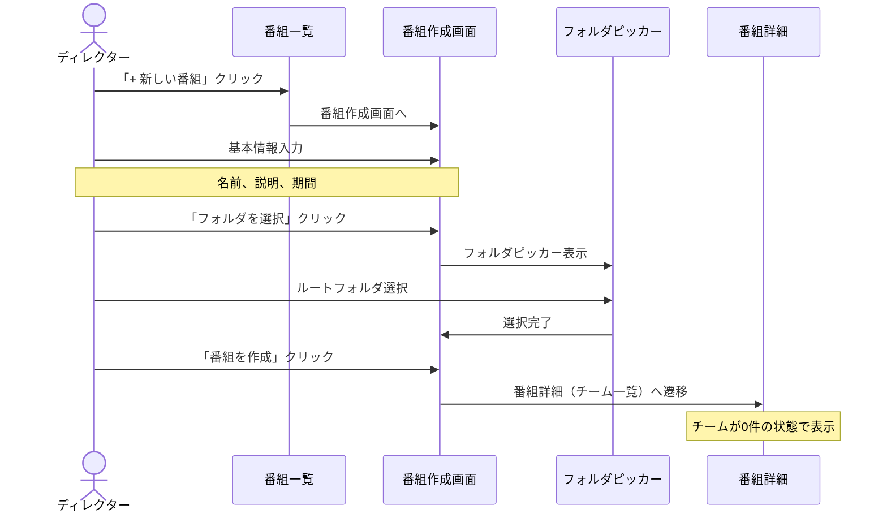
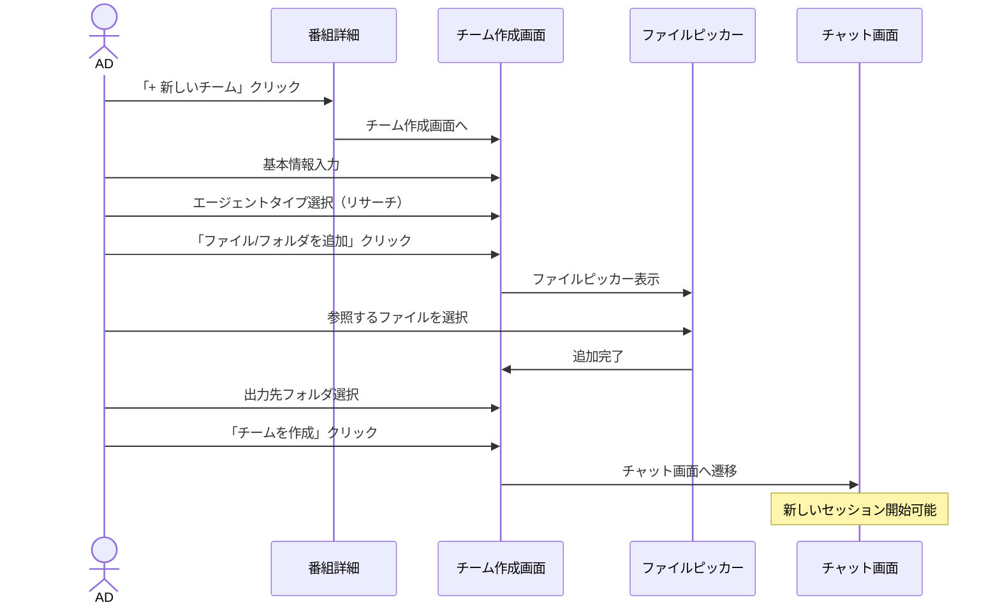
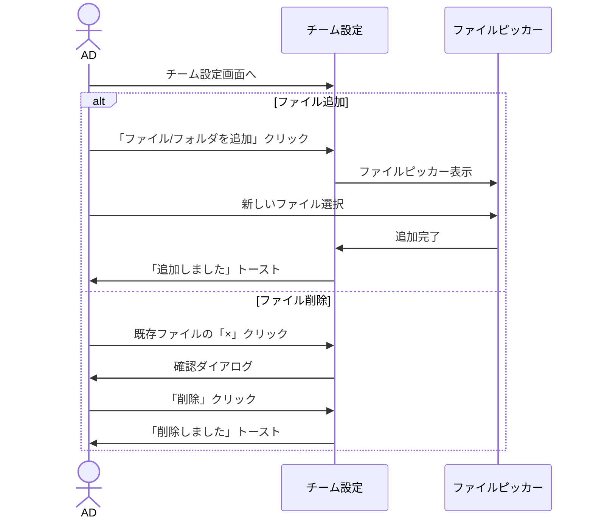
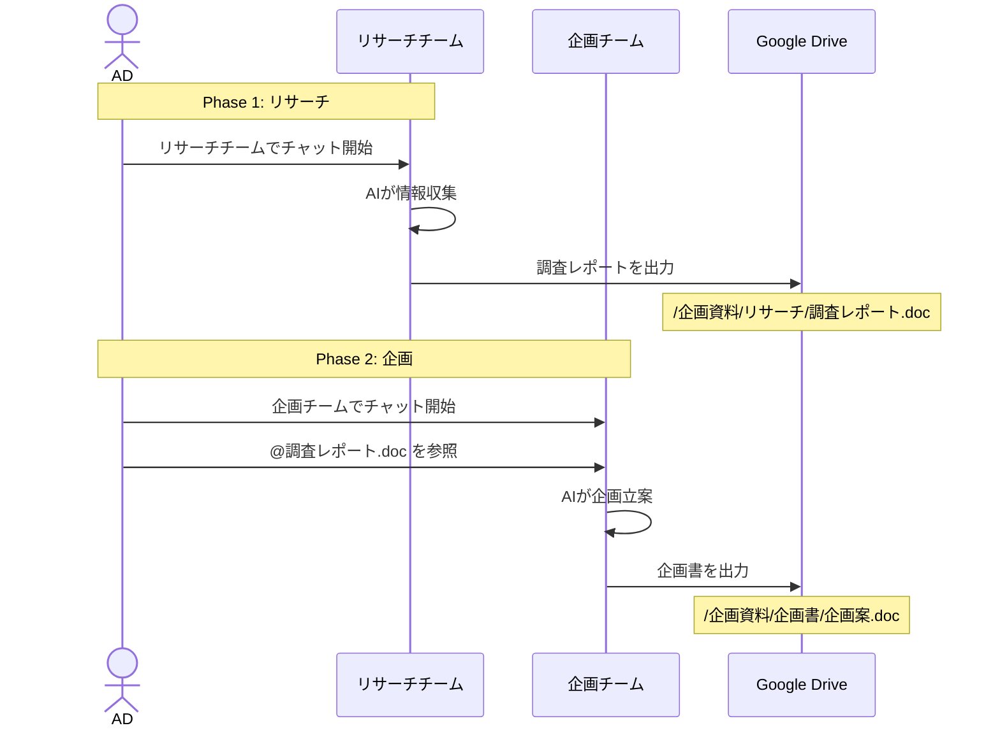

# 5. Program/Team - 番組・チーム管理画面設計

## 概要

番組とチームの作成・管理画面。番組はGoogle Driveのルートディレクトリと連携し、チームはエージェントタイプと参照ファイルを設定する。

## Google Drive フォルダ設定の階層構造

```
Workspace (ワークスペース設定: /settings/drive)
  └─ Service Account JSON のみ設定
     ※ フォルダIDはここでは設定しない

Program (番組設定: PG-002, PG-004)
  └─ 参照フォルダ (rootFolderId)
     - @メンションで参照できるルートフォルダ
     - 番組作成時に設定（STEP 2: Google Drive連携）

Team (チーム設定: TM-001, TM-002)
  └─ 出力フォルダ (outputFolderId)
     - 成果物を保存するフォルダ
     - チーム作成時に設定（STEP 5: 出力先設定）
```

**設計理由:**
- **参照フォルダ**: 番組ごとに異なる資料フォルダを使用するため、番組単位で設定
- **出力フォルダ**: チームごとに成果物の種類が異なるため、チーム単位で設定
- **Service Account**: ワークスペース全体で共有する認証情報のため、ワークスペース単位で設定

## 画面一覧

| 画面ID | 画面名 | パス | 説明 |
|--------|--------|------|------|
| PG-001 | 番組一覧 | `/[slug]/programs` | ワークスペース内の番組一覧 |
| PG-002 | 番組作成 | `/[slug]/programs/new` | 新規番組作成 |
| PG-003 | 番組詳細 | `/[slug]/programs/[programId]` | 番組のチーム一覧 |
| PG-004 | 番組設定 | `/[slug]/programs/[programId]/settings` | 番組設定編集 |
| TM-001 | チーム作成 | `/[slug]/programs/[programId]/teams/new` | 新規チーム作成 |
| TM-002 | チーム設定 | `/[slug]/programs/[programId]/teams/[teamId]/settings` | チーム設定編集 |

---

## PG-001: 番組一覧

### ワイヤーフレーム

```
┌─────────────────────────────────────────────────────────────────────────────┐
│ [HEADER]                                                                     │
├─────────────────────────────────────────────────────────────────────────────┤
│ [SIDEBAR]          │ [MAIN CONTENT]                                         │
│                    │                                                        │
│  📺 番組 ◀        │   番組一覧                                             │
│                    │                                                        │
│                    │   ┌───────────────────────────────────────────────────┐│
│                    │   │ 🔍 番組を検索...                    + 新しい番組  ││
│                    │   └───────────────────────────────────────────────────┘│
│                    │                                                        │
│                    │   ┌───────────────────────────────────────────────────┐│
│                    │   │                                                   ││
│                    │   │  ┌─────────────────────────────────────────────┐  ││
│                    │   │  │ ┌────────────┐                              │  ││
│                    │   │  │ │   Cover    │  朝の情報番組               │  ││
│                    │   │  │ │   Image    │                              │  ││
│                    │   │  │ │            │  毎週月〜金の朝の情報番組    │  ││
│                    │   │  │ └────────────┘                              │  ││
│                    │   │  │                                             │  ││
│                    │   │  │  チーム: 3  •  セッション: 45               │  ││
│                    │   │  │  📁 /朝の情報番組                           │  ││
│                    │   │  │                                             │  ││
│                    │   │  │  ステータス: ● 進行中                       │  ││
│                    │   │  │  期間: 2024/04/01 - 2025/03/31              │  ││
│                    │   │  │                                     [⋮]    │  ││
│                    │   │  └─────────────────────────────────────────────┘  ││
│                    │   │                                                   ││
│                    │   │  ┌─────────────────────────────────────────────┐  ││
│                    │   │  │ ┌────────────┐                              │  ││
│                    │   │  │ │   Cover    │  夜のバラエティ              │  ││
│                    │   │  │ │   Image    │                              │  ││
│                    │   │  │ │            │  毎週土曜22時からのバラエティ │  ││
│                    │   │  │ └────────────┘                              │  ││
│                    │   │  │                                             │  ││
│                    │   │  │  チーム: 4  •  セッション: 78               │  ││
│                    │   │  │  📁 /夜のバラエティ                         │  ││
│                    │   │  │                                             │  ││
│                    │   │  │  ステータス: ● 進行中                       │  ││
│                    │   │  │  期間: 2024/10/01 - 2025/09/30              │  ││
│                    │   │  │                                     [⋮]    │  ││
│                    │   │  └─────────────────────────────────────────────┘  ││
│                    │   │                                                   ││
│                    │   │  ┌─────────────────────────────────────────────┐  ││
│                    │   │  │ ┌────────────┐                              │  ││
│                    │   │  │ │   Cover    │  特別企画2025               │  ││
│                    │   │  │ │   Image    │                              │  ││
│                    │   │  │ │            │  2025年新春特別番組          │  ││
│                    │   │  │ └────────────┘                              │  ││
│                    │   │  │                                             │  ││
│                    │   │  │  チーム: 2  •  セッション: 12               │  ││
│                    │   │  │  📁 /特別企画/2025新春                      │  ││
│                    │   │  │                                             │  ││
│                    │   │  │  ステータス: ○ 企画中                       │  ││
│                    │   │  │  期間: 2025/01/01 - 2025/01/05              │  ││
│                    │   │  │                                     [⋮]    │  ││
│                    │   │  └─────────────────────────────────────────────┘  ││
│                    │   │                                                   ││
│                    │   └───────────────────────────────────────────────────┘│
│                    │                                                        │
└─────────────────────────────────────────────────────────────────────────────┘
```

### [⋮] メニュー項目

| メニュー項目 | アクション |
|-------------|----------|
| 設定 | 番組設定画面へ |
| チームを追加 | チーム作成画面へ |
| アーカイブ | アーカイブ確認ダイアログ |
| 削除 | 削除確認ダイアログ |

---

## PG-002: 番組作成

### ワイヤーフレーム

```
┌─────────────────────────────────────────────────────────────────────────────┐
│ [HEADER]                                                                     │
├─────────────────────────────────────────────────────────────────────────────┤
│ [SIDEBAR]          │ [MAIN CONTENT]                                         │
│                    │                                                        │
│                    │   ← 戻る                                               │
│                    │                                                        │
│                    │   新しい番組を作成                                     │
│                    │                                                        │
│                    │   ┌───────────────────────────────────────────────────┐│
│                    │   │ STEP 1: 基本情報                                  ││
│                    │   ├───────────────────────────────────────────────────┤│
│                    │   │                                                   ││
│                    │   │  ┌──────────────────┐                             ││
│                    │   │  │                  │  カバー画像をアップロード   ││
│                    │   │  │    + 画像追加    │                             ││
│                    │   │  │                  │                             ││
│                    │   │  └──────────────────┘                             ││
│                    │   │                                                   ││
│                    │   │  番組名 *                                         ││
│                    │   │  ┌─────────────────────────────────────────────┐  ││
│                    │   │  │ 朝の情報番組                                │  ││
│                    │   │  └─────────────────────────────────────────────┘  ││
│                    │   │                                                   ││
│                    │   │  説明                                             ││
│                    │   │  ┌─────────────────────────────────────────────┐  ││
│                    │   │  │ 毎週月〜金曜日、朝8時から放送の情報番組    │  ││
│                    │   │  │                                             │  ││
│                    │   │  └─────────────────────────────────────────────┘  ││
│                    │   │                                                   ││
│                    │   │  ステータス                                       ││
│                    │   │  ┌─────────────────────────────────────────────┐  ││
│                    │   │  │ ○ 企画中  ● 進行中  ○ 完了  ○ 中止        │  ││
│                    │   │  └─────────────────────────────────────────────┘  ││
│                    │   │                                                   ││
│                    │   │  期間                                             ││
│                    │   │  ┌───────────────────┐  〜  ┌───────────────────┐││
│                    │   │  │ 2024/04/01        │      │ 2025/03/31        │││
│                    │   │  └───────────────────┘      └───────────────────┘││
│                    │   │                                                   ││
│                    │   └───────────────────────────────────────────────────┘│
│                    │                                                        │
│                    │   ┌───────────────────────────────────────────────────┐│
│                    │   │ STEP 2: Google Drive連携                          ││
│                    │   ├───────────────────────────────────────────────────┤│
│                    │   │                                                   ││
│                    │   │  番組のルートフォルダを選択                       ││
│                    │   │                                                   ││
│                    │   │  この番組で使用するGoogle Driveのルートフォルダを  ││
│                    │   │  選択してください。チームは、このフォルダ内の      ││
│                    │   │  ファイルを参照できます。                         ││
│                    │   │                                                   ││
│                    │   │  ┌─────────────────────────────────────────────┐  ││
│                    │   │  │                                             │  ││
│                    │   │  │  📁 ABC制作会社 共有ドライブ                │  ││
│                    │   │  │    └ 📁 番組制作                            │  ││
│                    │   │  │        ├ 📁 朝の情報番組  ← ✓ 選択中       │  ││
│                    │   │  │        ├ 📁 夜のバラエティ                  │  ││
│                    │   │  │        └ 📁 特別企画                        │  ││
│                    │   │  │                                             │  ││
│                    │   │  └─────────────────────────────────────────────┘  ││
│                    │   │                                                   ││
│                    │   │  選択中: /番組制作/朝の情報番組                   ││
│                    │   │  ┌─────────────────────────────────────────────┐  ││
│                    │   │  │ 🔗 https://drive.google.com/drive/folders/...│  ││
│                    │   │  └─────────────────────────────────────────────┘  ││
│                    │   │                                                   ││
│                    │   └───────────────────────────────────────────────────┘│
│                    │                                                        │
│                    │   ┌───────────────────────────────────────────────────┐│
│                    │   │                 番組を作成                        ││
│                    │   └───────────────────────────────────────────────────┘│
│                    │                                                        │
└─────────────────────────────────────────────────────────────────────────────┘
```

---

## PG-003: 番組詳細（チーム一覧）

### ワイヤーフレーム

```
┌─────────────────────────────────────────────────────────────────────────────┐
│ [HEADER]                                                                     │
├─────────────────────────────────────────────────────────────────────────────┤
│ [SIDEBAR]          │ [MAIN CONTENT]                                         │
│                    │                                                        │
│  📺 番組           │   ┌───────────────────────────────────────────────────┐│
│   ├ 朝の情報番組 ◀│   │ ┌────────────┐                                   ││
│   ├ 夜のバラエティ │   │ │   Cover    │  朝の情報番組            [設定]  ││
│   └ 特別企画2025   │   │ │   Image    │                                   ││
│                    │   │ │            │  毎週月〜金の朝の情報番組         ││
│                    │   │ └────────────┘                                   ││
│                    │   │                                                   ││
│                    │   │ 📁 /番組制作/朝の情報番組                        ││
│                    │   │ ステータス: ● 進行中                              ││
│                    │   │ 期間: 2024/04/01 - 2025/03/31                     ││
│                    │   └───────────────────────────────────────────────────┘│
│                    │                                                        │
│                    │   ┌───────────────────────────────────────────────────┐│
│                    │   │ チーム一覧                           + 新しいチーム││
│                    │   ├───────────────────────────────────────────────────┤│
│                    │   │                                                   ││
│                    │   │  ┌─────────────────────────────────────────────┐  ││
│                    │   │  │ 🔍 リサーチチーム                          │  ││
│                    │   │  │                                             │  ││
│                    │   │  │ エージェント: リサーチ                       │  ││
│                    │   │  │ セッション数: 15                            │  ││
│                    │   │  │ 最終更新: 2時間前                           │  ││
│                    │   │  │                                             │  ││
│                    │   │  │ 参照ファイル: 5個                           │  ││
│                    │   │  │ 出力先: /企画資料/リサーチ                  │  ││
│                    │   │  │                                             │  ││
│                    │   │  │ ┌────────────────┐                    [⋮]  │  ││
│                    │   │  │ │  チャットを開く │                          │  ││
│                    │   │  │ └────────────────┘                          │  ││
│                    │   │  └─────────────────────────────────────────────┘  ││
│                    │   │                                                   ││
│                    │   │  ┌─────────────────────────────────────────────┐  ││
│                    │   │  │ 💡 ネタ探しチーム                          │  ││
│                    │   │  │                                             │  ││
│                    │   │  │ エージェント: ネタ探し                       │  ││
│                    │   │  │ セッション数: 23                            │  ││
│                    │   │  │ 最終更新: 1日前                             │  ││
│                    │   │  │                                             │  ││
│                    │   │  │ 参照ファイル: 3個                           │  ││
│                    │   │  │ 出力先: /企画資料/ネタ                      │  ││
│                    │   │  │                                             │  ││
│                    │   │  │ ┌────────────────┐                    [⋮]  │  ││
│                    │   │  │ │  チャットを開く │                          │  ││
│                    │   │  │ └────────────────┘                          │  ││
│                    │   │  └─────────────────────────────────────────────┘  ││
│                    │   │                                                   ││
│                    │   │  ┌─────────────────────────────────────────────┐  ││
│                    │   │  │ 📝 企画作家チーム                          │  ││
│                    │   │  │                                             │  ││
│                    │   │  │ エージェント: 企画作家                       │  ││
│                    │   │  │ セッション数: 7                             │  ││
│                    │   │  │ 最終更新: 3時間前                           │  ││
│                    │   │  │                                             │  ││
│                    │   │  │ 参照ファイル: 8個                           │  ││
│                    │   │  │ 出力先: /企画資料/企画書                    │  ││
│                    │   │  │                                             │  ││
│                    │   │  │ ┌────────────────┐                    [⋮]  │  ││
│                    │   │  │ │  チャットを開く │                          │  ││
│                    │   │  │ └────────────────┘                          │  ││
│                    │   │  └─────────────────────────────────────────────┘  ││
│                    │   │                                                   ││
│                    │   └───────────────────────────────────────────────────┘│
│                    │                                                        │
└─────────────────────────────────────────────────────────────────────────────┘
```

---

## TM-001: チーム作成

### ワイヤーフレーム

```
┌─────────────────────────────────────────────────────────────────────────────┐
│ [HEADER]                                                                     │
├─────────────────────────────────────────────────────────────────────────────┤
│ [SIDEBAR]          │ [MAIN CONTENT]                                         │
│                    │                                                        │
│                    │   ← 戻る（朝の情報番組）                               │
│                    │                                                        │
│                    │   新しいチームを作成                                   │
│                    │                                                        │
│                    │   ┌───────────────────────────────────────────────────┐│
│                    │   │ STEP 1: 基本情報                                  ││
│                    │   ├───────────────────────────────────────────────────┤│
│                    │   │                                                   ││
│                    │   │  チーム名 *                                       ││
│                    │   │  ┌─────────────────────────────────────────────┐  ││
│                    │   │  │ リサーチチーム                              │  ││
│                    │   │  └─────────────────────────────────────────────┘  ││
│                    │   │                                                   ││
│                    │   │  説明                                             ││
│                    │   │  ┌─────────────────────────────────────────────┐  ││
│                    │   │  │ 番組で取り上げるネタのリサーチを行う        │  ││
│                    │   │  │                                             │  ││
│                    │   │  └─────────────────────────────────────────────┘  ││
│                    │   │                                                   ││
│                    │   └───────────────────────────────────────────────────┘│
│                    │                                                        │
│                    │   ┌───────────────────────────────────────────────────┐│
│                    │   │ STEP 2: エージェントタイプ                        ││
│                    │   ├───────────────────────────────────────────────────┤│
│                    │   │                                                   ││
│                    │   │  エージェントの役割を選択してください             ││
│                    │   │                                                   ││
│                    │   │  ┌─────────────────────────────────────────────┐  ││
│                    │   │  │                                             │  ││
│                    │   │  │  ┌───────────────┐  ┌───────────────┐       │  ││
│                    │   │  │  │ 🔍           │  │ 💡           │       │  ││
│                    │   │  │  │ リサーチ  ✓  │  │ ネタ探し     │       │  ││
│                    │   │  │  │              │  │              │       │  ││
│                    │   │  │  │ 情報収集・   │  │ トレンド・   │       │  ││
│                    │   │  │  │ 調査資料作成 │  │ 話題発掘     │       │  ││
│                    │   │  │  └───────────────┘  └───────────────┘       │  ││
│                    │   │  │                                             │  ││
│                    │   │  │  ┌───────────────┐  ┌───────────────┐       │  ││
│                    │   │  │  │ 📝           │  │ 🎬           │       │  ││
│                    │   │  │  │ 企画作家     │  │ 構成作家     │       │  ││
│                    │   │  │  │              │  │              │       │  ││
│                    │   │  │  │ 企画立案・   │  │ 台本・       │       │  ││
│                    │   │  │  │ 企画書作成   │  │ 構成作成     │       │  ││
│                    │   │  │  └───────────────┘  └───────────────┘       │  ││
│                    │   │  │                                             │  ││
│                    │   │  │  ┌───────────────┐                          │  ││
│                    │   │  │  │ ⚙️           │                          │  ││
│                    │   │  │  │ カスタム     │                          │  ││
│                    │   │  │  │              │                          │  ││
│                    │   │  │  │ 自分でプロン │                          │  ││
│                    │   │  │  │ プトを設定   │                          │  ││
│                    │   │  │  └───────────────┘                          │  ││
│                    │   │  │                                             │  ││
│                    │   │  └─────────────────────────────────────────────┘  ││
│                    │   │                                                   ││
│                    │   └───────────────────────────────────────────────────┘│
│                    │                                                        │
│                    │   ┌───────────────────────────────────────────────────┐│
│                    │   │ STEP 3: システムプロンプト（カスタムの場合）      ││
│                    │   ├───────────────────────────────────────────────────┤│
│                    │   │                                                   ││
│                    │   │  ※ カスタムエージェント選択時のみ表示            ││
│                    │   │                                                   ││
│                    │   │  システムプロンプト                               ││
│                    │   │  ┌─────────────────────────────────────────────┐  ││
│                    │   │  │ あなたは番組制作の専門アシスタントです。   │  ││
│                    │   │  │ 与えられた資料を分析し、視聴者に響く       │  ││
│                    │   │  │ コンテンツ企画を提案してください。         │  ││
│                    │   │  │                                             │  ││
│                    │   │  │                                             │  ││
│                    │   │  └─────────────────────────────────────────────┘  ││
│                    │   │                                                   ││
│                    │   │  出力フォーマットテンプレート                     ││
│                    │   │  ┌─────────────────────────────────────────────┐  ││
│                    │   │  │ ## タイトル                                 │  ││
│                    │   │  │ ## 概要                                     │  ││
│                    │   │  │ ## 詳細                                     │  ││
│                    │   │  └─────────────────────────────────────────────┘  ││
│                    │   │                                                   ││
│                    │   └───────────────────────────────────────────────────┘│
│                    │                                                        │
│                    │   ┌───────────────────────────────────────────────────┐│
│                    │   │ STEP 4: 参照ファイル設定                          ││
│                    │   ├───────────────────────────────────────────────────┤│
│                    │   │                                                   ││
│                    │   │  チームがアクセスできるファイル/フォルダを追加    ││
│                    │   │                                                   ││
│                    │   │  ┌─────────────────────────────────────────────┐  ││
│                    │   │  │ + ファイル/フォルダを追加                   │  ││
│                    │   │  └─────────────────────────────────────────────┘  ││
│                    │   │                                                   ││
│                    │   │  追加済み:                                        ││
│                    │   │  ┌─────────────────────────────────────────────┐  ││
│                    │   │  │ 📁 /企画資料          ☑ サブフォルダ含む [×]│  ││
│                    │   │  │ 📄 /会議録/2024-12.doc                   [×]│  ││
│                    │   │  │ 📄 /参考資料/競合分析.xlsx              [×]│  ││
│                    │   │  └─────────────────────────────────────────────┘  ││
│                    │   │                                                   ││
│                    │   └───────────────────────────────────────────────────┘│
│                    │                                                        │
│                    │   ┌───────────────────────────────────────────────────┐│
│                    │   │ STEP 5: 出力先設定                                ││
│                    │   ├───────────────────────────────────────────────────┤│
│                    │   │                                                   ││
│                    │   │  成果物の出力先フォルダを選択                     ││
│                    │   │                                                   ││
│                    │   │  ┌─────────────────────────────────────────────┐  ││
│                    │   │  │ 📁 /企画資料/リサーチ                   ✓  │  ││
│                    │   │  └─────────────────────────────────────────────┘  ││
│                    │   │  ┌──────────────────────────────┐                 ││
│                    │   │  │   フォルダを選択/変更        │                 ││
│                    │   │  └──────────────────────────────┘                 ││
│                    │   │                                                   ││
│                    │   └───────────────────────────────────────────────────┘│
│                    │                                                        │
│                    │   ┌───────────────────────────────────────────────────┐│
│                    │   │                 チームを作成                      ││
│                    │   └───────────────────────────────────────────────────┘│
│                    │                                                        │
└─────────────────────────────────────────────────────────────────────────────┘
```

---

## ファイル/フォルダ選択ダイアログ

```
┌─────────────────────────────────────────────────────────────────┐
│                                                                 │
│  ファイル/フォルダを選択                                        │
│                                                                 │
│  ┌───────────────────────────────────────────────────────────┐  │
│  │ 🔍 検索...                                                │  │
│  └───────────────────────────────────────────────────────────┘  │
│                                                                 │
│  ┌───────────────────────────────────────────────────────────┐  │
│  │ 📁 /朝の情報番組 (番組ルート)                             │  │
│  │                                                           │  │
│  │   ☐ 📁 企画資料                                          │  │
│  │      ├ ☐ 📁 リサーチ                                     │  │
│  │      │    ├ ☐ 📄 調査レポート01.doc                     │  │
│  │      │    └ ☐ 📄 競合分析.xlsx                          │  │
│  │      └ ☐ 📁 企画書                                       │  │
│  │   ☐ 📁 会議録                                            │  │
│  │      ├ ☐ 📄 2024-12-01_定例.doc                         │  │
│  │      └ ☐ 📄 2024-12-15_企画会議.doc                     │  │
│  │   ☐ 📁 参考資料                                          │  │
│  │      └ ☐ 📄 視聴率データ.xlsx                           │  │
│  │                                                           │  │
│  └───────────────────────────────────────────────────────────┘  │
│                                                                 │
│  選択中: 2ファイル, 1フォルダ                                   │
│                                                                 │
│  ☑ フォルダを選択した場合、サブフォルダも含める                │
│                                                                 │
│  ┌───────────────────────┐  ┌───────────────────────┐          │
│  │      キャンセル       │  │       追加する        │          │
│  └───────────────────────┘  └───────────────────────┘          │
│                                                                 │
└─────────────────────────────────────────────────────────────────┘
```

---

## TM-002: チーム設定

### ワイヤーフレーム

```
┌─────────────────────────────────────────────────────────────────────────────┐
│ [HEADER]                                                                     │
├─────────────────────────────────────────────────────────────────────────────┤
│ [SIDEBAR]          │ [MAIN CONTENT]                                         │
│                    │                                                        │
│                    │   ← 戻る（リサーチチーム）                             │
│                    │                                                        │
│                    │   チーム設定                                           │
│                    │                                                        │
│                    │   ┌───────────────────────────────────────────────────┐│
│                    │   │ 基本情報                                          ││
│                    │   ├───────────────────────────────────────────────────┤│
│                    │   │                                                   ││
│                    │   │  チーム名 *                                       ││
│                    │   │  ┌─────────────────────────────────────────────┐  ││
│                    │   │  │ リサーチチーム                              │  ││
│                    │   │  └─────────────────────────────────────────────┘  ││
│                    │   │                                                   ││
│                    │   │  説明                                             ││
│                    │   │  ┌─────────────────────────────────────────────┐  ││
│                    │   │  │ 番組で取り上げるネタのリサーチを行う        │  ││
│                    │   │  └─────────────────────────────────────────────┘  ││
│                    │   │                                                   ││
│                    │   │  エージェントタイプ: 🔍 リサーチ                  ││
│                    │   │  ※ 変更するにはチームを再作成してください        ││
│                    │   │                                                   ││
│                    │   │  ┌──────────────────────┐                         ││
│                    │   │  │      変更を保存      │                         ││
│                    │   │  └──────────────────────┘                         ││
│                    │   │                                                   ││
│                    │   └───────────────────────────────────────────────────┘│
│                    │                                                        │
│                    │   ┌───────────────────────────────────────────────────┐│
│                    │   │ 参照ファイル                                      ││
│                    │   ├───────────────────────────────────────────────────┤│
│                    │   │                                                   ││
│                    │   │  現在の参照ファイル:                              ││
│                    │   │                                                   ││
│                    │   │  ┌─────────────────────────────────────────────┐  ││
│                    │   │  │ 📁 /企画資料          ☑ サブフォルダ含む [×]│  ││
│                    │   │  │ 📄 /会議録/2024-12.doc                   [×]│  ││
│                    │   │  │ 📄 /参考資料/競合分析.xlsx              [×]│  ││
│                    │   │  └─────────────────────────────────────────────┘  ││
│                    │   │                                                   ││
│                    │   │  ┌────────────────────────────────────────────┐   ││
│                    │   │  │ + ファイル/フォルダを追加                  │   ││
│                    │   │  └────────────────────────────────────────────┘   ││
│                    │   │                                                   ││
│                    │   └───────────────────────────────────────────────────┘│
│                    │                                                        │
│                    │   ┌───────────────────────────────────────────────────┐│
│                    │   │ 出力先フォルダ                                    ││
│                    │   ├───────────────────────────────────────────────────┤│
│                    │   │                                                   ││
│                    │   │  現在の出力先: /企画資料/リサーチ                 ││
│                    │   │  ┌─────────────────────────────────────────────┐  ││
│                    │   │  │ 🔗 https://drive.google.com/drive/folders...│  ││
│                    │   │  └─────────────────────────────────────────────┘  ││
│                    │   │                                                   ││
│                    │   │  ┌────────────────────────────────────────────┐   ││
│                    │   │  │          出力先を変更                      │   ││
│                    │   │  └────────────────────────────────────────────┘   ││
│                    │   │                                                   ││
│                    │   └───────────────────────────────────────────────────┘│
│                    │                                                        │
│                    │   ┌───────────────────────────────────────────────────┐│
│                    │   │ 危険な操作                                       ││
│                    │   ├───────────────────────────────────────────────────┤│
│                    │   │                                                   ││
│                    │   │  チームを削除                                     ││
│                    │   │                                                   ││
│                    │   │  ⚠️ この操作は取り消せません。すべてのセッション  ││
│                    │   │  と成果物が削除されます。                         ││
│                    │   │                                                   ││
│                    │   │  ┌──────────────────────┐                         ││
│                    │   │  │    チームを削除      │                         ││
│                    │   │  └──────────────────────┘                         ││
│                    │   │                                                   ││
│                    │   └───────────────────────────────────────────────────┘│
│                    │                                                        │
└─────────────────────────────────────────────────────────────────────────────┘
```

---

## ユーザーシナリオ

### シナリオ 1: 新しい番組の作成



### シナリオ 2: 番組にチームを追加



### シナリオ 3: チームの参照ファイル更新



### シナリオ 4: エージェントワークフローの実行



---

## エージェントタイプ詳細

| タイプ | アイコン | 説明 | デフォルトプロンプトのポイント |
|--------|---------|------|------------------------------|
| リサーチ | 🔍 | 情報収集・調査 | 事実確認重視、出典明記、網羅的調査 |
| ネタ探し | 💡 | トレンド・話題発掘 | 最新トレンド、話題性、ユニークな切り口 |
| 企画作家 | 📝 | 企画立案・構想 | 視聴者目線、実現可能性、差別化要素 |
| 構成作家 | 🎬 | 台本・構成作成 | 起承転結、テンポ、演出ポイント |
| カスタム | ⚙️ | ユーザー定義 | 完全自由設定 |

---

## バリデーション

### 番組作成

| フィールド | ルール | エラーメッセージ |
|-----------|--------|-----------------|
| name | 必須、2-100文字 | 「番組名は2文字以上100文字以内で入力してください」 |
| google_drive_root_id | 必須（Drive連携済みの場合） | 「ルートフォルダを選択してください」 |
| start_date | 任意、日付形式 | 「有効な日付を入力してください」 |
| end_date | 任意、start_date以降 | 「終了日は開始日以降にしてください」 |

### チーム作成

| フィールド | ルール | エラーメッセージ |
|-----------|--------|-----------------|
| name | 必須、2-50文字 | 「チーム名は2文字以上50文字以内で入力してください」 |
| agent_type | 必須 | 「エージェントタイプを選択してください」 |
| system_prompt | カスタム時必須 | 「システムプロンプトを入力してください」 |
| output_directory_id | 任意 | - |
