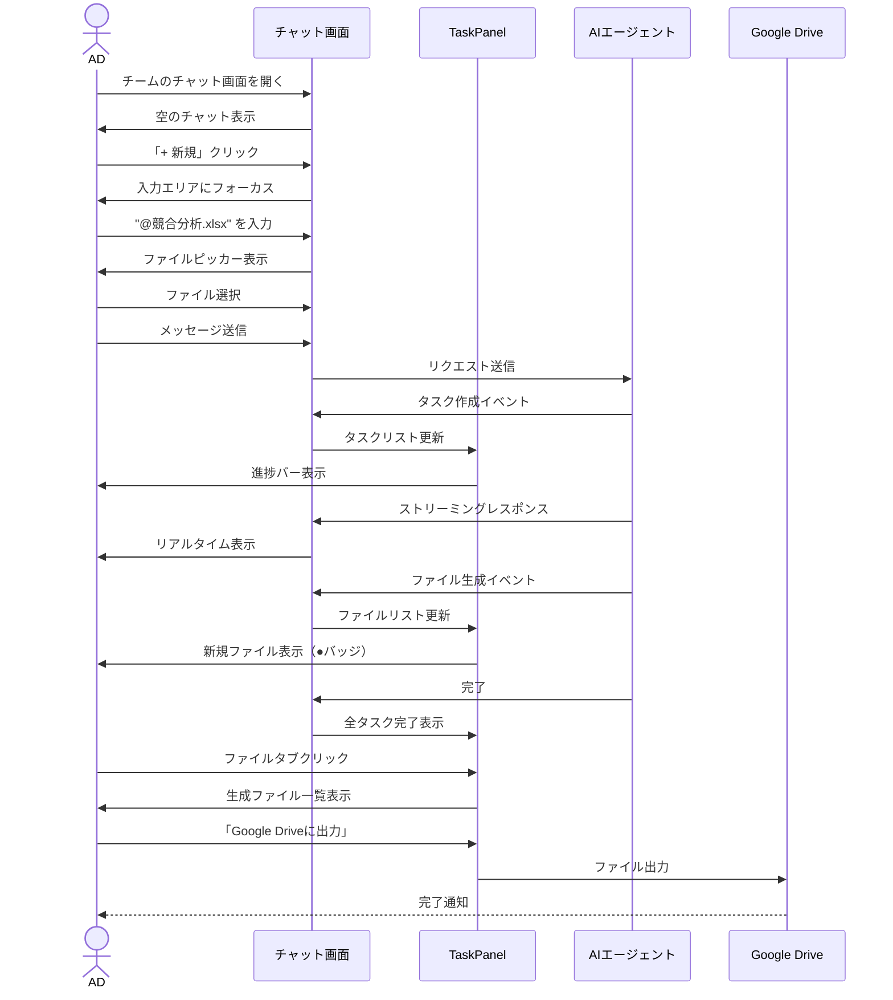
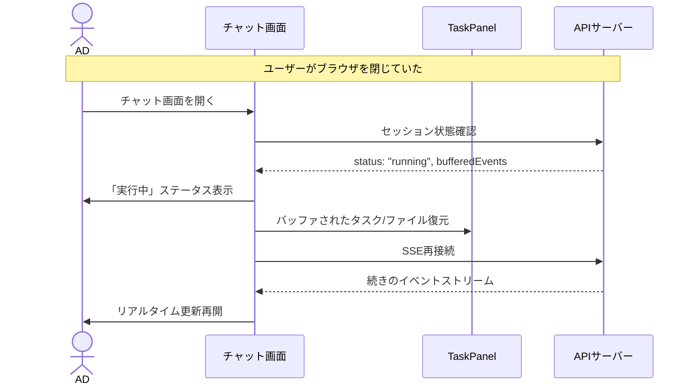
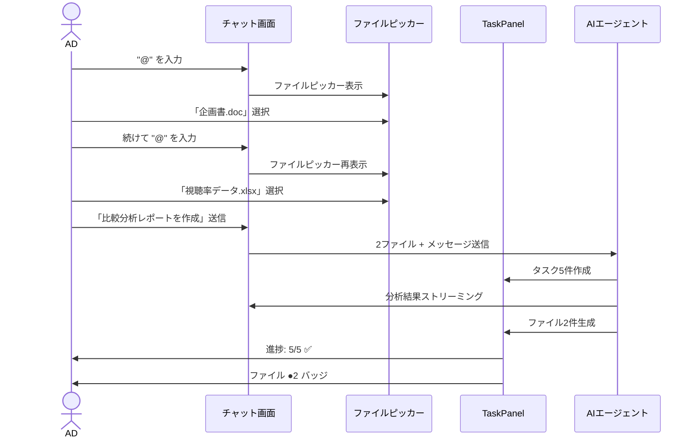

# 6. Chat UI - チャット画面設計

## 概要

T-Agentのコア機能であるチャットUI。チーム単位でAIエージェントと対話し、@メンションでファイルを参照、タスク進捗とファイル出力をチャット画面内で直接確認できる。

**設計方針**: 2パネルレイアウト（セッションサイドバー + チャットメインエリア）

## 画面一覧

| 画面ID | 画面名 | パス | 説明 |
|--------|--------|------|------|
| CH-001 | チャットメイン | `/[slug]/programs/[programId]/teams/[teamId]/chat` | メインチャット画面 |
| CH-002 | セッション一覧 | サイドバー | 過去のチャット履歴 |
| CH-003 | タスクパネル | チャット内埋め込み | タスク進捗とファイル出力表示 |

---

## CH-001: チャットメイン

### レイアウト構成

```
┌──────────────────────────────────────────────────────────────────────┐
│ [2パネルレイアウト]                                                    │
│                                                                        │
│  ┌─────────────┐  ┌────────────────────────────────────────────────┐  │
│  │             │  │                                                │  │
│  │  SESSION    │  │              CHAT MAIN AREA                    │  │
│  │  SIDEBAR    │  │                                                │  │
│  │             │  │  ┌──────────────────────────────────────────┐  │  │
│  │  (w-80)     │  │  │ SessionStatusBadge                       │  │  │
│  │             │  │  └──────────────────────────────────────────┘  │  │
│  │             │  │                                                │  │
│  │             │  │  ┌──────────────────────────────────────────┐  │  │
│  │             │  │  │ MessageList                              │  │  │
│  │             │  │  │ (flex-1, overflow-y-auto)                │  │  │
│  │             │  │  └──────────────────────────────────────────┘  │  │
│  │             │  │                                                │  │
│  │             │  │  ┌──────────────────────────────────────────┐  │  │
│  │             │  │  │ TaskPanel (タスク/ファイル タブ)         │  │  │
│  │             │  │  └──────────────────────────────────────────┘  │  │
│  │             │  │                                                │  │
│  │             │  │  ┌──────────────────────────────────────────┐  │  │
│  │             │  │  │ ChatInput (@メンション対応)              │  │  │
│  │             │  │  └──────────────────────────────────────────┘  │  │
│  │             │  │                                                │  │
│  └─────────────┘  └────────────────────────────────────────────────┘  │
│                                                                        │
└──────────────────────────────────────────────────────────────────────┘
```

### ワイヤーフレーム（デスクトップ）

```
┌────────────────────────────────────────────────────────────────────────────┐
│ [HEADER]                                                                    │
│ ┌────────────────────────────────────────────────────────────────────────┐ │
│ │  🎬 T-Agent    ABC制作会社 ▼                        👤 山田太郎 ▼      │ │
│ └────────────────────────────────────────────────────────────────────────┘ │
├────────────────────────────────────────────────────────────────────────────┤
│ [SESSION SIDEBAR]     │ [CHAT MAIN AREA]                                   │
│ ┌───────────────────┐ │                                                    │
│ │ ← 朝の情報番組    │ │  ┌──────────────────────────────────────────────┐ │
│ │                   │ │  │ 🔍 リサーチチーム              ● 実行中      │ │
│ │ 🔍 リサーチ       │ │  └──────────────────────────────────────────────┘ │
│ │ チーム            │ │                                                    │
│ │                   │ │  ┌──────────────────────────────────────────────┐ │
│ │───────────────────│ │  │ 新しいチャットを開始するか、                  │ │
│ │ セッション        │ │  │ 左のセッションを選択してください              │ │
│ │                   │ │  └──────────────────────────────────────────────┘ │
│ │ + 新規            │ │                                                    │
│ │                   │ │                                                    │
│ │ 📝 競合調査       │ │                                                    │
│ │   1/18 10:30      │ │                                                    │
│ │                   │ │                                                    │
│ │ 📝 トレンド分析   │ │  ┌──────────────────────────────────────────────┐ │
│ │   1/17 15:00      │ │  │ [タスク] [ファイル]              進捗: 0/0   │ │
│ │                   │ │  │                                              │ │
│ │ 📝 視聴者調査     │ │  │ タスクはまだありません                       │ │
│ │   1/15 09:00      │ │  │                                              │ │
│ │                   │ │  └──────────────────────────────────────────────┘ │
│ └───────────────────┘ │                                                    │
│                       │  ┌──────────────────────────────────────────────┐ │
│                       │  │ 💬 メッセージを入力... (@でファイル参照)     │ │
│                       │  │                                        [送信]│ │
│                       │  └──────────────────────────────────────────────┘ │
└────────────────────────────────────────────────────────────────────────────┘
```

### ワイヤーフレーム（チャット中 - タスク実行時）

```
┌────────────────────────────────────────────────────────────────────────────┐
│ [HEADER]                                                                    │
├────────────────────────────────────────────────────────────────────────────┤
│ [SESSION SIDEBAR]     │ [CHAT MAIN AREA]                                   │
│ ┌───────────────────┐ │  ┌──────────────────────────────────────────────┐ │
│ │ ← 朝の情報番組    │ │  │ 🔍 リサーチチーム              🔄 実行中    │ │
│ │                   │ │  └──────────────────────────────────────────────┘ │
│ │ 🔍 リサーチ       │ │                                                    │
│ │ チーム            │ │  ┌──────────────────────────────────────────────┐ │
│ │                   │ │  │ 👤 User                             10:30   │ │
│ │───────────────────│ │  │                                              │ │
│ │ セッション        │ │  │ @競合分析.xlsx を参考に、最新の競合番組の    │ │
│ │                   │ │  │ 視聴率トレンドを調査して、レポートを         │ │
│ │ + 新規            │ │  │ 作成してください。                           │ │
│ │                   │ │  │                                              │ │
│ │ 📝 競合調査 ◀    │ │  │ ┌─────────────────────────┐                  │ │
│ │   1/18 10:30      │ │  │ │ 📄 競合分析.xlsx       │                  │ │
│ │                   │ │  │ └─────────────────────────┘                  │ │
│ │ 📝 トレンド分析   │ │  └──────────────────────────────────────────────┘ │
│ │   1/17 15:00      │ │                                                    │
│ │                   │ │  ┌──────────────────────────────────────────────┐ │
│ │                   │ │  │ 🤖 Assistant                         10:31  │ │
│ │                   │ │  │                                              │ │
│ │                   │ │  │ 競合分析.xlsxを確認しました。レポートを      │ │
│ │                   │ │  │ 作成中です...                                │ │
│ │                   │ │  │                                              │ │
│ │                   │ │  │ ▊ 回答を生成中                               │ │
│ │                   │ │  └──────────────────────────────────────────────┘ │
│ │                   │ │                                                    │
│ └───────────────────┘ │  ┌──────────────────────────────────────────────┐ │
│                       │  │ [タスク] [ファイル]            進捗: 2/5     │ │
│                       │  │ ━━━━━━━━━━━━━━━━━━━━░░░░░░░░░░░░░░  40%     │ │
│                       │  │                                              │ │
│                       │  │ ✅ データの読み込み                          │ │
│                       │  │ ✅ 競合番組の抽出                            │ │
│                       │  │ 🔄 視聴率トレンドの分析中...                 │ │
│                       │  │ ○ レポート構成の作成                         │ │
│                       │  │ ○ 最終レポートの出力                         │ │
│                       │  │                                              │ │
│                       │  └──────────────────────────────────────────────┘ │
│                       │                                                    │
│                       │  ┌──────────────────────────────────────────────┐ │
│                       │  │ 💬 メッセージを入力...             [■ 停止] │ │
│                       │  └──────────────────────────────────────────────┘ │
└────────────────────────────────────────────────────────────────────────────┘
```

### ワイヤーフレーム（完了 - ファイル出力あり）

```
┌────────────────────────────────────────────────────────────────────────────┐
│ [HEADER]                                                                    │
├────────────────────────────────────────────────────────────────────────────┤
│ [SESSION SIDEBAR]     │ [CHAT MAIN AREA]                                   │
│ ┌───────────────────┐ │  ┌──────────────────────────────────────────────┐ │
│ │ ...               │ │  │ 🔍 リサーチチーム              ✅ 完了      │ │
│ └───────────────────┘ │  └──────────────────────────────────────────────┘ │
│                       │                                                    │
│                       │  [... メッセージ履歴 ...]                          │
│                       │                                                    │
│                       │  ┌──────────────────────────────────────────────┐ │
│                       │  │ 🤖 Assistant                         10:35  │ │
│                       │  │                                              │ │
│                       │  │ 競合番組の視聴率トレンド分析レポートを       │ │
│                       │  │ 作成しました。                               │ │
│                       │  │                                              │ │
│                       │  │ ## 主な発見                                  │ │
│                       │  │                                              │ │
│                       │  │ ### 1. A局「朝の顔」                         │ │
│                       │  │ - 直近4週平均: 12.5%                         │ │
│                       │  │ - 前年同期比: +0.8pt                         │ │
│                       │  │ ...                                          │ │
│                       │  │                                              │ │
│                       │  │ [👍] [👎] [📋 コピー]                        │ │
│                       │  └──────────────────────────────────────────────┘ │
│                       │                                                    │
│                       │  ┌──────────────────────────────────────────────┐ │
│                       │  │ [タスク] [ファイル ●2]         進捗: 5/5 ✅ │ │
│                       │  │                                              │ │
│                       │  │ 📄 競合視聴率分析レポート.md         [👁️]  │ │
│                       │  │    10:35 作成                                │ │
│                       │  │                                              │ │
│                       │  │ 📊 視聴率推移グラフ.png             [👁️]  │ │
│                       │  │    10:35 作成                                │ │
│                       │  │                                              │ │
│                       │  └──────────────────────────────────────────────┘ │
│                       │                                                    │
│                       │  ┌──────────────────────────────────────────────┐ │
│                       │  │ 💬 メッセージを入力... (@でファイル参照)     │ │
│                       │  │                                        [送信]│ │
│                       │  └──────────────────────────────────────────────┘ │
└────────────────────────────────────────────────────────────────────────────┘
```

---

## CH-003: TaskPanel（タスクパネル）

チャット画面内に埋め込まれるパネル。「タスク」と「ファイル」の2つのタブで構成。

### タスクタブ

```
┌────────────────────────────────────────────────────────────────────┐
│ [タスク] [ファイル]                              進捗: 3/5         │
│ ━━━━━━━━━━━━━━━━━━━━━━━━━━━━━━░░░░░░░░░░░░░░░░░░░  60%             │
├────────────────────────────────────────────────────────────────────┤
│                                                                    │
│  ✅ データの読み込み                                               │
│     完了 10:31                                                     │
│                                                                    │
│  ✅ 競合番組の抽出                                                 │
│     完了 10:32                                                     │
│                                                                    │
│  ✅ 視聴率トレンドの分析                                           │
│     完了 10:33                                                     │
│                                                                    │
│  🔄 レポート構成の作成中...                                        │
│     実行中                                                         │
│                                                                    │
│  ○ 最終レポートの出力                                              │
│     待機中                                                         │
│                                                                    │
└────────────────────────────────────────────────────────────────────┘
```

### ファイルタブ

```
┌────────────────────────────────────────────────────────────────────┐
│ [タスク] [ファイル ●2]                                             │
├────────────────────────────────────────────────────────────────────┤
│                                                                    │
│  📄 競合視聴率分析レポート.md                            [👁️]    │
│     作成: 10:35                                                    │
│     パス: /outputs/競合視聴率分析レポート.md                       │
│                                                                    │
│  📊 視聴率推移グラフ.png                                 [👁️]    │
│     作成: 10:35                                                    │
│     パス: /outputs/視聴率推移グラフ.png                            │
│                                                                    │
│  ──────────────────────────────────────────────────────────────    │
│                                                                    │
│  ┌──────────────────────────────────────────────────────────────┐  │
│  │  📁 Google Driveに出力                                       │  │
│  └──────────────────────────────────────────────────────────────┘  │
│                                                                    │
└────────────────────────────────────────────────────────────────────┘
```

### ファイルプレビューモーダル

```
┌────────────────────────────────────────────────────────────────────┐
│                                                            [×]     │
│  📄 競合視聴率分析レポート.md                                      │
├────────────────────────────────────────────────────────────────────┤
│                                                                    │
│  # 競合番組 視聴率トレンド分析レポート                             │
│                                                                    │
│  ## 概要                                                           │
│  本レポートは、2025年1月時点における主要競合番組の                 │
│  視聴率トレンドをまとめたものです。                                │
│                                                                    │
│  ## 1. A局「朝の顔」                                               │
│  - 直近4週平均: 12.5%                                              │
│  - 前年同期比: +0.8pt                                              │
│  - 特徴: 芸能ニュース強化により若年層獲得                          │
│                                                                    │
│  ## 2. B局「モーニングワイド」                                     │
│  - 直近4週平均: 10.2%                                              │
│  - 前年同期比: -0.3pt                                              │
│  ...                                                               │
│                                                                    │
├────────────────────────────────────────────────────────────────────┤
│  [📋 コピー]  [💾 ダウンロード]  [📁 Google Driveに保存]           │
└────────────────────────────────────────────────────────────────────┘
```

### タスクステータス

```typescript
type TodoStatus = 'pending' | 'in_progress' | 'completed';

interface Todo {
  id: string;
  content: string;
  status: TodoStatus;
  createdAt: Date;
  completedAt?: Date;
}

// 表示アイコン
const statusIcons = {
  pending: '○',      // 待機中
  in_progress: '🔄', // 実行中
  completed: '✅',    // 完了
};
```

---

## @メンションファイルピッカー（Team指定ファイルのみ）

**重要**: @メンションで選択できるファイルは **Team設定で指定されたファイル（`team_file_refs`）のみ** です。
全ファイルにアクセスする場合は、Files タブの FolderTree から Drag & Drop を使用してください。

### データフロー

```
team_file_refs テーブル
├── ref_type: 'file' | 'folder'
├── drive_id: Google Drive ファイル/フォルダID
├── drive_name: 表示名
├── drive_path: パス
├── include_subfolders: サブフォルダも含めるか (folder時)
└── display_order: 表示順

※ チャット画面ロード時に team_file_refs を事前読み込み
  → @メンション時に遅延なく表示
```

### ドロップダウン表示

```
┌────────────────────────────────────────────────────────────────────┐
│                                                                    │
│ ┌────────────────────────────────────────────────────────────────┐ │
│ │ Team参照ファイルから選択                                       │ │
│ ├────────────────────────────────────────────────────────────────┤ │
│ │                                                                │ │
│ │ 🔍 compet                                                      │ │
│ │                                                                │ │
│ │ マッチするファイル (team_file_refs):                                            │ │
│ │                                                                │ │
│ │ ┌──────────────────────────────────────────────────────────┐   │ │
│ │ │ 📄 競合分析.xlsx                                   ◀   │   │ │
│ │ │    /参考資料/競合分析.xlsx                              │   │ │
│ │ │    更新: 2025-01-15                                     │   │ │
│ │ └──────────────────────────────────────────────────────────┘   │ │
│ │                                                                │ │
│ │ ┌──────────────────────────────────────────────────────────┐   │ │
│ │ │ 📄 競合番組リスト.doc                                   │   │ │
│ │ │    /企画資料/競合番組リスト.doc                         │   │ │
│ │ │    更新: 2025-01-10                                     │   │ │
│ │ └──────────────────────────────────────────────────────────┘   │ │
│ │                                                                │ │
│ └────────────────────────────────────────────────────────────────┘ │
│                                                                    │
│ ┌────────────────────────────────────────────────────────────────┐ │
│ │ @compet▊ を参考に調査してください                              │ │
│ └────────────────────────────────────────────────────────────────┘ │
│                                                                    │
│ [📎 ファイル追加]                                          [送信] │
│                                                                    │
└────────────────────────────────────────────────────────────────────┘
```

### ファイル選択後

```
┌────────────────────────────────────────────────────────────────────┐
│                                                                    │
│ ┌────────────────────────────────────────────────────────────────┐ │
│ │ @競合分析.xlsx を参考に調査してください                        │ │
│ │                                                                │ │
│ │ ┌─────────────────────────┐                                    │ │
│ │ │ 📄 競合分析.xlsx   [×] │                                    │ │
│ │ └─────────────────────────┘                                    │ │
│ └────────────────────────────────────────────────────────────────┘ │
│                                                                    │
│ [📎 ファイル追加]                                          [送信] │
│                                                                    │
└────────────────────────────────────────────────────────────────────┘
```

---

## メッセージコンポーネント

### ユーザーメッセージ

```
┌────────────────────────────────────────────────────────────────────┐
│ 👤 User                                                   10:30   │
│                                                                    │
│ @競合分析.xlsx を参考に、最新の競合番組の視聴率トレンドを         │
│ 調査して、レポートを作成してください。                             │
│                                                                    │
│ ┌─────────────────────────┐                                        │
│ │ 📄 競合分析.xlsx       │                                        │
│ │ /参考資料/             │                                        │
│ └─────────────────────────┘                                        │
│                                                                    │
└────────────────────────────────────────────────────────────────────┘
```

### アシスタントメッセージ（ストリーミング中）

```
┌────────────────────────────────────────────────────────────────────┐
│ 🤖 Assistant                                                       │
│                                                                    │
│ 競合分析.xlsxを確認しました。視聴率トレンドを分析しています...    │
│                                                                    │
│ ▊                                                                  │
│                                                                    │
└────────────────────────────────────────────────────────────────────┘
```

### アシスタントメッセージ（完了）

```
┌────────────────────────────────────────────────────────────────────┐
│ 🤖 Assistant                                              10:35   │
│                                                                    │
│ 競合番組の視聴率トレンド分析レポートを作成しました。               │
│                                                                    │
│ ## 主な発見                                                        │
│                                                                    │
│ ### 1. A局「朝の顔」                                               │
│ - 直近4週平均: 12.5%                                               │
│ - 前年同期比: +0.8pt                                               │
│ - 特徴: 芸能ニュース強化                                           │
│                                                                    │
│ ### 2. B局「モーニングワイド」                                     │
│ - 直近4週平均: 10.2%                                               │
│ - 前年同期比: -0.3pt                                               │
│ - 特徴: 生活情報充実                                               │
│                                                                    │
│ ### 分析サマリー                                                   │
│ - 全体的に視聴率は安定傾向                                         │
│ - 芸能・エンタメ強化局が伸長                                       │
│                                                                    │
│ 詳細はファイルタブからレポートをご確認ください。                   │
│                                                                    │
│ [👍] [👎] [📋 コピー]                                              │
│                                                                    │
└────────────────────────────────────────────────────────────────────┘
```

### ツール実行通知（折りたたみ可能）

```
┌────────────────────────────────────────────────────────────────────┐
│ 🔧 ツール実行                                       [▼ 展開]      │
└────────────────────────────────────────────────────────────────────┘

[展開時]
┌────────────────────────────────────────────────────────────────────┐
│ 🔧 ツール実行                                       [▲ 折りたたむ]│
├────────────────────────────────────────────────────────────────────┤
│                                                                    │
│ ┌──────────────────────────────────────────────────────────────┐   │
│ │ 🌐 web_search                                                │   │
│ │ 検索: "2025年 テレビ視聴率 トレンド"                         │   │
│ │ 結果: 10件取得 ✅                                            │   │
│ └──────────────────────────────────────────────────────────────┘   │
│                                                                    │
│ ┌──────────────────────────────────────────────────────────────┐   │
│ │ 📄 read_file                                                 │   │
│ │ ファイル: 競合分析.xlsx                                      │   │
│ │ ステータス: 完了 ✅                                          │   │
│ └──────────────────────────────────────────────────────────────┘   │
│                                                                    │
└────────────────────────────────────────────────────────────────────┘
```

---

## CH-002: サイドバー（タブ切り替え）

サイドバーは**Sessions（セッション）**と**Files（ファイル）**の2つのタブで構成。

### タブ構成

```
┌─────────────────────────┐
│ ← 朝の情報番組          │  ← プログラム名に戻る
│                         │
│ 🔍 リサーチチーム       │  ← 現在のチーム名
│                         │
│─────────────────────────│
│ [💬 Sessions] [📁 Files]│  ← タブ切り替え
│─────────────────────────│
```

### Sessions タブ

```
┌─────────────────────────┐
│ [💬 Sessions] [📁 Files]│
│─────────────────────────│
│ セッション              │
│                         │
│ ┌─────────────────────┐ │
│ │ + 新しいセッション   │ │  ← 新規作成ボタン
│ └─────────────────────┘ │
│                         │
│ 今日                    │  ← 日付グループ
│ ┌─────────────────────┐ │
│ │ 📝 競合調査 ◀       │ │  ← 選択中
│ │    10:30             │ │
│ │    メッセージ: 8     │ │
│ └─────────────────────┘ │
│                         │
│ ┌─────────────────────┐ │
│ │ 📝 視聴者分析        │ │
│ │    09:15             │ │
│ │    メッセージ: 5     │ │
│ └─────────────────────┘ │
│                         │
│ 昨日                    │
│ ┌─────────────────────┐ │
│ │ 📝 トレンド分析      │ │
│ │    15:00             │ │
│ │    メッセージ: 12    │ │
│ └─────────────────────┘ │
│                         │
│ 今週                    │
│ ┌─────────────────────┐ │
│ │ 📝 初期調査          │ │
│ │    1/15 09:00        │ │
│ │    メッセージ: 3     │ │
│ └─────────────────────┘ │
│                         │
└─────────────────────────┘
```

### セッションアイテムメニュー

```
┌─────────────────────────┐
│ 📝 タイトルを編集       │
├─────────────────────────┤
│ 📋 セッションをコピー   │
│ 📤 エクスポート         │
├─────────────────────────┤
│ 🗑️ 削除                │
└─────────────────────────┘
```

### Files タブ（FolderTree）

Workspace の Google Drive root directory から全ファイル/ディレクトリを表示。

**特徴:**
- **遅延読み込み**: フォルダ展開時にAPIをqueryしてstateに保存
- **Reload**: ディレクトリ横のreloadボタンで再取得
- **Drag & Drop**: ファイルをChatInputへドラッグで添付可能

```
┌─────────────────────────┐
│ [💬 Sessions] [📁 Files]│
│─────────────────────────│
│                         │
│ 📁 番組ルートフォルダ [🔄]│  ← Program root folder
│ ├─ 📁 企画資料      [🔄]│  ← クリックで展開/折りたたみ
│ │   ├─ 📄 企画書.doc    │  ← draggable
│ │   └─ 📄 調査.xlsx     │  ← draggable
│ ├─ 📁 会議録        [🔄]│
│ │   └─ ⏳ Loading...    │  ← 読み込み中
│ └─ 📄 README.md         │  ← draggable
│                         │
└─────────────────────────┘
```

**動作フロー:**
1. 初回: Program の `google_drive_root_id` の内容を自動読み込み
2. フォルダクリック → 展開/折りたたみ切り替え
3. 初回展開時にAPI呼び出し → stateに保存（キャッシュ）
4. 2回目以降はstateから表示
5. 🔄ボタンで強制再読み込み

**State構造:**
```typescript
interface FolderTreeState {
  [folderId: string]: {
    loaded: boolean;
    loading: boolean;
    expanded: boolean;
    files: DriveFile[];
    folders: DriveFolder[];
    error?: string;
  }
}
```

### Drag & Drop (FolderTree → ChatInput)

ファイルをChatInputエリアにドラッグ&ドロップで添付。

```
[ドラッグ中]
┌────────────────────────────────────────────┐
│                                            │
│  ┌────────────────────────────────────┐    │
│  │  📄 ファイルをドロップして添付     │    │  ← ドロップゾーン
│  │                                    │    │    (isDragOver)
│  └────────────────────────────────────┘    │
│                                            │
│  ┌────────────────────────────────────┐    │
│  │ 💬 メッセージを入力...            │    │
│  └────────────────────────────────────┘    │
│                                            │
└────────────────────────────────────────────┘

[ドロップ後]
┌────────────────────────────────────────────┐
│  ┌───────────────────────┐                 │
│  │ 📄 企画書.doc    [×]  │  ← 添付ファイル │
│  └───────────────────────┘                 │
│                                            │
│  ┌────────────────────────────────────┐    │
│  │ 💬 メッセージを入力...            │    │
│  └────────────────────────────────────┘    │
│                                            │
└────────────────────────────────────────────┘
```

**Drag Data:**
```typescript
// FolderTreeItem でドラッグ開始時にセット
e.dataTransfer.setData('application/json', JSON.stringify({
  id: file.id,
  name: file.name,
  mimeType: file.mimeType,
  webViewLink: file.webViewLink
}));
```

---

## セッションステータスバッジ

チャットエリア上部に表示されるセッション状態表示。

```typescript
type SessionStatus = 'idle' | 'running' | 'completed' | 'error' | 'reconnecting';

// 表示例
const statusDisplay = {
  idle: { icon: '●', text: 'アイドル', color: 'gray' },
  running: { icon: '🔄', text: '実行中', color: 'blue' },
  completed: { icon: '✅', text: '完了', color: 'green' },
  error: { icon: '❌', text: 'エラー', color: 'red' },
  reconnecting: { icon: '🔄', text: '再接続中...', color: 'yellow' },
};
```

### ステータスバッジ表示

```
┌──────────────────────────────────────────────────────────────┐
│ 🔍 リサーチチーム                        ● アイドル         │
└──────────────────────────────────────────────────────────────┘

┌──────────────────────────────────────────────────────────────┐
│ 🔍 リサーチチーム                        🔄 実行中          │
└──────────────────────────────────────────────────────────────┘

┌──────────────────────────────────────────────────────────────┐
│ 🔍 リサーチチーム                        ✅ 完了            │
└──────────────────────────────────────────────────────────────┘
```

---

## Google Drive出力ダイアログ

### 出力設定

```
┌────────────────────────────────────────────────────────────────────┐
│                                                            [×]     │
│  📁 Google Driveに出力                                             │
│                                                                    │
│  ┌──────────────────────────────────────────────────────────────┐  │
│  │ 出力ファイル                                                 │  │
│  │                                                              │  │
│  │ ☑️ 競合視聴率分析レポート.md                                 │  │
│  │ ☑️ 視聴率推移グラフ.png                                      │  │
│  │                                                              │  │
│  └──────────────────────────────────────────────────────────────┘  │
│                                                                    │
│  ┌──────────────────────────────────────────────────────────────┐  │
│  │ 出力先フォルダ                                               │  │
│  │ 📁 /企画資料/リサーチ                          [変更]       │  │
│  └──────────────────────────────────────────────────────────────┘  │
│                                                                    │
│  ┌──────────────────────────────────────────────────────────────┐  │
│  │ 出力形式                                                     │  │
│  │ ● Google ドキュメント/スプレッドシート                       │  │
│  │ ○ 元の形式のまま                                             │  │
│  └──────────────────────────────────────────────────────────────┘  │
│                                                                    │
│  ┌─────────────────────┐  ┌─────────────────────────┐              │
│  │     キャンセル      │  │   Google Driveに出力    │              │
│  └─────────────────────┘  └─────────────────────────┘              │
│                                                                    │
└────────────────────────────────────────────────────────────────────┘
```

### 出力完了通知

```
┌────────────────────────────────────────────────────────────────────┐
│                                                            [×]     │
│  ✅ Google Driveに出力しました                                     │
│                                                                    │
│  ┌──────────────────────────────────────────────────────────────┐  │
│  │                                                              │  │
│  │  📄 競合視聴率分析レポート                                   │  │
│  │  📊 視聴率推移グラフ.png                                     │  │
│  │                                                              │  │
│  │  保存先: /企画資料/リサーチ                                  │  │
│  │                                                              │  │
│  │  ┌──────────────────────────────────────────────────────┐    │  │
│  │  │ 🔗 Google Driveで開く                               │    │  │
│  │  └──────────────────────────────────────────────────────┘    │  │
│  │                                                              │  │
│  └──────────────────────────────────────────────────────────────┘  │
│                                                                    │
│                    ┌─────────────────────┐                         │
│                    │        閉じる       │                         │
│                    └─────────────────────┘                         │
│                                                                    │
└────────────────────────────────────────────────────────────────────┘
```

---

## モバイルレイアウト

### モバイル - チャット画面

```
┌───────────────────────────────────┐
│ [HEADER]                          │
│ ┌───────────────────────────────┐ │
│ │ ☰  リサーチチーム   🔄 実行中│ │
│ └───────────────────────────────┘ │
├───────────────────────────────────┤
│                                   │
│ ┌───────────────────────────────┐ │
│ │ 👤 User               10:30  │ │
│ │                               │ │
│ │ @競合分析.xlsx を参考に...   │ │
│ │                               │ │
│ │ ┌───────────────────────┐     │ │
│ │ │ 📄 競合分析.xlsx     │     │ │
│ │ └───────────────────────┘     │ │
│ └───────────────────────────────┘ │
│                                   │
│ ┌───────────────────────────────┐ │
│ │ 🤖 Assistant          10:35  │ │
│ │                               │ │
│ │ 分析レポートを作成しました   │ │
│ │ ...                          │ │
│ └───────────────────────────────┘ │
│                                   │
├───────────────────────────────────┤
│ ┌───────────────────────────────┐ │
│ │ [タスク 3/5] [ファイル ●2]   │ │
│ │ ━━━━━━━━━━━━━━━━░░░░░░  60%  │ │
│ │                               │ │
│ │ 🔄 レポート作成中...          │ │
│ └───────────────────────────────┘ │
├───────────────────────────────────┤
│ ┌───────────────────────────────┐ │
│ │ 💬 メッセージを入力...  [➤] │ │
│ └───────────────────────────────┘ │
│                                   │
│ [📎] [📁 @]                       │
│                                   │
└───────────────────────────────────┘
```

### モバイル - セッションドロワー

```
┌───────────────────────────────────┐
│ セッション                  [×]   │
├───────────────────────────────────┤
│                                   │
│ ┌───────────────────────────────┐ │
│ │ + 新しいセッション            │ │
│ └───────────────────────────────┘ │
│                                   │
│ 今日                              │
│ ┌───────────────────────────────┐ │
│ │ 📝 競合調査          10:30   │ │
│ └───────────────────────────────┘ │
│                                   │
│ ┌───────────────────────────────┐ │
│ │ 📝 視聴者分析        09:15   │ │
│ └───────────────────────────────┘ │
│                                   │
│ 昨日                              │
│ ┌───────────────────────────────┐ │
│ │ 📝 トレンド分析      15:00   │ │
│ └───────────────────────────────┘ │
│                                   │
└───────────────────────────────────┘
```

### モバイル - TaskPanel展開

```
┌───────────────────────────────────┐
│ [タスク] [ファイル ●2]      [×]   │
├───────────────────────────────────┤
│ 進捗: 3/5                         │
│ ━━━━━━━━━━━━━━━━━━░░░░░░░░  60%   │
│                                   │
│ ✅ データの読み込み               │
│ ✅ 競合番組の抽出                 │
│ ✅ 視聴率トレンドの分析           │
│ 🔄 レポート構成の作成中...        │
│ ○ 最終レポートの出力              │
│                                   │
│───────────────────────────────────│
│ ファイル (2件)                    │
│                                   │
│ 📄 競合視聴率分析レポート.md      │
│ 📊 視聴率推移グラフ.png           │
│                                   │
│ ┌───────────────────────────────┐ │
│ │  📁 Google Driveに出力        │ │
│ └───────────────────────────────┘ │
│                                   │
└───────────────────────────────────┘
```

---

## 状態管理

### チャット状態

```typescript
interface ChatState {
  // セッション
  sessionId: string | null;
  sessionStatus: SessionStatus;

  // メッセージ
  messages: Message[];
  isLoading: boolean;
  isStreaming: boolean;
  streamingContent: string;

  // 入力
  inputValue: string;
  attachedFiles: FileReference[];
  showFilePicker: boolean;
  filePickerQuery: string;

  // タスク・ファイル
  todos: Todo[];
  generatedFiles: GeneratedFile[];
}

interface Message {
  id: string;
  role: 'user' | 'assistant' | 'system';
  content: string;
  fileAttachments?: FileAttachment[];
  toolCalls?: ToolCall[];
  createdAt: Date;
}

interface Todo {
  id: string;
  content: string;
  status: 'pending' | 'in_progress' | 'completed';
  createdAt: Date;
  completedAt?: Date;
}

interface GeneratedFile {
  id: string;
  name: string;
  path: string;
  mimeType: string;
  size: number;
  createdAt: Date;
}

interface FileAttachment {
  driveId: string;
  name: string;
  path: string;
  mimeType: string;
}

interface ToolCall {
  toolName: string;
  input: Record<string, any>;
  output?: Record<string, any>;
  status: 'pending' | 'running' | 'completed' | 'error';
}
```

---

## ユーザーシナリオ

### シナリオ 1: 新しいセッションでリサーチ



### シナリオ 2: バックグラウンド実行からの再接続



### シナリオ 3: 複数ファイル参照とレポート作成



---

## キーボードショートカット

| ショートカット | アクション |
|--------------|----------|
| `Enter` | メッセージ送信 |
| `Shift + Enter` | 改行 |
| `@` | ファイルピッカー表示 |
| `Esc` | ファイルピッカー閉じる / モーダル閉じる |
| `↑` `↓` | ファイルピッカー内ナビゲーション |
| `Tab` | TaskPanelタブ切り替え |
| `Cmd/Ctrl + N` | 新規セッション |
| `Cmd/Ctrl + K` | セッション検索 |

---

## エラー状態

### 接続エラー

```
┌────────────────────────────────────────────────────────────────────┐
│                                                                    │
│  ⚠️ 接続エラー                                                     │
│                                                                    │
│  サーバーとの接続が切断されました。                                │
│                                                                    │
│  ┌─────────────────────┐                                           │
│  │      再接続する      │                                           │
│  └─────────────────────┘                                           │
│                                                                    │
└────────────────────────────────────────────────────────────────────┘
```

### セッション実行中の停止確認

```
┌────────────────────────────────────────────────────────────────────┐
│                                                                    │
│  ⚠️ 実行を停止しますか？                                           │
│                                                                    │
│  現在進行中のタスクが中断されます。                                │
│  生成済みのファイルは保持されます。                                │
│                                                                    │
│  ┌─────────────────────┐  ┌─────────────────────┐                  │
│  │     キャンセル      │  │       停止する      │                  │
│  └─────────────────────┘  └─────────────────────┘                  │
│                                                                    │
└────────────────────────────────────────────────────────────────────┘
```

### AIエラー

```
┌────────────────────────────────────────────────────────────────────┐
│ 🤖 Assistant                                                       │
│                                                                    │
│ ⚠️ エラーが発生しました                                            │
│                                                                    │
│ リクエストの処理中にエラーが発生しました。                         │
│                                                                    │
│ ┌─────────────────────┐                                            │
│ │      再試行する      │                                            │
│ └─────────────────────┘                                            │
│                                                                    │
└────────────────────────────────────────────────────────────────────┘
```

---

## アクセシビリティ

| 要件 | 対応 |
|------|------|
| キーボード操作 | 全機能がキーボードで操作可能 |
| スクリーンリーダー | ARIA属性で適切なラベル付け |
| フォーカス管理 | 論理的なフォーカス順序 |
| 色のコントラスト | WCAG AA準拠 |
| 動的コンテンツ | live-region で通知（タスク更新、ファイル生成） |
| 進捗表示 | progressbar roleで進捗を音声読み上げ |

---

## 実装コンポーネント一覧

### Sidebar Components

| ファイル | 説明 |
|---------|------|
| `components/sidebar/SidebarTabs.tsx` | Sessions/Files タブ切り替えコンポーネント |
| `components/sidebar/FolderTree.tsx` | Google Drive フォルダツリー（遅延読み込み対応） |
| `components/sidebar/FolderTreeItem.tsx` | ツリーアイテム（フォルダ/ファイル、Drag対応） |
| `components/sidebar/index.ts` | Sidebar コンポーネントのエクスポート |

### Chat Components

| ファイル | 説明 |
|---------|------|
| `components/chat/SessionList.tsx` | セッション一覧（作成/選択/削除） |
| `components/chat/ChatInput.tsx` | メッセージ入力（@メンション + Drag&Drop対応） |
| `components/chat/MessageList.tsx` | メッセージ表示（User/Assistant、添付ファイル表示） |
| `components/chat/index.ts` | Chat コンポーネントのエクスポート |

### Hooks

| ファイル | 説明 |
|---------|------|
| `hooks/useFolderTree.ts` | フォルダツリー状態管理（遅延読み込み、キャッシュ） |

### Pages

| ファイル | 説明 |
|---------|------|
| `app/[slug]/programs/[programId]/teams/[teamId]/chat/page.tsx` | チームチャットメインページ |

### API Routes

| ファイル | 説明 |
|---------|------|
| `app/api/workspace/drive/folders/route.ts` | Google Drive フォルダ内容取得API |

### ファイル参照の2つの方法

| 方法 | 対象 | 用途 |
|------|------|------|
| **@メンション** | `team_file_refs` で指定されたファイルのみ | よく使うファイルへのクイックアクセス |
| **Drag & Drop** | FolderTree内の全ファイル | 任意のファイルを添付 |
