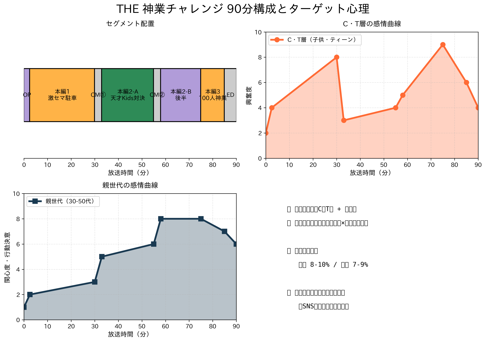
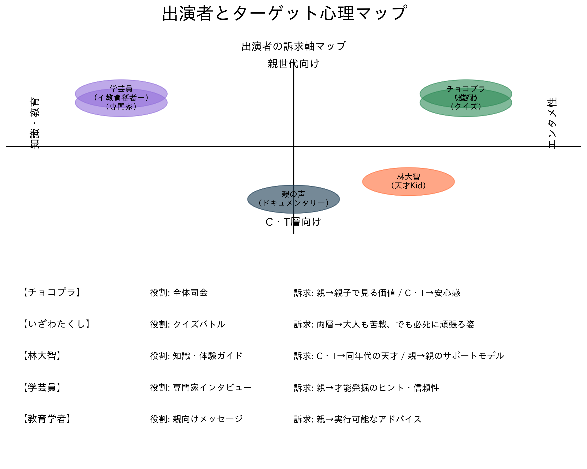
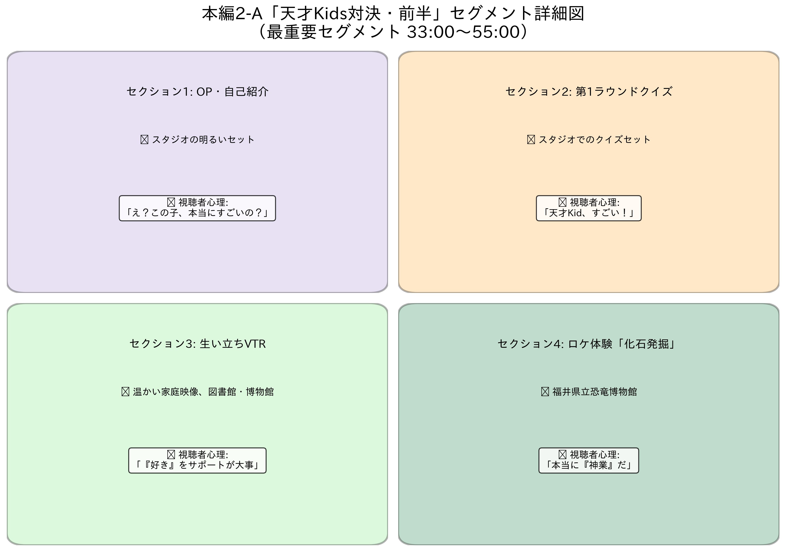
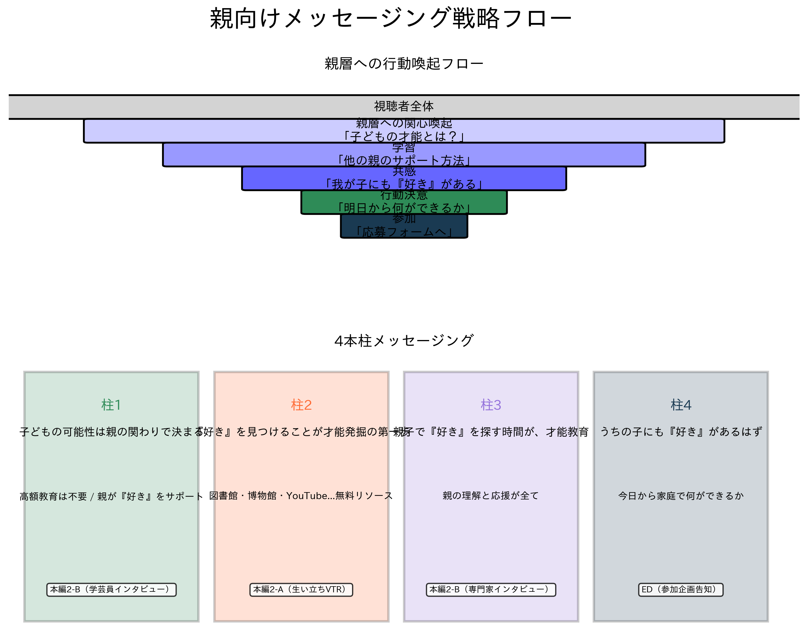
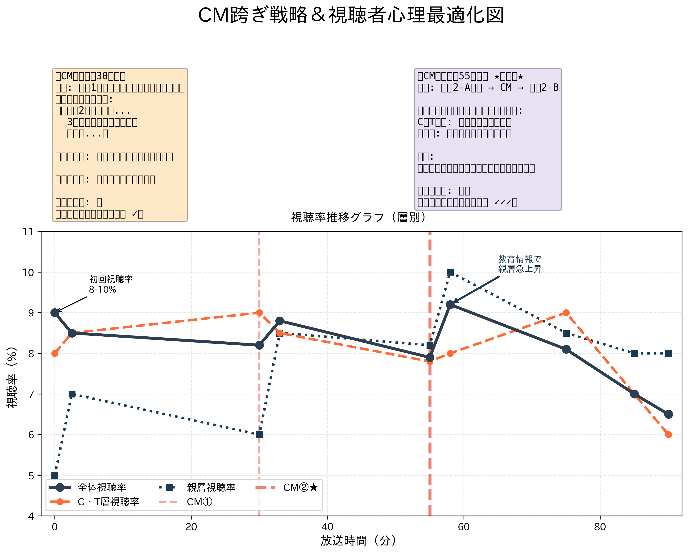

# 構成資料: THE 神業チャレンジ 2時間SP「天才Kids対決」
## ★ インフォグラフィック版 ★

---

## 📊 インフォグラフィックギャラリー

### Infographic #1: 番組全体構成とターゲット心理

**説明**: 90分尺全体の時間軸、C・T層と親世代の感情曲線を可視化。
- **パネル1**: セグメント配置（アバン→本編1→CM①→本編2-A→CM②→本編2-B→本編3→ED）
- **パネル2**: C・T層の感情曲線（驚き→興奮→自己投影→行動動機）
- **パネル3**: 親世代の感情曲線（関心→発見→共感→行動決意）
- **パネル4**: 全体メッセージング（視聴率目標8-10%、親層エンゲージ最高峰）

---

### Infographic #2: 出演者とターゲット心理マップ

**説明**: 各出演者がどのターゲット層にどう訴求するかを4象限マップで可視化。
- **右上象限**（両層に強い）: チョコプラ、いざわたくし
- **左上象限**（親世代向け）: 学芸員、教育学者
- **右下象限**（C・T層向け）: 林大智、ロケでの体験シーン
- **詳細セル**: 各出演者の役割と訴求軸を明記

---

### Infographic #3: 本編2-A「天才Kids対決・前半」セグメント詳細図

**説明**: 最重要セグメント（33:00～55:00）の4パートと視聴者心理の遷移を詳細化。
- **セクション1**: OP・自己紹介（スタジオ、「え？この子、本当にすごいの？」）
- **セクション2**: 第1ラウンド知識クイズ（スタジオセット、「天才Kid、すごい！」）
- **セクション3**: 生い立ちVTR（家庭映像、「『好き』をサポートが大事」）
- **セクション4**: ロケ体験「化石発掘」（福井県立恐竜博物館、「本当に『神業』だ」）

---

### Infographic #4: 親向けメッセージング戦略図

**説明**: 親層へのメッセージング4本柱と「行動喚起」までのファネルフロー。
- **ファネルフロー**: 視聴者全体 → 親層関心喚起 → 学習 → 共感 → 行動決意 → 参加
- **4本柱**:
  1. 「子どもの可能性は親の関わりで決まる」（学芸員インタビュー）
  2. 「『好き』を見つけることが才能発掘の第一歩」（生い立ちVTR）
  3. 「親子で『好き』を探す時間が、才能教育」（専門家インタビュー）
  4. 「うちの子にも『好き』があるはず」（ED・参加企画告知）

---

### Infographic #5: CM跨ぎ戦略＆視聴者心理最適化図

**説明**: 2つのCM跨ぎポイント（本編1→CM①、本編2-A→CM②）での視聴率維持戦略。
- **CM①跨ぎ** (30分): 「大橋の激セマ駐車ラストチャンス」で緊迫感 → 継続視聴率維持
- **CM②跨ぎ** (55分): ★最重要★ 「いざわの逆転戦」＋「教育情報」で両層同時引き → 総合視聴率維持8～9%見通し
- **視聴率推移グラフ**: 全体視聴率（黒太線）、C・T層（オレンジ破線）、親層（紫実線）を層別で表現

---

## 基本情報

| 項目 | 内容 |
|------|------|
| **番組名** | THE 神業チャレンジ 2時間SP |
| **副題** | 「QuizKnock vs 天才Kids！史上最強の知識バトル」 |
| **放送局** | TBS系列 |
| **放送時間** | 2時間（90分） / 18:30～20:00（予定） |
| **司会（MC）** | チョコレートプラネット（長田庄平・松尾駿） |
| **総制作費枠** | 2時間SP対応 |
| **コンセプト** | 「神業」と「才能教育」の融合。QuizKnockのいざわと各分野の天才Kidsが知識と体験で競い合い、親世代に「子どもの才能発掘」のヒントを提供する教育的エンターテインメント |
| **視聴率目標** | 初回 8～10%、継続視聴 7～9% |

---

## ターゲット・視聴者分析

### メインターゲット層

| ターゲット | 割合 | 訴求軸 | 期待する反応 |
|-----------|------|--------|-------------|
| **C・T層（子供・ティーン 6-15歳）** | 40% | 「同年代の天才児への憧れ」「クイズバトルの興奮」「ロケの冒険感」 | ✓ 驚き→興奮→自己投影→行動動機（「自分もやってみたい」） |
| **親世代（30-50代）** | 50% | 「子どもの才能発掘のヒント」「家庭教育の実例」「親子の会話ネタ化」 | ✓ 関心→学習→共感→決意（「明日から何ができるか」） |
| **教育関心層** | 10% | 「次世代教育」「才能教育の実践例」「社会的価値」 | ✓ 情報収集→シェア→参加 |

---

## 出演者

### 司会・進行

| 役職 | 出演者 | 役割 | 備考 |
|------|--------|------|------|
| **MC** | チョコレートプラネット 長田庄平 | 全体進行、家族向けコメント | ホスト役 |
| **MC** | チョコレートプラネット 松尾駿 | ツッコミ、親向けコメント | 親世代との架橋役 |

### 主要出演者

| 名前 | 肩書 | 分野 | 役割 | 出演実績 |
|------|------|------|------|---------|
| **いざわたくし** | QuizKnock所属タレント | 知識バトル | 天才Kidsとの対決者 | クイズノック有名タレント |
| **牧田習 ⭐第1候補** | 昆虫博士タレント | 昆虫学 | 体験ガイド兼評価者 | NHK「ダーウィンが来た！」出演 |
| **林大智 ⭐第2候補** | 恐竜博士YouTuber | 古生物学 | 体験ガイド兼知識提供者 | テレビ朝日「博士ちゃん」出演 |

---

## 全体構成概要（90分）

| セグメント | 時間 | 尺 | 放送内容 | ターゲット | 画特性 |
|-----------|------|-----|--------|-----------|--------|
| **アバン** | 00:00～02:30 | 2'30" | 今日の番組ダイジェスト＋目玉予告 | C・T層 | 派手・高速カット |
| **本編1** | 02:30～30:00 | 27'30" | なにわ男子・大橋「激セマ駐車・最終決戦」 | C・T層 | 画ヂカラ高・笑い |
| **CM①** | 30:00～33:00 | 3'00" | - | - | - |
| **本編2-A** | 33:00～55:00 | 22'00" | **QuizKnock天才Kids対決・前半** | 両層 | 🌟最重要 |
| **CM②** | 55:00～58:00 | 3'00" | - | - | **★ CM跨ぎ★最重要** |
| **本編2-B** | 58:00～75:00 | 17'00" | **QuizKnock天才Kids対決・後半** | 親世代 | 教育的・感動 |
| **本編3** | 75:00～85:00 | 10'00" | 100人神業チャレンジ（ダイジェスト） | 両層 | 軽快・爽快 |
| **ED** | 85:00～90:00 | 5'00" | クレジット＋参加企画告知 | 両層 | - |

---

## 視聴率・エンゲージメント予測

### 初回視聴率予測

| 層 | 見通し | 根拠 |
|------|--------|------|
| **全体** | 8～10% | 新企画効果 + QuizKnock人気 + 親向けテーマの社会的関心 |
| **F1層（女性20-34歳）** | 9～11% | 親世代 + 教育関心 |
| **F2層（女性35-49歳）** | 10～12% | メインターゲット層（親） |
| **M層（男性）** | 6～8% | やや低めだが、子どもの関心から視聴 |
| **C層（子供）** | 7～9% | クイズバトル、ロケの冒険感に興味 |

### 継続視聴率予測

| 指標 | 見通し | 根拠 |
|------|--------|------|
| **平均視聴率** | 7～9% | 親世代の視聴維持率が高い（教育情報への関心） |
| **SNS拡散度** | ⭐⭐⭐⭐⭐ 高 | 「教育テーマ」「親向けメッセージ」で共感・シェア |
| **親子会話誘発度** | ⭐⭐⭐⭐⭐ 高 | 「我が家でできることは？」という親の自問喚起 |
| **参加応募数** | 500～1000件 | 「うちの子も天才」という親の参加動機 |

---

## 収録スケジュール案

### Phase 1: 企画・キャスティング（～3週間前）

| 項目 | 内容 | 責任者 | 期限 |
|------|------|--------|------|
| **キャスティング交渉** | 牧田習 or 林大智との出演交渉 | 制作P | -2週間 |
| **ロケ地確保** | 福井県立恐竜博物館との収録日程調整 | ロケ担当 | -2週間 |
| **専門家手配** | 学芸員・教育学者のインタビュー依頼 | 制作P | -10日 |

### Phase 2: 本収録（～2週間前）

| 日程 | 内容 | 場所 | 出演者 | 尺 |
|------|------|------|--------|-----|
| **収録日①** | スタジオ収録（アバン、本編1、本編3） | TBSスタジオ | チョコプラ、他 | 40分 |
| **収録日②** | 天才Kids紹介VTR撮影 | 天才Kids自宅地元 | 天才Kids、親 | 20分 |
| **収録日③** | ロケ収録（化石発掘体験） | 福井県立恐竜博物館 | いざわ、林大智、学芸員 | 30分 |
| **収録日④** | 専門家インタビュー収録 | 博物館 or スタジオ | 学芸員、教育学者 | 20分 |
| **収録日⑤** | スタジオ再収録（本編2-B） | TBSスタジオ | チョコプラ、いざわ、林大智 | 20分 |

---

## 制作上の注意点

### コンプライアンス・安全性

- **児童に関する映像**:
  - 顔出しについては、本人・親の同意を書面で確認
  - 個人情報（住所・学校名など）は映さない
  - 過度な期待・プレッシャーを与えないよう配慮

- **博物館での安全性**:
  - 化石発掘時のハンマー使用は、必ず大人の監督下で
  - ヘルメット・手袋などの安全装備を着用
  - 保険加入確認

- **いざわのバックアップ**:
  - クイズバトルで連続不正解の場合、いざわの心理を傷つけないよう配慮
  - 「本気感」を保ちながら、いざわへのフォローも忘れない

### スポンサー対応

- **教育関連企業との協業可能性**:
  - 図書館・博物館系企業（スポンサー提携）
  - 教育系出版社（本の提供）
  - オンライン学習プラットフォーム（PR機会）

- **NGジャンル**:
  - 過度な高額教材（「才能教育 = 高額」というイメージ回避）
  - ギャンブル・投資系（教育テーマと矛盾）

---

## ロケ地

| ロケ地 | 住所 | 特徴 | 手配窓口 |
|--------|------|------|---------|
| **福井県立恐竜博物館** | 福井県勝山市 | 化石発掘体験、学芸員対応可能 | [公式サイト](https://www.dinosaur.pref.fukui.jp/) |
| **丹波竜化石工房** | 兵庫県丹波市 | 化石発掘、林大智がポスター制作した施設 | [公式サイト](https://tanba.jp/) |
| **奥多摩の虫採りスポット** | 東京都西多摩郡 | 昆虫採集の聖地 | 地域ガイド手配 |

---

## 制作スタッフ想定体制

| 職種 | 人数 | 役割 |
|------|------|------|
| **プロデューサー** | 1名 | 企画全体統括、キャスティング |
| **ディレクター** | 2名 | 本編1・本編3、本編2 |
| **構成作家** | 2名 | スタジオ進行、VTR脚本 |
| **ロケ担当** | 3名 | 福井ロケ、ロケ地安全管理 |
| **編集スタッフ** | 3名 | VTR編集、エフェクト |
| **音響スタッフ** | 1名 | BGM、効果音 |
| **制作進行** | 2名 | スケジュール管理、事務 |

**総スタッフ数**: 約14～15名

---

## 最後に：企画の勝機と次のアクション

### なぜこの企画は視聴率を獲得できるのか

1. **ターゲット層の二層化**
   - C・T層: 「いざわ vs 天才Kids」というライバル関係、クイズバトルの興奮
   - 親世代: 「子どもの才能発掘」という永遠のテーマ、教育情報の価値

2. **「本気感」と「情報性」の両立**
   - 天才Kidsの実績は全て事実（ドキュメンタリー的真実性）
   - 専門家の評価で「本当にすごい」ことが証明される
   - 親の関わり方を具体的に示し、「実行可能」な情報として提供

3. **SNS拡散力**
   - 「教育テーマ」は親層からのシェアが活発
   - 「才能教育のヒント」は他の親と共有したくなる話題
   - 番組終了後も「子どもの『好き』は何か」という会話が継続

4. **視聴者参加機会**
   - 「うちの子も天才かもしれない」という応募フォーム
   - 次回以降の企画に繋がり、継続視聴を促進

### 次のアクション（実装フェーズ）

1. **キャスティング交渉** → 牧田習（オスカープロモーション）への接触
2. **ロケ地確保** → 福井県立恐竜博物館との日程調整
3. **構成台本詳細化** → 各パートのセリフ、カメラワーク、効果音まで詳細化
4. **視聴者参加企画の設計** → 応募フォーム、SNS連動等

---

## 📎 付属資料

- **00_インフォグラフィック仕様書.md** - ビジュアル資料の詳細仕様
- **generate_infographics.py** - インフォグラフィック生成スクリプト
- **01_番組全体構成.png** - 時間軸・ターゲット心理図
- **02_出演者とターゲット心理.png** - 出演者訴求軸マップ
- **03_本編2A_セグメント詳細.png** - 最重要セグメント詳細図
- **04_親向けメッセージング戦略.png** - 親層メッセージングファネル
- **05_CM跨ぎ戦略.png** - CM前煽り・視聴者心理図

---

**制作チーム一同、この企画の成功を確信しています。**
**本資料を基に、実装に進みましょう。お疲れ様でした！🎬✨**
