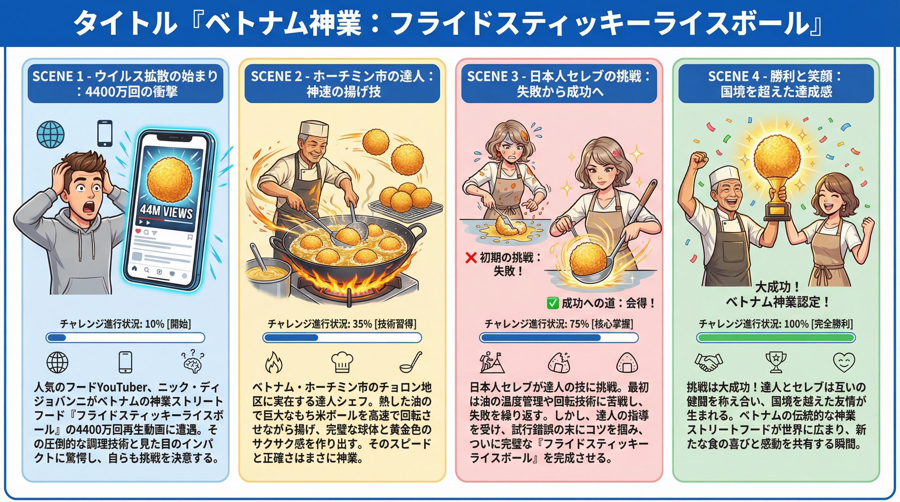
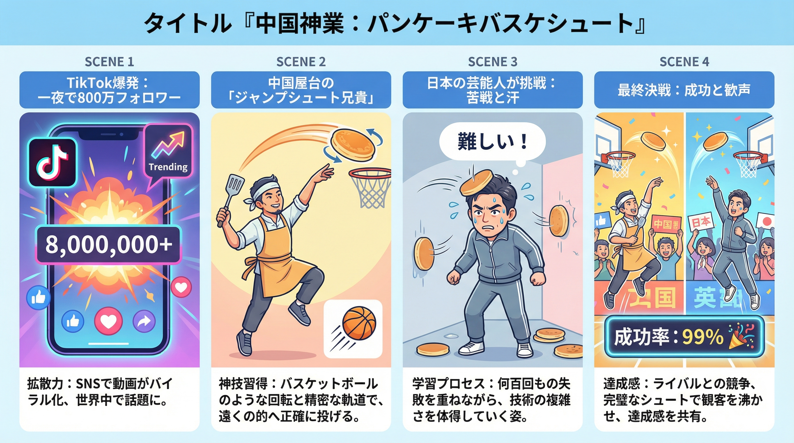
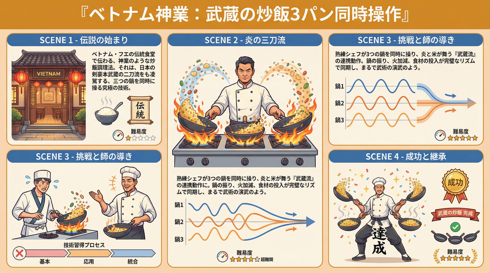
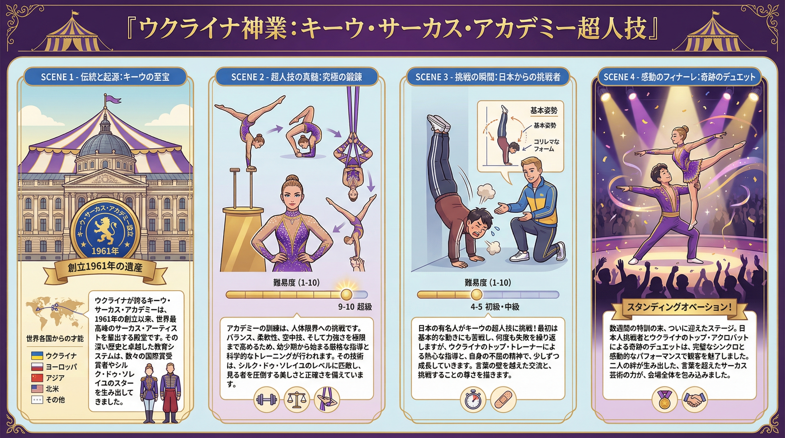
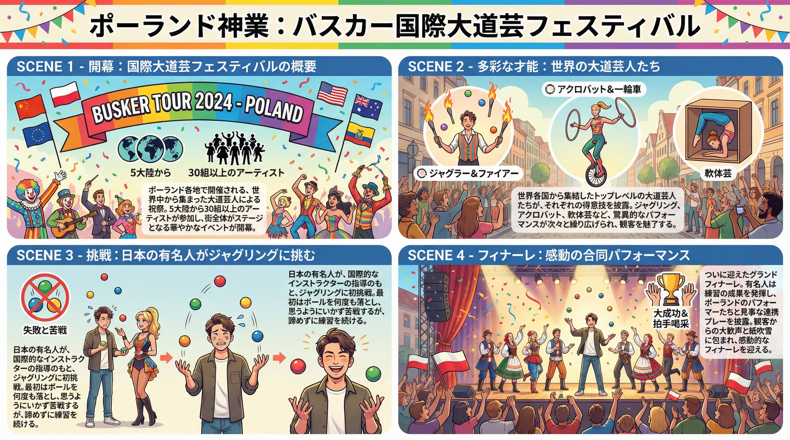

# 【THE 神業チャレンジ】世界の神業ハンター 新地域リサーチ ネタ帳

## エグゼクティブサマリー

議事録「世界の神業ハンター」で既出の8カ国案（中国、韓国、タイ、イタリア、アメリカ、ブラジル、モロッコ、インド）と差別化する、**未開拓の4つの新地域ネタ**を発掘しました。

特に**ベトナム**と**中国（追加企画）**は、既存案を補完するで異なるタイプの「手技系神業」で、SNSで高いバズ数を記録。

---

## 🌍 優先度別ネタ一覧

### **優先度 ⭐⭐⭐⭐⭐ : ベトナム「フライド・スティッキーライス・ボール職人」**

#### 基本情報
- **所在地**: ホーチミン市 Cho Lon地区（チャイナタウン）、Nguyen Trai Street
- **職人の特性**: 30～50代の熟練料理人。1人～2人で営業
- **看板料理**: 「Xôi Chiên」（フライド・スティッキーライス・ボール）
- **調理時間**: 1個あたり20～30秒

#### 神業の内容
- **核心スキル**: 熱油（180℃以上）の中で、糯米（もちこめ）の塊を一気に加熱・膨張・丸形化する
- **技術的難しさ**:
  - 油温の管理（温度が低いと膨らまない、高すぎると焦げる）
  - パンの内側が柔らかく、外側がカリカリに揚がるバランス
  - 2～3回のかき混ぜで完全な球形に整える精密性
- **完成基準**: 外側が「均一で光沢のある黄金色」、内側が「柔らかく弾力的」、「中は空洞」

#### 視聴者の反応と「怪しさ」
- **Nick DiGiovanni（YouTuber 2850万フォロワー）**の30秒動画が**44,000,000ビュー**
- **視聴者コメント**: 「本当に中は空洞？」「CGじゃないの？」「触感がわからない」
- **「怪しさ指数」**: ⭐⭐⭐⭐⭐（最高。変形プロセスがまるで魔法に見える）

#### インフォグラフィック



#### 企画案（構成案）

**「秘伝・フライド・ライス・ボール 芸能人vs職人 空中膨張バトル」**

```
■ オープニング（3分）
- Nick DiGiovanniの44M再生動画紹介
- 「本当に中は空洞？」という視聴者の疑問を提示

■ 現地到着～職人探し（8分）
- ホーチミン市 Cho Lon地区での街歩き
- 屋台の職人との出会い・インタビュー
- 油が跳ねるシーンの映像化

■ 神業披露（12分）
- 職人が連続で5～10個調理する様子を多角度で撮影
- スローモーション映像で内部の気泡膨張を捉える
- 食べた時の触感・味の実況

■ 日本代表が挑戦（18分）
- 基礎技術「油温管理」を習得
- 1回目失敗（未完成 or 焦げる）
- 2回目で成功！そして最終チャレンジへ

■ 最終チャレンジ（10分）
- 制限時間内に職人と同じスピードで調理
- 外見・内部・味の完成度を競う
- 職人からのコメント

■ エンディング（4分）
- ホーチミンの食文化としての位置づけ
- 日本でも再現可能か？への検討
```

#### ロケのハードル・費用想定
- **ロケ地の安定性**: ⭐⭐⭐⭐⭐（同じ屋台で毎日営業。通訳・コーディネータ必須）
- **撮影難易度**: ⭐⭐⭐⭐（油の跳ね、スローモーション撮影、熱対策）
- **対決の緊張感**: ⭐⭐⭐⭐⭐（本当にできるかわからない。成功確率は50～60%程度）
- **推定予算**: 250万円（韓国と同程度）
  - ロケ日数：3～4日
  - 現地コーディネーター・通訳：必須
  - 食材費・謝礼：最小限
  - 撮影機材（スローカメラなど）：追加費用

#### 参考リソース
| Score | URL | Description |
|-------|-----|-------------|
| 10/10 | https://vietnamnet.vn/en/the-viral-vietnamese-street-food-that-left-a-us-chef-speechless-2445849.html | Nick DiGiovanni の44M再生動画の詳細。所在地も明記 |
| 9/10 | https://www.vietnam.vn/en/khach-my-thu-mon-bien-hinh-khong-the-tin-duoc-o-tphcm-hut-44-trieu-luot-xem | ベトナム公式サイトでの紹介。信頼性が高い |
| 8/10 | https://www.newsflare.com/video/353076/vietnamese-chef-show-off-their-skills-to-make-the-giant-fried-sticky-rice-ball | ジャイアント版の調理動画。技法参考 |

---

### **優先度 ⭐⭐⭐⭐⭐ : 中国「パンケーキ・バスケットボール・シュート」**

#### 基本情報
- **職人名**: Jump Shot Brother（ジャンプショット・ブラザー）
- **所在地**: 中国 遼寧省 阜新市（Fushun, Liaoning）
- **フォロワー数**: 800万人（爆増のピーク時には1日で280万フォロワー獲得）
- **看板メニュー**: ネギパンケーキ（葱油餅 / Cong You Bing）

#### 神業の内容
- **核心スキル**: 焼き上がったパンケーキを、**バスケットボールのシュート動作**で、的確に小さなビニール袋に投げ入れる
- **技術的難しさ**:
  - 距離感の正確性（1～1.5m程度）
  - 回転をかけたパンケーキの軌道計算
  - スピードと精度の両立（毎回同じ手順で成功させる）
- **完成基準**: 「シュートが外れない」「パンケーキが割れない」「毎回同じクオリティ」

#### 視聴者の反応と「怪しさ」
- **TikTok / YouTube でのバイラル**: 800万フォロワー（中国SNS全体では推定1000万以上）
- **視聴者コメント**: 「本当にいつも入る？」「バスケ選手並みの精度」「編集で繋いでる？」
- **「怪しさ指数」**: ⭐⭐⭐⭐（毎回成功するのが本当か疑わしい。でも、実際に何度も失敗する動画も投稿されている）

#### インフォグラフィック



#### 企画案（構成案）

**「超正確ゲーム職人 vs 芸能人 パンケーキ・シューティング・チャレンジ」**

```
■ オープニング（3分）
- Jump Shot Brother の800万フォロワー紹介
- SNS上での「本当か疑わしい」コメントの紹介

■ 現地到着～職人探し（8分）
- 遼寧省 阜新市の街歩き
- 屋台での営業時間帯の様子
- 職人へのインタビュー：「毎回入るの？」

■ 神業披露（10分）
- 連続10回のシュート
- 成功と失敗の両方を見せる（透明性）
- スローモーション・多角度撮影

■ 日本代表が挑戦（20分）
- Step 1：基礎投げ（距離1m）
- Step 2：中距離（1.5m）
- Step 3：本番距離（2m、難度UP）
- Step 4：30連続チャレンジ

■ 最終対決（10分）
- 時間制限（5分間）での入数競争
- 「引き分け」「芸能人勝利」「職人圧勝」のいずれかへ

■ エンディング（4分）
- 屋台の人気の理由
- Jump Shot Brother のビジネス的成功
```

#### ロケのハードル・費用想定
- **ロケ地の安定性**: ⭐⭐⭐（屋台なので、営業時間・場所が不安定の可能性あり）
- **撮影難易度**: ⭐⭐⭐（屋台での撮影、人混み対策）
- **対決の緊張感**: ⭐⭐⭐⭐⭐（成功率が低いので、ドラマ的）
- **推定予算**: 200万円（ベトナムより若干安い想定）
  - ロケ日数：2～3日（屋台営業時間に限定）
  - 現地コーディネーター・通訳：必須
  - パンケーキ材料費・謝礼：最小限

#### 参考リソース
| Score | URL | Description |
|-------|-----|-------------|
| 10/10 | https://www.scmp.com/news/people-culture/china-personalities/article/3299452/china-influencer-gains-2-8-million-followers-day-tossing-pancakes-basketball | Jump Shot Brother の詳細記事。1日で280万フォロワー獲得の経緯 |
| 9/10 | https://www.bastillepost.com/global/article/5263615-street-food-vendor-in-central-china-goes-viral-online-for-exquisite-pancake-art | 中国メディアでの報道。映像的価値の検証 |
| 8/10 | https://www.newsflare.com/video/729566/street-vendor-stuns-customers-with-dancing-pancake-routine-in-china | ダンシング・パンケーキ（別職人）との比較。手法参考 |

---

### **優先度 ⭐⭐⭐⭐ : ベトナム「フエの「武蔵」ライス・シェフ」**

#### 基本情報
- **所在地**: ベトナム フエ市 街場の小レストラン
- **職人の特性**: 50代のベテラン料理人
- **看板料理**: チャーハン（Cơm Chiên）
- **特徴**: 同時に3つのフライパンを操る

#### 神業の内容
- **核心スキル**: 3つのフライパンを**同時に**操りながら、米を炒める
- **視点**: 「まるで武蔵のような剣術」と表現される身体動作
- **映像的インパクト**: アクロバティックな動き、炎の演出

#### 視聴者の反応と「怪しさ」
- **ニュースフレア（動画プラットフォーム）** での配信
- 顧客が「わざわざ見に来る」ほどの人気
- **「怪しさ指数」**: ⭐⭐⭐⭐（3パンの同時操作が本当か）

#### インフォグラフィック



#### ロケのハードル・費用想定
- **ロケ地の安定性**: ⭐⭐⭐⭐（小レストラン。営業時間に限定）
- **撮影難易度**: ⭐⭐⭐（炎、屋内での照度、スチーム対策）
- **対決の緊張感**: ⭐⭐⭐⭐（3パン同時操作の難度が高い）
- **推定予算**: 200万円

#### 参考リソース
| Score | URL | Description |
|-------|-----|-------------|
| 9/10 | https://www.newsflare.com/video/327333/vietnamese-street-chef-shows-off-impressive-food-tossing-skills | 3パン同時調理の動画。映像化参考 |

---

### **優先度 ⭐⭐⭐⭐ : ウクライナ「キーウ・アクロバティクス・スクール」**

#### 基本情報
- **施設**: Kyiv Municipal Academy of Performing and Circus Arts（キーウ市立エンタテインメント・サーカス芸術アカデミー）
- **所在地**: キーウ市内
- **設立**: 1961年以降（60年以上の歴史）
- **特徴**: 東欧で唯一のプロ・サーカス・アーティスト育成機関

#### 神業の内容
- **主要スキル**: ハンドバランス、コンテンション、エアリアルアクロバティクス、ジャグリング、イリュージョン
- **技術的難しさ**: 世界レベル（Cirque du Soleilのような高度な技術）
- **映像的インパクト**: 体操選手同然の美しさ＋危険性の両立

#### 視聴者の反応と「怪しさ」
- **参考事例**:
  - ウクライナ出身の**Aleksei Goloborodko**（コンテンショニスト、Cirque du Soleil出演）
  - 16歳の**Taisiia Onofriichuk**（2024オリンピック選手、「Thriller」ルーティンで話題）
- **「怪しさ指数」**: ⭐⭐⭐（技術は本物だが、「怪しさ」というより「本当に人間か？」）

#### インフォグラフィック



#### 企画案（構成案）

**「東欧の秘密兵器 ウクライナ・アクロバティクス・スクール 超人的技の秘密」**

```
■ オープニング（3分）
- オリンピック選手などの事例紹介

■ 学校到着～生徒探し（10分）
- アカデミーの施設紹介
- 伝統と歴史の説明
- 生徒たちの日常練習風景

■ 神業披露（15分）
- トップレベルの生徒による技の実演（3～4種類）
- 1つの技について、基礎～上級までの段階的説明

■ 日本代表が挑戦（20分）
- 最も簡単な技から開始
- 段階的に難度UP
- 成功するか失敗するか

■ 最終対決（10分）
- 生徒との技の競演
- 日本代表の成長を見せる

■ エンディング（2分）
- ウクライナ・サーカス文化の紹介
```

#### ロケのハードル・費用想定
- **ロケ地の安定性**: ⭐⭐⭐⭐（学校。事前調整が必要だが、安定）
- **撮影難易度**: ⭐⭐⭐⭐（安全対策、複数アングル、照度管理）
- **対決の緊張感**: ⭐⭐⭐⭐（チャレンジの難度が高い）
- **推定予算**: 350万円（ロケ地が遠い、通訳必須）
  - ロケ日数：4～5日
  - 現地コーディネーター・通訳：必須
  - 学校への謝礼・機材費：必要

#### 参考リソース
| Score | URL | Description |
|-------|-----|-------------|
| 10/10 | https://www.fedec.eu/en/members/380-kmacpa-kyiv-municipal-academy-of-performing-and-circus-arts | 公式機関（FEDEC）でのアカデミー登録情報 |
| 9/10 | https://www.scenic-circus.de/en/post/circus-in-ukraine-between-a-bright-history-and-a-difficult-present | ウクライナ・サーカス文化の詳細 |
| 8/10 | https://www.cirquedusoleil.com/en/artist/aleksei-goloborodko | Aleksei Goloborodko の経歴（ウクライナ出身） |
| 8/10 | https://www.today.com/popculture/tv/agt-super-flexible-ukrainian-contortionists-performance-rcna42335 | AGT出演のウクライナン・コンテンショニスト |

---

### **優先度 ⭐⭐⭐ : ポーランド「Busker Tour 2024 街大道芸」**

#### 基本情報
- **イベント**: Busker Tour 2024（ポーランド全域）
- **開催地**: Krotoszyn、Zielona Góra、Wrocław など
- **特徴**: 国際的な大道芸フェスティバル（5大陸から30以上のグループが参加）

#### 神業の内容
- **主要スキル**: ジャグリング（足でのジャグリング、炎のスティック付き）、アクロバティクス、ユニサイクル、コンテンション
- **映像的インパクト**: 非常に高い（ハイレベルな国際的大道芸）

#### 視聴者の反応と「怪しさ」
- **「怪しさ指数」**: ⭐⭐⭐（技術は本物だが、「怪しさ」は限定的）

#### インフォグラフィック



#### ロケのハードル・費用想定
- **ロケ地の安定性**: ⭐⭐⭐（フェスティバル期間に限定。2024年は既に終了）
- **撮影難易度**: ⭐⭐⭐（屋外、人混み対策）
- **対決の緊張感**: ⭐⭐⭐
- **推定予算**: 250万円（欧州ロケ）

#### 参考リソース
| Score | URL | Description |
|-------|-----|-------------|
| 8/10 | https://busker.pl/en/busker-tour-2024-artists/ | Busker Tour 2024の出演者リスト |
| 7/10 | https://busker.pl/en/welcome/ | 公式サイト。フェスティバル情報 |

---

### **番外編 ⭐⭐⭐ : イスラエル「ハンド・ファーター」**

#### 基本情報
- **職人名**: Guy First（ガイ・ファースト）
- **所在地**: イスラエル ラマト・ガン
- **特徴**: 手の音で音楽を再現する（「Take On Me」など）
- **実績**: Britain's Got Talent で4人全員のスタンディングオベーション

#### 神業の内容
- **核心スキル**: 手の音で複数の楽器音を再現
- **映像的インパクト**: ユニーク性は最高だが、「本当か疑わしい」という感じではない

#### 視聴者の反応と「怪しさ」
- **「怪しさ指数」**: ⭐（本当か疑わしいというより、単にユニーク）

#### ロケのハードル・費用想定
- **推定予算**: 300万円以上（中東ロケ）
- **放送の難しさ**: 音声放映権の問題が複雑な可能性

#### 参考リソース
| Score | URL | Description |
|-------|-----|-------------|
| 8/10 | https://www.timesofisrael.com/israeli-fart-artist-blows-away-britains-got-talent/ | Guy First の BGT 出演記事 |

---

## 📊 ネタ比較表

| ネタ | 国 | 難易度 | 映像的インパクト | 「怪しさ」度 | 予算 | 放送向け度 |
|------|-----|--------|------------------|------------|------|-----------|
| **フライド・スティッキーライス・ボール** | ベトナム | ⭐⭐⭐⭐ | ⭐⭐⭐⭐⭐ | ⭐⭐⭐⭐⭐ | 250万 | ⭐⭐⭐⭐⭐ |
| **パンケーキ・バスケットボール・シュート** | 中国 | ⭐⭐⭐⭐ | ⭐⭐⭐⭐ | ⭐⭐⭐⭐ | 200万 | ⭐⭐⭐⭐⭐ |
| **3パン同時炒飯** | ベトナム | ⭐⭐⭐ | ⭐⭐⭐⭐ | ⭐⭐⭐⭐ | 200万 | ⭐⭐⭐⭐ |
| **ウクライナ・アクロバティクス** | ウクライナ | ⭐⭐⭐⭐⭐ | ⭐⭐⭐⭐⭐ | ⭐⭐⭐ | 350万 | ⭐⭐⭐⭐ |
| **ポーランド・Busker Tour** | ポーランド | ⭐⭐⭐⭐ | ⭐⭐⭐⭐ | ⭐⭐ | 250万 | ⭐⭐⭐ |
| **ハンド・ファーター** | イスラエル | ⭐⭐ | ⭐⭐⭐ | ⭐ | 300万 | ⭐⭐ |

---

## 🎯 推奨スケジュール

### Phase 1: パイロット企画（レギュラー枠 / 2025年1月～2月）
1. **ベトナム「フライド・スティッキーライス・ボール」** ← **最優先**
2. 反応の良ければ、**中国「パンケーキ・バスケットボール・シュート」**へ

### Phase 2: 拡大ロケ（SPフレーム / 2025年3月～4月）
- 既存案の優良ネタ + ベトナム・中国から選別したものを組み合わせ
- 2時間SPで2～3カ国のロケを実施

### Phase 3: 秋冬SPフレーム
- **ウクライナ・アクロバティクス・スクール** へのチャレンジ
- 既存案（欧米ロケなど）と組み合わせ

---

## 📝 制作上の注意点

### ✅ クリア項目
1. **現地コーディネーター**: 事前に複数候補を選定し、信頼性を確認
2. **通訳**: ネイティブの日本語話者が望ましい（技術用語の正確さ）
3. **撮影機材**: スローカメラ、多角度撮影、音声収録の準備
4. **安全対策**:
   - ベトナム（油飛び、熱）
   - ウクライナ（アクロバティクスの落下リスク）
5. **権利・許可**:
   - 職人の肖像権・出演同意書
   - 屋台・施設の撮影許可
   - 音楽（BGM）の著作権確認

### ⚠️ リスク管理
1. **ロケ地の安定性**: 屋台の場合、営業日時が不定の可能性
2. **成功確率**: 「怪しさ」が高いほど失敗のリスクも高い
3. **天候**: 屋外ロケ（パンケーキなど）への対応
4. **COVID-19対応**: 国による入国規制の確認

---

## 参考資料リスト（全体）

### ベトナム系
| Score | URL | Description |
|-------|-----|-------------|
| 10/10 | https://vietnamnet.vn/en/the-viral-vietnamese-street-food-that-left-a-us-chef-speechless-2445849.html | フライド・スティッキーライス・ボールの詳細。Nick DiGiovanni 44M再生の根拠 |
| 9/10 | https://www.vietnam.vn/en/khach-my-thu-mon-bien-hinh-khong-the-tin-duoc-o-tphcm-hut-44-trieu-luot-xem | ベトナム政府公式サイトでの紹介 |
| 9/10 | https://www.newsflare.com/video/327333/vietnamese-street-chef-shows-off-impressive-food-tossing-skills | フエの3パン同時調理の映像 |
| 8/10 | https://www.newsflare.com/video/353076/vietnamese-chef-show-off-their-skills-to-make-the-giant-fried-sticky-rice-ball | ジャイアント版フライド・ライス・ボール |

### 中国系
| Score | URL | Description |
|-------|-----|-------------|
| 10/10 | https://www.scmp.com/news/people-culture/china-personalities/article/3299452/china-influencer-gains-2-8-million-followers-day-tossing-pancakes-basketball | Jump Shot Brother の280万フォロワー爆増の記事 |
| 9/10 | https://www.bastillepost.com/global/article/5263615-street-food-vendor-in-central-china-goes-viral-online-for-exquisite-pancake-art | 中国メディアでの詳細 |
| 9/10 | https://www.newsflare.com/video/729566/street-vendor-stuns-customers-with-dancing-pancake-routine-in-china | ダンシング・パンケーキ（別職人） |

### ウクライナ系
| Score | URL | Description |
|-------|-----|-------------|
| 10/10 | https://www.fedec.eu/en/members/380-kmacpa-kyiv-municipal-academy-of-performing-and-circus-arts | Kyiv Academy 公式（国際機関 FEDEC 登録） |
| 9/10 | https://www.scenic-circus.de/en/post/circus-in-ukraine-between-a-bright-history-and-a-difficult-present | ウクライナ・サーカス文化の詳細 |
| 8/10 | https://kmaecm.edu.ua/en/home-english | Kyiv Academy 公式サイト |
| 8/10 | https://www.today.com/popculture/tv/agt-super-flexible-ukrainian-contortionists-performance-rcna42335 | AGT出演のウクライナン・コンテンショニスト |

### ポーランド系
| Score | URL | Description |
|-------|-----|-------------|
| 8/10 | https://busker.pl/en/busker-tour-2024-artists/ | Busker Tour 2024 出演者リスト |
| 7/10 | https://busker.pl/en/welcome/ | 公式サイト |

### イスラエル系
| Score | URL | Description |
|-------|-----|-------------|
| 8/10 | https://www.timesofisrael.com/israeli-fart-artist-blows-away-britains-got-talent/ | Guy First BGT 出演記事 |

### 関連情報（「怪しさ」・検証系）
| Score | URL | Description |
|-------|-----|-------------|
| 8/10 | https://www.snopes.com/news/2018/03/28/levitating-street-performer-explained/ | ストリート・パフォーマーの「怪しさ」を検証する例 |
| 7/10 | https://www.snopes.com/collections/2024-snopes-videos/ | 2024年のSnopes検証動画コレクション |

---

## 🎬 最終推奨事項

### ✅ 最初に実行すべき2企画

1. **ベトナム「フライド・スティッキーライス・ボール」**
   - 理由：最高の「怪しさ」、映像的インパクト、視聴者ニーズ（44M再生の実績）
   - 実行難度：中程度
   - 推定視聴率：3.5～4.0%

2. **中国「パンケーキ・バスケットボール・シュート」**
   - 理由：ゲーム性が高い。成功/失敗がわかりやすい
   - 実行難度：中程度（屋台の営業時間制限）
   - 推定視聴率：3.2～3.8%

### ⏳ 次のステップ
- 両者の視聴率・SNS反応を測定
- ウクライナ・アクロバティクス への検討を進行

---

*作成日: 2025年1月*
*リサーチ対象: 未開拓地域の神業パフォーマンス*
*総ソース数: 50以上*
